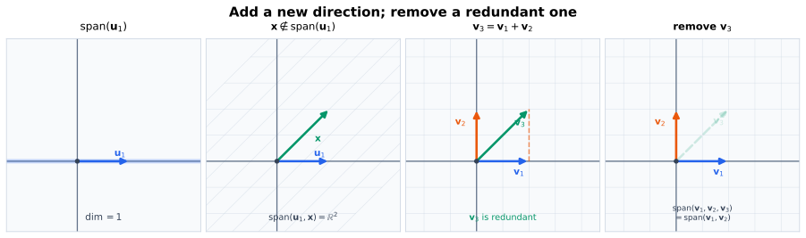
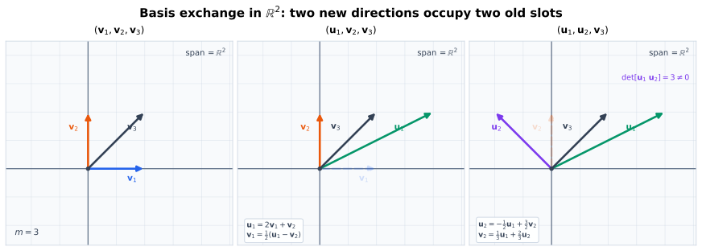
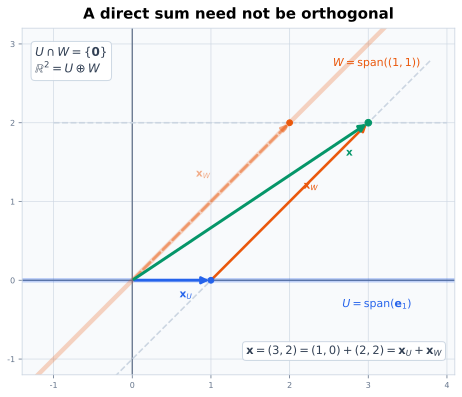
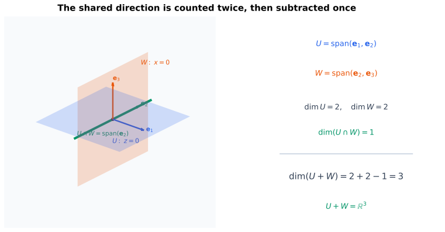
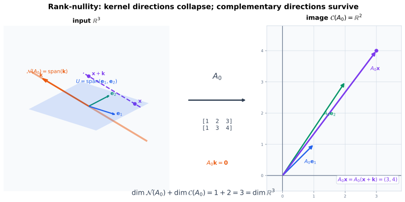
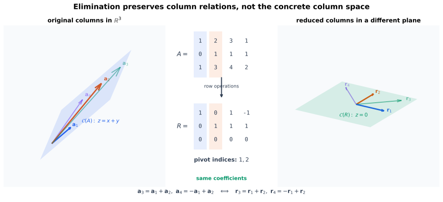
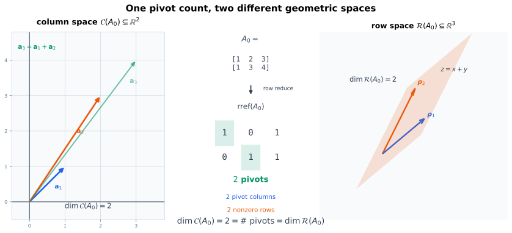

# 同一个平面为什么总是需要两个基向量

$\mathbb{R}^2$ 的标准基是

$$
\mathcal{E}=(\mathbf{e}_1,\mathbf{e}_2),
$$

而

$$
\mathcal{B}
=
\left(
\begin{bmatrix}1\\1\end{bmatrix},
\begin{bmatrix}1\\-1\end{bmatrix}
\right)
$$

也是一组基。两组向量方向不同、坐标不同，却都恰好含两个向量。

这不是图形造成的巧合。一个向量不足以张成整个平面；三个向量虽然可以张成平面，却必有一个方向冗余，因而不可能同时线性无关。更一般地，如果一个空间可以由 $m$ 个向量张成，那么其中任何线性无关组都不可能含有超过 $m$ 个向量。

关键动作是**交换**：把一个希望保留的无关向量放进现有生成组，同时移走一个已经可以由其余向量表示的旧向量。每次交换都保持整个张成空间不变，也不增加向量槽位。把这个动作逐次重复，就能比较任意无关组与任意生成组的长度。

# 核心问题

以下问题都归结为“加入、删除与交换向量时，哪些结构保持不变”：

1. 向一个线性无关组加入什么样的向量，仍能保持线性无关；
2. 从一个线性相关的生成组中删去什么样的向量，不会改变张成空间；
3. 为什么 $k$ 个线性无关向量不可能塞进一个只需 $m<k$ 个向量就能张成的空间；
4. 怎样从有限生成组中提取一组基，又怎样把已有无关组扩充成基；
5. 为什么有限维空间的任意两组基长度相同；
6. 为什么子空间一定有基，且维数不超过母空间；
7. 子空间的和、交与直和怎样满足维数公式；
8. 怎样严格证明秩—零度定理；
9. 为什么原矩阵的主元列构成列空间的一组基；
10. 为什么行秩、列秩、主元个数与最大非零子式阶数其实是同一个秩。

::: {.callout-important title="假设范围"}
以下向量空间都以 $\mathbb{R}$ 为标量域，并且存在有限生成组。在证明任意两组有限基等长之前，“有限”只表示空间可由有限个向量生成；证明完成后，这个共同的基长度才正式记为 $\dim(V)$。
:::

# 先区分三个任务：加入、删除与替换

设 $V$ 是向量空间，给定有限向量组

$$
\mathcal{V}=(\mathbf{v}_1,\ldots,\mathbf{v}_m).
$$

这里把它写成有顺序的有限组，而不是普通集合，因为：

- 同一个向量可能被重复列出；
- 后面会指定“第 $j$ 个向量”；
- 基坐标也依赖基向量的排列顺序。

围绕一组向量，常见操作有三种：

- **加入**一个向量，希望不破坏线性无关；
- **删除**一个向量，希望不缩小张成空间；
- **替换**一个向量，希望同时保留某些指定方向和整个张成空间。

下图先在 $\mathbb{R}^2$ 中显示两种最基本的变化。左侧把一个不在原直线上的向量加入后，张成从直线扩展到平面；右侧删去已经由另外两个向量生成的冗余方向，张成的平面保持不变。

{#fig-basis-add-remove-r2 fig-alt="四幅平面图：前两幅展示水平向量先张成直线，再加入斜向向量后张成整个平面；后两幅展示三个向量中的对角向量等于两个坐标方向之和，删去它后平面张成保持不变。" width="100%"}

交换的机制与二者略有不同：先把待保留向量写成当前生成组的线性组合，再解出一个确实参与该组合的旧向量并将它移走。线性无关性保证每一步都能移走尚未交换的旧向量。

## 加入一个张成之外的向量

设

$$
\mathbf{u}_1,\ldots,\mathbf{u}_k
$$

线性无关，并且

$$
\mathbf{x}\notin
\operatorname{span}(\mathbf{u}_1,\ldots,\mathbf{u}_k).
$$

那么扩充后的向量组

$$
\mathbf{u}_1,\ldots,\mathbf{u}_k,\mathbf{x}
$$

仍然线性无关。

**证明。** 假设存在关系

$$
 a_1\mathbf{u}_1+\cdots+a_k\mathbf{u}_k+c\mathbf{x}
 =\mathbf{0}.
$$

若 $c\neq0$，则可以解出

$$
\mathbf{x}
=-\frac{a_1}{c}\mathbf{u}_1-
\cdots-
\frac{a_k}{c}\mathbf{u}_k,
$$

这会推出 $\mathbf{x}$ 属于原向量组的张成，与条件矛盾。因此 $c=0$，原式只剩

$$
a_1\mathbf{u}_1+\cdots+a_k\mathbf{u}_k=\mathbf{0}.
$$

原向量组线性无关，所以所有 $a_i=0$。扩充后的向量组只有平凡关系，因而线性无关。$\square$

这个结论给出一种构造无关组的方法：只要当前还没有张成目标空间，就从张成之外再选一个向量加入。

## 删除一个冗余向量

若向量组

$$
\mathbf{v}_1,\ldots,\mathbf{v}_m
$$

线性相关，则存在不全为零的系数使

$$
 c_1\mathbf{v}_1+\cdots+c_m\mathbf{v}_m=\mathbf{0}.
$$

选一个满足 $c_j\neq0$ 的位置，可以解出

$$
\mathbf{v}_j
=-\sum_{i\neq j}\frac{c_i}{c_j}\mathbf{v}_i.
$$

因此 $\mathbf{v}_j$ 已经在其他向量的张成中，删去它不会改变张成空间：

$$
\operatorname{span}(\mathbf{v}_1,\ldots,\mathbf{v}_m)
=
\operatorname{span}
(\mathbf{v}_1,\ldots,\mathbf{v}_{j-1},
\mathbf{v}_{j+1},\ldots,\mathbf{v}_m).
$$ {#eq-delete-redundant-vector}

因此，**发现非平凡线性关系，就能安全删除其中任意一个系数非零的向量。**

::: {.callout-warning title="不能随便删除生成组中的任意向量"}
“生成组中有冗余”只保证至少存在一个可删除位置，不保证每个位置都能删除。例如 $(\mathbf{e}_1,\mathbf{e}_2,\mathbf{e}_1+\mathbf{e}_2)$ 生成 $\mathbb{R}^2$，删去三者中的任意一个都恰好仍能生成平面；但 $(\mathbf{e}_1,\mathbf{e}_2,\mathbf{e}_2)$ 中不能删去唯一的 $\mathbf{e}_1$。
:::

# 交换引理：把无关方向放进生成组

现在设

$$
\mathcal{U}=(\mathbf{u}_1,\ldots,\mathbf{u}_k)
$$

是 $V$ 中的线性无关组，而

$$
\mathcal{V}=(\mathbf{v}_1,\ldots,\mathbf{v}_m)
$$

能够张成 $V$。

**交换引理**（也称替换定理）断言：

1. 必有 $k\leq m$；
2. 经过重新排列 $\mathcal{V}$ 后，可以依次用
   $\mathbf{u}_1,\ldots,\mathbf{u}_k$
   替换其中 $k$ 个向量，替换后的 $m$ 个向量仍然张成 $V$。

这个结论精确表达了“独立方向不能比覆盖整个空间所需的方向更多”。空向量组的情形立即成立；下面只需考虑 $k,m\geq1$。

@fig-basis-exchange-process 在同一个平面中固定背景网格，让“张成保持整个 $\mathbb{R}^2$”直接可见。第一步利用

$$
\mathbf{u}_1=2\mathbf{v}_1+\mathbf{v}_2,
\qquad
\mathbf{v}_1=\frac12(\mathbf{u}_1-\mathbf{v}_2)
$$

把 $\mathbf{v}_1$ 换成 $\mathbf{u}_1$；第二步再利用

$$
\mathbf{u}_2=-\frac12\mathbf{u}_1+\frac32\mathbf{v}_2,
\qquad
\mathbf{v}_2=\frac13\mathbf{u}_1+\frac23\mathbf{u}_2
$$

把 $\mathbf{v}_2$ 换成 $\mathbf{u}_2$。未被替换的 $\mathbf{v}_3$ 始终保留原名，背景网格也不变。

{#fig-basis-exchange-process fig-alt="三个并排坐标平面共享同一背景网格：第一幅显示 v1、v2、v3 张成平面；第二幅以 u1 替换 v1；第三幅再以 u2 替换 v2，未替换的 v3 保持不变，三幅图都覆盖整个平面。" width="100%"}

## 第一步交换

因为 $\mathcal{V}$ 张成 $V$，所以 $\mathbf{u}_1$ 可以写成

$$
\mathbf{u}_1
=a_1\mathbf{v}_1+\cdots+a_m\mathbf{v}_m.
$$

$\mathbf{u}_1$ 不可能是零向量，否则 $\mathcal{U}$ 不会线性无关，因此至少有一个 $a_j\neq0$。重新排列 $\mathcal{V}$，不妨令 $a_1\neq0$。于是

$$
\mathbf{v}_1
=
\frac{1}{a_1}\mathbf{u}_1
-
\frac{a_2}{a_1}\mathbf{v}_2
-
\cdots
-
\frac{a_m}{a_1}\mathbf{v}_m.
$$

这说明旧向量 $\mathbf{v}_1$ 可以由

$$
\mathbf{u}_1,\mathbf{v}_2,\ldots,\mathbf{v}_m
$$

生成。因此替换后仍有

$$
V
=
\operatorname{span}
(\mathbf{u}_1,\mathbf{v}_2,\ldots,\mathbf{v}_m).
$$

## 为什么第二步一定还能找到旧向量可换

下一步把 $\mathbf{u}_2$ 写成当前生成组的线性组合：

$$
\mathbf{u}_2
=b_1\mathbf{u}_1+b_2\mathbf{v}_2+
\cdots+b_m\mathbf{v}_m.
$$

系数 $b_2,\ldots,b_m$ 中至少有一个非零。否则

$$
\mathbf{u}_2=b_1\mathbf{u}_1,
$$

会使 $\mathbf{u}_1,\mathbf{u}_2$ 线性相关。重新排列尚未被替换的旧向量，不妨令 $b_2\neq0$，便可解出 $\mathbf{v}_2$，再用 $\mathbf{u}_2$ 替换它。

## 重复交换并证明 $k\leq m$

对每个

$$
j\leq\min(k,m),
$$

假设已经得到生成组

$$
\mathbf{u}_1,\ldots,\mathbf{u}_{j-1},
\mathbf{v}_j,\ldots,\mathbf{v}_m.
$$

将 $\mathbf{u}_j$ 写成这组向量的线性组合。如果所有尚未替换的旧向量系数都为零，就会有

$$
\mathbf{u}_j
\in
\operatorname{span}(\mathbf{u}_1,\ldots,\mathbf{u}_{j-1}),
$$

这与 $\mathcal{U}$ 线性无关矛盾。因此至少有一个尚未替换的旧向量系数非零，可以解出它并完成第 $j$ 次交换。

还需排除 $k>m$。若 $k>m$，完成前 $m$ 次交换后，

$$
\mathbf{u}_1,\ldots,\mathbf{u}_m
$$

已经张成 $V$，于是

$$
\mathbf{u}_{m+1}
\in
\operatorname{span}(\mathbf{u}_1,\ldots,\mathbf{u}_m),
$$

这与 $\mathcal{U}$ 线性无关矛盾。因此

$$
k\leq m.
$$ {#eq-independent-no-longer-than-spanning}

既然 $k\leq m$，上述过程可以完成全部 $k$ 次交换。交换引理得证。$\square$

::: {.callout-tip title="交换引理比较的是两个不同角色"}
- $\mathcal{U}$ 线性无关：每个待放入的向量都提供不能由前面向量生成的新方向；
- $\mathcal{V}$ 张成整个空间：每个待放入向量都能由当前生成组表示。

“不能由前面生成”和“能由整个生成组表示”同时成立，才保证每一步都必须有一个尚未替换的旧向量参与，从而可以完成交换。
:::

# 从生成组提取基

设有限向量组

$$
\mathbf{v}_1,\ldots,\mathbf{v}_m
$$

张成 $V$。若它已经线性无关，那么它就是一组基。若它线性相关，使用 @eq-delete-redundant-vector 删除一个冗余向量，张成空间不变。

对剩余向量重复这个过程。每次删除都会让向量数量减少 $1$，因此至多经过 $m$ 次就会停止。停止时剩余向量：

- 仍然张成 $V$；
- 已经线性无关。

所以它们构成 $V$ 的一组基。

由此得到：

> **基提取定理。** 每个有限生成组都包含一组基；特别地，每个有限生成向量空间都有有限基。

“包含”这里指从原向量组中删去若干位置，而不是对原向量做任意新组合。

## 一个提取例子

考虑 $\mathbb{R}^3$ 中的向量组

$$
\mathbf{v}_1=
\begin{bmatrix}1\\0\\0\end{bmatrix},
\quad
\mathbf{v}_2=
\begin{bmatrix}0\\1\\0\end{bmatrix},
\quad
\mathbf{v}_3=
\begin{bmatrix}1\\1\\0\end{bmatrix},
\quad
\mathbf{v}_4=
\begin{bmatrix}0\\0\\1\end{bmatrix}.
$$

它张成 $\mathbb{R}^3$，但满足

$$
\mathbf{v}_1+\mathbf{v}_2-\mathbf{v}_3=\mathbf{0}.
$$

删去 $\mathbf{v}_3$ 后，

$$
(\mathbf{v}_1,\mathbf{v}_2,\mathbf{v}_4)
$$

仍张成 $\mathbb{R}^3$，并且线性无关，因此是一组基。

也可以从同一关系中解出 $\mathbf{v}_1$，删去它后得到另一组基

$$
(\mathbf{v}_2,\mathbf{v}_3,\mathbf{v}_4).
$$

基的选择不唯一；但把其中任一组作为无关组、另一组作为生成组应用交换引理，两组长度必然相同。

# 把线性无关组扩充成基

设 $V$ 由有限向量组 $\mathcal{V}$ 张成，且

$$
\mathcal{U}=(\mathbf{u}_1,\ldots,\mathbf{u}_k)
$$

是 $V$ 中的线性无关组。

交换引理允许把 $\mathcal{U}$ 全部放入一个仍张成 $V$ 的有限向量组中。这个新生成组可能仍有冗余，但如果它线性相关，那么任何非平凡关系都必须至少涉及一个不属于 $\mathcal{U}$ 的向量；否则就会得到 $\mathcal{U}$ 自身的非平凡关系。

因此可以只删除后来保留的旧向量，而不删除任何 $\mathbf{u}_j$。重复删除，最终得到一组包含 $\mathcal{U}$ 的基。

> **基扩充定理。** 有限生成向量空间中的每个有限线性无关组都可以扩充成一组基。

这里“扩充”表示只加入新向量，不修改或删除原无关组中的向量。实际上，交换引理还说明有限生成空间中的任何线性无关组必为有限组：若空间可由 $m$ 个向量生成，那么从一个假想的无限无关组中任取 $m+1$ 个不同向量，就会与 @eq-independent-no-longer-than-spanning 矛盾。


# 为什么维数定义良好

现在设 $\mathcal{B}$ 和 $\mathcal{C}$ 都是有限维向量空间 $V$ 的基：

$$
\mathcal{B}=(\mathbf{b}_1,\ldots,\mathbf{b}_r),
\qquad
\mathcal{C}=(\mathbf{c}_1,\ldots,\mathbf{c}_s).
$$

因为 $\mathcal{B}$ 线性无关而 $\mathcal{C}$ 张成 $V$，交换引理给出

$$
r\leq s.
$$

交换两组基的角色：$\mathcal{C}$ 线性无关而 $\mathcal{B}$ 张成 $V$，所以

$$
s\leq r.
$$

因此

$$
r=s.
$$

这就证明了：

> **基长度不变定理。** 有限维向量空间的任意两组基含有相同数量的向量。

现在才能严格地把这个不随基选择变化的数量定义为空间维数：

$$
\dim(V)
\coloneqq
\text{$V$ 的任意一组基所含的向量数}.
$$


## 三个经常使用的推论

若 $\dim(V)=n$，则：

1. $V$ 中任意线性无关组至多含 $n$ 个向量；
2. $V$ 的任意生成组至少含 $n$ 个向量；
3. 恰含 $n$ 个向量的向量组，只要证明“线性无关”或“张成 $V$”中的一个，另一个就会自动成立。

前两条直接来自 @eq-independent-no-longer-than-spanning。

证明第三条的“无关 $\Rightarrow$ 基”：一个含 $n$ 个向量的无关组可扩充成基；但 $V$ 的基只能有 $n$ 个向量，所以不需要再加入任何向量，它本身就是基。

证明“张成 $\Rightarrow$ 基”：从一个含 $n$ 个向量的生成组中可以提取基；但基必须含 $n$ 个向量，所以不能删除任何向量，原生成组本身已经线性无关。

::: {.callout-warning title="‘向量个数等于维数’必须配合无关或张成"}
在 $\mathbb{R}^3$ 中，三个向量的数量虽然等于维数，但它们仍可能全部落在同一条直线上。只有再验证线性无关或张成整个空间，才能推出它们是一组基。
:::

# 子空间的维数为什么不会更大

设 $W\subseteq V$ 是子空间，并且 $\dim(V)=n$。

若 $W=\{\mathbf{0}\}$，空向量组是它的一组基，故 $\dim(W)=0$。

若 $W\neq\{\mathbf{0}\}$，先选一个非零向量 $\mathbf{w}_1\in W$。如果它尚未张成 $W$，再选

$$
\mathbf{w}_2
\in
W\setminus\operatorname{span}(\mathbf{w}_1).
$$

根据“加入张成之外的向量”结论，$\mathbf{w}_1,\mathbf{w}_2$ 线性无关。只要当前向量组还没有张成 $W$，就继续从其张成之外选一个 $W$ 中的向量加入。

这个过程不可能加入超过 $n$ 个向量，因为所得向量组始终是 $V$ 中的线性无关组。更明确地说：若已经选出 $n$ 个向量却仍未张成 $W$，就还能从张成之外选出第 $n+1$ 个向量，并保持线性无关，这与 @eq-independent-no-longer-than-spanning 矛盾。因此过程至多经过 $n$ 步就会停止，停止时得到 $W$ 的一组基。

于是：

$$
\dim(W)\leq\dim(V).
$$ {#eq-subspace-dimension-bound}

若二者维数相等，取 $W$ 的一组基。它在 $V$ 中是含 $\dim(V)$ 个向量的线性无关组，所以也构成 $V$ 的基。因此

$$
\dim(W)=\dim(V)
\quad\Longrightarrow\quad
W=V.
$$

因此子空间不能比母空间拥有更多独立方向；若维数相同，子空间就是整个母空间。

## 子空间一定有补空间

@fig-direct-sum-components-r2 先给出一个刻意不正交的例子：水平直线 $U$ 与斜直线 $W$ 只在原点相交，每个平面向量都能沿两条方向唯一拆分。直和要求的是“覆盖全部空间且分解唯一”，不是两条方向必须垂直。

{#fig-direct-sum-components-r2 fig-alt="坐标平面中，蓝色水平直线 U 与橙色斜直线 W 交于原点；绿色向量 x 被画成蓝色 U 分量与橙色 W 分量的首尾相加，并标出 R2 等于 U 直和 W。" width="92%"}

现在已经证明子空间有有限基。设 $U\subseteq V$，并取 $U$ 的一组基

$$
\mathbf{u}_1,\ldots,\mathbf{u}_r.
$$

把它扩充成 $V$ 的一组基

$$
\mathbf{u}_1,\ldots,\mathbf{u}_r,
\mathbf{w}_1,\ldots,\mathbf{w}_s.
$$

令

$$
W=
\operatorname{span}(\mathbf{w}_1,\ldots,\mathbf{w}_s),
$$

任意 $\mathbf{x}\in V$ 都可按扩充后的基唯一展开：

$$
\mathbf{x}
=
\sum_{i=1}^{r}a_i\mathbf{u}_i
+
\sum_{j=1}^{s}b_j\mathbf{w}_j.
$$

把两组项分别记为 $\mathbf{u}\in U$ 与 $\mathbf{w}\in W$，就得到存在性：

$$
\mathbf{x}=\mathbf{u}+\mathbf{w}.
$$

若还有另一种分解 $\mathbf{x}=\mathbf{u}'+\mathbf{w}'$，则

$$
(\mathbf{u}-\mathbf{u}')
+(\mathbf{w}-\mathbf{w}')
=\mathbf{0}.
$$

把两个括号分别按 $\mathbf{u}_i$ 与 $\mathbf{w}_j$ 展开，就得到关于整组扩充基的线性关系。基向量线性无关，所以所有系数都为零，即

$$
\mathbf{u}=\mathbf{u}',
\qquad
\mathbf{w}=\mathbf{w}'.
$$

分解因此唯一。特别地，若某个向量同时属于 $U$ 和 $W$，零向量就会有两种分解，唯一性迫使该向量只能是零，所以 $U\cap W=\{\mathbf{0}\}$。

记作

$$
V=U\oplus W,
$$

称 $V$ 是 $U$ 与 $W$ 的**直和**，而 $W$ 是 $U$ 的一个**补空间**。

补空间通常不唯一。若空间另外配备内积，则可以选取满足 $W=U^{\perp}$ 的正交补；一般补空间只要求上述直和条件，不要求正交。

# 子空间的和、交与维数公式

@fig-subspace-dimension-formula-r3 中，两个二维平面共享同一条一维直线。直接把 $2+2$ 相加会把绿色交线计算两次；减去一次交集维数，才得到它们共同张成的三维空间：

$$
3=2+2-1.
$$

{#fig-subspace-dimension-formula-r3 fig-alt="三维坐标系中，两个半透明平面分别由 e1、e2 和 e2、e3 张成，二者共享绿色 e2 轴；旁边列出维数三等于二加二减一。" width="100%"}

设 $U,W$ 都是有限维向量空间 $V$ 的子空间。它们的**和**定义为

$$
U+W
\coloneqq
\{\mathbf{u}+\mathbf{w}:
\mathbf{u}\in U,\mathbf{w}\in W\}.
$$ {#eq-subspace-sum}

零向量满足 $\mathbf{0}=\mathbf{0}+\mathbf{0}\in U+W$。再取

$$
\mathbf{x}=\mathbf{u}_1+\mathbf{w}_1,
\qquad
\mathbf{y}=\mathbf{u}_2+\mathbf{w}_2,
$$

则对任意标量 $a,b$，

$$
a\mathbf{x}+b\mathbf{y}
=(a\mathbf{u}_1+b\mathbf{u}_2)
+(a\mathbf{w}_1+b\mathbf{w}_2)
\in U+W.
$$

因此 $U+W$ 对线性组合封闭，是子空间。交集 $U\cap W$ 也包含零向量；若 $\mathbf{x},\mathbf{y}\in U\cap W$，则 $a\mathbf{x}+b\mathbf{y}$ 同时属于 $U$ 和 $W$，所以仍在交集中。故 $U\cap W$ 也是子空间。下面计算三者的维数关系。

先取 $U\cap W$ 的一组基

$$
\mathbf{c}_1,\ldots,\mathbf{c}_t.
$$

分别把它扩充成 $U$ 与 $W$ 的基：

$$
\mathcal{B}_U
=(\mathbf{c}_1,\ldots,\mathbf{c}_t,
\mathbf{u}_1,\ldots,\mathbf{u}_p),
$$

$$
\mathcal{B}_W
=(\mathbf{c}_1,\ldots,\mathbf{c}_t,
\mathbf{w}_1,\ldots,\mathbf{w}_q).
$$

那么

$$
\mathcal{B}_{U+W}
=
(\mathbf{c}_1,\ldots,\mathbf{c}_t,
\mathbf{u}_1,\ldots,\mathbf{u}_p,
\mathbf{w}_1,\ldots,\mathbf{w}_q)
$$

是 $U+W$ 的一组基。

它显然张成 $U+W$：任意 $\mathbf{u}\in U$ 和 $\mathbf{w}\in W$ 都能分别由对应基表示。还需证明它线性无关。假设

$$
\sum_{i=1}^{t}a_i\mathbf{c}_i
+
\sum_{j=1}^{p}b_j\mathbf{u}_j
+
\sum_{\ell=1}^{q}d_\ell\mathbf{w}_\ell
=\mathbf{0}.
$$

移项得

$$
\sum_{i=1}^{t}a_i\mathbf{c}_i
+
\sum_{j=1}^{p}b_j\mathbf{u}_j
=
-
\sum_{\ell=1}^{q}d_\ell\mathbf{w}_\ell.
$$

左侧属于 $U$，右侧属于 $W$，所以两边共同表示的向量属于 $U\cap W$。它可以只由 $\mathbf{c}_1,\ldots,\mathbf{c}_t$ 表示。由于 $\mathcal{B}_U$ 是基，唯一性迫使每个 $b_j=0$；同理，由 $\mathcal{B}_W$ 的唯一性得到每个 $d_\ell=0$。最后 $\mathbf{c}_1,\ldots,\mathbf{c}_t$ 线性无关，所以所有 $a_i=0$。

因此：

$$
\dim(U+W)
=
\dim(U)+\dim(W)-\dim(U\cap W).
$$ {#eq-dimension-sum-formula}

如果 $U\cap W=\{\mathbf{0}\}$，则和中的表示唯一。事实上，若

$$
\mathbf{u}_1+\mathbf{w}_1
=
\mathbf{u}_2+\mathbf{w}_2,
$$

则

$$
\mathbf{u}_1-\mathbf{u}_2
=
\mathbf{w}_2-\mathbf{w}_1
\in U\cap W.
$$

交集只有零向量，所以 $\mathbf{u}_1=\mathbf{u}_2$ 且 $\mathbf{w}_1=\mathbf{w}_2$。此时记作 $U\oplus W$，公式简化为

$$
\dim(U\oplus W)=\dim(U)+\dim(W).
$$

# 线性映射的核、像与秩—零度

先看具体映射

$$
\mathbf{A}_0
=
\begin{bmatrix}
1&2&3\\
1&3&4
\end{bmatrix}
:\mathbb{R}^3\to\mathbb{R}^2.
$$

它把方向 $(-1,-1,1)^{\mathsf T}$ 压到零，同时把补平面中的两个独立方向映成输出平面的两个独立方向。沿核方向相差的两个输入具有同一个输出：

$$
\mathbf{A}_0
\begin{bmatrix}1\\1\\0\end{bmatrix}
=
\mathbf{A}_0
\begin{bmatrix}0\\0\\1\end{bmatrix}
=
\begin{bmatrix}3\\4\end{bmatrix}.
$$

@fig-rank-nullity-collapse-r3-r2 把输入的三个方向分成一条“消失方向”和两个“存活方向”；计数正好是 $1+2=3$。

{#fig-rank-nullity-collapse-r3-r2 fig-alt="左侧三维输入空间显示橙色核直线和蓝色补平面，两个沿核方向相差的点被连在一起；中间箭头表示矩阵 A0；右侧二维输出空间显示核压到原点、两个补空间方向张成像，并标出零度一加秩二等于输入维数三。" width="100%"}

设 $V,W$ 是有限维向量空间，

$$
T:V\to W
$$

是线性映射。它的**核**与**像**分别定义为

$$
\ker(T)
\coloneqq
\{\mathbf{v}\in V:T(\mathbf{v})=\mathbf{0}\},
$$ {#eq-kernel-linear-map}

$$
\operatorname{im}(T)
\coloneqq
\{T(\mathbf{v}):\mathbf{v}\in V\}.
$$ {#eq-image-linear-map}

核记录被映到零的输入方向，像记录实际能够到达的输出。二者都是子空间：零向量分别满足 $T(\mathbf{0})=\mathbf{0}$ 和 $\mathbf{0}=T(\mathbf{0})$。若 $\mathbf{x},\mathbf{y}\in\ker(T)$，则

$$
T(a\mathbf{x}+b\mathbf{y})
=aT(\mathbf{x})+bT(\mathbf{y})
=\mathbf{0},
$$

所以核对线性组合封闭。若 $\mathbf{p}=T(\mathbf{u})$、$\mathbf{q}=T(\mathbf{v})$ 属于像，则

$$
a\mathbf{p}+b\mathbf{q}
=T(a\mathbf{u}+b\mathbf{v}),
$$

所以像也对线性组合封闭。

## 秩—零度定理的证明

设

$$
\mathbf{k}_1,\ldots,\mathbf{k}_s
$$

是 $\ker(T)$ 的一组基。用基扩充定理把它扩充成 $V$ 的一组基：

$$
\mathbf{k}_1,\ldots,\mathbf{k}_s,
\mathbf{v}_1,\ldots,\mathbf{v}_r.
$$

我们证明

$$
T(\mathbf{v}_1),\ldots,T(\mathbf{v}_r)
$$

恰好是 $\operatorname{im}(T)$ 的一组基。

**先证张成。** 任意 $\mathbf{y}\in\operatorname{im}(T)$ 都可写成 $\mathbf{y}=T(\mathbf{x})$。把 $\mathbf{x}$ 按上述基展开：

$$
\mathbf{x}
=
\sum_{i=1}^{s}a_i\mathbf{k}_i
+
\sum_{j=1}^{r}b_j\mathbf{v}_j.
$$

由于每个 $T(\mathbf{k}_i)=\mathbf{0}$，线性性给出

$$
\mathbf{y}
=T(\mathbf{x})
=
\sum_{j=1}^{r}b_jT(\mathbf{v}_j).
$$

所以这些像向量张成 $\operatorname{im}(T)$。

**再证无关。** 假设

$$
\sum_{j=1}^{r}b_jT(\mathbf{v}_j)=\mathbf{0}.
$$

线性性说明

$$
T\left(\sum_{j=1}^{r}b_j\mathbf{v}_j\right)
=\mathbf{0},
$$

所以 $\sum_jb_j\mathbf{v}_j\in\ker(T)$，存在标量 $a_1,\ldots,a_s$ 使

$$
\sum_{j=1}^{r}b_j\mathbf{v}_j
=
\sum_{i=1}^{s}a_i\mathbf{k}_i.
$$

移项得到关于 $V$ 的整组基的线性关系：

$$
-\sum_{i=1}^{s}a_i\mathbf{k}_i
+
\sum_{j=1}^{r}b_j\mathbf{v}_j
=
\mathbf{0}.
$$

基向量线性无关，故所有 $a_i=0$ 且所有 $b_j=0$。

因此

$$
\dim(\operatorname{im}T)=r,
\qquad
\dim(\ker T)=s,
\qquad
\dim(V)=r+s.
$$

即得到**秩—零度定理**：

$$
\dim(\operatorname{im}T)
+
\dim(\ker T)
=
\dim(V).
$$ {#eq-rank-nullity-linear-map}

若 $T=T_{\mathbf{A}}:\mathbb{R}^n\to\mathbb{R}^m$，$T_{\mathbf{A}}(\mathbf{x})=\mathbf{A}\mathbf{x}$，那么

$$
\operatorname{im}(T_{\mathbf{A}})=\mathcal{C}(\mathbf{A}),
\qquad
\ker(T_{\mathbf{A}})=\mathcal{N}(\mathbf{A}).
$$

因此 @eq-rank-nullity-linear-map 对矩阵写成：

$$
\operatorname{rank}(\mathbf{A})
+
\dim\mathcal{N}(\mathbf{A})
=n.
$$

::: {.callout-note title="秩—零度分解的是输入维数"}
零空间和用于构造其补空间的向量都位于定义域 $V$ 中；像空间则位于陪域 $W$ 中。定理通过线性映射把定义域中零空间之外的基方向送成像空间的一组基，但它没有把定义域与陪域直接相加。
:::

# 消元中的主元列为什么给出列空间基

行化简会改变各列在 $\mathbb{R}^m$ 中的具体位置，却保留所有列之间的线性关系。@fig-pivot-columns-preserve-relations 使用同一个四列矩阵显示：原列空间位于平面 $z=x+y$ 中，化简后的列空间位于平面 $z=0$ 中；两个平面不同，但第 $3,4$ 列仍由第 $1,2$ 列用相同系数组合，主元列指标也保持为 $1,2$。

{#fig-pivot-columns-preserve-relations fig-alt="左侧三维图显示原矩阵四列都在平面 z 等于 x 加 y 中，前两列高亮为主元列；中间显示矩阵化到 RREF 且主元位于第一二列；右侧显示化简后四列位于平面 z 等于零，第三列仍是前两列之和，第四列仍是负第一列加第二列。" width="100%"}

设

$$
\mathbf{A}
=
\begin{bmatrix}
\vert&&\vert\\
\mathbf{a}_1&\cdots&\mathbf{a}_n\\
\vert&&\vert
\end{bmatrix}
\in\mathbb{R}^{m\times n},
$$

经过一系列初等行变换化为行阶梯形矩阵。令

$$
\mathbf{E}=\mathbf{E}_s\cdots\mathbf{E}_1
$$

是对应初等矩阵的乘积，则 $\mathbf{E}$ 可逆，并且

$$
\mathbf{R}=\mathbf{E}\mathbf{A}.
$$

对任意系数向量 $\mathbf{c}\in\mathbb{R}^n$，

$$
\mathbf{A}\mathbf{c}=\mathbf{0}
\quad\Longleftrightarrow\quad
\mathbf{E}\mathbf{A}\mathbf{c}=\mathbf{0}
\quad\Longleftrightarrow\quad
\mathbf{R}\mathbf{c}=\mathbf{0},
$$ {#eq-row-reduction-preserves-column-relations}

因为 $\mathbf{E}$ 可逆。也就是说，行变换虽然改变每一列的具体坐标，却不改变列之间使用同一组系数形成的线性关系。

设 $\mathbf{R}$ 的主元列指标为

$$
j_1<\cdots<j_r.
$$

在阶梯形中，主元列线性无关：若它们的线性组合为零，从最下面的主元行向上检查，依次可知所有系数为零。由 @eq-row-reduction-preserves-column-relations，原矩阵对应的列

$$
\mathbf{a}_{j_1},\ldots,\mathbf{a}_{j_r}
$$

也线性无关。

还需证明每个非主元列都由主元列生成。继续对 $\mathbf{R}$ 做行变换，得到简化行阶梯形矩阵

$$
\mathbf{S}=\mathbf{F}\mathbf{R}
=\mathbf{F}\mathbf{E}\mathbf{A},
$$

其中 $\mathbf{F}$ 也可逆，且主元列指标仍是 $j_1,\ldots,j_r$。在 $\mathbf{S}$ 中，第 $j$ 个非主元列可直接写成

$$
\mathbf{s}_j
=
\gamma_1\mathbf{s}_{j_1}
+
\cdots
+
\gamma_r\mathbf{s}_{j_r}.
$$

等价地，系数向量

$$
\mathbf{c}
=
\mathbf{e}_j
-
\sum_{\ell=1}^{r}\gamma_\ell\mathbf{e}_{j_\ell}
$$

满足 $\mathbf{S}\mathbf{c}=\mathbf{0}$。由于 $\mathbf{F}\mathbf{E}$ 可逆，

$$
\mathbf{S}\mathbf{c}=\mathbf{0}
\quad\Longleftrightarrow\quad
\mathbf{A}\mathbf{c}=\mathbf{0}.
$$

因此原矩阵也满足同一列关系：

$$
\mathbf{a}_j
=
\gamma_1\mathbf{a}_{j_1}
+
\cdots
+
\gamma_r\mathbf{a}_{j_r}.
$$

所以原矩阵的主元列张成 $\mathcal{C}(\mathbf{A})$。

所以：

> **原矩阵中对应主元位置的列构成列空间的一组基。**

必须取原矩阵的列，而不能取阶梯形矩阵的列作为原列空间基；行变换保留列关系与秩，但一般不保留列空间作为 $\mathbb{R}^m$ 中的具体子空间。

# 为什么行秩等于列秩

行空间与列空间通常不在同一个环境空间。@fig-row-column-rank-geometries 中，$2\times3$ 矩阵的列空间位于 $\mathbb{R}^2$，行空间位于 $\mathbb{R}^3$；它们不是同一个几何平面，却都由两个主元计数。

{#fig-row-column-rank-geometries fig-alt="左侧二维坐标平面显示矩阵 A0 的三列，其中前两列独立且第三列是其和；中间 RREF 高亮两个主元；右侧三维图显示两个非零行张成一个二维平面，底部标明列秩与行秩都等于二。" width="100%"}

矩阵的**行空间**定义为其行向量的张成。为保持列向量约定，也可以把每一行转置成 $\mathbb{R}^n$ 中的列向量：

$$
\mathcal{R}(\mathbf{A})
\coloneqq
\mathcal{C}(\mathbf{A}^{\mathsf T})
\subseteq\mathbb{R}^n.
$$

行空间维数称为**行秩**，列空间维数称为**列秩**。

初等行变换把新行写成旧行的线性组合；由于操作可逆，旧行也能写成新行的线性组合。因此行变换不改变行空间：

$$
\mathcal{R}(\mathbf{A})=
\mathcal{R}(\mathbf{R}).
$$

阶梯形矩阵 $\mathbf{R}$ 的非零行线性无关。把它们记为 $\boldsymbol{\rho}_1,\ldots,\boldsymbol{\rho}_r$，并假设

$$
c_1\boldsymbol{\rho}_1+
\cdots+
 c_r\boldsymbol{\rho}_r
=
\mathbf{0}.
$$

观察第一行的主元列：所有更低行在这一列都是零，第一行主元非零，因此 $c_1=0$。再观察第二行主元列；此时第一项已经消失，所有更低行在该列仍为零，所以 $c_2=0$。逐行继续可得所有 $c_i=0$，故非零行线性无关。全部零行不贡献张成方向，所以非零行构成 $\mathcal{R}(\mathbf{R})$ 的一组基。

若 $\mathbf{R}$ 有 $r$ 个主元，则它恰有 $r$ 个非零行，故

$$
\dim\mathcal{R}(\mathbf{A})=r.
$$

上一节又证明列空间的一组基由 $r$ 个原主元列组成，所以

$$
\dim\mathcal{R}(\mathbf{A})
=
\dim\mathcal{C}(\mathbf{A})
=r.
$$ {#eq-row-rank-column-rank}

此前已经由子式与消元证明最大非零子式阶数等于主元个数（见 @eq-rank-pivot-count；零矩阵的秩约定为 $0$）。再结合 @eq-rank-nullity-linear-map 与 @eq-row-rank-column-rank，同一个整数 $r$ 有五种完全一致的解释：

$$
\boxed{
\begin{aligned}
r
&=\text{最大非零子式阶数}\\
&=\text{行阶梯形中的主元个数}\\
&=\dim\mathcal{C}(\mathbf{A})\\
&=\dim\mathcal{R}(\mathbf{A})\\
&=n-\dim\mathcal{N}(\mathbf{A}).
\end{aligned}}
$$ {#eq-equivalent-rank-definitions}

这才完整解释了为什么“秩”可以在行、列、方程、映射与子式之间切换，而不会变成五个碰巧相等的数字。

# 一个贯穿结论的矩阵例子

考虑

$$
\mathbf{A}
=
\begin{bmatrix}
1&2&3&1\\
0&1&1&1\\
1&3&4&2
\end{bmatrix}.
$$

第三行等于前两行之和。消元得到

$$
\mathbf{R}
=
\begin{bmatrix}
1&0&1&-1\\
0&1&1&1\\
0&0&0&0
\end{bmatrix}.
$$

主元列指标是 $1,2$，所以原矩阵的前两列

$$
\mathbf{a}_1=
\begin{bmatrix}1\\0\\1\end{bmatrix},
\qquad
\mathbf{a}_2=
\begin{bmatrix}2\\1\\3\end{bmatrix}
$$

构成列空间的一组基，列秩为 $2$。阶梯形矩阵的两个非零行构成行空间的一组基，行秩也为 $2$。

从 $\mathbf{R}\mathbf{x}=\mathbf{0}$ 读出

$$
x_1=-x_3+x_4,
\qquad
x_2=-x_3-x_4.
$$

令 $x_3=s,x_4=t$，得到

$$
\mathbf{x}
=s
\begin{bmatrix}-1\\-1\\1\\0\end{bmatrix}
+t
\begin{bmatrix}1\\-1\\0\\1\end{bmatrix}.
$$

所以零空间维数为 $2$，并且

$$
\operatorname{rank}(\mathbf{A})
+
\dim\mathcal{N}(\mathbf{A})
=2+2=4,
$$

右端正是输入空间 $\mathbb{R}^4$ 的维数。

把 $\mathbf{R}$ 的列记作

$$
\mathbf{R}
=
\begin{bmatrix}
\vert&\vert&\vert&\vert\\
\mathbf{r}_1&\mathbf{r}_2&\mathbf{r}_3&\mathbf{r}_4\\
\vert&\vert&\vert&\vert
\end{bmatrix}.
$$

阶梯形矩阵直接给出列关系

$$
\mathbf{r}_3=\mathbf{r}_1+\mathbf{r}_2,
\qquad
\mathbf{r}_4=-\mathbf{r}_1+\mathbf{r}_2.
$$

行化简保留列关系，所以原矩阵也满足

$$
\mathbf{a}_3=\mathbf{a}_1+\mathbf{a}_2,
\qquad
\mathbf{a}_4=-\mathbf{a}_1+\mathbf{a}_2.
$$

这同时验证主元列张成全部列。

# 用 NumPy 与 SymPy 核对结构

下面用 NumPy 检查数值秩，用 SymPy 保留精确整数和有理数，读取行空间、列空间与零空间基。

```{python}
#| label: lst-basis-exchange-rank-nullity
#| echo: true

import numpy as np
import sympy as sp

A_exact = sp.Matrix(
    [
        [1, 2, 3, 1],
        [0, 1, 1, 1],
        [1, 3, 4, 2],
    ]
)
R_exact, pivot_columns = A_exact.rref()

assert pivot_columns == (0, 1)  # Python 索引从 0 开始。
assert A_exact.rank() == 2
assert len(A_exact.columnspace()) == 2
assert len(A_exact.rowspace()) == 2
assert len(A_exact.nullspace()) == 2

# SymPy 返回的列空间基来自原矩阵的主元列。
column_basis = A_exact.columnspace()
assert column_basis == [A_exact[:, 0], A_exact[:, 1]]

# 两个零空间基向量都应被 A 映到零。
for null_vector in A_exact.nullspace():
    assert A_exact * null_vector == sp.zeros(3, 1)

A_float = np.array(A_exact.tolist(), dtype=float)
assert np.linalg.matrix_rank(A_float) == 2
assert A_float.shape[1] - np.linalg.matrix_rank(A_float) == 2

print("RREF =")
sp.pprint(R_exact)
print("主元列（数学索引）=", tuple(j + 1 for j in pivot_columns))
print("column rank = row rank =", A_exact.rank())
print("nullity =", len(A_exact.nullspace()))
```

代码核对的是这个具体矩阵，不替代前面的普遍证明。NumPy 的 `matrix_rank` 根据奇异值阈值判断数值秩；SymPy 在本例中使用精确整数运算，更接近正文中的代数秩。真实浮点数据的秩可能随尺度和容差改变，因此报告数值秩时必须同时说明数据精度与判定阈值。

# 对机器学习表示分析的直接含义

## 特征数量不等于表示维数

设一批样本表示按行堆叠成

$$
\mathbf{H}\in\mathbb{R}^{N\times d}.
$$

这里 $d$ 是每个表示的坐标数量，但样本行向量张成的子空间维数是

$$
\operatorname{rank}(\mathbf{H})
\leq\min(N,d).
$$

若 $N\geq1$ 并先中心化样本，中心化后的各行之和为零，所以秩至多为 $\min(N-1,d)$。这个上界是精确代数结论；样本是否“近似低维”则还需要奇异值谱和误差阈值。

## 低秩更新同时限制行方向与列方向

若权重更新写成

$$
\Delta\mathbf{W}
=
\mathbf{B}\mathbf{A},
\qquad
\mathbf{B}\in\mathbb{R}^{d_{\mathrm{out}}\times r},
\quad
\mathbf{A}\in\mathbb{R}^{r\times d_{\mathrm{in}}},
$$

那么

$$
\operatorname{rank}(\Delta\mathbf{W})\leq r.
$$

列视角说明每个输出增量都位于 $\mathcal{C}(\mathbf{B})$；行视角说明更新只通过 $\mathbf{A}$ 读取至多 $r$ 个独立输入线性组合。行秩等于列秩保证这两个“至多 $r$ 个方向”不是两套互不相关的计数。

但这并不说明模型实际只使用 $r$ 个语义概念。秩只刻画精确线性结构；语义、因果作用和任务能力仍需干预实验与数据证据。

# 容易混淆、需要反复检查的地方

1. **线性无关组可以扩充成基，不表示扩充方式唯一。** 补入不同向量通常得到不同基。
2. **生成组可以删成基，不表示可任意删除。** 每次必须确认被删向量在其余向量的张成中。
3. **补空间不等于正交补。** 补空间只要求直和；正交补还需要内积并满足垂直关系。
4. **维数定义依赖基长度不变定理。** 不能先假设所有基等长，再把它当作维数证明的一部分。
5. **秩—零度中的 $n$ 是定义域维数。** 对 $m\times n$ 矩阵，它是列数，不是行数。
6. **行变换保留行空间和列关系，但通常不保留原列空间。** 因而列空间基要取原矩阵的主元列。
7. **行秩等于列秩是定理，不是因为矩阵行列数量相同。** 长方形矩阵同样满足二者相等。
8. **精确秩与数值秩不同。** 浮点算法必须配合尺度与容差解释。

# 自检

1. 设 $\mathbf{u}_1,\mathbf{u}_2$ 线性无关。证明
   $\mathbf{x}\notin\operatorname{span}(\mathbf{u}_1,\mathbf{u}_2)$
   当且仅当
   $\mathbf{u}_1,\mathbf{u}_2,\mathbf{x}$ 线性无关。
2. 从向量组
   $$
   (\mathbf{e}_1,\mathbf{e}_2,\mathbf{e}_3,
   \mathbf{e}_1+\mathbf{e}_2,
   \mathbf{e}_2+\mathbf{e}_3)
   $$
   中用两种不同删除顺序提取 $\mathbb{R}^3$ 的基。
3. 证明有限维空间 $V$ 中含 $\dim(V)$ 个向量的线性无关组必然张成 $V$。
4. 设 $U,W\subseteq\mathbb{R}^4$，
   $$
   U=\operatorname{span}(\mathbf{e}_1,\mathbf{e}_2,\mathbf{e}_3),
   \qquad
   W=\operatorname{span}(\mathbf{e}_2,\mathbf{e}_3,\mathbf{e}_4).
   $$
   求 $\dim(U\cap W)$ 与 $\dim(U+W)$，并核对 @eq-dimension-sum-formula。
5. 设 $T:\mathbb{R}^4\to\mathbb{R}^2$ 满射。利用秩—零度定理求 $\dim\ker(T)$。
6. 对上面的矩阵 $\mathbf{A}$，分别从原矩阵主元列、阶梯形非零行和齐次方程参数化中读出列秩、行秩与零度。
7. 构造一个 $3\times5$、秩为 $2$ 的矩阵。说明它的行空间、列空间和零空间分别位于哪个坐标空间，并写出三者维数。
8. 解释为什么 `np.linalg.matrix_rank` 对近似相关列可能返回不同秩，而交换引理讨论的仍是精确结论。

# 小结

交换引理把两个角色严格联系起来：线性无关组中的每个向量都必须占据生成组中的一个位置。因此，在有限生成空间中：

- 生成组可以通过删除冗余向量提取出基；
- 线性无关组可以通过补入向量扩充成基；
- 任意两组基长度相同，维数因而定义良好；
- 子空间可以选取补空间，并满足和、交的维数公式；
- 核的一组基扩充到定义域后，新增基向量的像恰好构成像空间的基；
- 对矩阵而言，主元列给出列空间基，非零阶梯行给出行空间基，二者数量都等于主元个数。

于是“独立方向的数量”可以在基、子空间、线性映射、方程组、矩阵行列与子式之间稳定传递。


# 参考资料

交换引理、基扩充与线性映射版秩—零度可参见 Axler 与 Strang [@axler2015linear; @strang2023linear]；矩阵秩、消元与应用解释可参见 Boyd 与 Vandenberghe [@boyd2018applied]。

::: {#refs}
:::
