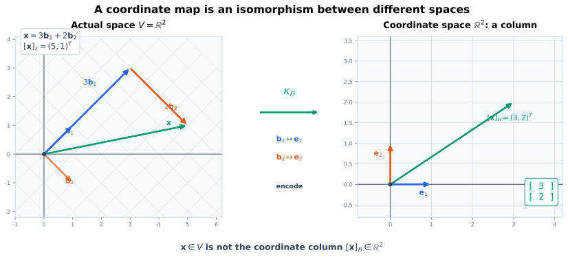
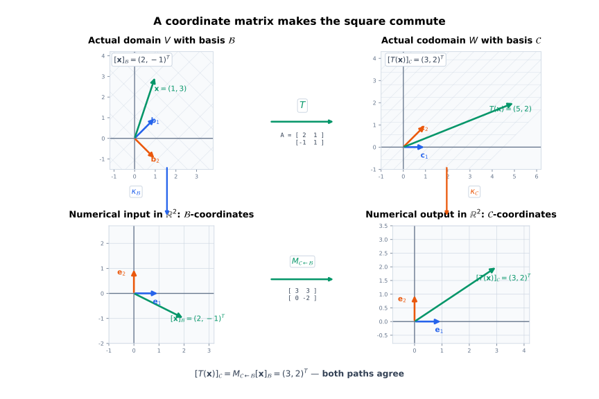
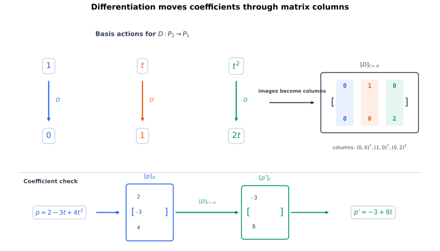
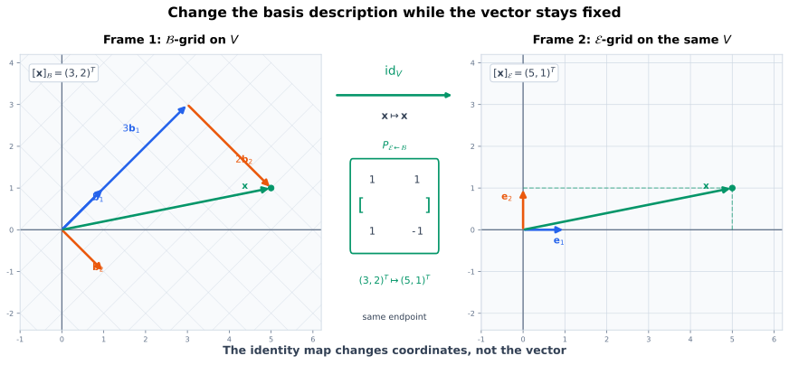
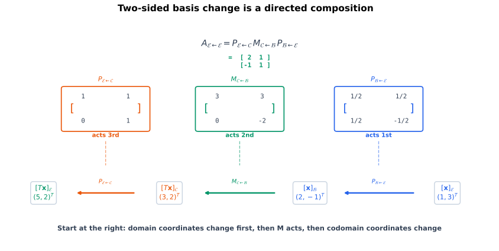
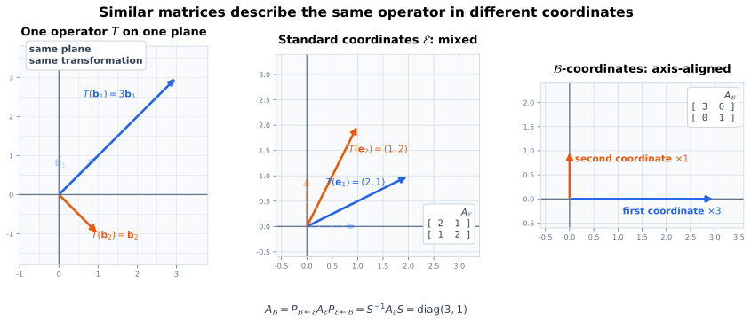

# 同一个向量为什么会有不同坐标

基与维数理论保证：一旦选定有序基，每个向量都有且只有一个坐标列。现在把这个唯一坐标真正用于记录线性映射。

在标准基

$$
\mathcal{E}=(\mathbf{e}_1,\mathbf{e}_2)
$$

下，向量

$$
\mathbf{x}
=
\begin{bmatrix}5\\1\end{bmatrix}
$$

的坐标就是

$$
[\mathbf{x}]_{\mathcal{E}}
=
\begin{bmatrix}5\\1\end{bmatrix}.
$$

改用有序基

$$
\mathcal{B}=(\mathbf{b}_1,\mathbf{b}_2),
\qquad
\mathbf{b}_1=
\begin{bmatrix}1\\1\end{bmatrix},
\quad
\mathbf{b}_2=
\begin{bmatrix}1\\-1\end{bmatrix},
$$

同一个向量满足

$$
\mathbf{x}=3\mathbf{b}_1+2\mathbf{b}_2,
$$

所以

$$
[\mathbf{x}]_{\mathcal{B}}
=
\begin{bmatrix}3\\2\end{bmatrix}.
$$

向量没有从 $(5,1)$ 移动到 $(3,2)$；改变的是记录向量所用的坐标尺。@fig-coordinate-map-isomorphism 把这两个空间分开：左侧是向量实际所属的空间，右侧是坐标列所属的标准坐标空间。基向量 $\mathbf{b}_1,\mathbf{b}_2$ 分别被编码为 $\mathbf{e}_1,\mathbf{e}_2$，于是 $3\mathbf{b}_1+2\mathbf{b}_2$ 被编码为 $(3,2)^{\mathsf T}$。

{#fig-coordinate-map-isomorphism fig-alt="左侧实际平面显示斜基 b1、b2 和向量 x 等于三倍 b1 加两倍 b2；中间坐标映射 kappa_B；右侧标准坐标平面显示 b1 对应 e1、b2 对应 e2，x 对应坐标向量三二。" width="100%"}

这个区分在一般向量空间中更重要。多项式

$$
p(t)=2-3t+4t^2
$$

不是一个三行一列的数组，但相对于基

$$
\mathcal{B}=(1,t,t^2)
$$

有坐标

$$
[p]_{\mathcal{B}}
=
\begin{bmatrix}2\\-3\\4\end{bmatrix}.
$$

坐标列是多项式的一种数字编码，不是多项式本身。

# 核心问题

1. 什么时候一个线性映射不丢失信息，什么时候它能够覆盖整个陪域；
2. 为什么一组有序基会把任意 $n$ 维实向量空间与 $\mathbb{R}^n$ 对应起来；
3. 怎样区分抽象向量 $\mathbf{v}$ 与坐标列 $[\mathbf{v}]_{\mathcal{B}}$；
4. 对一般线性映射 $T:V\to W$，怎样在定义域基与陪域基下构造唯一矩阵；
5. 为什么矩阵的第 $j$ 列是 $T(\mathbf{b}_j)$ 在陪域基下的坐标；
6. 为什么指定基以后，矩阵乘法仍然精确表示线性映射复合；
7. 为什么换基矩阵其实是恒等映射在两组不同基下的矩阵；
8. 定义域和陪域同时换基时，表示矩阵的左右两侧各自做什么；
9. 为什么同一个线性算子在不同基下得到相似矩阵；
10. 哪些性质不依赖坐标选择，哪些矩阵外观会随基改变。

::: {.callout-important title="假设与记号"}
本章继续讨论实数域上的有限维向量空间。基一律视为**有序基**；改变基向量顺序会改变坐标分量顺序，也会改变表示矩阵的行列顺序。

记号

$$
[T]_{\mathcal{C}\leftarrow\mathcal{B}}
$$

表示：输入使用定义域基 $\mathcal{B}$ 的坐标，输出使用陪域基 $\mathcal{C}$ 的坐标。箭头从右向左读取，与矩阵作用于列向量的方向一致。
:::

# 线性同构：不丢失也不遗漏的线性映射

设 $T:V\to W$ 是线性映射。一般函数的单射、满射和双射定义可以直接用于 $T$：

- $T$ **单射**：不同输入不会得到同一输出；
- $T$ **满射**：每个 $\mathbf{w}\in W$ 都是某个输入的像；
- $T$ **双射**：同时单射和满射。

双射的线性映射称为**线性同构**。若存在同构 $T:V\to W$，则称 $V$ 与 $W$ **同构**。同构允许我们在保持全部线性组合关系的前提下，用一个空间编码另一个空间。

## 单射为什么等价于核只有零向量

线性映射满足

$$
T(\mathbf{x})=T(\mathbf{y})
\quad\Longleftrightarrow\quad
T(\mathbf{x}-\mathbf{y})=\mathbf{0}.
$$

因此：

$$
T\text{ 单射}
\quad\Longleftrightarrow\quad
\ker(T)=\{\mathbf{0}\}.
$$ {#eq-injective-iff-trivial-kernel}

**证明。** 若 $T$ 单射且 $\mathbf{v}\in\ker(T)$，则

$$
T(\mathbf{v})=\mathbf{0}=T(\mathbf{0}).
$$

单射性迫使 $\mathbf{v}=\mathbf{0}$，所以核只有零向量。

反过来，若 $\ker(T)=\{\mathbf{0}\}$ 且 $T(\mathbf{x})=T(\mathbf{y})$，则

$$
T(\mathbf{x}-\mathbf{y})=\mathbf{0}.
$$

于是 $\mathbf{x}-\mathbf{y}=\mathbf{0}$，即 $\mathbf{x}=\mathbf{y}$，所以 $T$ 单射。$\square$

满射则直接等价于

$$
\operatorname{im}(T)=W.
$$ {#eq-surjective-iff-full-image}

## 双射线性映射的逆映射仍然线性

若 $T:V\to W$ 是双射，一般函数理论保证逆函数

$$
T^{-1}:W\to V
$$

存在。还需验证它保持线性组合。

任取 $\mathbf{w}_1,\mathbf{w}_2\in W$，令

$$
\mathbf{v}_1=T^{-1}(\mathbf{w}_1),
\qquad
\mathbf{v}_2=T^{-1}(\mathbf{w}_2).
$$

对任意 $a,b\in\mathbb{R}$，线性性给出

$$
T(a\mathbf{v}_1+b\mathbf{v}_2)
=a\mathbf{w}_1+b\mathbf{w}_2.
$$

对两边应用 $T^{-1}$：

$$
T^{-1}(a\mathbf{w}_1+b\mathbf{w}_2)
=aT^{-1}(\mathbf{w}_1)+bT^{-1}(\mathbf{w}_2).
$$

因此 $T^{-1}$ 也是线性映射。

## 同维有限维空间中，单射与满射等价

设

$$
\dim(V)=\dim(W)=n.
$$

秩—零度定理给出

$$
\dim(\operatorname{im}T)
+
\dim(\ker T)
=n.
$$

若 $T$ 单射，则 $\dim(\ker T)=0$，所以

$$
\dim(\operatorname{im}T)=n=\dim(W).
$$

像空间是 $W$ 的同维子空间，只能等于 $W$，因此 $T$ 满射。

反过来，若 $T$ 满射，则 $\dim(\operatorname{im}T)=n$，秩—零度迫使 $\dim(\ker T)=0$，所以 $T$ 单射。

于是同维有限维空间之间有

$$
T\text{ 单射}
\Longleftrightarrow
T\text{ 满射}
\Longleftrightarrow
T\text{ 是线性同构}.
$$ {#eq-equal-dimension-isomorphism-criteria}

::: {.callout-warning title="不同维数时不能省略维数条件"}
从 $\mathbb{R}^2$ 到 $\mathbb{R}^3$ 的线性映射可以单射但不可能满射；从 $\mathbb{R}^3$ 到 $\mathbb{R}^2$ 的线性映射可以满射但不可能单射。只有定义域与陪域维数相同，单射和满射才互相推出。
:::

# 有序基给出的坐标同构

设 $V$ 是 $n$ 维实向量空间，

$$
\mathcal{B}=(\mathbf{b}_1,\ldots,\mathbf{b}_n)
$$

是 $V$ 的一组有序基。每个 $\mathbf{v}\in V$ 都有唯一展开

$$
\mathbf{v}
=x_1\mathbf{b}_1+
\cdots+
 x_n\mathbf{b}_n.
$$

定义**坐标映射**

$$
\kappa_{\mathcal{B}}:V\to\mathbb{R}^n,
\qquad
\kappa_{\mathcal{B}}(\mathbf{v})
\coloneqq
[\mathbf{v}]_{\mathcal{B}}
=
\begin{bmatrix}
x_1\\\vdots\\x_n
\end{bmatrix}.
$$ {#eq-coordinate-map-definition}

它把抽象向量送到相对于 $\mathcal{B}$ 的坐标列。

## 坐标映射为什么线性

设

$$
[\mathbf{u}]_{\mathcal{B}}
=
\begin{bmatrix}u_1\\\vdots\\u_n\end{bmatrix},
\qquad
[\mathbf{v}]_{\mathcal{B}}
=
\begin{bmatrix}v_1\\\vdots\\v_n\end{bmatrix}.
$$

那么

$$
\mathbf{u}=\sum_{j=1}^{n}u_j\mathbf{b}_j,
\qquad
\mathbf{v}=\sum_{j=1}^{n}v_j\mathbf{b}_j.
$$

对任意标量 $a,b$，

$$
a\mathbf{u}+b\mathbf{v}
=
\sum_{j=1}^{n}(au_j+bv_j)\mathbf{b}_j.
$$

坐标唯一性给出

$$
[a\mathbf{u}+b\mathbf{v}]_{\mathcal{B}}
=
a[\mathbf{u}]_{\mathcal{B}}
+b[\mathbf{v}]_{\mathcal{B}}.
$$ {#eq-coordinate-map-linearity}

所以 $\kappa_{\mathcal{B}}$ 是线性映射。

## 坐标映射为什么是双射

- **单射**：若 $[\mathbf{u}]_{\mathcal{B}}=[\mathbf{v}]_{\mathcal{B}}$，两者在基下有相同系数，故 $\mathbf{u}=\mathbf{v}$；
- **满射**：任取坐标列 $\mathbf{x}=(x_1,\ldots,x_n)^{\mathsf T}\in\mathbb{R}^n$，向量
  $$
  \sum_{j=1}^{n}x_j\mathbf{b}_j
  $$
  的 $\mathcal{B}$-坐标恰好是 $\mathbf{x}$。

因此 $\kappa_{\mathcal{B}}$ 是线性同构。它的逆映射是**坐标合成映射**：

$$
\kappa_{\mathcal{B}}^{-1}
\left(
\begin{bmatrix}x_1\\\vdots\\x_n\end{bmatrix}
\right)
=
\sum_{j=1}^{n}x_j\mathbf{b}_j.
$$ {#eq-coordinate-synthesis-map}

由此得到：

> 每个 $n$ 维实向量空间在选定一组有序基后，都与 $\mathbb{R}^n$ 线性同构。

“选定基后”不可省略。同一个空间可以选择许多基，它们给出许多不同的坐标同构；同构关系保留线性结构，但没有自动指定哪一组坐标最自然。

# 任意基下的线性映射矩阵

先看一个具体的坐标流。@fig-coordinate-matrix-square 上方是实际向量的变化：输入向量 $\mathbf{x}$ 经过 $T$ 变成 $T(\mathbf{x})$；下方是数字编码的变化：$\mathcal{B}$-坐标列经过矩阵 $\mathbf{M}_{\mathcal{C}\leftarrow\mathcal{B}}$ 变成 $\mathcal{C}$-坐标列。两条竖直箭头只负责读取坐标，因此沿方形的两条路径必须得到相同结果。

{#fig-coordinate-matrix-square fig-alt="四个面板组成交换方形：左上定义域实际向量 x，右上经过 T 得到实际输出；左下是 x 在基 B 下的坐标二负一，右下是输出在基 C 下的坐标三二；上方由 T 连接，下方由坐标矩阵 M 连接，两侧竖向由坐标映射连接。" width="100%"}

图中的具体数字稍后逐项核对。先把这条坐标流写成一般形式。设

$$
T:V\to W
$$

是线性映射，其中

$$
\dim(V)=n,
\qquad
\dim(W)=m.
$$

在定义域选择有序基

$$
\mathcal{B}=(\mathbf{b}_1,\ldots,\mathbf{b}_n),
$$

在陪域选择有序基

$$
\mathcal{C}=(\mathbf{c}_1,\ldots,\mathbf{c}_m).
$$

每个 $T(\mathbf{b}_j)\in W$ 都有唯一的 $\mathcal{C}$-坐标。把这些坐标列依次放入矩阵，定义

$$
[T]_{\mathcal{C}\leftarrow\mathcal{B}}
\coloneqq
\begin{bmatrix}
\vert&&\vert\\
[T(\mathbf{b}_1)]_{\mathcal{C}}
&\cdots&
[T(\mathbf{b}_n)]_{\mathcal{C}}\\
\vert&&\vert
\end{bmatrix}
\in\mathbb{R}^{m\times n}.
$$ {#eq-coordinate-matrix-definition}

矩阵有 $n$ 列，因为定义域基有 $n$ 个向量；每列有 $m$ 个分量，因为输出使用陪域的 $m$ 维坐标。

## 核心坐标公式

若

$$
[\mathbf{v}]_{\mathcal{B}}
=
\begin{bmatrix}x_1\\\vdots\\x_n\end{bmatrix},
$$

则

$$
\mathbf{v}=\sum_{j=1}^{n}x_j\mathbf{b}_j.
$$

由线性性，

$$
T(\mathbf{v})
=
\sum_{j=1}^{n}x_jT(\mathbf{b}_j).
$$

取 $\mathcal{C}$-坐标，并使用坐标映射的线性性：

$$
[T(\mathbf{v})]_{\mathcal{C}}
=
\sum_{j=1}^{n}x_j[T(\mathbf{b}_j)]_{\mathcal{C}}.
$$

右侧正是矩阵各列按 $x_j$ 形成的线性组合，所以

$$
\boxed{
[T(\mathbf{v})]_{\mathcal{C}}
=
[T]_{\mathcal{C}\leftarrow\mathcal{B}}
[\mathbf{v}]_{\mathcal{B}}
}.
$$ {#eq-coordinate-matrix-action}

这就是标准公式

$$
T(\mathbf{x})=\mathbf{A}\mathbf{x}
$$

在任意有限维空间、任意定义域基和任意陪域基下的完整形式。

## 一个完整的坐标交换方形

考虑标准坐标下的线性映射

$$
T:\mathbb{R}^2\to\mathbb{R}^2,
\qquad
T(\mathbf{x})
=
\mathbf{A}\mathbf{x},
\qquad
\mathbf{A}
=
\begin{bmatrix}
2&1\\
-1&1
\end{bmatrix}.
$$

定义域使用基

$$
\mathcal{B}
=
\left(
\begin{bmatrix}1\\1\end{bmatrix},
\begin{bmatrix}1\\-1\end{bmatrix}
\right),
$$

陪域使用基

$$
\mathcal{C}
=
\left(
\begin{bmatrix}1\\0\end{bmatrix},
\begin{bmatrix}1\\1\end{bmatrix}
\right).
$$

先计算两列。对 $\mathbf{b}_1=(1,1)^{\mathsf T}$，

$$
T(\mathbf{b}_1)
=
\begin{bmatrix}3\\0\end{bmatrix}
=3\mathbf{c}_1+0\mathbf{c}_2,
$$

因此

$$
[T(\mathbf{b}_1)]_{\mathcal{C}}
=
\begin{bmatrix}3\\0\end{bmatrix}.
$$

对 $\mathbf{b}_2=(1,-1)^{\mathsf T}$，

$$
T(\mathbf{b}_2)
=
\begin{bmatrix}1\\-2\end{bmatrix}
=3\mathbf{c}_1-2\mathbf{c}_2,
$$

所以

$$
[T(\mathbf{b}_2)]_{\mathcal{C}}
=
\begin{bmatrix}3\\-2\end{bmatrix}.
$$

把两列合并：

$$
[T]_{\mathcal{C}\leftarrow\mathcal{B}}
=
\begin{bmatrix}
3&3\\
0&-2
\end{bmatrix}.
$$ {#eq-running-coordinate-matrix}

取

$$
[\mathbf{x}]_{\mathcal{B}}
=
\begin{bmatrix}2\\-1\end{bmatrix}.
$$

实际向量是

$$
\mathbf{x}
=2\mathbf{b}_1-\mathbf{b}_2
=
\begin{bmatrix}1\\3\end{bmatrix},
$$

而

$$
T(\mathbf{x})
=
\begin{bmatrix}5\\2\end{bmatrix}.
$$

在 $\mathcal{C}$ 下，

$$
\begin{bmatrix}5\\2\end{bmatrix}
=3\mathbf{c}_1+2\mathbf{c}_2,
$$

因此

$$
[T(\mathbf{x})]_{\mathcal{C}}
=
\begin{bmatrix}3\\2\end{bmatrix}.
$$

直接用坐标矩阵也得到

$$
\begin{bmatrix}
3&3\\
0&-2
\end{bmatrix}
\begin{bmatrix}2\\-1\end{bmatrix}
=
\begin{bmatrix}3\\2\end{bmatrix}.
$$

这正是 @fig-coordinate-matrix-square 下方的坐标路径：

$$
\begin{bmatrix}2\\-1\end{bmatrix}_{\mathcal B}
\xmapsto{\,\mathbf M_{\mathcal C\leftarrow\mathcal B}\,}
\begin{bmatrix}3\\2\end{bmatrix}_{\mathcal C},
$$

它与上方“先作用 $T$、再读取 $\mathcal C$-坐标”的路径汇合。

## 表示矩阵为什么唯一

若另一个矩阵 $\mathbf{N}\in\mathbb{R}^{m\times n}$ 也满足

$$
[T(\mathbf{v})]_{\mathcal{C}}
=
\mathbf{N}[\mathbf{v}]_{\mathcal{B}}
$$

对所有 $\mathbf{v}\in V$ 成立，那么令 $\mathbf{v}=\mathbf{b}_j$。因为

$$
[\mathbf{b}_j]_{\mathcal{B}}=\mathbf{e}_j,
$$

得到

$$
\mathbf{N}\mathbf{e}_j
=
[T(\mathbf{b}_j)]_{\mathcal{C}}.
$$

左侧是 $\mathbf{N}$ 的第 $j$ 列，右侧是 @eq-coordinate-matrix-definition 规定的第 $j$ 列。所有列都被唯一确定，所以

$$
\mathbf{N}
=
[T]_{\mathcal{C}\leftarrow\mathcal{B}}.
$$

反方向也成立：给定任意矩阵 $\mathbf{M}\in\mathbb{R}^{m\times n}$，令

$$
T_{\mathbf M}:\mathbb R^n\to\mathbb R^m,
\qquad
T_{\mathbf M}(\mathbf x)=\mathbf M\mathbf x,
$$

并定义

$$
T
\coloneqq
\kappa_{\mathcal{C}}^{-1}
\circ T_{\mathbf{M}}
\circ\kappa_{\mathcal{B}}.
$$ {#eq-matrix-defines-map-between-bases}

三个映射都线性，因此 $T:V\to W$ 线性，并且它在 $\mathcal{B},\mathcal{C}$ 下的矩阵就是 $\mathbf{M}$。所以一旦指定定义域基与陪域基，线性映射与相应形状的矩阵一一对应。

# 抽象空间例子：多项式求导

令

$$
D:\mathbb{P}_2\to\mathbb{P}_1,
\qquad
D(p)=p'
$$

为求导映射。它是线性的，因为

$$
D(ap+bq)=aD(p)+bD(q).
$$

定义域和陪域分别选择基

$$
\mathcal{B}=(1,t,t^2),
\qquad
\mathcal{C}=(1,t).
$$

逐个求定义域基向量的像：

$$
D(1)=0,
\qquad
D(t)=1,
\qquad
D(t^2)=2t.
$$

它们的 $\mathcal{C}$-坐标为

$$
[0]_{\mathcal{C}}
=
\begin{bmatrix}0\\0\end{bmatrix},
\quad
[1]_{\mathcal{C}}
=
\begin{bmatrix}1\\0\end{bmatrix},
\quad
[2t]_{\mathcal{C}}
=
\begin{bmatrix}0\\2\end{bmatrix}.
$$

因此

$$
[D]_{\mathcal{C}\leftarrow\mathcal{B}}
=
\begin{bmatrix}
0&1&0\\
0&0&2
\end{bmatrix}.
$$ {#eq-polynomial-derivative-matrix}

对

$$
p(t)=2-3t+4t^2,
\qquad
[p]_{\mathcal{B}}
=
\begin{bmatrix}2\\-3\\4\end{bmatrix},
$$

矩阵计算给出

$$
[D(p)]_{\mathcal{C}}
=
\begin{bmatrix}
0&1&0\\
0&0&2
\end{bmatrix}
\begin{bmatrix}2\\-3\\4\end{bmatrix}
=
\begin{bmatrix}-3\\8\end{bmatrix}.
$$

这恰好对应

$$
D(p)=-3+8t.
$$

{#fig-polynomial-derivative-matrix fig-alt="上方显示一、t、t平方分别经过求导变为零、一、二t；中间矩阵三列分别是零零、一零、零二；下方将多项式系数二负三四映到导数系数负三八。" width="100%"}

这个例子说明：矩阵不是线性映射本身。求导映射作用于多项式；只有在定义域和陪域都选定基以后，才由一个数值矩阵记录。

# 复合、恒等与逆映射的坐标矩阵

设

$$
T:U\to V,
\qquad
S:V\to W,
$$

并分别在 $U,V,W$ 中选择有序基

$$
\mathcal{A},\qquad\mathcal{B},\qquad\mathcal{C}.
$$

对任意 $\mathbf{u}\in U$，连续使用 @eq-coordinate-matrix-action：

$$
\begin{aligned}
[(S\circ T)(\mathbf{u})]_{\mathcal{C}}
&=
[S]_{\mathcal{C}\leftarrow\mathcal{B}}
[T(\mathbf{u})]_{\mathcal{B}}\\
&=
[S]_{\mathcal{C}\leftarrow\mathcal{B}}
[T]_{\mathcal{B}\leftarrow\mathcal{A}}
[\mathbf{u}]_{\mathcal{A}}.
\end{aligned}
$$

表示矩阵唯一，因此

$$
[S\circ T]_{\mathcal{C}\leftarrow\mathcal{A}}
=
[S]_{\mathcal{C}\leftarrow\mathcal{B}}
[T]_{\mathcal{B}\leftarrow\mathcal{A}}.
$$ {#eq-coordinate-matrix-composition}

这不是新的矩阵乘法规则，而是已有“矩阵乘法表示复合”在任意基下的版本。关键是中间空间 $V$ 两次都使用同一组基 $\mathcal{B}$：前一个矩阵输出 $\mathcal{B}$-坐标，后一个矩阵才能直接接收 $\mathcal{B}$-坐标。

## 恒等映射的矩阵不一定是单位矩阵

恒等映射

$$
I_V:V\to V,
\qquad
I_V(\mathbf{v})=\mathbf{v}
$$

不改变向量。若输入和输出都使用同一组基 $\mathcal{B}$，则

$$
[I_V]_{\mathcal{B}\leftarrow\mathcal{B}}
=
\mathbf{I}_n.
$$

但若输入使用 $\mathcal{B}$、输出使用另一组基 $\mathcal{C}$，恒等映射虽然仍不改变向量，它的矩阵一般不再是单位矩阵。这个观察正好引出换基。

## 逆映射对应逆矩阵

若 $T:V\to W$ 是线性同构，则 $\dim(V)=\dim(W)$：单射性与秩—零度给出 $\dim(V)\leq\dim(W)$，满射性给出 $\dim(V)\geq\dim(W)$。记这个共同维数为 $n$，则表示矩阵

$$
\mathbf{M}
=[T]_{\mathcal{C}\leftarrow\mathcal{B}}
$$

是 $n\times n$ 方阵。由

$$
T^{-1}\circ T=I_V
$$

及 @eq-coordinate-matrix-composition，

$$
[T^{-1}]_{\mathcal{B}\leftarrow\mathcal{C}}
[T]_{\mathcal{C}\leftarrow\mathcal{B}}
=
\mathbf{I}_n.
$$

同理，由 $T\circ T^{-1}=I_W$ 得到反向乘积也为单位矩阵。因此

$$
[T^{-1}]_{\mathcal{B}\leftarrow\mathcal{C}}
=
[T]_{\mathcal{C}\leftarrow\mathcal{B}}^{-1}.
$$ {#eq-inverse-map-coordinate-matrix}

这证明了“线性同构推出表示矩阵可逆”。反过来，设

$$
\mathbf M=[T]_{\mathcal C\leftarrow\mathcal B}
$$

可逆。此时 $\mathbf M$ 必为方阵，所以 $\dim(V)=\dim(W)=n$。利用 $\mathbf M^{-1}$ 定义线性映射

$$
S
\coloneqq
\kappa_{\mathcal B}^{-1}
\circ T_{\mathbf M^{-1}}
\circ\kappa_{\mathcal C}
:W\to V.
$$

由矩阵与线性映射的一一对应，

$$
[S]_{\mathcal B\leftarrow\mathcal C}=\mathbf M^{-1}.
$$

复合公式给出

$$
[S\circ T]_{\mathcal B\leftarrow\mathcal B}
=
\mathbf M^{-1}\mathbf M
=
\mathbf I_n
=
[I_V]_{\mathcal B\leftarrow\mathcal B},
$$

而表示矩阵唯一，所以 $S\circ T=I_V$。同理，

$$
[T\circ S]_{\mathcal C\leftarrow\mathcal C}
=
\mathbf M\mathbf M^{-1}
=
\mathbf I_n
=
[I_W]_{\mathcal C\leftarrow\mathcal C},
$$

故 $T\circ S=I_W$。于是 $S=T^{-1}$，$T$ 是线性同构。两个方向合并得到

$$
T\text{ 是线性同构}
\quad\Longleftrightarrow\quad
[T]_{\mathcal{C}\leftarrow\mathcal{B}}
\text{ 可逆}.
$$ {#eq-isomorphism-iff-invertible-coordinate-matrix}

# 换基矩阵：恒等映射只改变坐标

先固定实际空间中的一个向量。@fig-change-of-basis-identity 左右两幅图中的绿色箭头有同一个起点和终点；左图沿斜基网格读成 $(3,2)^{\mathsf T}$，右图沿标准网格读成 $(5,1)^{\mathsf T}$。恒等映射没有移动向量，只改变记录它的数字。

{#fig-change-of-basis-identity fig-alt="左右两个平面显示同一绿色向量 x，左侧用斜基 B 表示为坐标三二，右侧用标准基 E 表示为五一；中间恒等映射与换基矩阵 P 从 B 指向 E，强调向量不变而坐标改变。" width="100%"}

设 $V$ 是 $n$ 维向量空间，$\mathcal{B}$ 与 $\mathcal{C}$ 是 $V$ 的两组有序基。定义从 $\mathcal{B}$-坐标到 $\mathcal{C}$-坐标的**换基矩阵**或**过渡矩阵**：

$$
\mathbf{P}_{\mathcal{C}\leftarrow\mathcal{B}}
\coloneqq
[I_V]_{\mathcal{C}\leftarrow\mathcal{B}}.
$$ {#eq-change-of-basis-definition}

因为 $I_V(\mathbf{b}_j)=\mathbf{b}_j$，按坐标矩阵定义，

$$
\mathbf{P}_{\mathcal{C}\leftarrow\mathcal{B}}
=
\begin{bmatrix}
\vert&&\vert\\
[\mathbf{b}_1]_{\mathcal{C}}
&\cdots&
[\mathbf{b}_n]_{\mathcal{C}}\\
\vert&&\vert
\end{bmatrix}.
$$ {#eq-change-of-basis-columns}

对任意 $\mathbf{v}\in V$，@eq-coordinate-matrix-action 给出

$$
[\mathbf{v}]_{\mathcal{C}}
=
\mathbf{P}_{\mathcal{C}\leftarrow\mathcal{B}}
[\mathbf{v}]_{\mathcal{B}}.
$$ {#eq-change-of-basis-vector}

::: {.callout-tip title="用箭头检查方向"}
在

$$
\mathbf{P}_{\mathcal{C}\leftarrow\mathcal{B}}
$$

中，右侧 $\mathcal{B}$ 是输入坐标的基，左侧 $\mathcal{C}$ 是输出坐标的基。矩阵各列是“旧基 $\mathcal{B}$ 的基向量，用新基 $\mathcal{C}$ 怎样表示”。不要只凭公式中哪个字母先出现来猜方向。
:::

## 标准基与非标准基的例子

继续取

$$
\mathcal{B}=(\mathbf{b}_1,\mathbf{b}_2),
\qquad
\mathbf{b}_1=
\begin{bmatrix}1\\1\end{bmatrix},
\quad
\mathbf{b}_2=
\begin{bmatrix}1\\-1\end{bmatrix},
$$

以及标准基 $\mathcal{E}$。因为基向量的标准坐标就是它们本身，

$$
\mathbf{P}_{\mathcal{E}\leftarrow\mathcal{B}}
=
\begin{bmatrix}
1&1\\
1&-1
\end{bmatrix}.
$$

于是

$$
[\mathbf{x}]_{\mathcal{E}}
=
\mathbf{P}_{\mathcal{E}\leftarrow\mathcal{B}}
[\mathbf{x}]_{\mathcal{B}}
=
\begin{bmatrix}
1&1\\
1&-1
\end{bmatrix}
\begin{bmatrix}3\\2\end{bmatrix}
=
\begin{bmatrix}5\\1\end{bmatrix}.
$$

这个计算把 @fig-change-of-basis-identity 中间的数字转换完整写出。所得矩阵正是前文把基向量并为列得到的基矩阵。一般公式

$$
\mathbf{x}=\mathbf{B}[\mathbf{x}]_{\mathcal{B}}
$$

现在可读成

$$
[\mathbf{x}]_{\mathcal{E}}
=
\mathbf{P}_{\mathcal{E}\leftarrow\mathcal{B}}
[\mathbf{x}]_{\mathcal{B}}.
$$

## 反向换基矩阵是逆矩阵

恒等映射是线性同构，而且

$$
I_V^{-1}=I_V.
$$

但输入输出基交换以后，表示矩阵方向也交换。由 @eq-inverse-map-coordinate-matrix，

$$
\mathbf{P}_{\mathcal{B}\leftarrow\mathcal{C}}
=
\mathbf{P}_{\mathcal{C}\leftarrow\mathcal{B}}^{-1}.
$$ {#eq-change-of-basis-inverse}

在上例中，

$$
\mathbf{P}_{\mathcal{B}\leftarrow\mathcal{E}}
=
\frac12
\begin{bmatrix}
1&1\\
1&-1
\end{bmatrix}.
$$

因此

$$
[\mathbf{x}]_{\mathcal{B}}
=
\mathbf{P}_{\mathcal{B}\leftarrow\mathcal{E}}
[\mathbf{x}]_{\mathcal{E}}
=
\frac12
\begin{bmatrix}
1&1\\
1&-1
\end{bmatrix}
\begin{bmatrix}5\\1\end{bmatrix}
=
\begin{bmatrix}3\\2\end{bmatrix}.
$$

## 多次换基仍是矩阵乘法

若 $\mathcal{B},\mathcal{C},\mathcal{D}$ 是同一空间的三组有序基，则

$$
I_V=I_V\circ I_V.
$$

在中间坐标使用 $\mathcal{C}$，由复合公式得到

$$
\mathbf{P}_{\mathcal{D}\leftarrow\mathcal{B}}
=
\mathbf{P}_{\mathcal{D}\leftarrow\mathcal{C}}
\mathbf{P}_{\mathcal{C}\leftarrow\mathcal{B}}.
$$ {#eq-change-of-basis-chain}

矩阵从右向左依次把 $\mathcal{B}$-坐标转换为 $\mathcal{C}$-坐标，再转换为 $\mathcal{D}$-坐标。

# 定义域与陪域同时换基

先沿 @fig-two-sided-basis-change 下方的数字从右向左走：标准输入坐标 $(1,3)^{\mathsf T}$ 先换成 $\mathcal B$-坐标 $(2,-1)^{\mathsf T}$，旧矩阵再把它送到 $\mathcal C$-坐标 $(3,2)^{\mathsf T}$，最后换回标准输出坐标 $(5,2)^{\mathsf T}$。输入换基先作用，所以在乘积右侧；输出换基后作用，所以在左侧。

{#fig-two-sided-basis-change fig-alt="从右向左的四个坐标列依次为标准输入坐标、B 输入坐标、C 输出坐标和标准输出坐标；三个矩阵依次转换输入坐标、应用旧表示矩阵、转换输出坐标，三者乘积得到标准矩阵 A。" width="100%"}

把这条坐标流写成一般形式。设

$$
T:V\to W,
$$

旧定义域基和旧陪域基分别为 $\mathcal{B},\mathcal{C}$，新定义域基和新陪域基分别为 $\mathcal{B}',\mathcal{C}'$。记

$$
\mathbf{M}
=[T]_{\mathcal{C}\leftarrow\mathcal{B}}.
$$

输入首先以 $\mathcal{B}'$-坐标给出。要让旧矩阵 $\mathbf{M}$ 接收它，必须先转换为 $\mathcal{B}$-坐标：

$$
[\mathbf{v}]_{\mathcal{B}}
=
\mathbf{P}_{\mathcal{B}\leftarrow\mathcal{B}'}
[\mathbf{v}]_{\mathcal{B}'}.
$$

旧矩阵输出 $\mathcal{C}$-坐标：

$$
[T(\mathbf{v})]_{\mathcal{C}}
=
\mathbf{M}
\mathbf{P}_{\mathcal{B}\leftarrow\mathcal{B}'}
[\mathbf{v}]_{\mathcal{B}'}.
$$

最后把输出转换为 $\mathcal{C}'$-坐标：

$$
[T(\mathbf{v})]_{\mathcal{C}'}
=
\mathbf{P}_{\mathcal{C}'\leftarrow\mathcal{C}}
\mathbf{M}
\mathbf{P}_{\mathcal{B}\leftarrow\mathcal{B}'}
[\mathbf{v}]_{\mathcal{B}'}.
$$

表示矩阵唯一，所以

$$
\boxed{
[T]_{\mathcal{C}'\leftarrow\mathcal{B}'}
=
\mathbf{P}_{\mathcal{C}'\leftarrow\mathcal{C}}
[T]_{\mathcal{C}\leftarrow\mathcal{B}}
\mathbf{P}_{\mathcal{B}\leftarrow\mathcal{B}'}
}.
$$ {#eq-two-sided-basis-change}

@eq-two-sided-basis-change 正是 @fig-two-sided-basis-change 中三段坐标转换的一般表达。

## 用具体矩阵核对两侧方向

前面的基矩阵为

$$
\mathbf{P}_{\mathcal{E}\leftarrow\mathcal{B}}
=
\begin{bmatrix}
1&1\\
1&-1
\end{bmatrix},
\qquad
\mathbf{P}_{\mathcal{B}\leftarrow\mathcal{E}}
=
\frac12
\begin{bmatrix}
1&1\\
1&-1
\end{bmatrix}.
$$

陪域基

$$
\mathcal{C}
=
\left(
\begin{bmatrix}1\\0\end{bmatrix},
\begin{bmatrix}1\\1\end{bmatrix}
\right)
$$

给出

$$
\mathbf{P}_{\mathcal{E}\leftarrow\mathcal{C}}
=
\begin{bmatrix}
1&1\\
0&1
\end{bmatrix}.
$$

令 $\mathcal{B}'=\mathcal{C}'=\mathcal{E}$，把 @eq-running-coordinate-matrix 代入 @eq-two-sided-basis-change：

$$
\begin{aligned}
[T]_{\mathcal{E}\leftarrow\mathcal{E}}
&=
\mathbf{P}_{\mathcal{E}\leftarrow\mathcal{C}}
[T]_{\mathcal{C}\leftarrow\mathcal{B}}
\mathbf{P}_{\mathcal{B}\leftarrow\mathcal{E}}\\
&=
\begin{bmatrix}1&1\\0&1\end{bmatrix}
\begin{bmatrix}3&3\\0&-2\end{bmatrix}
\frac12
\begin{bmatrix}1&1\\1&-1\end{bmatrix}\\
&=
\begin{bmatrix}2&1\\-1&1\end{bmatrix}.
\end{aligned}
$$

这正是映射 $T$ 的标准矩阵。

::: {.callout-warning title="左右两侧不能凭对称性猜测"}
定义域换基作用在输入坐标上，所以矩阵出现在右侧并先作用；陪域换基作用在已经得到的输出坐标上，所以矩阵出现在左侧并后作用。两者通常不是同一个矩阵，也不要求定义域与陪域是同一空间。
:::

# 相似矩阵：同一个算子的两种坐标记录

定义域与陪域相同的线性映射 $T:V\to V$ 称为 $V$ 上的**线性算子**。当输入和输出都使用同一组基 $\mathcal D$ 时，简写

$$
[T]_{\mathcal D}
\coloneqq
[T]_{\mathcal D\leftarrow\mathcal D}.
$$

## 一个算子，两种完全不同的矩阵外观

考虑平面上的线性算子 $T:\mathbb R^2\to\mathbb R^2$，它在标准基下的矩阵是

$$
[T]_{\mathcal{E}}
=
\begin{bmatrix}
2&1\\
1&2
\end{bmatrix}.
$$

改用有序基

$$
\mathcal{B}
=
\left(
\mathbf b_1,
\mathbf b_2
\right)
=
\left(
\begin{bmatrix}1\\1\end{bmatrix},
\begin{bmatrix}1\\-1\end{bmatrix}
\right).
$$

直接作用于两个基向量：

$$
T(\mathbf{b}_1)=3\mathbf{b}_1,
\qquad
T(\mathbf{b}_2)=\mathbf{b}_2.
$$

所以同一个 $T$ 在 $\mathcal B$ 下记录为

$$
[T]_{\mathcal{B}}
=
\begin{bmatrix}
3&0\\
0&1
\end{bmatrix}.
$$

@fig-similar-matrices-same-operator 的左面板画实际平面中的同一个算子；中间面板用标准坐标记录两个标准方向的像；右面板则使用 $\mathcal B$-坐标。标准坐标中的两个方向发生混合，而 $\mathcal B$-坐标只需把第一分量放大三倍、保持第二分量不变。算子没有改变，改变的是描述它的坐标方向。

{#fig-similar-matrices-same-operator fig-alt="三面板展示同一个平面线性算子：左侧实际平面显示 b1 被伸长三倍而 b2 保持不变；中间标准坐标下矩阵为二一一二，两个坐标方向发生混合；右侧 B 坐标下矩阵为对角三一，两个坐标方向分别独立缩放。" width="100%"}

矩阵关系也可直接核对。令

$$
\mathbf{S}
=
\mathbf{P}_{\mathcal{E}\leftarrow\mathcal{B}}
=
\begin{bmatrix}
1&1\\
1&-1
\end{bmatrix}.
$$

从 $\mathcal B$-坐标出发，先乘 $\mathbf S$ 换成标准坐标，应用标准矩阵，再乘 $\mathbf S^{-1}$ 换回 $\mathcal B$-坐标，因此

$$
[T]_{\mathcal{B}}
=
\mathbf{S}^{-1}
[T]_{\mathcal{E}}
\mathbf{S}
=
\begin{bmatrix}
3&0\\
0&1
\end{bmatrix}.
$$

## 从同步换基得到一般公式

现在考虑任意有限维空间上的线性算子

$$
T:V\to V.
$$

设 $\mathcal B,\mathcal C$ 是 $V$ 的两组有序基。在一般两侧换基公式 @eq-two-sided-basis-change 中，令旧定义域基与旧陪域基都为 $\mathcal B$，新定义域基与新陪域基都为另一组基 $\mathcal C$，得到

$$
[T]_{\mathcal C}
=
\mathbf P_{\mathcal C\leftarrow\mathcal B}
[T]_{\mathcal B}
\mathbf P_{\mathcal B\leftarrow\mathcal C}.
$$

由 @eq-change-of-basis-inverse，若记

$$
\mathbf P
=
\mathbf P_{\mathcal B\leftarrow\mathcal C},
$$

则

$$
[T]_{\mathcal C}
=
\mathbf P^{-1}
[T]_{\mathcal B}
\mathbf P.
$$ {#eq-similarity-from-basis-change}

两个 $n\times n$ 矩阵 $\mathbf A,\mathbf B$ 称为**相似**，若存在可逆矩阵 $\mathbf P$ 使

$$
\mathbf B=\mathbf P^{-1}\mathbf A\mathbf P.
$$ {#eq-similar-matrices-definition}

因此，同一个线性算子在两组有序基下的矩阵必然相似。反过来，若 $\mathbf B=\mathbf P^{-1}\mathbf A\mathbf P$，把 $\mathbf P$ 的各列作为一组新基在旧基下的坐标，就能把 $\mathbf A$ 与 $\mathbf B$ 看作同一个算子的两种坐标记录。

::: {.callout-important title="相似只适用于同一空间上的算子"}
一般映射 $T:V\to W$ 的定义域和陪域可以分别换基，得到两侧不同的过渡矩阵 @eq-two-sided-basis-change。只有当 $V=W$，并且输入与输出同步使用同一组旧基、再同步使用同一组新基时，公式才收缩成相似关系。
:::

## 相似是一种等价关系

相似关系满足：

1. **自反性**：
   $$
   \mathbf{A}
   =
   \mathbf{I}^{-1}\mathbf{A}\mathbf{I};
   $$
2. **对称性**：若
   $$
   \mathbf{B}=\mathbf{P}^{-1}\mathbf{A}\mathbf{P},
   $$
   则
   $$
   \mathbf{A}=\mathbf{P}\mathbf{B}\mathbf{P}^{-1}
   =
   (\mathbf{P}^{-1})^{-1}\mathbf{B}\mathbf{P}^{-1};
   $$
3. **传递性**：若
   $$
   \mathbf{B}=\mathbf{P}^{-1}\mathbf{A}\mathbf{P},
   \qquad
   \mathbf{C}=\mathbf{Q}^{-1}\mathbf{B}\mathbf{Q},
   $$
   则
   $$
   \mathbf{C}
   =
   (\mathbf{P}\mathbf{Q})^{-1}
   \mathbf{A}
   (\mathbf{P}\mathbf{Q}).
   $$
   由于 $\mathbf P,\mathbf Q$ 都可逆，$\mathbf P\mathbf Q$ 也可逆，所以这确实给出 $\mathbf A$ 与 $\mathbf C$ 的相似关系。

所以相似把方阵分成若干等价类；同一类中的矩阵可以看作同一个算子的不同坐标版本。

# 坐标变化下什么保持不变

矩阵元素本身依赖基，主元所在的具体行列也可能改变。但以下性质属于线性映射本身，不随基改变：

- 核与像的维数；
- 秩与零度；
- 单射性与满射性；
- 是否为线性同构；
- 对算子而言，某个指定子空间是否在作用后仍留在自身中；以及是否存在非零真子空间 $U\subsetneq V$ 满足 $T(U)\subseteq U$。

## 秩为什么不随定义域和陪域换基改变

由 @eq-two-sided-basis-change，新旧矩阵满足

$$
\mathbf{M}'
=
\mathbf{P}_{\mathcal{C}'\leftarrow\mathcal{C}}
\mathbf{M}
\mathbf{P}_{\mathcal{B}\leftarrow\mathcal{B}'},
$$

两侧过渡矩阵都可逆。左乘可逆矩阵只是对输出空间做坐标同构，右乘可逆矩阵只是对输入空间做坐标同构，不会改变像空间的维数。因此

$$
\operatorname{rank}(\mathbf{M}')
=
\operatorname{rank}(\mathbf{M}).
$$ {#eq-rank-basis-invariant}

也可以直接从抽象映射看：无论选择什么基，$\mathbf{M}$ 表示的都是同一个 $T$，所以矩阵秩都等于

$$
\dim(\operatorname{im}T).
$$

## 核在坐标中怎样变化

若

$$
\mathbf{M}[\mathbf{v}]_{\mathcal{B}}=\mathbf{0},
$$

则 $T(\mathbf{v})=\mathbf{0}$。换用 $\mathcal{B}'$ 后，核中的实际向量不变，只是其坐标通过

$$
[\mathbf{v}]_{\mathcal{B}}
=
\mathbf{P}_{\mathcal{B}\leftarrow\mathcal{B}'}
[\mathbf{v}]_{\mathcal{B}'}
$$

重新编码。因此零空间作为坐标子空间可能改变位置，但维数不变。

::: {.callout-warning title="不变量不等于矩阵完全不变"}
换基通常会改变矩阵的每个元素、列空间在坐标空间中的具体位置以及某些稀疏结构。保持的是由同一个抽象线性映射决定的结构性质，而不是数组外观。
:::

# 用 NumPy 与 SymPy 核对坐标公式

```{python}
#| label: lst-coordinate-matrices-change-of-basis
#| echo: true

import numpy as np
import sympy as sp

# 贯穿例子：标准矩阵、定义域基矩阵和陪域基矩阵。
A = sp.Matrix([[2, 1], [-1, 1]])
B = sp.Matrix([[1, 1], [1, -1]])
C = sp.Matrix([[1, 1], [0, 1]])

# 输入 B 坐标 -> 实际向量 -> 实际输出 -> 输出 C 坐标。
x_B = sp.Matrix([2, -1])
x_standard = B * x_B
y_standard = A * x_standard
y_C = C.inv() * y_standard

# 一般基下的矩阵应满足 M = C^{-1} A B。
M_C_from_B = C.inv() * A * B
assert M_C_from_B == sp.Matrix([[3, 3], [0, -2]])
assert x_standard == sp.Matrix([1, 3])
assert y_standard == sp.Matrix([5, 2])
assert y_C == sp.Matrix([3, 2])
assert M_C_from_B * x_B == y_C

# 两端换回标准坐标：A = C M B^{-1}。
assert C * M_C_from_B * B.inv() == A

# 多项式求导矩阵。
D = sp.Matrix([[0, 1, 0], [0, 0, 2]])
p_B = sp.Matrix([2, -3, 4])
assert D * p_B == sp.Matrix([-3, 8])

# 相似矩阵例子。
operator_standard = sp.Matrix([[2, 1], [1, 2]])
operator_B = B.inv() * operator_standard * B
assert operator_B == sp.diag(3, 1)
assert operator_standard.rank() == operator_B.rank()

# NumPy 浮点核对同一公式。
A_np = np.array(A.tolist(), dtype=float)
B_np = np.array(B.tolist(), dtype=float)
C_np = np.array(C.tolist(), dtype=float)
M_np = np.linalg.solve(C_np, A_np @ B_np)
np.testing.assert_allclose(M_np, np.array([[3.0, 3.0], [0.0, -2.0]]))
np.testing.assert_allclose(C_np @ M_np @ np.linalg.inv(B_np), A_np)

print("[T]_{C<-B} =")
sp.pprint(M_C_from_B)
print("[x]_B =", list(x_B), "-> [T(x)]_C =", list(y_C))
print("同一算子在 B 下的矩阵 =")
sp.pprint(operator_B)
```

`np.linalg.solve(C_np, A_np @ B_np)` 比显式形成 `np.linalg.inv(C_np) @ A_np @ B_np` 更适合作为数值计算。二者在精确代数中都表达 $C^{-1}AB$，但浮点实现应优先解线性方程。若基向量几乎线性相关，基矩阵虽然在精确意义下可逆，坐标转换也可能对舍入误差非常敏感；这里不把“可逆”与“数值稳定”混为一谈。

# 与模型重参数化的连接

## 线性层可以在中间表示空间换基

考虑两个连续的无偏置线性映射

$$
\mathbf{x}
\xmapsto{\mathbf{W}_1}
\mathbf{h}
\xmapsto{\mathbf{W}_2}
\mathbf{y},
$$

其中

$$
\mathbf W_1\in\mathbb R^{d\times d_{\mathrm{in}}},
\qquad
\mathbf W_2\in\mathbb R^{d_{\mathrm{out}}\times d}.
$$

在 $d$ 维中间空间选择可逆矩阵 $\mathbf P\in\mathbb R^{d\times d}$。把 $\mathbf h$ 视为旧坐标，令 $\mathbf P$ 从新坐标转换到旧坐标，即 $\mathbf h=\mathbf P\mathbf h'$，等价地

$$
\mathbf{h}'=\mathbf{P}^{-1}\mathbf{h}.
$$

若同时重参数化

$$
\mathbf{W}_1'
=
\mathbf{P}^{-1}\mathbf{W}_1,
\qquad
\mathbf{W}_2'
=
\mathbf{W}_2\mathbf{P},
$$

则

$$
\mathbf{W}_2'\mathbf{W}_1'
=
\mathbf{W}_2\mathbf{P}
\mathbf{P}^{-1}\mathbf{W}_1
=
\mathbf{W}_2\mathbf{W}_1.
$$

因此整个输入—输出线性映射不变；改变的是中间表示的坐标与相邻权重的数字记录。

## 非线性通常会破坏任意换基自由

若中间插入逐坐标非线性 $\phi$，

$$
\mathbf{y}
=
\mathbf{W}_2\phi(\mathbf{W}_1\mathbf{x}),
$$

一般没有

$$
\phi(\mathbf{P}\mathbf{h})
=
\mathbf{P}\phi(\mathbf{h}).
$$

所以不能随意把任意可逆换基穿过 ReLU、门控、归一化或其他依赖坐标的操作。哪些变换仍保持网络函数不变，必须逐层检查具体运算，而不能只凭“隐藏表示可以换基”作全局推断。

## 相似关系不能单独证明模型语义相同

相似精确描述同一个线性算子的两种坐标记录。但训练后神经网络中的隐藏状态还经过非线性、归一化、残差相加和数据分布约束。两个激活矩阵之间存在某种线性对齐，不自动证明它们具有相同语义、因果作用或任务能力。

# 容易混淆、需要反复检查的地方

1. **向量不等于坐标列。** $\mathbf{v}\in V$，而 $[\mathbf{v}]_{\mathcal{B}}\in\mathbb{R}^n$；只有在标准坐标空间中才常把两者自然识别。
2. **基必须有顺序。** 交换 $\mathbf{b}_1$ 与 $\mathbf{b}_2$ 会交换坐标分量和表示矩阵的相应列。
3. **坐标矩阵需要两组基。** 对 $T:V\to W$，定义域基决定列对应哪些输入方向，陪域基决定每列中的输出分量。
4. **恒等映射的矩阵不总是单位矩阵。** 只有输入输出使用同一组基时才是 $\mathbf{I}$；使用两组不同基时，它就是换基矩阵。
5. **换基矩阵方向不能反写。** $\mathbf{P}_{\mathcal{C}\leftarrow\mathcal{B}}$ 接收 $\mathcal{B}$-坐标并输出 $\mathcal{C}$-坐标。
6. **定义域换基在右，陪域换基在左。** 这是坐标流向和矩阵复合顺序的结果，不是记忆口诀。
7. **一般两侧换基不等于相似。** 相似要求同一个空间上的算子，并同步改变输入和输出基。
8. **相似矩阵通常不相等。** 它们表示同一算子，但数组元素和稀疏外观可以完全不同。
9. **同尺寸矩阵不一定相似。** 必须存在可逆 $\mathbf{P}$ 满足 $\mathbf{B}=\mathbf{P}^{-1}\mathbf{A}\mathbf{P}$。
10. **代数可逆不保证数值稳定。** 几乎相关的基会使坐标转换放大浮点误差。

# 自检

1. 证明坐标合成映射 @eq-coordinate-synthesis-map 也是线性的，并直接核对它与 $\kappa_{\mathcal{B}}$ 互为逆映射。
2. 设 $T:V\to W$，$\dim V=\dim W$。用秩—零度证明 $T$ 单射当且仅当其任意表示矩阵可逆。
3. 对 $D:\mathbb{P}_3\to\mathbb{P}_2$，在基 $(1,t,t^2,t^3)$ 与 $(1,t,t^2)$ 下写出求导矩阵。
4. 设 $\mathcal{B}=((1,0)^{\mathsf T},(1,1)^{\mathsf T})$，$\mathcal{C}=((1,1)^{\mathsf T},(0,1)^{\mathsf T})$。分别求 $\mathbf{P}_{\mathcal{C}\leftarrow\mathcal{B}}$ 与反向矩阵，并核对它们互逆。
5. 从列定义证明 @eq-change-of-basis-chain，而不使用抽象复合公式。
6. 对贯穿例子，从 $\mathbf{P}_{\mathcal{E}\leftarrow\mathcal{C}}[T]_{\mathcal{C}\leftarrow\mathcal{B}}\mathbf{P}_{\mathcal{B}\leftarrow\mathcal{E}}$ 逐步解释每个中间坐标属于哪一组基。
7. 证明若 $\mathbf{A}$ 与 $\mathbf{B}$ 相似，则 $\mathbf{A}^k$ 与 $\mathbf{B}^k$ 也相似，并写出共轭矩阵。
8. 给出两个同为 $2\times2$ 但不相似的矩阵，并用秩不同说明它们不可能相似。
9. 构造一个带 ReLU 的二维例子，验证一般换基矩阵 $\mathbf{P}$ 不满足 $\operatorname{ReLU}(\mathbf{P}\mathbf{x})=\mathbf{P}\operatorname{ReLU}(\mathbf{x})$。
10. 解释为什么一个多项式的系数列改变不表示多项式本身改变，并将这句话类比到隐藏状态换基。

# 小结

一组有序基给出坐标同构

$$
\kappa_{\mathcal{B}}:V\to\mathbb{R}^n,
$$

把抽象向量编码为坐标列。对线性映射 $T:V\to W$，定义域基 $\mathcal{B}$ 与陪域基 $\mathcal{C}$ 共同决定唯一坐标矩阵，并满足

$$
[T(\mathbf{v})]_{\mathcal{C}}
=
[T]_{\mathcal{C}\leftarrow\mathcal{B}}
[\mathbf{v}]_{\mathcal{B}}.
$$

换基矩阵是恒等映射在两组不同基下的表示：

$$
[\mathbf{v}]_{\mathcal{C}}
=
\mathbf{P}_{\mathcal{C}\leftarrow\mathcal{B}}
[\mathbf{v}]_{\mathcal{B}}.
$$

定义域和陪域同时换基时，坐标矩阵两侧分别承担输入与输出坐标转换：

$$
[T]_{\mathcal{C}'\leftarrow\mathcal{B}'}
=
\mathbf{P}_{\mathcal{C}'\leftarrow\mathcal{C}}
[T]_{\mathcal{C}\leftarrow\mathcal{B}}
\mathbf{P}_{\mathcal{B}\leftarrow\mathcal{B}'}.
$$

对同一空间上的算子，这个公式收缩成相似关系。相似矩阵的数组外观可以不同，但它们记录同一个线性算子，因此共享秩、零度、单射性、满射性和可逆性等与坐标无关的结构。

# 参考资料

坐标同构、一般基下的矩阵表示、复合与换基可参见 Axler 和 Strang [@axler2015linear; @strang2023linear]；应用型坐标变换与数值计算视角可参见 Boyd 与 Vandenberghe [@boyd2018applied]。

::: {#refs}
:::
