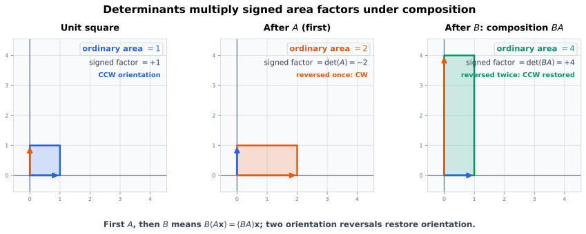
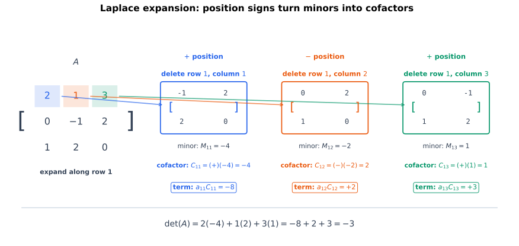
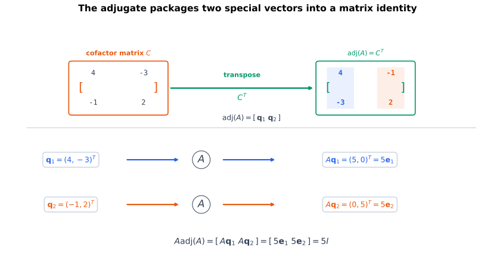
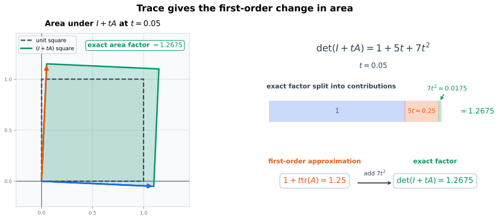

# 复合变换与矩阵的标量信息

行列式记录方阵对有向体积的缩放。两次线性变换复合时，体积倍率怎样合成？把行列式按一行展开时，每个元素的系数又是什么？这些问题将矩阵乘法、余子式和伴随矩阵联系起来。主对角元素之和——迹——则给出另一种标量信息：它怎样随矩阵相加、相乘而变化，又怎样描述接近恒等变换时的体积变化？

# 核心问题

1. 为什么矩阵乘法表示复合以后，行列式恰好相乘；
2. 为什么这个结论对奇异矩阵也成立；
3. 怎样把 $n!$ 项的 Leibniz 公式按某一行或某一列重新组织；
4. 余子式前面的棋盘符号 $(-1)^{i+j}$ 从哪里来；
5. 为什么余子式的转置会构造出满足
   $$
   \mathbf A\operatorname{adj}(\mathbf A)
   =
   \det(\mathbf A)\mathbf I
   $$
   的矩阵；
6. 伴随矩阵公式为什么对奇异矩阵仍有意义，却不能在奇异时给出逆矩阵；
7. 对角元素之和为什么满足循环性质。

::: {.callout-important title="本章使用的已有结论"}
对方阵，已经知道：

- 行列式对每一行、每一列分别线性；
- 交换两行或两列会使行列式变号；
- 出现重复行或重复列时行列式为零；
- $\det(\mathbf A^{\mathsf T})=\det(\mathbf A)$；
- $\det(\mathbf A)\neq0$ 当且仅当 $\mathbf A$ 可逆。

下面只从这些性质以及矩阵乘法的定义出发，不把待证恒等式偷偷当作前提。
:::

# 两次变换的面积倍率怎样合成

考虑两个平面线性变换

$$
\mathbf A
=
\begin{bmatrix}
0&2\\
1&0
\end{bmatrix},
\qquad
\mathbf B
=
\begin{bmatrix}
0&1\\
2&0
\end{bmatrix}.
$$

第一个变换把单位正方形变成面积为 $2$ 的矩形，同时反转方向：

$$
\det(\mathbf A)=-2.
$$

第二个变换本身也把有向面积乘以 $-2$。先应用 $\mathbf A$、再应用 $\mathbf B$，复合矩阵是

$$
\mathbf B\mathbf A
=
\begin{bmatrix}
1&0\\
0&4
\end{bmatrix}.
$$

最终普通面积变成 $4$，方向经过两次反转后恢复，而

$$
\det(\mathbf B\mathbf A)
=4
=(-2)(-2)
=\det(\mathbf B)\det(\mathbf A).
$$

@fig-determinant-composition-area 把普通面积与带符号的倍率分开显示。普通面积始终非负；负号记录的是有向基的顺序反转，不是“负面积”。

{#fig-determinant-composition-area fig-alt="三个同尺度平面依次显示单位正方形、经过 A 后面积为二且方向反转的矩形、再经过 B 后面积为四且方向恢复的矩形；底部写出先 A 后 B 对应 BA，以及 det BA 等于负二乘负二等于四。" width="100%"}

这个例子提示一般公式

$$
\det(\mathbf A\mathbf B)
=
\det(\mathbf A)\det(\mathbf B),
$$

但图形只能说明为什么公式合理，不能代替证明。特别是：

- 变换可能把空间压扁，此时矩阵不可逆；
- 高维体积无法直接画出；
- 两个负号怎样组合，必须由排列符号或交错性严格控制。

# 行列式为什么把矩阵乘法变成标量乘法

设

$$
\mathbf A,\mathbf B\in\mathbb R^{n\times n},
$$

并把 $\mathbf A$ 的列记为

$$
\mathbf A
=
\begin{bmatrix}
\vert&&\vert\\
\mathbf a_1&\cdots&\mathbf a_n\\
\vert&&\vert
\end{bmatrix}.
$$

若 $\mathbf B=(b_{ij})$，矩阵乘法的列视角告诉我们：$\mathbf A\mathbf B$ 的第 $j$ 列是

$$
\sum_{k=1}^{n}b_{kj}\mathbf a_k.
$$

因此

$$
\mathbf A\mathbf B
=
\begin{bmatrix}
\vert&&\vert\\
\sum_k b_{k1}\mathbf a_k
&\cdots&
\sum_k b_{kn}\mathbf a_k\\
\vert&&\vert
\end{bmatrix}.
$$

## 对所有输出列同时展开

对行列式的每一列反复使用线性性：

$$
\begin{aligned}
\det(\mathbf A\mathbf B)
={}&
\sum_{k_1=1}^{n}\cdots\sum_{k_n=1}^{n}
\left(
\prod_{j=1}^{n}b_{k_jj}
\right)
\det(
\mathbf a_{k_1},
\ldots,
\mathbf a_{k_n}
).
\end{aligned}
$$ {#eq-det-product-full-column-expansion}

这里暂时有 $n^n$ 个指标组合，但绝大多数项立即消失。若某两个指标相同，例如

$$
k_p=k_q,
\qquad p\neq q,
$$

对应行列式就包含两列相同的 $\mathbf a_{k_p}$，所以该项为零。

能够留下的项必须满足

$$
k_1,\ldots,k_n
$$

两两不同。它们从 $\{1,\ldots,n\}$ 中取 $n$ 个不同值，因此恰好构成一个排列

$$
\pi=(\pi(1),\ldots,\pi(n))\in S_n.
$$

于是 @eq-det-product-full-column-expansion 收缩为

$$
\det(\mathbf A\mathbf B)
=
\sum_{\pi\in S_n}
\left(
\prod_{j=1}^{n}b_{\pi(j),j}
\right)
\det(
\mathbf a_{\pi(1)},
\ldots,
\mathbf a_{\pi(n)}
).
$$

## 排列列只留下一个符号

把 $\mathbf A$ 的列按照 $\pi$ 重排，每次交换两列都会使行列式变号，因此

$$
\det(
\mathbf a_{\pi(1)},
\ldots,
\mathbf a_{\pi(n)}
)
=
\operatorname{sgn}(\pi)\det(\mathbf A).
$$

代入得到

$$
\det(\mathbf A\mathbf B)
=
\det(\mathbf A)
\sum_{\pi\in S_n}
\operatorname{sgn}(\pi)
\prod_{j=1}^{n}b_{\pi(j),j}.
$$

右侧的和正是 $\det(\mathbf B^{\mathsf T})$ 的 Leibniz 展开。因为转置不改变行列式，

$$
\sum_{\pi\in S_n}
\operatorname{sgn}(\pi)
\prod_{j=1}^{n}b_{\pi(j),j}
=
\det(\mathbf B^{\mathsf T})
=
\det(\mathbf B).
$$

所以得到行列式的**乘法性**：

$$
\boxed{
\det(\mathbf A\mathbf B)
=
\det(\mathbf A)\det(\mathbf B)
}.
$$ {#eq-determinant-multiplicativity}

证明没有假设 $\mathbf A$ 或 $\mathbf B$ 可逆，因此也覆盖把空间压扁的奇异变换。若任一因子行列式为零，复合行列式也为零；一旦某一步丢失了体积和信息，后续线性变换无法重新恢复它们。

::: {.callout-warning title="几何直觉与严格证明的边界"}
“先乘一个体积倍率，再乘另一个体积倍率”解释了公式的形状，但如果把这句话直接当证明，就已经默认了待证结论。严格证明必须回到矩阵乘法的列组合、行列式的列线性、重复列为零和排列符号。
:::

## 乘法性的直接推论

### 单位矩阵

由三角矩阵公式，

$$
\det(\mathbf I_n)=1.
$$

### 逆矩阵

若 $\mathbf A$ 可逆，则

$$
\mathbf A\mathbf A^{-1}=\mathbf I_n.
$$

对两边取行列式并使用乘法性：

$$
\det(\mathbf A)\det(\mathbf A^{-1})=1.
$$

因此

$$
\boxed{
\det(\mathbf A^{-1})
=
\frac{1}{\det(\mathbf A)}
}.
$$ {#eq-determinant-of-inverse}

这个公式只在 $\mathbf A$ 可逆时使用；此时 $\det(\mathbf A)\neq0$，分母合法。

### 矩阵的整数次幂

对任意正整数 $k$，反复使用乘法性：

$$
\det(\mathbf A^k)
=
\det(\mathbf A)^k.
$$

若 $\mathbf A$ 可逆，这个结论还能扩展到负整数次幂。

# 从 $n!$ 项到一行：余子式在测量什么

Leibniz 公式统一而精确，但包含 $n!$ 个排列项。若矩阵某一行有很多零，更自然的做法是按这一行的元素组织所有项。

取具体矩阵

$$
\mathbf A
=
\begin{bmatrix}
2&1&3\\
0&-1&2\\
1&2&0
\end{bmatrix}.
$$

沿第一行观察：选择 $a_{11}=2$ 后，剩余排列只能在删除第一行、第一列后的 $2\times2$ 方块中完成；选择 $a_{12}=1$ 或 $a_{13}=3$ 时也一样。@fig-laplace-cofactor-expansion 把每个元素、删除后的小方阵以及位置符号并排展示。

{#fig-laplace-cofactor-expansion fig-alt="左侧三阶矩阵第一行的二、一、三分别用三种颜色标出；右侧三张卡片保持原顺序显示删除第一行和对应列后得到的二阶矩阵，标明 minor、cofactor、位置符号正负正以及贡献负八、正二、正三；底部合计 det A 等于负三。" width="100%"}

## 子式、余子式与代数余子式

设

$$
\mathbf A=(a_{ij})\in\mathbb R^{n\times n}.
$$

删除第 $i$ 行和第 $j$ 列后得到的 $(n-1)\times(n-1)$ 矩阵记为

$$
\mathbf A_{\widehat i,\widehat j}.
$$

它的行列式

$$
M_{ij}
\coloneqq
\det(\mathbf A_{\widehat i,\widehat j})
$$ {#eq-minor-definition}

称为元素 $a_{ij}$ 的**余子式**。乘上位置符号后得到**代数余子式**：

$$
C_{ij}
\coloneqq
(-1)^{i+j}M_{ij}.
$$ {#eq-cofactor-definition}

有些资料把 $M_{ij}$ 称为 minor，把 $C_{ij}$ 称为 cofactor。阅读不同资料时必须先核对术语；本章始终用符号 $M_{ij}$ 与 $C_{ij}$ 区分二者。

对 $1\times1$ 矩阵，删除唯一一行一列会得到 $0\times0$ 空矩阵。约定

$$
\det(\mathbf I_0)=1,
$$

于是 $1\times1$ 矩阵 $[a]$ 的唯一代数余子式是 $1$，后续公式仍统一成立。

## 棋盘符号为什么是 $(-1)^{i+j}$

固定第 $i$ 行。把它写成标准行向量的线性组合：

$$
\mathbf r_i
=
\sum_{j=1}^{n}a_{ij}\mathbf e_j^{\mathsf T}.
$$

行列式对第 $i$ 行线性，因此 $a_{ij}$ 的系数，是把第 $i$ 行替换为 $\mathbf e_j^{\mathsf T}$ 后所得矩阵的行列式。

为了读出这个系数：

1. 用 $i-1$ 次相邻换行，把第 $i$ 行移到第一行；
2. 用 $j-1$ 次相邻换列，把第 $j$ 列移到第一列。

总共发生

$$
(i-1)+(j-1)=i+j-2
$$

次交换，所以产生符号

$$
(-1)^{i+j-2}=(-1)^{i+j}.
$$

移动后左上角是 $1$，第一行其余元素是 $0$。Leibniz 公式只有选择这个左上角 $1$ 的项可能留下，右下角剩余矩阵恰好是

$$
\mathbf A_{\widehat i,\widehat j},
$$

且其余行列保持原顺序。因此 $a_{ij}$ 的系数正是

$$
(-1)^{i+j}
\det(\mathbf A_{\widehat i,\widehat j})
=C_{ij}.
$$

这证明了位置符号，而不是只靠记忆

$$
\begin{bmatrix}
+&-&+&\cdots\\
-&+&-&\cdots\\
+&-&+&\cdots\\
\vdots&\vdots&\vdots&\ddots
\end{bmatrix}.
$$

# Laplace 展开

把上一节的所有系数合并，得到沿第 $i$ 行的 **Laplace 展开**：

$$
\boxed{
\det(\mathbf A)
=
\sum_{j=1}^{n}a_{ij}C_{ij}
}.
$$ {#eq-laplace-row-expansion}

对 $\mathbf A^{\mathsf T}$ 使用行展开，再利用

$$
\det(\mathbf A^{\mathsf T})=\det(\mathbf A),
$$

得到沿第 $j$ 列的展开：

$$
\boxed{
\det(\mathbf A)
=
\sum_{i=1}^{n}a_{ij}C_{ij}
}.
$$ {#eq-laplace-column-expansion}

可以沿任意一行或任意一列展开；结果都等于同一个行列式。计算时通常选择零最多的一行或一列，以减少真正需要计算的项。

## 完成三阶例子

对 @fig-laplace-cofactor-expansion 中的矩阵，第一行对应的余子式为

$$
\begin{aligned}
M_{11}
&=
\det\!\begin{bmatrix}-1&2\\2&0\end{bmatrix}
=-4,\\
M_{12}
&=
\det\!\begin{bmatrix}0&2\\1&0\end{bmatrix}
=-2,\\
M_{13}
&=
\det\!\begin{bmatrix}0&-1\\1&2\end{bmatrix}
=1.
\end{aligned}
$$

位置符号是 $+,-,+$，所以代数余子式为

$$
C_{11}=-4,
\qquad
C_{12}=2,
\qquad
C_{13}=1.
$$

沿第一行展开：

$$
\begin{aligned}
\det(\mathbf A)
&=
2C_{11}+1C_{12}+3C_{13}\\
&=
2(-4)+1(2)+3(1)\\
&=-8+2+3\\
&=-3.
\end{aligned}
$$

注意中间贡献为 $+2$：余子式 $M_{12}=-2$ 与位置负号相乘后，代数余子式变为 $C_{12}=2$。把这两个负号混在一起，是手算 Laplace 展开最常见的错误之一。

## 一个稀疏行例子

若

$$
\mathbf H
=
\begin{bmatrix}
0&0&5&0\\
1&2&0&3\\
0&-1&4&2\\
2&0&1&1
\end{bmatrix},
$$

沿第一行展开时只有一项：

$$
\det(\mathbf H)
=
5C_{13}
=
5(-1)^{1+3}M_{13}
=
5M_{13}.
$$

这说明 Laplace 展开的价值在于组织结构和符号推导，并不意味着对稠密大矩阵递归展开是高效算法。一般稠密 $n\times n$ 矩阵若朴素递归展开，计算量会迅速增长；实际数值计算仍优先使用消元或矩阵分解。

# 余子式怎样拼成伴随矩阵

把所有代数余子式排成矩阵：

$$
\operatorname{Cof}(\mathbf A)
\coloneqq
(C_{ij}).
$$

**伴随矩阵**定义为代数余子式矩阵的转置：

$$
\operatorname{adj}(\mathbf A)
\coloneqq
\operatorname{Cof}(\mathbf A)^{\mathsf T}.
$$ {#eq-adjugate-definition}

转置不能省略。伴随矩阵第 $j$ 列由第 $j$ 行的代数余子式组成，这个方向恰好使矩阵乘积的第 $(i,j)$ 个元素成为

$$
(\mathbf A\operatorname{adj}(\mathbf A))_{ij}
=
\sum_{k=1}^{n}a_{ik}C_{jk}.
$$ {#eq-a-adj-entry}

@fig-adjugate-identity 用二阶矩阵

$$
\mathbf A
=
\begin{bmatrix}2&1\\3&4\end{bmatrix}
$$

展示这个构造。两个特制列向量经过 $\mathbf A$ 后分别落在 $5\mathbf e_1$ 与 $5\mathbf e_2$ 上，于是整列地得到 $\mathbf A\operatorname{adj}(\mathbf A)=5\mathbf I$。

{#fig-adjugate-identity fig-alt="上方显示矩阵 A 的代数余子式矩阵经过转置成为 adj A；下方只追踪 adj A 的两列 q1 和 q2，它们经过 A 后分别得到五 e1 和五 e2；底部写 A adj A 等于五 I，且 det A 等于五。" width="100%"}

# 伴随矩阵恒等式为什么对奇异矩阵也成立

## 先证明 $\mathbf A\operatorname{adj}(\mathbf A)$

由 @eq-a-adj-entry，考虑

$$
\sum_{k=1}^{n}a_{ik}C_{jk}.
$$

### 对角位置 $i=j$

此时

$$
\sum_{k=1}^{n}a_{jk}C_{jk}
$$

正是沿第 $j$ 行的 Laplace 展开，所以等于

$$
\det(\mathbf A).
$$

### 非对角位置 $i\neq j$

构造新矩阵 $\widetilde{\mathbf A}$：把 $\mathbf A$ 的第 $j$ 行替换为第 $i$ 行。新矩阵有两行相同，因此

$$
\det(\widetilde{\mathbf A})=0.
$$

沿新矩阵的第 $j$ 行展开。删除第 $j$ 行后，被替换的那一行完全消失，所以对应代数余子式仍然是原矩阵的 $C_{jk}$。因此

$$
0
=
\det(\widetilde{\mathbf A})
=
\sum_{k=1}^{n}a_{ik}C_{jk}.
$$

综上，

$$
\sum_{k=1}^{n}a_{ik}C_{jk}
=
\begin{cases}
\det(\mathbf A),&i=j,\\
0,&i\neq j.
\end{cases}
$$

也就是

$$
\boxed{
\mathbf A\operatorname{adj}(\mathbf A)
=
\det(\mathbf A)\mathbf I_n
}.
$$ {#eq-a-adj-identity}

## 再证明 $\operatorname{adj}(\mathbf A)\mathbf A$

另一个方向不能在奇异情形下通过“约掉 $\mathbf A$”得到，因为奇异矩阵没有逆。直接看乘积元素：

$$
(\operatorname{adj}(\mathbf A)\mathbf A)_{ij}
=
\sum_{k=1}^{n}C_{ki}a_{kj}.
$$

若 $i=j$，这是沿第 $i$ 列的 Laplace 展开，等于 $\det(\mathbf A)$。

若 $i\neq j$，把第 $i$ 列替换为第 $j$ 列，新矩阵出现两列相同。沿被替换的第 $i$ 列展开，得到

$$
\sum_{k=1}^{n}C_{ki}a_{kj}=0.
$$

因此

$$
\boxed{
\operatorname{adj}(\mathbf A)\mathbf A
=
\det(\mathbf A)\mathbf I_n
}.
$$ {#eq-adj-a-identity}

两个方向合并为

$$
\boxed{
\mathbf A\operatorname{adj}(\mathbf A)
=
\operatorname{adj}(\mathbf A)\mathbf A
=
\det(\mathbf A)\mathbf I_n
}.
$$ {#eq-adjugate-master-identity}

整个证明没有假设 $\det(\mathbf A)\neq0$。若 $\mathbf A$ 奇异，右侧只是零矩阵：

$$
\mathbf A\operatorname{adj}(\mathbf A)
=
\operatorname{adj}(\mathbf A)\mathbf A
=
\mathbf 0.
$$

伴随矩阵此时不一定为零。例如

$$
\mathbf S
=
\begin{bmatrix}1&2\\2&4\end{bmatrix},
\qquad
\operatorname{adj}(\mathbf S)
=
\begin{bmatrix}4&-2\\-2&1\end{bmatrix},
$$

而

$$
\mathbf S\operatorname{adj}(\mathbf S)=\mathbf 0.
$$

这反映出伴随矩阵的列落在 $\mathbf S$ 的零空间中，但不能据此除以 $\det(\mathbf S)=0$。

# 逆矩阵的伴随公式

现在额外假设

$$
\det(\mathbf A)\neq0.
$$

把 @eq-adjugate-master-identity 两边除以 $\det(\mathbf A)$：

$$
\mathbf A
\left(
\frac{1}{\det(\mathbf A)}
\operatorname{adj}(\mathbf A)
\right)
=
\mathbf I_n,
$$

且反向乘积也为单位矩阵。因此

$$
\boxed{
\mathbf A^{-1}
=
\frac{1}{\det(\mathbf A)}
\operatorname{adj}(\mathbf A)
}.
$$ {#eq-inverse-adjugate-formula}

对二阶矩阵

$$
\mathbf A
=
\begin{bmatrix}a&b\\c&d\end{bmatrix},
$$

代数余子式矩阵与伴随矩阵分别为

$$
\operatorname{Cof}(\mathbf A)
=
\begin{bmatrix}d&-c\\-b&a\end{bmatrix},
\qquad
\operatorname{adj}(\mathbf A)
=
\begin{bmatrix}d&-b\\-c&a\end{bmatrix}.
$$

所以熟悉的二阶逆矩阵公式

$$
\mathbf A^{-1}
=
\frac{1}{ad-bc}
\begin{bmatrix}d&-b\\-c&a\end{bmatrix}
$$

不是孤立技巧，而是一般伴随公式的 $2\times2$ 特例。

## 与 Cramer 法则的关系

由 @eq-inverse-adjugate-formula，方程

$$
\mathbf A\mathbf x=\mathbf b
$$

的唯一解满足

$$
\mathbf x
=
\frac{1}{\det(\mathbf A)}
\operatorname{adj}(\mathbf A)\mathbf b.
$$

第 $j$ 个分量的分子是

$$
\sum_{i=1}^{n}C_{ij}b_i.
$$

这正是把 $\mathbf A$ 第 $j$ 列替换为 $\mathbf b$ 后，沿替换列做 Laplace 展开所得的行列式。因此

$$
x_j
=
\frac{\det(\mathbf A_j(\mathbf b))}
{\det(\mathbf A)},
$$

与已经证明的 Cramer 法则完全一致。

::: {.callout-warning title="公式存在不等于数值算法合适"}
伴随公式揭示逆矩阵、余子式与行列式之间的精确关系，适合证明和小规模符号计算。但对大型浮点矩阵，不应先计算全部余子式再形成逆矩阵；通常会先把矩阵分解成更容易求解的结构，再通过分步求解得到 $\mathbf x$。LU/PLU 与 QR 都是这类分解方法。无论采用哪种方法，都应尽量直接求解 $\mathbf A\mathbf x=\mathbf b$，而不是先显式形成 $\mathbf A^{-1}$。
:::

# 迹：主对角元素之和

行列式来自有向体积。方阵还有一个更简单的标量：主对角元素之和。

对

$$
\mathbf A=(a_{ij})\in\mathbb R^{n\times n},
$$

定义它的**迹**：

$$
\operatorname{tr}(\mathbf A)
\coloneqq
\sum_{i=1}^{n}a_{ii}.
$$ {#eq-trace-definition}

例如

$$
\operatorname{tr}
\begin{bmatrix}
2&7&0\\
-1&3&4\\
5&2&-6
\end{bmatrix}
=
2+3-6
=-1.
$$

从定义立即得到线性性：

$$
\operatorname{tr}(\mathbf A+\mathbf B)
=
\operatorname{tr}(\mathbf A)
+
\operatorname{tr}(\mathbf B),
$$

以及

$$
\operatorname{tr}(c\mathbf A)
=
c\operatorname{tr}(\mathbf A).
$$

行列式不是矩阵元素的线性函数，而迹是。反过来，行列式满足乘法性，迹一般不满足

$$
\operatorname{tr}(\mathbf A\mathbf B)
=
\operatorname{tr}(\mathbf A)
\operatorname{tr}(\mathbf B).
$$

两者承担不同角色。

## 为什么 $\operatorname{tr}(\mathbf A\mathbf B)=\operatorname{tr}(\mathbf B\mathbf A)$

更一般地，设

$$
\mathbf A\in\mathbb R^{m\times n},
\qquad
\mathbf B\in\mathbb R^{n\times m}.
$$

虽然 $\mathbf A\mathbf B$ 是 $m\times m$，$\mathbf B\mathbf A$ 是 $n\times n$，两者甚至可能形状不同，但它们的迹都存在。按分量展开：

$$
\begin{aligned}
\operatorname{tr}(\mathbf A\mathbf B)
&=
\sum_{i=1}^{m}(\mathbf A\mathbf B)_{ii}\\
&=
\sum_{i=1}^{m}\sum_{j=1}^{n}a_{ij}b_{ji}\\
&=
\sum_{j=1}^{n}\sum_{i=1}^{m}b_{ji}a_{ij}\\
&=
\sum_{j=1}^{n}(\mathbf B\mathbf A)_{jj}\\
&=
\operatorname{tr}(\mathbf B\mathbf A).
\end{aligned}
$$

所以

$$
\boxed{
\operatorname{tr}(\mathbf A\mathbf B)
=
\operatorname{tr}(\mathbf B\mathbf A)
}.
$$ {#eq-trace-cyclic-two-factors}

这不表示

$$
\mathbf A\mathbf B=\mathbf B\mathbf A.
$$

矩阵乘法仍然通常不可交换；只有最终对角元素总和相同。

对三个或更多形状相容的因子，可以循环移动：

$$
\operatorname{tr}(\mathbf A\mathbf B\mathbf C)
=
\operatorname{tr}(\mathbf B\mathbf C\mathbf A)
=
\operatorname{tr}(\mathbf C\mathbf A\mathbf B).
$$

但不能任意交换内部次序。一般没有

$$
\operatorname{tr}(\mathbf A\mathbf B\mathbf C)
=
\operatorname{tr}(\mathbf A\mathbf C\mathbf B).
$$

# 迹的局部面积图景

迹只是对角线求和，看起来不像几何量。它的一个直观入口，是观察接近恒等映射的微小变形

$$
\mathbf I+t\mathbf A.
$$

对二阶矩阵

$$
\mathbf A
=
\begin{bmatrix}a&b\\c&d\end{bmatrix},
$$

直接计算：

$$
\begin{aligned}
\det(\mathbf I_2+t\mathbf A)
&=
\det\!\begin{bmatrix}
1+ta&tb\\
tc&1+td
\end{bmatrix}\\
&=(1+ta)(1+td)-t^2bc\\
&=1+t(a+d)+t^2(ad-bc)\\
&=1+t\operatorname{tr}(\mathbf A)
+t^2\det(\mathbf A).
\end{aligned}
$$ {#eq-two-dimensional-trace-volume-expansion}

所以当 $t$ 很小时，面积倍率的一阶变化由

$$
\operatorname{tr}(\mathbf A)
$$

控制。非对角元素可以在 $O(t)$ 的尺度上立即改变图形形状，但不会单独出现在面积倍率的一阶系数中；在二维公式里，它们通过 $-t^2bc$ 的耦合影响二阶面积倍率。

@fig-trace-first-order-area 取

$$
\mathbf A
=
\begin{bmatrix}2&1\\-1&3\end{bmatrix},
\qquad
\operatorname{tr}(\mathbf A)=5,
\qquad
\det(\mathbf A)=7,
$$

以及 $t=0.05$。一阶预测为

$$
1+t\operatorname{tr}(\mathbf A)=1.25,
$$

精确面积倍率则是

$$
1+5t+7t^2=1.2675.
$$

{#fig-trace-first-order-area fig-alt="左侧叠加单位正方形和 I 加零点零五 A 作用后的平行四边形；右侧将精确面积倍率一点二六七五分成一、迹的一阶贡献零点二五、行列式的二阶贡献零点零一七五，并把一阶近似一点二五与精确值区分。" width="100%"}

对一般 $n\times n$ 矩阵也有

$$
\det(\mathbf I_n+t\mathbf A)
=
1+t\operatorname{tr}(\mathbf A)
+\text{次数至少为 }2\text{ 的 }t\text{ 项}.
$$ {#eq-general-trace-first-order-determinant}

理由可直接从 Leibniz 公式看出：

- 恒等排列给出
  $$
  \prod_{i=1}^{n}(1+ta_{ii})
  =
  1+t\sum_i a_{ii}+\text{高次项};
  $$
- 非恒等排列至少移动两个位置，对应乘积至少包含两个来自 $t\mathbf A$ 的非对角因子，因此次数至少为 $2$。

因此

$$
\left.
\frac{d}{dt}
\det(\mathbf I_n+t\mathbf A)
\right|_{t=0}
=
\operatorname{tr}(\mathbf A).
$$

::: {.callout-warning title="迹不是一般有限变换的面积倍率"}
$\det(\mathbf A)$ 才是 $\mathbf A$ 的有向体积倍率。迹描述的是 $\mathbf I+t\mathbf A$ 在 $t=0$ 附近的体积倍率变化率，不能把 $\operatorname{tr}(\mathbf A)$ 直接解释为 $\mathbf A$ 的面积或体积缩放。
:::

# 用 SymPy 与 NumPy 核对

```{python}
#| label: lst-determinant-cofactors-invariants
#| echo: true

import math

import numpy as np
import sympy as sp

# 乘法性：精确核对可逆与奇异例子。
A = sp.Matrix([[0, 2], [1, 0]])
B = sp.Matrix([[0, 1], [2, 0]])
assert A.det() == -2
assert B.det() == -2
assert (B * A).det() == B.det() * A.det() == 4

singular = sp.Matrix([[1, 2], [2, 4]])
assert (A * singular).det() == A.det() * singular.det() == 0

# Laplace 展开。
L = sp.Matrix([[2, 1, 3], [0, -1, 2], [1, 2, 0]])
minors_row_1 = [L.minor_submatrix(0, j).det() for j in range(3)]
cofactors_row_1 = [L.cofactor(0, j) for j in range(3)]
assert minors_row_1 == [-4, -2, 1]
assert cofactors_row_1 == [-4, 2, 1]
assert sum(L[0, j] * cofactors_row_1[j] for j in range(3)) == L.det() == -3

# 伴随矩阵恒等式，分别核对可逆与奇异情形。
C = sp.Matrix([[2, 1], [3, 4]])
adj_C = C.adjugate()
assert adj_C == sp.Matrix([[4, -1], [-3, 2]])
assert C * adj_C == C.det() * sp.eye(2)
assert adj_C * C == C.det() * sp.eye(2)
assert C.inv() == adj_C / C.det()
assert singular * singular.adjugate() == sp.zeros(2)

# 迹控制接近恒等变换时面积倍率的一阶项。
t = sp.symbols("t")
G = sp.Matrix([[2, 1], [-1, 3]])
assert sp.expand((sp.eye(2) + t * G).det()) == 1 + 5 * t + 7 * t**2

# 迹的循环性质也适用于相反形状的长方形矩阵。
U = sp.Matrix([[1, 2, 3], [0, 1, 4]])
V = sp.Matrix([[1, 0], [2, 1], [0, 3]])
assert sp.trace(U * V) == sp.trace(V * U)

# 浮点行列式与稳定的对数绝对行列式。
S_np = np.array([[1.0, 2.0], [3.0, 4.0]])
np.testing.assert_allclose(np.linalg.det(S_np), -2.0)
sign, logabsdet = np.linalg.slogdet(S_np)
np.testing.assert_allclose(sign, -1.0)
np.testing.assert_allclose(logabsdet, math.log(2.0))

# 极大尺度下不直接形成行列式，而保留 sign 与 log|det|。
large_diagonal = np.diag([1e200] * 10)
large_sign, large_logabsdet = np.linalg.slogdet(large_diagonal)
np.testing.assert_allclose(large_sign, 1.0)
np.testing.assert_allclose(large_logabsdet, 2000 * math.log(10), rtol=1e-12)

print("det(B A) =", (B * A).det())
print("row-1 minors =", minors_row_1)
print("row-1 cofactors =", cofactors_row_1)
print("adj(C) =")
sp.pprint(adj_C)
print("slogdet(S) =", (sign, logabsdet))
```

`np.linalg.det` 返回浮点行列式本身，适合尺度温和、只需普通结果的场景。若 $n$ 个方向都产生很大的缩放，绝对行列式可能上溢；若都强烈收缩，则可能下溢。`np.linalg.slogdet` 返回

$$
(\operatorname{sign}\det(\mathbf A),
\log|\det(\mathbf A)|),
$$

把方向符号与尺度的对数分开保存，更适合高维概率和数值计算。

这仍不消除病态问题：当矩阵接近奇异时，微小舍入误差可能显著影响行列式。`slogdet` 解决的是数值范围，不是自动证明矩阵远离奇异。

# 与模型和概率变换的连接

## 连续线性层的体积倍率相乘

若两个方形无偏置线性层依次为

$$
\mathbf x
\xmapsto{\mathbf W_1}
\mathbf h
\xmapsto{\mathbf W_2}
\mathbf y,
$$

则整体矩阵是

$$
\mathbf W_2\mathbf W_1,
$$

有向体积倍率满足

$$
\det(\mathbf W_2\mathbf W_1)
=
\det(\mathbf W_2)
\det(\mathbf W_1).
$$

若任一层奇异，整体线性映射也奇异；后续线性层无法恢复已经被压掉的方向。

若加入偏置

$$
\mathbf y=\mathbf W\mathbf x+\mathbf b,
$$

偏置只平移图形，不改变体积倍率，因此体积变化仍由 $\det(\mathbf W)$ 决定。但整个映射此时是仿射映射，不应把它与线性算子混为一谈。

## 可逆变换中的对数行列式

对可逆线性变量变换

$$
\mathbf y=\mathbf W\mathbf x,
$$

概率密度变换会出现

$$
\log|\det(\mathbf W)|.
$$

乘法性把复合变换的绝对行列式变成乘积，从而把对数绝对行列式变成和：

$$
\log|\det(\mathbf W_L\cdots\mathbf W_1)|
=
\sum_{\ell=1}^{L}
\log|\det(\mathbf W_\ell)|.
$$

这解释了为什么可逆生成模型会特别关心能够高效计算 Jacobian 对数行列式的结构。对非线性变换，必须改用每个输入点处的 Jacobian；固定权重矩阵的行列式不再足以描述全局体积变化。

# 容易混淆、需要反复检查的地方

1. **先 $\mathbf A$ 后 $\mathbf B$ 的复合矩阵是 $\mathbf B\mathbf A$。** 行列式标量可以交换次序，但矩阵本身一般不能。
2. **普通面积非负，行列式可以为负。** 负号记录方向反转。
3. **$\det(\mathbf A\mathbf B)$ 的证明不能只处理可逆矩阵。** 列多线性证明同时覆盖奇异情形。
4. **余子式与代数余子式不同。** $M_{ij}$ 不含位置符号，$C_{ij}=(-1)^{i+j}M_{ij}$。
5. **删除行列后不能重排剩余顺序。** 否则会额外引入符号。
6. **伴随矩阵是代数余子式矩阵的转置。** 不转置通常无法得到矩阵恒等式。
7. **伴随恒等式对奇异矩阵也成立。** 只有逆矩阵公式要求 $\det(\mathbf A)\neq0$。
8. **不能在奇异情形中约掉矩阵。** $\operatorname{adj}(\mathbf A)\mathbf A=\det(\mathbf A)\mathbf I$ 必须独立证明。
9. **$\operatorname{tr}(\mathbf A\mathbf B)=\operatorname{tr}(\mathbf B\mathbf A)$ 不表示矩阵乘法可交换。** 只保证两个标量相等。
10. **迹只允许循环移动乘积因子，不允许任意重排。**
11. **精确公式不自动给出稳定算法。** 大型浮点问题不使用 Leibniz 展开、递归余子式或伴随公式直接计算。

# 自检

1. 不使用逆矩阵，按照列多线性证明 $\det(\mathbf A\mathbf B)=\det(\mathbf A)\det(\mathbf B)$，并指出重复列在哪一步消掉非排列项。
2. 由乘法性证明：若 $\mathbf A\mathbf B=\mathbf I_n$，则 $\det(\mathbf A)$ 与 $\det(\mathbf B)$ 都非零且互为倒数。
3. 对
   $$
   \begin{bmatrix}
   1&0&2\\
   0&3&0\\
   4&0&5
   \end{bmatrix}
   $$
   分别沿第二行和第二列展开，核对结果一致。
4. 从“移动第 $i$ 行和第 $j$ 列到首位”重新推导 $(-1)^{i+j}$，不要直接引用棋盘图案。
5. 计算
   $$
   \begin{bmatrix}
   1&2&0\\
   0&1&3\\
   2&0&1
   \end{bmatrix}
   $$
   的全部代数余子式与伴随矩阵，并核对 @eq-adjugate-master-identity。
6. 给出一个奇异矩阵，使其伴随矩阵非零，并解释为什么伴随公式仍不能产生逆矩阵。
7. 用分量求和证明 $\operatorname{tr}(\mathbf A\mathbf B)=\operatorname{tr}(\mathbf B\mathbf A)$，其中 $\mathbf A$ 与 $\mathbf B$ 可以是相反形状的长方形矩阵。
8. 构造三个 $2\times2$ 矩阵，验证迹对三因子乘积可以循环移动，但一次任意交换可能改变迹。
9. 对一般二阶矩阵直接验证 @eq-two-dimensional-trace-volume-expansion。
10. 解释 `slogdet` 解决了什么数值问题，又没有解决什么问题。

# 小结

矩阵乘法把线性变换复合起来，行列式乘法性则把复合的有向体积倍率压缩成标量乘法。把 Leibniz 公式按一行或一列重新组织，会得到代数余子式与 Laplace 展开；代数余子式矩阵转置后形成伴随矩阵，并满足

$$
\mathbf A\operatorname{adj}(\mathbf A)
=
\operatorname{adj}(\mathbf A)\mathbf A
=\det(\mathbf A)\mathbf I.
$$

只有在 $\det(\mathbf A)\neq0$ 时，才能进一步除以行列式得到逆矩阵。迹由对角元素之和定义，并满足相容矩阵乘积的循环性质。

精确代数公式与浮点计算中的分解算法、数值范围和病态敏感性必须明确区分。

乘法性与循环性质还会使某些坐标变换前后的标量相等；[相似变换下的行列式与迹](similarity-determinant-and-trace.qmd)讨论这种不变性。

# 参考资料

行列式乘法性、Laplace 展开、伴随矩阵与迹的基本性质可参见 Strang 与 Axler [@strang2023linear; @axler2015linear]；对数绝对行列式与稳定计算视角可参见 Boyd 与 Vandenberghe [@boyd2018applied]。

::: {#refs}
:::
