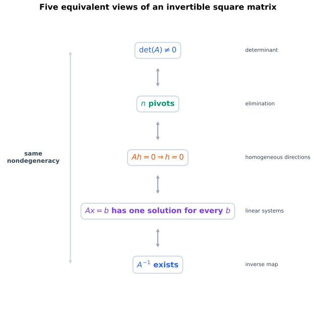
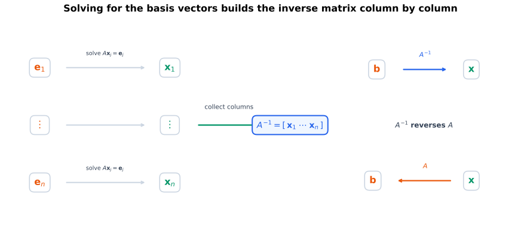
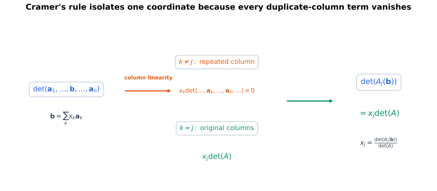
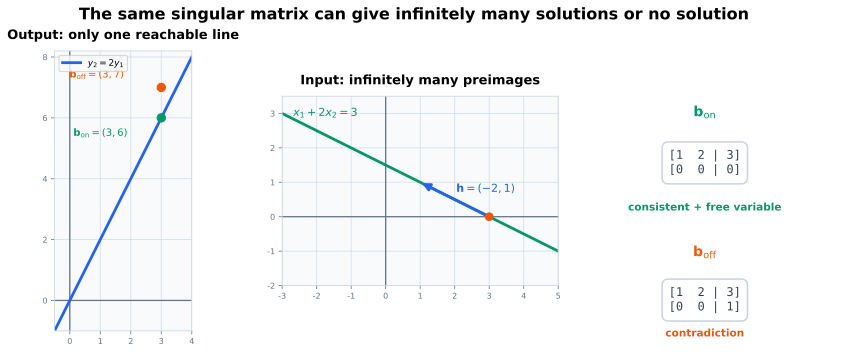
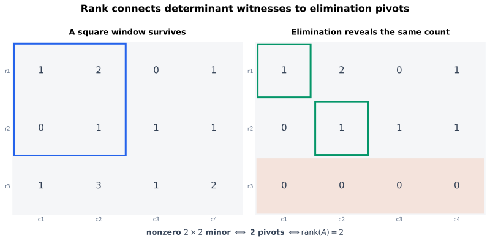
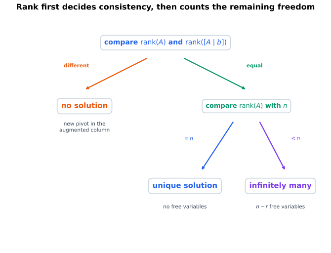

# 从上一页留下的问题出发

上一页从消元构造了行列式，并看到

$$
\det(\mathbf{A})=0
$$

意味着方阵把有向体积压扁。这个几何现象暗示某些输入方向在变换后消失，但还没有正式回答方程组问题：

$$
\mathbf{A}\mathbf{x}=\mathbf{b}
$$

什么时候唯一可解？行列式为零时，为什么有时无解、有时又有无穷多解？矩阵不是方阵时，没有整体行列式，又该用什么判别？

本页把这些问题接回消元。重点不在增加更多公式，而在确认每个新对象补上了哪一块缺口。

# 本页要回答的问题

核心问题是：**能否把消元读出的“主元、矛盾行和自由变量”改写成不依赖某一次具体消元过程的判别？**

需要依次解决：

1. 为什么 $\det(\mathbf{A})\neq0$ 恰好表示方阵有 $n$ 个主元；
2. 为什么这又等价于齐次方程只有零解、每个右端都有唯一解；
3. 为什么“同时处理所有右端”会自然引出逆矩阵；
4. Cramer 法则为什么能由行列式的列线性直接推出；
5. 为什么 $\det(\mathbf{A})=0$ 不能区分无解与无穷多解；
6. 为什么长方形矩阵需要考察子式，并用最大非零子式定义秩；
7. 为什么秩又等于主元个数；
8. 怎样由
   $$
   \operatorname{rank}(\mathbf{A})
   =
   \operatorname{rank}([\mathbf{A}\mid\mathbf{b}])
   $$
   完成一般线性方程组的相容性判别。

整条问题链是

$$
\det\neq0
\longleftrightarrow
n\text{ 个主元}
\longleftrightarrow
\text{没有非零齐次方向}
\longleftrightarrow
\text{每个右端唯一可解}
\longleftrightarrow
\text{可逆},
$$

然后再处理这条链失效的地方：

$$
\det=0\text{ 或矩阵不是方阵}
\longrightarrow
\text{子式}
\longrightarrow
\text{秩}
\longrightarrow
\text{一般相容性判据}.
$$

# 行列式非零为什么等价于主元齐全

先只考虑

$$
\mathbf{A}\in\mathbb{R}^{n\times n}.
$$

Gaussian 消元通过行倍加和必要的换行，把 $\mathbf{A}$ 化为上三角矩阵 $\mathbf{U}$。若一共交换了 $s$ 次行，而没有对行做缩放，则上一页的行列式规则给出

$$
\det(\mathbf{A})
=
(-1)^s\det(\mathbf{U})
=
(-1)^s\prod_{i=1}^{n}u_{ii}.
$$ {#eq-det-through-elimination}

因此

$$
\det(\mathbf{A})\neq0
$$

当且仅当每个 $u_{ii}$ 都非零，也就是消元过程中没有丢失任何主元。

::: {.callout-important title="方阵的第一个等价关系"}
对 $\mathbf{A}\in\mathbb{R}^{n\times n}$：

$$
\det(\mathbf{A})\neq0
\quad\Longleftrightarrow\quad
\mathbf{A}\text{ 有 }n\text{ 个主元}.
$$ {#eq-det-n-pivots}
:::

若消元中还把某行乘以非零标量，行列式会乘上同一个非零倍数，但“是否等于零”仍然不变。因此 @eq-det-n-pivots 不依赖具体采用哪条合法消元路线。

这一步回答了行列式最初被提出的问题：它把“全部主元都存在”压缩成了一个标量的非零性。

# 主元齐全为什么决定解的唯一性

行列式只看系数矩阵，方程组却还含有右端 $\mathbf{b}$。两者之间的桥梁是齐次方程

$$
\mathbf{A}\mathbf{h}=\mathbf{0}.
$$

## 非零齐次方向会破坏唯一性

若 $\mathbf{x}_p$ 满足

$$
\mathbf{A}\mathbf{x}_p=\mathbf{b},
$$

而存在 $\mathbf{h}\neq\mathbf{0}$ 使

$$
\mathbf{A}\mathbf{h}=\mathbf{0},
$$

那么对任意 $t\in\mathbb{R}$：

$$
\mathbf{A}(\mathbf{x}_p+t\mathbf{h})
=
\mathbf{b}.
$$

只要系统有一个解，就会沿 $\mathbf{h}$ 方向产生无穷多个解。因此唯一性要求齐次方程不能有非零方向。

反过来，若同一个非齐次方程有两个不同解 $\mathbf{x}_1,\mathbf{x}_2$，则

$$
\mathbf{A}(\mathbf{x}_1-\mathbf{x}_2)
=
\mathbf{0},
$$

而 $\mathbf{x}_1-\mathbf{x}_2\neq\mathbf{0}$。所以解不唯一必然暴露出一个非零齐次解。

于是，只要非齐次系统有解：

$$
\text{解唯一}
\quad\Longleftrightarrow\quad
\mathbf{A}\mathbf{h}=\mathbf{0}\text{ 只有零解}.
$$ {#eq-uniqueness-trivial-homogeneous}

## 方阵为什么还能保证“对每个右端都有解”

对 $n\times n$ 方阵，若有 $n$ 个主元，消元后的系数部分每行、每列都有主元。把同样的行操作施加到任意增广矩阵

$$
[\mathbf{A}\mid\mathbf{b}]
$$

时，不可能出现系数部分全零、增广项非零的矛盾行，因为系数部分没有零行。回代会对每个 $\mathbf{b}$ 给出唯一解。

若主元少于 $n$，齐次系统至少有一个自由变量，因而存在非零齐次解。此时任何相容的非齐次系统都不可能唯一。

::: {.callout-important title="方阵唯一可解的等价条件"}
对 $\mathbf{A}\in\mathbb{R}^{n\times n}$，以下条件等价：

1. $\det(\mathbf{A})\neq0$；
2. $\mathbf{A}$ 有 $n$ 个主元；
3. $\mathbf{A}\mathbf{h}=\mathbf{0}$ 只有零解；
4. 对每个 $\mathbf{b}\in\mathbb{R}^{n}$，$\mathbf{A}\mathbf{x}=\mathbf{b}$ 都有唯一解。
:::

{#fig-invertibility-equivalences fig-alt="一条自上而下的等价链依次连接行列式非零、n 个主元、零空间只有零向量、每个右端唯一可解和存在逆矩阵，侧边标注代数体积、消元、齐次方向、方程组和映射五种视角。" width="88%"}

# 为什么“每个右端唯一可解”会引出逆矩阵

上面的结论仍把每个 $\mathbf{b}$ 当成一次新的求解任务。若系数矩阵固定，只是右端反复变化，更自然的问题是：**能否把“从 $\mathbf{b}$ 找到唯一解 $\mathbf{x}$”本身记录成一个矩阵？**

先分别求解 $n$ 个基准系统

$$
\mathbf{A}\mathbf{x}_j=\mathbf{e}_j,
\qquad
j=1,\ldots,n.
$$

把这些解作为列组成

$$
\mathbf{B}
=
\begin{bmatrix}
\vert&&\vert\\
\mathbf{x}_1&\cdots&\mathbf{x}_n\\
\vert&&\vert
\end{bmatrix}.
$$

矩阵乘法的列视角给出

$$
\mathbf{A}\mathbf{B}
=
\begin{bmatrix}
\mathbf{A}\mathbf{x}_1&\cdots&\mathbf{A}\mathbf{x}_n
\end{bmatrix}
=
\begin{bmatrix}
\mathbf{e}_1&\cdots&\mathbf{e}_n
\end{bmatrix}
=
\mathbf{I}_n.
$$

由于 $\mathbf{A}\mathbf{h}=\mathbf{0}$ 只有零解，对任意 $\mathbf{x}$：

$$
\mathbf{A}(\mathbf{B}\mathbf{A}\mathbf{x}-\mathbf{x})
=
\mathbf{0}
$$

意味着括号中的向量只能为零，因此

$$
\mathbf{B}\mathbf{A}\mathbf{x}=\mathbf{x}.
$$

所以

$$
\mathbf{B}\mathbf{A}=\mathbf{I}_n.
$$

这个同时满足

$$
\mathbf{A}\mathbf{B}
=
\mathbf{B}\mathbf{A}
=
\mathbf{I}_n
$$

的矩阵称为 $\mathbf{A}$ 的**逆矩阵**，记为

$$
\mathbf{A}^{-1}.
$$

于是任意右端的唯一解都统一写成

$$
\mathbf{x}=\mathbf{A}^{-1}\mathbf{b}.
$$ {#eq-solve-with-inverse}

反方向也直接成立：若 $\mathbf{A}^{-1}$ 存在，则

$$
\mathbf{A}(\mathbf{A}^{-1}\mathbf{b})=\mathbf{b},
$$

所以对任意 $\mathbf{b}$ 至少有一个解；若 $\mathbf{A}\mathbf{x}=\mathbf{b}$，在等式两侧左乘 $\mathbf{A}^{-1}$，只能得到 $\mathbf{x}=\mathbf{A}^{-1}\mathbf{b}$，所以解也唯一。至此，“对每个右端唯一可解”与“逆矩阵存在”的两个方向都闭合。

逆矩阵不是为了把“除以矩阵”写得像标量除法，而是把**同一个线性变换的逆过程**记录成矩阵。

{#fig-inverse-solves-basis fig-alt="标准基向量 e1 到 en 分别经过逆向求解得到 x1 到 xn，这些解组成 A 的逆矩阵；右侧显示任意 b 经过 A 逆得到 x，再经 A 回到 b。" width="100%"}

## 逆矩阵为什么唯一

若 $\mathbf{B}$ 和 $\mathbf{C}$ 都是 $\mathbf{A}$ 的逆矩阵，则

$$
\mathbf{B}
=
\mathbf{B}\mathbf{I}_n
=
\mathbf{B}(\mathbf{A}\mathbf{C})
=
(\mathbf{B}\mathbf{A})\mathbf{C}
=
\mathbf{I}_n\mathbf{C}
=
\mathbf{C}.
$$

因此逆矩阵如果存在，就只有一个。

## 用 Gauss–Jordan 消元同时求出逆矩阵

对增广矩阵

$$
[\mathbf{A}\mid\mathbf{I}_n]
$$

实施行变换。若左侧能够化为 $\mathbf{I}_n$，同一串行变换在右侧留下的就是 $\mathbf{A}^{-1}$：

$$
[\mathbf{A}\mid\mathbf{I}_n]
\longrightarrow
[\mathbf{I}_n\mid\mathbf{A}^{-1}].
$$

若左侧不能得到 $n$ 个主元，逆矩阵不存在。这个算法再次说明，可逆性不是额外条件，而是主元齐全的另一种表达。

# Cramer 法则为什么会从列线性中出现

逆矩阵说明解可以统一表示，但还没有直接给出每个坐标 $x_j$ 的行列式公式。行列式对列也分别线性，这正好可以从方程

$$
\mathbf{b}
=
\mathbf{A}\mathbf{x}
=
x_1\mathbf{a}_1+
\cdots+
x_n\mathbf{a}_n
$$

中提取单个系数。

记

$$
\mathbf{A}
=
\begin{bmatrix}
\vert&&\vert\\
\mathbf{a}_1&\cdots&\mathbf{a}_n\\
\vert&&\vert
\end{bmatrix},
$$

并令 $\mathbf{A}_j(\mathbf{b})$ 表示把 $\mathbf{A}$ 的第 $j$ 列替换为 $\mathbf{b}$ 后得到的矩阵。

对替换列使用线性性：

$$
\begin{aligned}
\det(\mathbf{A}_j(\mathbf{b}))
&=
\det(\mathbf{a}_1,\ldots,
\sum_{k=1}^{n}x_k\mathbf{a}_k,
\ldots,\mathbf{a}_n)\\
&=
\sum_{k=1}^{n}x_k
\det(\mathbf{a}_1,\ldots,
\mathbf{a}_k,
\ldots,\mathbf{a}_n).
\end{aligned}
$$

当 $k\neq j$ 时，行列式中出现两列 $\mathbf{a}_k$，该项为零；只有 $k=j$ 留下：

$$
\det(\mathbf{A}_j(\mathbf{b}))
=
x_j\det(\mathbf{A}).
$$ {#eq-cramer-key-identity}

若 $\det(\mathbf{A})\neq0$，就得到

$$
x_j
=
\frac{\det(\mathbf{A}_j(\mathbf{b}))}
{\det(\mathbf{A})},
\qquad
j=1,\ldots,n.
$$ {#eq-cramers-rule}

这就是 **Cramer 法则**。

{#fig-cramer-column-replacement fig-alt="左侧矩阵 A 的第 j 列被紫色向量 b 替换，中间把 b 展开成各列的线性组合，右侧显示除第 j 项以外都因重复列而变成零，最终得到 det Aj b 等于 xj det A。" width="100%"}

## 一个二阶例子

取

$$
\mathbf{A}
=
\begin{bmatrix}
2&1\\
1&3
\end{bmatrix},
\qquad
\mathbf{b}
=
\begin{bmatrix}
5\\
7
\end{bmatrix}.
$$

先算

$$
\det(\mathbf{A})=6-1=5.
$$

替换第一列：

$$
\det(\mathbf{A}_1(\mathbf{b}))
=
\det\!\begin{bmatrix}
5&1\\
7&3
\end{bmatrix}
=15-7=8.
$$

替换第二列：

$$
\det(\mathbf{A}_2(\mathbf{b}))
=
\det\!\begin{bmatrix}
2&5\\
1&7
\end{bmatrix}
=14-5=9.
$$

所以

$$
\mathbf{x}
=
\begin{bmatrix}
8/5\\
9/5
\end{bmatrix}.
$$

Cramer 法则适合揭示坐标与行列式的关系，也适合小规模符号推导；实际数值求解通常不会为每个坐标重复计算一个行列式，而会使用一次矩阵分解处理全部右端。

# 行列式为零究竟告诉了什么

若

$$
\det(\mathbf{A})=0,
$$

方阵主元不足，因此齐次方程存在非零解 $\mathbf{h}$。这足以排除唯一解：

- 若 $\mathbf{A}\mathbf{x}=\mathbf{b}$ 有一个特解，就有整族 $\mathbf{x}+t\mathbf{h}$；
- 但系统也可能根本没有特解。

所以行列式为零只说明“不会唯一可解”，还不能区分“无解”和“无穷多解”。

## 同一个奇异矩阵，两种不同右端

取

$$
\mathbf{A}
=
\begin{bmatrix}
1&2\\
2&4
\end{bmatrix},
\qquad
\det(\mathbf{A})=0.
$$

它把整个 $\mathbb{R}^{2}$ 映到输出平面中的直线

$$
y_2=2y_1.
$$

若

$$
\mathbf{b}_{\mathrm{on}}
=
\begin{bmatrix}3\\6\end{bmatrix},
$$

则 $\mathbf{b}_{\mathrm{on}}$ 位于这条输出直线上。消元得到

$$
\left[
\begin{array}{cc|c}
1&2&3\\
0&0&0
\end{array}
\right],
$$

因此有无穷多解。

若

$$
\mathbf{b}_{\mathrm{off}}
=
\begin{bmatrix}3\\7\end{bmatrix},
$$

则 $\mathbf{b}_{\mathrm{off}}$ 不在可达到的输出直线上。消元得到

$$
\left[
\begin{array}{cc|c}
1&2&3\\
0&0&1
\end{array}
\right],
$$

因此无解。

{#fig-singular-system-two-rhs fig-alt="左侧显示奇异矩阵把二维输入压缩到输出直线 y2 等于 2y1，绿色右端 bon 位于直线上并对应无穷多解，橙色右端 boff 位于直线外并对应无解；右侧列出两种增广阶梯形。" width="100%"}

这个例子暴露了行列式判别的两个边界：

1. $\det=0$ 不能判断右端是否落在矩阵能够产生的输出集合中；
2. 长方形矩阵根本没有一个对应的整体行列式。

要继续推进，需要保留行列式“检测非退化方块”的能力，但不能再要求整个矩阵必须是方阵。

# 长方形矩阵为什么引出子式

设

$$
\mathbf{A}\in\mathbb{R}^{m\times n}
$$

不一定是方阵。虽然不能计算整个 $\det(\mathbf{A})$，但可以从中选出相同数量的行和列，形成方形子矩阵。

取行指标集合

$$
I=\{i_1,\ldots,i_k\}
$$

与列指标集合

$$
J=\{j_1,\ldots,j_k\},
$$

对应的 $k\times k$ 子矩阵记为

$$
\mathbf{A}[I,J].
$$

它的行列式

$$
\Delta_{I,J}
\coloneqq
\det(\mathbf{A}[I,J])
$$

称为 $\mathbf{A}$ 的一个 **$k$ 阶子式**。

子式解决的问题很具体：虽然整个矩阵可能是长方形或整体退化，某个 $k\times k$ 方块仍可能保留非零体积。最大的非零方块有多大，就说明消元最多能找到多少个有效主元。

## 一个 $3\times4$ 例子

考虑

$$
\mathbf{A}
=
\begin{bmatrix}
1&2&0&1\\
0&1&1&1\\
1&3&1&2
\end{bmatrix}.
$$ {#eq-rank-example-matrix}

前两行、前两列组成子矩阵

$$
\begin{bmatrix}
1&2\\
0&1
\end{bmatrix},
$$

其行列式为 $1$，所以至少存在一个非零二阶子式。

另一方面，第三行等于前两行之和。任取三列得到的 $3\times3$ 子矩阵都具有同样的行关系，因此所有三阶子式都为零。最大的非零子式阶数正好是 $2$。

# 秩：最大的非退化方块有多大

矩阵 $\mathbf{A}$ 的**秩**定义为其非零子式的最大阶数，记为

$$
\operatorname{rank}(\mathbf{A}).
$$

零矩阵没有正阶非零子式，约定其秩为 $0$。

对 @eq-rank-example-matrix：

$$
\operatorname{rank}(\mathbf{A})=2.
$$

这个定义同时覆盖方阵和长方形矩阵。特别地，对 $n\times n$ 方阵：

$$
\operatorname{rank}(\mathbf{A})=n
\quad\Longleftrightarrow\quad
\det(\mathbf{A})\neq0.
$$ {#eq-full-rank-det-nonzero}

但秩真正有用，还需要证明它与消元中的主元个数是同一个数。

# 为什么最大非零子式阶数等于主元个数

先说明初等行变换不会改变“是否存在某个非零 $k$ 阶子式”。

- 交换两行，只会重排行选择及相应符号；
- 一行乘非零标量，只会让涉及该行的子式乘非零倍数；
- 一行加另一行的倍数时，新子式由原来的 $k$ 阶子式线性组合得到。

因此，若原矩阵所有 $k$ 阶子式都为零，行变换后仍全部为零。每个初等行变换都可逆，反方向同样成立，所以最大非零子式阶数在消元中保持不变。

把 $\mathbf{A}$ 化为行阶梯形 $\mathbf{U}$，设它有 $r$ 个主元，也就有 $r$ 个非零行。

一方面，任何 $(r+1)\times(r+1)$ 子矩阵都要选取 $r+1$ 行，但 $\mathbf{U}$ 只有 $r$ 个非零行，所以所有 $r+1$ 阶及更高阶子式都为零。

另一方面，选取 $r$ 个非零行和 $r$ 个主元列，会得到一个上三角 $r\times r$ 子矩阵；它的对角元素正是 $r$ 个非零主元，因此行列式非零。

所以最大非零子式阶数恰好是 $r$：

$$
\operatorname{rank}(\mathbf{A})
=
\text{行阶梯形中的主元个数}.
$$ {#eq-rank-pivot-count}

{#fig-rank-minor-pivots fig-alt="左侧三乘四矩阵高亮前两行前两列的非零二阶子式，中间箭头表示行消元，右侧阶梯形高亮两个绿色主元和底部零行，底部总结最大非零子式阶数等于主元个数等于二。" width="100%"}

秩因此把两种视角统一起来：

- 子式定义不依赖某一次具体消元；
- 主元个数给出实际可计算的方法。

# 一般方程组为什么要比较两个秩

现在回到任意

$$
\mathbf{A}\in\mathbb{R}^{m\times n},
\qquad
\mathbf{b}\in\mathbb{R}^{m}.
$$

对增广矩阵

$$
[\mathbf{A}\mid\mathbf{b}]
$$

做行消元时，系数部分和增广列必须经历完全相同的行操作。

设

$$
r=\operatorname{rank}(\mathbf{A}).
$$

根据 @eq-rank-pivot-count，系数部分有 $r$ 个主元。此时只有两种可能：

1. 增广列没有产生新主元，增广矩阵仍有 $r$ 个主元；
2. 增广列产生一个新主元，即出现
   $$
   [0\ \cdots\ 0\mid c],
   \qquad c\neq0,
   $$
   增广矩阵的秩比系数矩阵大。

第二种情况正是矛盾行。因此得到一般相容性判据。

::: {.callout-important title="线性方程组的秩判别准则"}
方程组

$$
\mathbf{A}\mathbf{x}=\mathbf{b}
$$

有解，当且仅当

$$
\operatorname{rank}(\mathbf{A})
=
\operatorname{rank}([\mathbf{A}\mid\mathbf{b}]).
$$ {#eq-rank-consistency-criterion}
:::

这不是独立于消元的新规则，而是把“增广列是否出现矛盾主元”改写成秩的语言。

# 有解以后，秩怎样决定自由变量数量

若方程组相容，并记

$$
\operatorname{rank}(\mathbf{A})=r,
$$

那么 $n$ 个未知量中有 $r$ 个主元变量，剩下

$$
n-r
$$

个自由变量。因此：

- $r=n$：没有自由变量，解唯一；
- $r<n$：至少有一个自由变量，在实数域上有无穷多解。

把相容性与自由变量合在一起：

$$
\begin{cases}
\operatorname{rank}(\mathbf{A})
<
\operatorname{rank}([\mathbf{A}\mid\mathbf{b}])
&\Longrightarrow \text{无解},\\[4pt]
\operatorname{rank}(\mathbf{A})
=
\operatorname{rank}([\mathbf{A}\mid\mathbf{b}])
=n
&\Longrightarrow \text{唯一解},\\[4pt]
\operatorname{rank}(\mathbf{A})
=
\operatorname{rank}([\mathbf{A}\mid\mathbf{b}])
<n
&\Longrightarrow \text{无穷多解}.
\end{cases}
$$ {#eq-rank-three-outcomes}

这里的 $n$ 是未知量个数，而不是方程个数 $m$。

对齐次方程

$$
\mathbf{A}\mathbf{h}=\mathbf{0},
$$

增广列永远不会制造矛盾，所以它一定有解，并且

$$
\text{自由变量数}
=
n-\operatorname{rank}(\mathbf{A}).
$$

当这个数大于零时，就存在非零齐次方向。

{#fig-rank-consistency-criterion fig-alt="顶部先比较 rank A 与 rank 增广矩阵，不相等的分支到无解；相等后继续比较 rank A 与未知量数 n，相等到唯一解，小于 n 到无穷多解，每个结果旁标出矛盾行或自由变量原因。" width="92%"}

# 方阵结论现在成为一般判据的特例

若 $\mathbf{A}$ 是 $n\times n$ 方阵，则

$$
\det(\mathbf{A})\neq0
\quad\Longleftrightarrow\quad
\operatorname{rank}(\mathbf{A})=n.
$$

此时对任意 $\mathbf{b}$：

$$
\operatorname{rank}([\mathbf{A}\mid\mathbf{b}])=n,
$$

所以系统唯一可解，$\mathbf{A}^{-1}$ 存在，也可以使用 Cramer 法则。

若

$$
\det(\mathbf{A})=0,
$$

则

$$
\operatorname{rank}(\mathbf{A})<n.
$$

接下来必须看增广矩阵：

- 秩增大：无解；
- 秩不变：有自由变量，因而有无穷多解。

至此，行列式判别、消元判别和秩判别已经接成同一条链，而不是三套互不相关的规则。

# 用 NumPy 核对

## Cramer 法则与逆矩阵

```{python}
#| label: lst-cramer-and-inverse
#| echo: true

import numpy as np


def cramers_rule(matrix: np.ndarray, rhs: np.ndarray) -> np.ndarray:
    if np.linalg.matrix_rank(matrix) < matrix.shape[0]:
        raise ValueError("矩阵在当前数值阈值下视为奇异")
    denominator = np.linalg.det(matrix)

    solution = np.empty(matrix.shape[1], dtype=float)
    for column in range(matrix.shape[1]):
        replaced = matrix.copy()
        replaced[:, column] = rhs
        solution[column] = np.linalg.det(replaced) / denominator
    return solution


A = np.array([[2.0, 1.0], [1.0, 3.0]])
b = np.array([5.0, 7.0])
x = cramers_rule(A, b)
A_inverse = np.linalg.solve(A, np.eye(2))

np.testing.assert_allclose(x, [1.6, 1.8])
np.testing.assert_allclose(A @ x, b)
np.testing.assert_allclose(A @ A_inverse, np.eye(2), atol=1e-12)
np.testing.assert_allclose(A_inverse @ A, np.eye(2), atol=1e-12)
print("Cramer 解：", x)
```

`np.linalg.solve(A, I)` 可以把单位矩阵的每一列同时当作右端，得到逆矩阵。实际只求 $\mathbf{A}\mathbf{x}=\mathbf{b}$ 时，直接使用 `solve` 通常比先显式计算 `inv(A)` 再乘 $b$ 更合适。

## 同一个奇异矩阵的两种右端

```{python}
A_singular = np.array([[1.0, 2.0], [2.0, 4.0]])
b_on = np.array([3.0, 6.0])
b_off = np.array([3.0, 7.0])

rank_A = np.linalg.matrix_rank(A_singular)
rank_on = np.linalg.matrix_rank(np.column_stack((A_singular, b_on)))
rank_off = np.linalg.matrix_rank(np.column_stack((A_singular, b_off)))

assert rank_A == rank_on == 1
assert rank_off == 2
print("系数矩阵秩：", rank_A)
print("相容右端的增广秩：", rank_on)
print("不相容右端的增广秩：", rank_off)
```

## 枚举小矩阵的最大非零子式

```{python}
from itertools import combinations


def largest_nonzero_minor_order(matrix: np.ndarray) -> int:
    row_count, column_count = matrix.shape
    for order in range(min(row_count, column_count), 0, -1):
        for rows in combinations(range(row_count), order):
            for columns in combinations(range(column_count), order):
                submatrix = matrix[np.ix_(rows, columns)]
                if np.linalg.matrix_rank(submatrix) == order:
                    return order
    return 0


A_rectangular = np.array(
    [
        [1.0, 2.0, 0.0, 1.0],
        [0.0, 1.0, 1.0, 1.0],
        [1.0, 3.0, 1.0, 2.0],
    ]
)
minor_rank = largest_nonzero_minor_order(A_rectangular)
numpy_rank = np.linalg.matrix_rank(A_rectangular)

assert minor_rank == numpy_rank == 2
print("最大非零子式阶数：", minor_rank)
```

这里把“浮点非零子式”解释为“候选方形子矩阵在 NumPy 的默认奇异值阈值下数值满秩”，避免对不同阶行列式共用同一个绝对阈值。它仍只是固定小例子的教学枚举，不是大矩阵秩算法。

也可以在项目根目录运行完整的独立核对：

```bash
python code/determinants_and_systems.py
```

# 精确秩与数值秩不是同一个判断环境

纸面证明中的子式要么严格等于零，要么不等于零。浮点计算只能在给定容差和数据尺度下判断某个奇异值是否“足够接近零”。

`np.linalg.matrix_rank` 通常通过奇异值和自适应阈值估计数值秩，而不是枚举全部子式。原因包括：

- 子式数量随矩阵规模组合爆炸；
- 行列式可能发生严重消去；
- 接近退化的矩阵没有稳定的“精确零”浮点表示；
- 不同应用对可忽略方向的阈值可能不同。

因此

```python
np.linalg.matrix_rank(A)
```

返回的是数值环境下的秩估计。它应与容差、尺度和条件数一起解释，不能冒充符号代数中的精确判定。

# 学习来源备忘

本页延续国内高等代数中“从方程组消元进入，再用行列式、子式和秩压缩判别条件”的路线。丘维声相关课程的第三方检索线索用于核对概念依赖，但不是官方课程页面，因此不作逐句或精确课时归因 [@qiuAdvancedAlgebraCourse]。

Strang 的列图景帮助连接“$\det=0$ 表示体积压扁”“存在非零齐次方向”和“右端是否落在可达到的输出集合中” [@strang2023linear]。NumPy 部分只用于核对小例子与数值边界，不替代代数证明。

# 容易混淆、需要反复检查的地方

1. $\det(\mathbf{A})\neq0$ 只对方阵讨论。
2. $\det(\mathbf{A})=0$ 排除唯一解，但不能单独区分无解与无穷多解。
3. 逆矩阵存在等价于方阵对每个右端都有唯一解。
4. $\mathbf{A}^{-1}\mathbf{b}$ 不是把矩阵当作普通标量做除法。
5. Cramer 法则要求 $\det(\mathbf{A})\neq0$。
6. 子矩阵是选出的方块；子式是该方形子矩阵的行列式。
7. 秩是最大非零子式阶数，也等于消元后的主元个数。
8. 相容性比较的是 $\operatorname{rank}(\mathbf{A})$ 与 $\operatorname{rank}([\mathbf{A}\mid\mathbf{b}])$。
9. 相容以后，自由变量数是 $n-r$，其中 $n$ 是未知量个数。
10. 浮点数值秩依赖阈值，不能与精确秩混为一谈。

# 自检

1. 用消元证明 $\det(\mathbf{A})\neq0$ 当且仅当方阵有 $n$ 个主元。
2. 证明同一个非齐次方程的两个解之差一定是齐次解。
3. 解释为什么非零齐次解会破坏非齐次解的唯一性。
4. 从分别求解 $\mathbf{A}\mathbf{x}_j=\mathbf{e}_j$ 推导 $\mathbf{A}^{-1}$ 的列。
5. 证明逆矩阵如果存在就唯一。
6. 从行列式的列线性推导 @eq-cramer-key-identity。
7. 对一个 $2\times2$ 非奇异系统手算 Cramer 法则，并代回检查。
8. 为同一个奇异方阵构造一个无解右端和一个有无穷多解的右端。
9. 找出 @eq-rank-example-matrix 的一个非零二阶子式，并说明所有三阶子式为何为零。
10. 解释初等行变换为什么不改变最大非零子式阶数。
11. 证明 @eq-rank-consistency-criterion 与“阶梯形中没有矛盾行”等价。
12. 若 $\mathbf{A}\in\mathbb{R}^{5\times7}$ 且秩为 $4$，相容方程组有几个自由变量？
13. 为什么 `matrix_rank` 的结果需要结合容差解释？

# 小结

行列式非零、方阵有 $n$ 个主元、齐次方程只有零解、每个右端唯一可解以及逆矩阵存在，描述的是同一个非退化事实。Cramer 法则进一步利用列线性提取每个解坐标。

行列式为零时，只能知道唯一性失败；要区分无解与无穷多解，必须比较右端是否带来新的主元。子式把行列式的非退化检测推广到方阵内部和长方形矩阵，秩则记录最大非零子式阶数，也就是主元个数。最终，一般方程组有解当且仅当系数矩阵与增广矩阵秩相等；相容时自由变量数为 $n-r$。

# 后续方向：为什么现在才进入线性空间

到这里，仍有几句话只停留在消元语言中：

- 齐次解对线性组合封闭；
- 全部非齐次解是“特解加齐次方向”；
- $\operatorname{rank}(\mathbf{A})$ 记录矩阵保留的有效方向数；
- 自由变量数 $n-r$ 记录齐次解中的独立参数数量。

要把“方向”“独立”“参数数量”说准确，需要统一定义向量空间、子空间、线性相关、生成、基和维数。此时进入线性空间不再是换一本目录，而是为了给已经反复出现的解结构提供正式语言。

# 参考资料

::: {#refs}
:::
