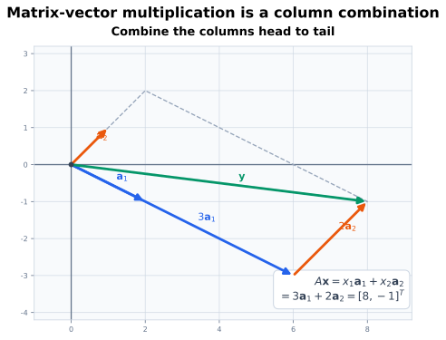
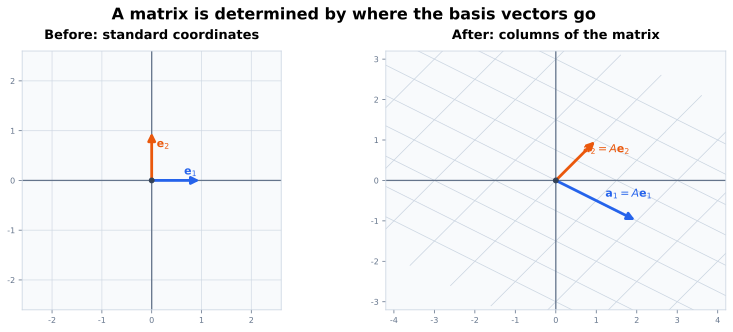
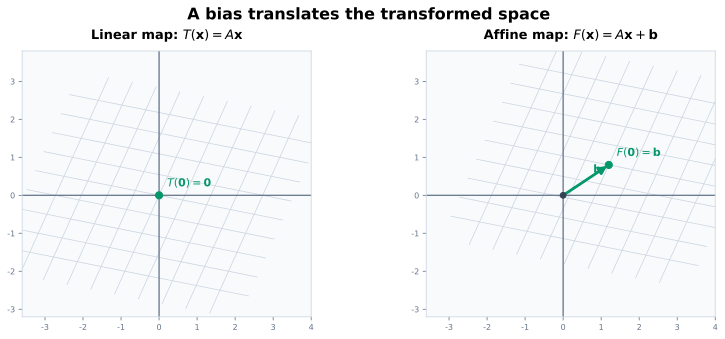

# 本页要回答的问题

读完这篇导论后，我希望能回答：

1. 线性代数究竟研究哪些对象和问题；
2. 为什么同一个矩阵可以同时表示数字表、线性组合、几何变换和方程组；
3. “线性映射”中的“线性”需要满足什么条件；
4. 为什么神经网络中的 `Linear` 层严格说通常是仿射映射；
5. 数学中的列向量约定如何对应代码里的批量矩阵；
6. 后续学习时应该怎样检查公式，而不是只记计算步骤。

# 线性代数在研究什么

最初看起来，线性代数似乎只是“把许多数排成向量和矩阵，再按规则计算”。但这些数字不是孤立的；它们通常在描述以下几类问题：

- **表示**：用坐标记录一个对象，例如位置、图像特征或 token 表示；
- **组合**：用若干方向的加权和构造新对象；
- **变换**：把一个空间中的表示映射到另一个空间；
- **约束与求解**：寻找同时满足多条线性关系的未知量；
- **比较**：用内积、范数和距离衡量方向、长度与差异；
- **分解与近似**：寻找矩阵的重要方向、低秩结构和稳定计算方式。

这些问题并不是六套互不相关的技巧。同一个矩阵可以从不同角度连接它们，这正是线性代数真正有用的地方。

# 一个计算的四种视角

考虑

$$
\mathbf{A}
=
\begin{bmatrix}
2 & 1\\
-1 & 1
\end{bmatrix}
\in\mathbb{R}^{2\times2},
\qquad
\mathbf{x}
=
\begin{bmatrix}
3\\
2
\end{bmatrix}
\in\mathbb{R}^{2}.
$$

计算得到

$$
\mathbf{y}
=
\mathbf{A}\mathbf{x}
=
\begin{bmatrix}
2\cdot3+1\cdot2\\
(-1)\cdot3+1\cdot2
\end{bmatrix}
=
\begin{bmatrix}
8\\
-1
\end{bmatrix}.
$$ {#eq-intro-matrix-vector}

这个简单计算至少可以用四种方式理解。

## 视角一：逐行计算输出分量

矩阵的第一行决定 $y_1$，第二行决定 $y_2$：

$$
y_1=2x_1+x_2,
\qquad
y_2=-x_1+x_2.
$$

这种视角适合检查每个输出分量依赖哪些输入，也是实现线性层时常见的理解方式。

## 视角二：对矩阵的列做线性组合

把 $\mathbf{A}$ 写成两列：

$$
\mathbf{A}
=
\begin{bmatrix}
\vert & \vert\\
\mathbf{a}_1 & \mathbf{a}_2\\
\vert & \vert
\end{bmatrix},
\qquad
\mathbf{a}_1=
\begin{bmatrix}2\\-1\end{bmatrix},
\qquad
\mathbf{a}_2=
\begin{bmatrix}1\\1\end{bmatrix}.
$$

那么

$$
\mathbf{A}\mathbf{x}
=x_1\mathbf{a}_1+x_2\mathbf{a}_2
=3\mathbf{a}_1+2\mathbf{a}_2.
$$

因此矩阵乘向量并不只是“行乘列”的口诀；它还表示用输入坐标作为权重，对矩阵的列进行线性组合。后续的列空间、张成和秩都会从这个视角自然出现。

{#fig-column-combination fig-alt="坐标平面中，三倍蓝色向量 a1 与两倍橙色向量 a2 首尾相接，得到绿色输出向量 y。" width="88%"}

## 视角三：空间中的变换

矩阵还定义了一个函数

$$
T:\mathbb{R}^{2}\to\mathbb{R}^{2},
\qquad
T(\mathbf{x})\coloneqq\mathbf{A}\mathbf{x}.
$$

它把平面中的每个输入向量映射到另一个向量。特别地，标准坐标向量满足

$$
T(\mathbf{e}_1)=\mathbf{a}_1,
\qquad
T(\mathbf{e}_2)=\mathbf{a}_2.
$$

也就是说，只要知道一组基向量被映到哪里，就能决定任意向量如何变换。旋转、缩放、投影和剪切都可以由合适的矩阵描述。

## 视角四：线性方程组

如果 $\mathbf{A}$ 和 $\mathbf{y}$ 已知，而 $\mathbf{x}$ 未知，那么

$$
\mathbf{A}\mathbf{x}=\mathbf{y}
$$

就是线性方程组。在本例中：

$$
\begin{cases}
2x_1+x_2=8,\\
-x_1+x_2=-1.
\end{cases}
$$

原来的矩阵乘法计算，与求解这两条方程是同一件事的两个方向：给定 $\mathbf{x}$ 时计算输出，给定输出时反求输入。方程是否有解、解是否唯一，以及误差会不会被放大，都与矩阵的结构有关。

::: {.callout-tip title="先抓住一个统一画面"}
矩阵不是彼此无关的数字表。它可以同时表示：

- 一组用于线性组合的列向量；
- 一个作用于空间的线性变换；
- 一组需要同时满足的线性方程；
- 在选定坐标系下对某个线性映射的记录。

后续遇到新概念时，我会反复在这几个视角之间切换。
:::

# 为什么先建立几何直觉

3Blue1Brown 的 *Essence of Linear Algebra* 系列最有价值的地方，不是提供更多矩阵计算技巧，而是把矩阵解释为空间的连续变形：观察网格、基向量、面积和方向如何变化。这个视角特别适合作为第一次接触线性代数时的心智图景 [@sanderson2016essence]。

例如二维矩阵

$$
\mathbf{A}
=
\begin{bmatrix}
\vert & \vert\\
\mathbf{a}_1 & \mathbf{a}_2\\
\vert & \vert
\end{bmatrix}
$$

已经记录了整个变换，因为它告诉我们：

$$
\mathbf{e}_1\mapsto\mathbf{a}_1,
\qquad
\mathbf{e}_2\mapsto\mathbf{a}_2.
$$

任意向量都可写为 $\mathbf{x}=x_1\mathbf{e}_1+x_2\mathbf{e}_2$。如果变换保持线性组合，那么

$$
T(\mathbf{x})
=T(x_1\mathbf{e}_1+x_2\mathbf{e}_2)
=x_1T(\mathbf{e}_1)+x_2T(\mathbf{e}_2)
=x_1\mathbf{a}_1+x_2\mathbf{a}_2.
$$

这一步同时解释了三件事：为什么矩阵的列是基向量的像，为什么矩阵乘向量是列的线性组合，以及为什么知道基向量的去向就足以确定整个线性变换。

{#fig-basis-transformation fig-alt="左图显示标准基 e1 和 e2，右图显示它们被矩阵 A 映射到 a1 和 a2，同时方格变成斜网格。" width="100%"}

几何动画主要展示二维和三维，但定义并不依赖我们能否把空间画出来。在数百或数千维中，仍然使用相同的线性组合、内积、子空间和投影规则；只是此时必须更多依赖公式、shape check 和数值实验。

# “线性”究竟是什么意思

函数

$$
T:\mathbb{R}^{n}\to\mathbb{R}^{m}
$$

称为线性映射，如果对任意 $\mathbf{x},\mathbf{y}\in\mathbb{R}^{n}$ 和 $\alpha,\beta\in\mathbb{R}$ 都满足

$$
T(\alpha\mathbf{x}+\beta\mathbf{y})
=
\alpha T(\mathbf{x})+
\beta T(\mathbf{y}).
$$ {#eq-linearity-preview}

这个条件把加法与标量乘法合并在一条公式中。取 $\alpha=\beta=0$ 可知线性映射必须满足

$$
T(\mathbf{0})=\mathbf{0}.
$$

因此

$$
F(\mathbf{x})=\mathbf{W}\mathbf{x}+\mathbf{b}
$$

在 $\mathbf{b}\neq\mathbf{0}$ 时严格说不是线性映射，而是**仿射映射**。深度学习框架通常仍把它命名为 `Linear` 层，这是工程惯例；判断数学性质时不能被类名代替定义。

{#fig-linear-vs-affine fig-alt="左图的线性变换网格经过原点，右图加入偏置 b 后，网格和零向量的像一起平移。" width="100%"}

真正使深度网络具有非线性表达能力的，是激活函数、softmax、归一化中依赖输入的统计量等非线性操作。如果只复合不带偏置的线性映射，最终仍然只是一个线性映射。

# 为什么机器学习离不开线性代数

语言模型处理的是 token，但计算机最终操作的是数字。一个 token 会被表示为向量；一批 token 会组成矩阵或张量；模型参数大部分也是矩阵。线性代数提供了表示并组合这些数字的语言。

Transformer 中最著名的公式是：

$$
\operatorname{Attention}(\mathbf{Q},\mathbf{K},\mathbf{V})
=
\operatorname{softmax}\!\left(
\frac{\mathbf{Q}\mathbf{K}^{\mathsf T}}{\sqrt{d_k}}
\right)\mathbf{V}.
$$

先不计算它，只观察对象和形状。设

$$
\mathbf{Q}\in\mathbb{R}^{T_q\times d_k},\qquad
\mathbf{K}\in\mathbb{R}^{T_k\times d_k},\qquad
\mathbf{V}\in\mathbb{R}^{T_k\times d_v}.
$$

则 $\mathbf{Q}\mathbf{K}^{\mathsf T}\in\mathbb{R}^{T_q\times T_k}$。softmax 通常逐行作用于 key 位置维度，最终输出属于 $\mathbb{R}^{T_q\times d_v}$。公式中包含：

- 矩阵 $\mathbf{Q},\mathbf{K},\mathbf{V}$；
- 转置 $\mathbf{K}^{\mathsf T}$；
- 矩阵乘法；
- 标量 $\sqrt{d_k}$；
- 沿指定维度应用的 softmax 函数。

如果不了解对象和形状，这行公式只能被背诵。我们的目标是让它最终成为一个可以逐分量推导、逐维度检查的自然结果。

## 模型中的五类直接用途

| 线性代数任务 | 数学对象 | 机器学习中的例子 |
|---|---|---|
| 表示 | 向量、矩阵、张量 | token embedding、hidden state、图像 patch |
| 变换 | 矩阵与线性映射 | 线性层、Q/K/V 投影、输出投影 |
| 比较 | 内积、范数、距离 | attention score、余弦相似度、梯度裁剪 |
| 求解 | 线性方程组、最小二乘 | 线性回归、局部近似、读出层拟合 |
| 分解与近似 | 特征分解、SVD、低秩结构 | PCA、LoRA、压缩、表示子空间分析 |

这些联系的强度并不相同。线性层和矩阵乘法是模型实现中的直接结构；用特征值或子空间解释训练后表示，则通常还需要数据、实验和额外假设。线性代数提供分析语言，但不会自动给出语义解释。

## 数学列向量与代码批量矩阵

本文默认单个向量写成列向量：

$$
\mathbf{x}\in\mathbb{R}^{d_{\mathrm{in}}},
\qquad
\mathbf{y}
=
\mathbf{W}\mathbf{x}+\mathbf{b},
$$

其中

$$
\mathbf{W}\in\mathbb{R}^{d_{\mathrm{out}}\times d_{\mathrm{in}}},
\qquad
\mathbf{b}\in\mathbb{R}^{d_{\mathrm{out}}}.
$$

代码通常把 $B$ 个样本按行堆叠：

$$
\mathbf{X}\in\mathbb{R}^{B\times d_{\mathrm{in}}}.
$$

于是批量计算写成

$$
\mathbf{Y}
=
\mathbf{X}\mathbf{W}^{\mathsf T}
+
\mathbf{1}_{B}\mathbf{b}^{\mathsf T}
\in
\mathbb{R}^{B\times d_{\mathrm{out}}},
$$ {#eq-batched-affine-map}

其中 $\mathbf{1}_{B}\in\mathbb{R}^{B}$ 的每个分量都是 $1$。这与单样本公式并不矛盾，只是批量数据采用了“每行一个样本”的存储约定。实际代码还可能增加序列长度、头数和通道等轴，因此必须明确每一维的语义，而不能只看元素总数。

# 本部分路线

1. 标量、向量与坐标；
2. 向量加法、数乘与线性组合；
3. 矩阵和线性映射；
4. 矩阵乘法；
5. 线性方程组与消元；
6. 向量空间、基、维数与秩；
7. 内积、范数、距离和投影；
8. 特征值与特征向量；
9. 奇异值分解与低秩近似。

每个概念都会在后续模型中重新出现。例如：

| 线性代数概念 | LLM/RL 中的用途 |
|---|---|
| 向量 | token embedding、hidden state、reward features |
| 内积 | attention score、余弦相似度 |
| 矩阵乘法 | 线性层、投影、批量计算 |
| 线性映射 | 多头 attention 中的特征映射、输出投影 |
| 基变换 | 同一对象在不同坐标系中的表示 |
| 低秩矩阵与低秩近似 | LoRA 更新参数化、压缩与近似 |
| 范数 | 正则化、梯度裁剪、参数变化度量 |

# 学习时反复使用的四个习惯

## 习惯一：先看对象和形状

看到

$$
\mathbf{y}=\mathbf{A}\mathbf{x}
$$

时，不要立即计算。先声明：

$$
\mathbf{A}\in\mathbb{R}^{m\times n},
\qquad
\mathbf{x}\in\mathbb{R}^{n},
\qquad
\mathbf{y}\in\mathbb{R}^{m}.
$$

形状说明 $\mathbf{A}$ 接受 $n$ 维输入并产生 $m$ 维输出。它既能解释运算，也能在推导和代码中尽早发现错误。

::: {.callout-warning title="形状合法只是必要条件"}
两个公式形状相容，不代表它们在语义上相同。例如 token 轴和特征轴即使长度碰巧相等，也不能随意交换。除了尺寸，还要记录每条轴的实际含义。
:::

## 习惯二：在整体形式与分量形式之间切换

整体形式简洁：

$$
\mathbf{y}=\mathbf{A}\mathbf{x}.
$$

分量形式则暴露每个输出如何计算：

$$
y_i
=
\sum_{j=1}^{n}A_{ij}x_j,
\qquad
i\in\{1,\ldots,m\}.
$$

前者适合组织推导，后者适合检查索引、实现循环并确认某个维度是否被正确求和。后续处理 attention 和张量缩并时，两种形式缺一不可。

## 习惯三：同时问“怎么算”和“它在做什么”

对矩阵乘法，只会执行“行乘列”还不够。我还需要追问：

- 这是在组合哪些列向量？
- 它把哪些方向压缩、拉伸或消去？
- 输出落在哪个子空间？
- 如果反过来求输入，解是否存在且唯一？

几何直觉帮助回答“它在做什么”，代数推导保证结论可以推广到无法画出的高维空间。

## 习惯四：区分精确代数与数值计算

纸面上可逆的矩阵，在有限精度计算中也可能非常不稳定。一个方程组“存在唯一解”与“能够可靠算出这个解”不是同一个问题。后续除了秩、逆矩阵和特征值，还会记录条件数、误差传播和数值稳定性。

# 这条学习路线借鉴了什么

本部分借鉴 3Blue1Brown 以空间变换和基向量为核心的几何直觉 [@sanderson2016essence]，也吸收 Strang 从列组合、方程组和子空间出发的组织方式 [@strang2023linear]。机器学习连接主要参考经典模式识别中的向量与矩阵语言 [@bishop2006pattern]，并以 Transformer 的 scaled dot-product attention 作为后续持续展开的实例 [@vaswani2017attention]。

这些来源提供的是视角和问题选择；本文会根据自己的学习依赖重新组织内容，不复刻原书或视频的章节顺序。第一次阅读优先建立几何画面和对象类型，第二次再补证明、抽象结构与数值边界。

# 小结

线性代数不是矩阵计算规则的清单，而是一套在“坐标表示、线性组合、空间变换和方程求解”之间来回切换的语言。3B1B 式的几何画面适合建立直觉，列组合和方程组视角负责连接计算，形式化定义保证结论能进入高维，shape 与数值检查则把这些概念接到真实机器学习代码上。

# 参考资料

::: {#refs}
:::
