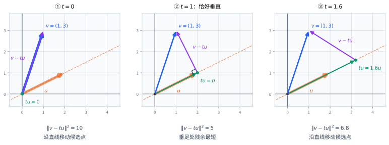
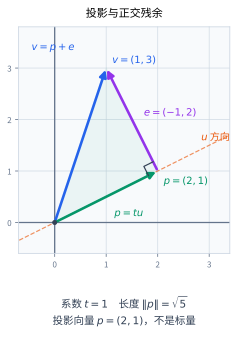
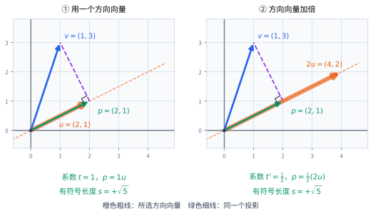
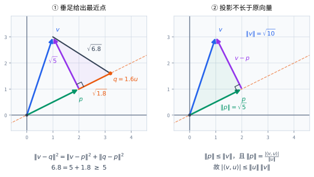
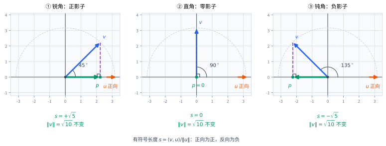
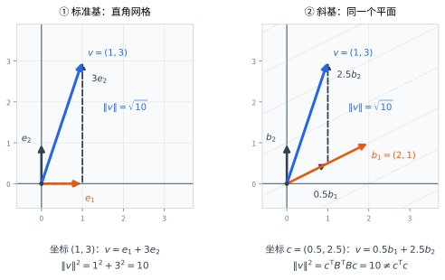

# 在线上选一个落脚点

一个近似解与真实解的差是一个向量；把近似解代回方程得到的残差也是一个向量。要比较它们的大小，需要长度；要判断一个差异主要落在哪个方向上，还需要沿该方向的分量。

先看平面中的两个向量：

$$
\mathbf u=\begin{bmatrix}2\\1\end{bmatrix},
\qquad
\mathbf v=\begin{bmatrix}1\\3\end{bmatrix}.
$$

橙色方向向量 $\mathbf u$ 确定一条过原点的直线

$$
\ell=\{t\mathbf u:t\in\mathbb R\}.
$$

在线上选一个点 $t\mathbf u$。从它的端点走到 $\mathbf v$ 的端点，还需要走一段向量 $\mathbf v-t\mathbf u$。随着 $t$ 改变，落脚点沿直线移动，这段剩余向量也跟着改变。

{#fig-inner-moving-foot fig-alt="三帧分别取 t=0、1、1.6。蓝色 v=(1,3) 不动，绿色落脚点沿 u=(2,1) 的直线移动；紫色剩余向量在 t=1 时与直线垂直。" width="100%"}

图中第二个位置有一个特殊之处：剩余向量恰好垂直于这条直线。先不把“看起来最短”当成结论。需要回答两个可计算的问题：

- 怎样求出这个垂直位置，而不靠目测？
- 为什么其他位置一定不会更近？

两者都从内积开始。

# 从坐标计算到垂直关系

## 长度与内积的基本约定

以下先讨论标准实坐标空间 $\mathbb R^n$，使用[向量的基本运算](scalars-and-vectors.qmd)中定义的标准内积与 Euclidean 范数：

$$
\langle\mathbf x,\mathbf y\rangle
=\mathbf x^{\mathsf T}\mathbf y
=\sum_{i=1}^{n}x_i y_i,
\qquad
\|\mathbf x\|_2=\sqrt{\langle\mathbf x,\mathbf x\rangle}.
$$

本章在没有歧义时把 $\|\mathbf x\|_2$ 简写成 $\|\mathbf x\|$。内积的结果是标量，长度则是非负标量。标准内积具有：

- 对称性：$\langle\mathbf x,\mathbf y\rangle=\langle\mathbf y,\mathbf x\rangle$；
- 对每个输入的线性：例如 $\langle a\mathbf x+b\mathbf y,\mathbf z\rangle=a\langle\mathbf x,\mathbf z\rangle+b\langle\mathbf y,\mathbf z\rangle$；
- 正定性：$\langle\mathbf x,\mathbf x\rangle\ge0$，且等号当且仅当 $\mathbf x=\mathbf0$。

这些分别来自实数乘法的交换律、分配律，以及平方和为零当且仅当每项为零。对称性也把第一个输入的线性转换为第二个输入的线性。

## 为什么点积为零对应垂直

平面中，若非零向量 $\mathbf u=(a,b)^{\mathsf T}$ 转过直角，就得到 $\mathbf w=(-b,a)^{\mathsf T}$。逐项相乘：

$$
\mathbf u^{\mathsf T}\mathbf w=a(-b)+ba=0.
$$

反过来，所有满足 $ax+by=0$ 的向量都是 $\mathbf w$ 的倍数：

- 若 $a\neq0$，则 $x=-by/a$，所以 $(x,y)^{\mathsf T}=(y/a)(-b,a)^{\mathsf T}$；
- 若 $a=0$，则 $b\neq0$，方程要求 $y=0$，其解恰好是水平方向，也就是 $(-b,0)^{\mathsf T}$ 的倍数。

因此，对非零平面向量，点积为零与几何垂直完全对应。这个不依赖画图的条件也能用于任意维数：

$$
\boxed{\mathbf x\perp\mathbf y
\quad\Longleftrightarrow\quad
\langle\mathbf x,\mathbf y\rangle=0.}
$$ {#eq-orthogonal-vectors}

这叫作**正交**。按定义，零向量与每个向量都正交，但零向量没有方向，不能据此给它指定一个夹角。

## 正交为什么消掉交叉项

直接展开平方长度：

$$
\begin{aligned}
\|\mathbf x+\mathbf y\|^2
&=\langle\mathbf x+\mathbf y,\mathbf x+\mathbf y\rangle\\
&=\|\mathbf x\|^2+2\langle\mathbf x,\mathbf y\rangle+\|\mathbf y\|^2.
\end{aligned}
$$

所以

$$
\mathbf x\perp\mathbf y
\quad\Longleftrightarrow\quad
\|\mathbf x+\mathbf y\|^2=\|\mathbf x\|^2+\|\mathbf y\|^2.
$$ {#eq-inner-pythagoras}

这就是实内积中的勾股关系，包括逆命题。它不是只适用于平面三角形的图形记忆，而是“双线性展开后交叉项为零”。

# 从垂直条件推导直线投影

设 $\mathbf u\neq\mathbf0$，要把任意 $\mathbf v\in\mathbb R^n$ 写成

$$
\mathbf v=t\mathbf u+\mathbf e,
\qquad \mathbf e\perp\mathbf u.
$$

第一部分沿着直线，第二部分不再含有沿该方向的分量。将 $\mathbf e=\mathbf v-t\mathbf u$ 代入正交条件：

$$
0=\langle\mathbf u,\mathbf v-t\mathbf u\rangle
=\langle\mathbf u,\mathbf v\rangle-t\|\mathbf u\|^2.
$$

因为 $\mathbf u\neq0$，分母 $\|\mathbf u\|^2>0$，因此唯一可能的系数是

$$
\boxed{t_*=
\frac{\langle\mathbf u,\mathbf v\rangle}{\|\mathbf u\|^2}.}
$$ {#eq-line-projection-coefficient}

将它代回，确实使内积为零，因此不仅必要，而且充分。定义

$$
\boxed{
\mathbf p=\operatorname{proj}_{\ell}(\mathbf v)
=\frac{\langle\mathbf u,\mathbf v\rangle}{\|\mathbf u\|^2}\mathbf u,
\qquad
\mathbf e=\mathbf v-\mathbf p.
}
$$ {#eq-line-projection-vector}

$\mathbf p$ 称为 $\mathbf v$ 到直线 $\ell=\operatorname{span}(\mathbf u)$ 的**正交投影**。它是从原点指向垂足的向量；$\mathbf e$ 是正交残余。

对开头的例子：

$$
\langle\mathbf u,\mathbf v\rangle=2\cdot1+1\cdot3=5,
\qquad \|\mathbf u\|^2=2^2+1^2=5,
$$

故 $t_*=1$，并且

$$
\mathbf p=\begin{bmatrix}2\\1\end{bmatrix},
\qquad
\mathbf e=\begin{bmatrix}-1\\2\end{bmatrix},
\qquad
\mathbf u^{\mathsf T}\mathbf e=-2+2=0.
$$

{#fig-inner-components fig-alt="原点到 p=(2,1) 是绿色投影，p 到 v=(1,3) 是紫色残余 (-1,2)，两段垂直。投影系数为 1，投影长度为根号五。" width="80%"}

这里 $\|\mathbf p\|^2=5$、$\|\mathbf e\|^2=5$，所以 $\|\mathbf v\|^2=10$。图里的直角与坐标中的等式说的是同一件事。

## 不要把三种“分量”混为一谈

把方向向量归一化，得到单位向量

$$
\widehat{\mathbf u}=\frac{\mathbf u}{\|\mathbf u\|},
\qquad \|\widehat{\mathbf u}\|=1.
$$

沿着 $\mathbf u$ 正方向的**有符号长度**为

$$
s=\langle\widehat{\mathbf u},\mathbf v\rangle
=\frac{\langle\mathbf u,\mathbf v\rangle}{\|\mathbf u\|}.
$$ {#eq-signed-component}

于是 $\mathbf p=s\widehat{\mathbf u}=t_*\mathbf u$。三者的类型与含义如下：

| 对象 | 一般公式 | 本例 |
|---|---|---|
| 相对于所选方向向量的倍数 | $t_*=\langle\mathbf u,\mathbf v\rangle/\|\mathbf u\|^2$ | $1$ |
| 沿指定正方向的有符号长度 | $s=\langle\mathbf u,\mathbf v\rangle/\|\mathbf u\|$ | $+\sqrt5$ |
| 投影向量 | $\mathbf p=t_*\mathbf u=s\widehat{\mathbf u}$ | $(2,1)^{\mathsf T}$ |

无符号的投影长度是 $\|\mathbf p\|=|s|$，不是一般情况下的 $s$，更不是 $t_*$。

# 换一根方向箭头，不应改变垂足

把 $\mathbf u$ 换成 $2\mathbf u$，描述的仍是同一条直线。新系数变为

$$
t_*'=\frac{\langle2\mathbf u,\mathbf v\rangle}{\|2\mathbf u\|^2}
=\frac{2}{4}t_*=\frac{t_*}{2}.
$$

因此 $t_*'(2\mathbf u)=t_*\mathbf u=\mathbf p$。方向箭头加倍，所需倍数减半，落脚点完全不动。

{#fig-inner-rescaling fig-alt="两图的蓝色 v 和绿色投影 p 相同；左图方向是 u=(2,1)，系数为 1，右图方向是 2u=(4,2)，系数为二分之一。两图使用相同坐标尺度。" width="100%"}

更一般地，用 $c\mathbf u$ 代替 $\mathbf u$，其中 $c\neq0$，投影系数变为 $t_*/c$，投影向量仍不变。有符号长度则满足

$$
s'=\frac{c}{|c|}s.
$$

当 $c<0$ 时，直线没有变，但人为指定的正方向反转了，因此有符号长度变号。这也解释了为什么投影向量只依赖直线，而有符号长度还依赖朝向。

# 为什么垂足是唯一最近点

现在才证明第一组图中的距离判断。直线上任取另一个点 $\mathbf q=a\mathbf u$。因为 $\mathbf p-\mathbf q$ 沿着 $\mathbf u$，而 $\mathbf e=\mathbf v-\mathbf p$ 与它正交，所以

$$
\mathbf v-\mathbf q
=\underbrace{(\mathbf v-\mathbf p)}_{\mathbf e}
+\underbrace{(\mathbf p-\mathbf q)}_{\text{沿直线}},
$$

并由勾股关系得到

$$
\boxed{
\|\mathbf v-\mathbf q\|^2
=\|\mathbf v-\mathbf p\|^2+\|\mathbf p-\mathbf q\|^2
\ge\|\mathbf v-\mathbf p\|^2.
}
$$ {#eq-line-nearest-point}

等号成立当且仅当 $\mathbf p=\mathbf q$。因此垂足是唯一最近点；这里没有使用求导，也没有预先假定任何最优化定理。

{#fig-inner-nearest fig-alt="左图取 q=1.6u，展示 v-p 与 p-q 垂直，距离平方为 5+1.8=6.8；右图展示 v=p+e 的直角三角形，投影 p 的长度不超过 v。" width="100%"}

本例 $\mathbf q=1.6\mathbf u$ 时，$\|\mathbf p-\mathbf q\|^2=0.6^2\cdot5=1.8$，所以距离平方是 $5+1.8=6.8$。原点对应 $a=0$，距离平方为 $5+5=10$。

## 投影为什么是线性映射

固定非零 $\mathbf u$，将 @eq-line-projection-vector 记为 $P_\ell(\mathbf v)$。由内积对第二个输入的线性，

$$
P_\ell(a\mathbf v+b\mathbf w)
=aP_\ell(\mathbf v)+bP_\ell(\mathbf w).
$$

而已经在线上的向量 $\mathbf v=c\mathbf u$ 满足 $P_\ell(\mathbf v)=c\mathbf u=\mathbf v$。所以投影两次与一次相同：$P_\ell(P_\ell(\mathbf v))=P_\ell(\mathbf v)$。这不是对任意矩阵都成立的性质，而是“落到线上以后，再落一次不再移动”。

# 从投影长度得到 Cauchy–Schwarz

任取 $\mathbf u\neq0$，刚才的正交分解给出

$$
\|\mathbf v\|^2=\|\mathbf p\|^2+\|\mathbf e\|^2
\ge\|\mathbf p\|^2
=\frac{\langle\mathbf u,\mathbf v\rangle^2}{\|\mathbf u\|^2}.
$$

乘以正数 $\|\mathbf u\|^2$，开平方，得到

$$
\boxed{
|\langle\mathbf u,\mathbf v\rangle|
\le\|\mathbf u\|\,\|\mathbf v\|.
}
$$ {#eq-cauchy-schwarz}

若 $\mathbf u=0$，两侧均为零，结论仍成立。这就是 **Cauchy–Schwarz 不等式**。它的几何内容是：一个向量沿任何单位方向的有符号分量，其绝对值不超过原向量长度。

**等号条件也在同一幅图中。** 当 $\mathbf u\neq0$ 时，等号当且仅当 $\mathbf e=0$，即 $\mathbf v$ 是 $\mathbf u$ 的倍数。连同零向量情形，等号当且仅当这两个向量线性相关。

## 不靠图形的另一种证明

对任意实数 $t$，平方长度非负：

$$
0\le\|\mathbf v-t\mathbf u\|^2
=\|\mathbf v\|^2-2t\langle\mathbf u,\mathbf v\rangle+t^2\|\mathbf u\|^2.
$$

若 $\mathbf u\neq0$，这是开口向上的二次式。它处处非负，所以判别式不大于零：

$$
4\langle\mathbf u,\mathbf v\rangle^2
-4\|\mathbf u\|^2\|\mathbf v\|^2\le0.
$$

整理即得同一不等式。若 $\mathbf u=0$ 则单独直接验证。也可以将二次式配方：

$$
\|\mathbf v-t\mathbf u\|^2
=\|\mathbf u\|^2(t-t_*)^2
+\|\mathbf v\|^2-
\frac{\langle\mathbf u,\mathbf v\rangle^2}{\|\mathbf u\|^2}.
$$

最小值在 $t=t_*$ 取得，最后两项的和恰好是 $\|\mathbf e\|^2$。二次式证明与垂足证明不是两个互不相关的技巧，而是同一个分解的两种写法。

# 点积的正负与夹角

## 平面中的有符号影子

固定一个单位方向，把它画成向右的方向轴。让长度不变的 $\mathbf v$ 转动：垂足先在正半轴，转过直角时回到原点，再进入负半轴。

{#fig-inner-signed-shadow fig-alt="三帧中的 v 长度均为根号十，相对于水平正方向分别成45、90、135度。有符号长度依次是正根号五、零、负根号五。" width="100%"}

图中把方向画成水平只是为了容易读取影子，并不是说公式只适用于水平方向。对任意平面单位向量 $\widehat{\mathbf u}=(a,b)^{\mathsf T}$，取垂直单位向量 $\mathbf w=(-b,a)^{\mathsf T}$。二者构成一组基，且

$$
\|s\widehat{\mathbf u}+r\mathbf w\|^2=s^2+r^2.
$$

在这两个垂直方向上量出的长度与原来的 Euclidean 长度相同。$\mathbf v$ 沿第一个方向的坐标正是 $s=\langle\widehat{\mathbf u},\mathbf v\rangle$。根据平面直角三角形的余弦关系（钝角时取负的有符号邻边），对于 $\mathbf v\neq0$，

$$
s=\|\mathbf v\|\cos\theta.
$$

因而对非零平面向量，几何夹角满足

$$
\langle\mathbf u,\mathbf v\rangle
=\|\mathbf u\|\,\|\mathbf v\|\cos\theta.
$$

## 高维中怎样定义夹角

在任意维数，Cauchy–Schwarz 已经保证两个非零向量满足

$$
-1\le\frac{\langle\mathbf u,\mathbf v\rangle}{\|\mathbf u\|\,\|\mathbf v\|}\le1.
$$

因此可以定义

$$
\boxed{
\theta=\arccos\left(
\frac{\langle\mathbf u,\mathbf v\rangle}{\|\mathbf u\|\,\|\mathbf v\|}
\right)\in[0,\pi].
}
$$ {#eq-inner-angle}

在平面中，这与刚才的几何夹角一致；在高维中，它提供同样的比较方式：正内积对应 $0\le\theta<\pi/2$，零内积对应 $\theta=\pi/2$，负内积对应 $\pi/2<\theta\le\pi$。去掉同向与反向这两个共线端点后，正、负内积分别对应锐角和钝角。

对贯穿例子，

$$
\cos\theta=\frac5{\sqrt5\sqrt{10}}=\frac1{\sqrt2},
\qquad \theta=\frac\pi4.
$$

当 $\cos\theta=1$ 时，两个非零向量同向；当 $\cos\theta=-1$ 时，二者反向。这还用了等号条件：它们必须共线，再由内积的正负区分倍数的符号。

::: {.callout-warning title="零向量正交，但没有夹角"}
$\langle\mathbf0,\mathbf v\rangle=0$ 并不意味着零向量与 $\mathbf v$ 成直角。角度公式的分母此时为零。正交的代数定义包含零向量，夹角定义则要求两个向量都非零。
:::

# 长度为什么可以用来定义距离

## 范数的三条要求

一般地，实向量空间上的范数是一个实值函数 $\|\cdot\|$，满足：

1. $\|\mathbf x\|\ge0$，且等号当且仅当 $\mathbf x=0$；
2. $\|a\mathbf x\|=|a|\|\mathbf x\|$；
3. $\|\mathbf x+\mathbf y\|\le\|\mathbf x\|+\|\mathbf y\|$。

Euclidean 范数的第一条来自平方和，第二条来自 $\sqrt{a^2}=|a|$。第三条是三角不等式，需要证明，不能只因为符号叫“长度”就假定它成立。

由 Cauchy–Schwarz，

$$
\begin{aligned}
\|\mathbf x+\mathbf y\|^2
&=\|\mathbf x\|^2+2\langle\mathbf x,\mathbf y\rangle+\|\mathbf y\|^2\\
&\le\|\mathbf x\|^2+2\|\mathbf x\|\|\mathbf y\|+\|\mathbf y\|^2\\
&=(\|\mathbf x\|+\|\mathbf y\|)^2.
\end{aligned}
$$

两边非负，开平方得到

$$
\boxed{\|\mathbf x+\mathbf y\|\le\|\mathbf x\|+\|\mathbf y\|.}
$$ {#eq-triangle-inequality}

若两个向量均非零，等号要求 $\langle\mathbf x,\mathbf y\rangle=\|\mathbf x\|\|\mathbf y\|$，即它们同向。反向但共线通常不是等号情形：沿反方向走会抵消，而不是增加总位移长度。任一向量为零时也取等号。

## 从原点长度到两点距离

定义

$$
d(\mathbf x,\mathbf y)=\|\mathbf x-\mathbf y\|.
$$ {#eq-euclidean-distance}

它非负，且只在两点相同时为零；由 $\|-(\mathbf x-\mathbf y)\|=\|\mathbf x-\mathbf y\|$ 得到对称性。又因为

$$
\mathbf x-\mathbf z=(\mathbf x-\mathbf y)+(\mathbf y-\mathbf z),
$$

三角不等式给出

$$
d(\mathbf x,\mathbf z)\le d(\mathbf x,\mathbf y)+d(\mathbf y,\mathbf z).
$$

这三项正是距离的基本要求：区分不同点、交换起终点不变、直接距离不超过绕路长度。

还有一个有用的推论：

$$
\big|\|\mathbf x\|-\|\mathbf y\|\big|\le\|\mathbf x-\mathbf y\|.
$$

证明是把 $\mathbf x=(\mathbf x-\mathbf y)+\mathbf y$ 代入三角不等式，再交换 $\mathbf x,\mathbf y$。因此两个向量接近时，它们的长度也接近；但长度接近不意味着方向或向量接近。

# 换了坐标，不能偷偷换掉尺子

令 $\mathcal B$ 的两个基向量为

$$
\mathbf b_1=\begin{bmatrix}2\\1\end{bmatrix},
\qquad
\mathbf b_2=\begin{bmatrix}0\\1\end{bmatrix},
\qquad
\mathbf B=\begin{bmatrix}2&0\\1&1\end{bmatrix}.
$$

同一个 $\mathbf v=(1,3)^{\mathsf T}$ 在这组基下的坐标为

$$
\mathbf c=[\mathbf v]_{\mathcal B}
=\begin{bmatrix}1/2\\5/2\end{bmatrix},
\qquad
\mathbf v=\mathbf B\mathbf c.
$$

注意：沿 $\mathbf b_1=\mathbf u$ 的**基坐标**是 $1/2$，但沿 $\mathbf u$ 的**正交投影系数**是 $1$。为什么不同？因为另一条基向量 $\mathbf b_2$ 不垂直于 $\mathbf u$，它也贡献了沿 $\mathbf u$ 的分量。基坐标是在指定基中重建向量的系数，不自动等于正交投影系数。

{#fig-inner-oblique fig-alt="同尺度的两图都画出 v=(1,3)。左图用标准基重建，右图用 b1=(2,1)、b2=(0,1) 及系数二分之一、二分之五重建；两图中 v 长度相同。" width="100%"}

标准坐标中的长度平方为 $1^2+3^2=10$，但直接平方相加新坐标，得到的是

$$
\mathbf c^{\mathsf T}\mathbf c=\frac14+\frac{25}4=\frac{13}2,
$$

并不是同一几何长度。正确的换算来自代入，而不是猜测：

$$
\|\mathbf v\|^2
=(\mathbf B\mathbf c)^{\mathsf T}(\mathbf B\mathbf c)
=\mathbf c^{\mathsf T}\mathbf G\mathbf c,
\qquad
\mathbf G=\mathbf B^{\mathsf T}\mathbf B
=\begin{bmatrix}5&1\\1&1\end{bmatrix}.
$$ {#eq-inner-coordinate-metric}

实际计算为 $5/4+2(1/2)(5/2)+25/4=10$。矩阵 $\mathbf G$ 的元素是基向量两两的内积，称为这组基的 **Gram 矩阵**。

更一般地，若 $\mathbf x=\mathbf B\mathbf c$、$\mathbf y=\mathbf B\mathbf d$，则

$$
\langle\mathbf x,\mathbf y\rangle=\mathbf c^{\mathsf T}\mathbf G\mathbf d.
$$

只有当 $\mathbf G=\mathbf I$，也就是基向量两两正交且各长为 $1$ 时，这个公式对所有坐标都简化为 $\mathbf c^{\mathsf T}\mathbf d$。这样的基叫作**正交归一基**。必要性可以取 $\mathbf c=\mathbf e_i,\mathbf d=\mathbf e_j$ 逐项读出，充分性则直接代入。

一般可逆换基不会改变对象本身，但会改变记录同一个内积的公式。反之，若换基后仍强行使用未经调整的坐标点积，那是在选另一种几何，而不只是给原几何换个名字。

# 内积是在线性结构上增加的选择

在实向量空间 $V$ 上，给定一个函数 $\langle\cdot,\cdot\rangle:V\times V\to\mathbb R$，如果它具有对称性、双线性和正定性，就称它为一个**内积**，$V$ 连同这个选择称为实内积空间。

这些性质足以定义 $\|v\|=\sqrt{\langle v,v\rangle}$。前面的投影、平方展开、Cauchy–Schwarz 和三角不等式证明只使用了这三条性质，因此对任意实内积空间同样成立。非零向量的夹角也仍可由 @eq-inner-angle 定义。

例如，同一组平面坐标可以配上

$$
\langle\mathbf x,\mathbf y\rangle_W=4x_1y_1+x_2y_2.
$$

对称性、双线性来自标量运算，正定性来自 $4x_1^2+x_2^2>0$ 对非零向量成立。它等于把两根箭头的横坐标都放大两倍以后再取标准点积。

向量 $(1,1)^{\mathsf T}$ 与 $(1,-1)^{\mathsf T}$ 在标准内积下正交，在这个内积下却有 $4-1=3\neq0$。向量加法、线性相关与维数没有改变，但长度和正交关系改变了。必须说清“使用哪个内积”，才谈得上某两个向量是否垂直。

这与上一节不同：上一节保持物理箭头与尺子不动，只改坐标；这里固定坐标，主动改变了测量规则。

# 用数值实验核对，而不是代替证明

下面核对贯穿例子的投影、重标度、最近点、夹角与换基。代码只针对有限的普通尺度实向量；极大或极小浮点数还可能造成平方溢出或下溢。

```{python}
#| label: lst-inner-product-geometry
#| echo: true

import numpy as np
import sympy as sp


def line_projection(v, u):
    v = np.asarray(v, dtype=float)
    u = np.asarray(u, dtype=float)
    if v.ndim != 1 or v.shape != u.shape:
        raise ValueError("v 与 u 必须是同形状的一维实向量")
    if not (np.isfinite(v).all() and np.isfinite(u).all()):
        raise ValueError("输入必须为有限数")
    denominator = u @ u
    if not np.isfinite(denominator) or denominator <= 0:
        raise ValueError("方向不能为零；其平方长度还必须可被当前精度表示")
    coefficient = (u @ v) / denominator
    projection = coefficient * u
    return coefficient, projection, v - projection


u = np.array([2.0, 1.0])
v = np.array([1.0, 3.0])
t, p, e = line_projection(v, u)
np.testing.assert_allclose(t, 1.0)
np.testing.assert_allclose(p, [2.0, 1.0])
np.testing.assert_allclose(e, [-1.0, 2.0])
np.testing.assert_allclose(e @ u, 0.0, atol=1e-12)
np.testing.assert_allclose(v @ v, p @ p + e @ e)

for scale in (2.0, -3.0):
    new_t, new_p, _ = line_projection(v, scale * u)
    np.testing.assert_allclose(new_t, t / scale)
    np.testing.assert_allclose(new_p, p)

for a in (-2.0, 0.0, 1.0, 1.6, 4.0):
    q = a * u
    np.testing.assert_allclose((v - q) @ (v - q), e @ e + (p - q) @ (p - q))

_, zero_p, zero_e = line_projection(np.zeros(2), u)
np.testing.assert_allclose(zero_p, 0.0)
np.testing.assert_allclose(zero_e, 0.0)
for bad_direction in (np.zeros(2), np.array([np.nan, 1.0])):
    try:
        line_projection(v, bad_direction)
    except ValueError:
        pass
    else:
        raise AssertionError("无效方向应被拒绝")

cosine = (u @ v) / (np.linalg.norm(u) * np.linalg.norm(v))
# 舍入可能使理论上合法的余弦略微越过 [-1, 1]。
angle = np.arccos(np.clip(cosine, -1.0, 1.0))
np.testing.assert_allclose(angle, np.pi / 4)

B = sp.Matrix([[2, 0], [1, 1]])
c = sp.Matrix([sp.Rational(1, 2), sp.Rational(5, 2)])
G = B.T * B
assert B * c == sp.Matrix([1, 3])
assert (c.T * c)[0] == sp.Rational(13, 2)
assert (c.T * G * c)[0] == 10
print("投影系数:", t, "投影:", p, "正交残余:", e)
print("夹角（度）:", np.degrees(angle))
print("斜基下坐标平方和:", (c.T * c)[0], "几何长度平方:", (c.T * G * c)[0])
```

`np.clip` 只修正计算非零向量余弦时的微小范围越界，不能给零向量制造方向，也不能修复严重溢出。`allclose` 核对的是带容差的数值近似关系；一般结论由前面的证明保证。

## 点积得分与余弦相似度不是同一个量

对两个非零向量，余弦相似度是

$$
\frac{\langle\mathbf x,\mathbf y\rangle}{\|\mathbf x\|\|\mathbf y\|}.
$$

它消去了两个长度因子。将某个向量正比例放大，余弦相似度不变，未归一化点积却相应放大。标准 Transformer 的缩放点积通常除以 $\sqrt{d_k}$，不是除以两个输入的长度，因此不能把它直接叫作余弦相似度。这里的几何解释说明它们计算上有什么区别，不保证模型中的方向自动对应某种语义。

## 把长度用于残差时，还不能跳过矩阵

设精确解满足 $\mathbf A\mathbf x=\mathbf b$，近似解为 $\widehat{\mathbf x}$，则

$$
\mathbf r=\mathbf b-\mathbf A\widehat{\mathbf x}
=-\mathbf A(\widehat{\mathbf x}-\mathbf x).
$$

现在可以量出 $\|\mathbf r\|$ 与 $\|\widehat{\mathbf x}-\mathbf x\|$，但前者在输出空间，后者在输入空间，中间仍隔着 $\mathbf A$。例如

$$
\mathbf H_\varepsilon=\begin{bmatrix}1&1\\1&1+\varepsilon\end{bmatrix},
\qquad
\mathbf x=\begin{bmatrix}1\\1\end{bmatrix},
\qquad
\widehat{\mathbf x}=\begin{bmatrix}2\\0\end{bmatrix},
\quad \varepsilon>0.
$$

取 $\mathbf b=\mathbf H_\varepsilon\mathbf x$，则解误差长为 $\sqrt2$，残差为 $(0,\varepsilon)^{\mathsf T}$，长为 $\varepsilon$。定义了长度并不会让“小残差必然代表小解误差”变成真命题。

# 内积与投影自检

1. 对 $\mathbf u=(2,1)^{\mathsf T}$、$\mathbf v=(1,3)^{\mathsf T}$，分别写出投影系数、有符号长度、投影向量和正交残余。
2. 将 $\mathbf u$ 换成 $-2\mathbf u$。哪些量不变，哪些量变号，哪些量还改变绝对值？
3. 若 $\mathbf v=-3\mathbf u$，为什么 Cauchy–Schwarz 取等号，而 $\|\mathbf u+\mathbf v\|\le\|\mathbf u\|+\|\mathbf v\|$ 不取等号？
4. 用平方展开证明：$\mathbf x\perp\mathbf y$ 当且仅当 $\|\mathbf x+\mathbf y\|^2=\|\mathbf x\|^2+\|\mathbf y\|^2$。
5. 不用求导，证明 $\|\mathbf v-a\mathbf u\|$ 在投影系数处唯一取最小值。哪些地方用了 $\mathbf u\neq0$？
6. 在斜基例子中，直接计算 $\langle\mathbf b_1,\frac12\mathbf b_1+\frac52\mathbf b_2\rangle$，解释为什么投影系数不是第一基坐标。
7. 在加权内积 $4x_1y_1+x_2y_2$ 下重新求贯穿例子的投影系数。它是否仍为 $1$？
8. 为什么非零且两两正交的向量组线性无关？试对一个等于零的线性组合逐个取内积。

::: {.callout-note title="核对关键结果"}
第 2 题：系数为 $-1/2$，有符号长度为 $-\sqrt5$，投影仍为 $(2,1)^{\mathsf T}$，残余也不变。第 7 题：分子为 $4\cdot2\cdot1+1\cdot3=11$，分母为 $4\cdot2^2+1=17$，所以系数为 $11/17$。第 8 题：若 $\sum_i a_i\mathbf w_i=0$，与 $\mathbf w_j$ 取内积得到 $a_j\|\mathbf w_j\|^2=0$；每个 $\mathbf w_j\neq0$，故每个 $a_j=0$。
:::

# 从一条方向到一整个子空间

直线投影把向量唯一拆成两部分：沿直线的一部分，与整条直线正交的一部分。公式来自一个垂直条件，最近点性质来自一次勾股展开。Cauchy–Schwarz 与夹角又来自同一个分解，而不是额外背诵的规则。

若把直线换成一个平面或更高维子空间，“与一个方向正交”就变成“与这个子空间的每个方向都正交”。这些剩余方向会组成怎样的集合？它与行空间、列空间以及方程的零空间有什么关系？这些问题把逐个向量的正交关系组织成[正交补与四个基本子空间](orthogonal-complements-and-four-fundamental-subspaces.qmd)的结构。

# 参考资料

点积的几何解释与线性变换视角可参见 Sanderson [@sanderson2016essence]；内积、正交与投影的代数推导可参见 Strang、Boyd 与 Vandenberghe 及 Axler [@strang2023linear; @boyd2018applied; @axler2015linear]。

::: {#refs}
:::
