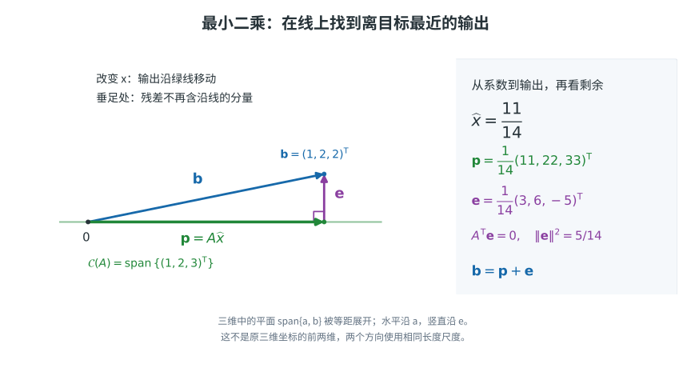
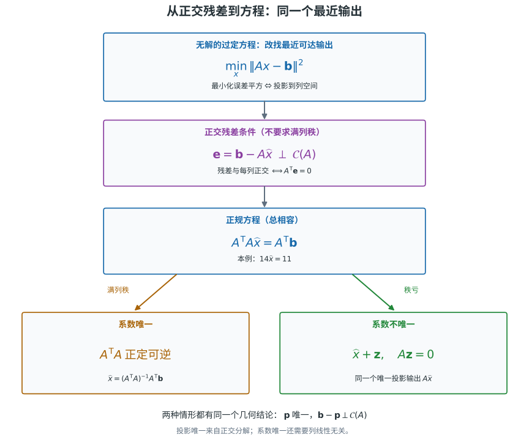

# 没有精确解时，输出能走到哪里

先看一个只有一个未知数、却有三个观测的方程组：

$$
A=\begin{bmatrix}1\\2\\3\end{bmatrix},
\qquad
\mathbf b=\begin{bmatrix}1\\2\\2\end{bmatrix},
\qquad
A x=\mathbf b.
$$

矩阵 $A$ 只有一列，所以无论 $x$ 取什么值，输出 $A x$ 都只能落在一条直线上：

$$
\mathcal C(A)=\{A x:x\in\mathbb R\}
=\operatorname{span}\!\left\{\begin{bmatrix}1\\2\\3\end{bmatrix}\right\}.
$$

但 $\mathbf b=(1,2,2)^{\mathsf T}$ 不是列向量 $(1,2,3)^{\mathsf T}$ 的倍数：前两个坐标会要求倍数为 $1$，第三个坐标却不满足。因此 $A x=\mathbf b$ 无解。问题不是让输出离开这条直线，而是在线上找离 $\mathbf b$ 最近的点。

{#fig-least-squares-projection-residual fig-alt="二维截面示意图：列空间 C(A) 是一条直线，原点到 p 的绿色向量沿列空间，原点到 b 的蓝色向量为目标，p 到 b 的紫色残差 e 垂直于列空间；旁边列出 A、b、p 和 e 的三维坐标。" width="92%"}

把最近点记为 $\mathbf p$，把从最近点指向目标的差记为残差：

$$
\mathbf p=A\widehat x,
\qquad
\mathbf e=\mathbf b-\mathbf p=\mathbf b-A\widehat x.
$$

对本例，投影系数由直线投影公式给出：

$$
\widehat x
=\frac{A^{\mathsf T}\mathbf b}{A^{\mathsf T}A}
=\frac{1+4+6}{1+4+9}
=\frac{11}{14}.
$$

所以

$$
\mathbf p=A\widehat x
=\begin{bmatrix}11/14\\11/7\\33/14\end{bmatrix},
\qquad
\mathbf e=\mathbf b-\mathbf p
=\begin{bmatrix}3/14\\3/7\\-5/14\end{bmatrix}.
$$

残差确实垂直于列空间，因为

$$
A^{\mathsf T}\mathbf e
=\begin{bmatrix}1&2&3\end{bmatrix}
\begin{bmatrix}3/14\\3/7\\-5/14\end{bmatrix}
=0.
$$

这里要区分三个对象：$\widehat x$ 是参数，$\mathbf p=A\widehat x$ 是最近的可达输出，$\mathbf e=\mathbf b-\mathbf p$ 是输出空间中的残差。最小二乘首先是在输出空间中找 $\mathbf p$；参数是随后用 $A\widehat x=\mathbf p$ 表示它的方式。

# 为什么最小值恰好对应正交残差

现在让 $A\in\mathbb R^{m\times n}$、$\mathbf b\in\mathbb R^m$；$x\in\mathbb R^n$ 表示一整组系数，不再限于一个标量。以下使用标准实内积与 Euclidean 范数。方程数多于未知数（$m>n$）称为**过定**，但过定不一定无解：是否有精确解仍取决于 $\mathbf b$ 是否属于 $\mathcal C(A)$。

对于无解的情形，我们不再要求每个坐标误差都为零，而是让它们的平方和最小。这就是**最小二乘**。对任意候选参数 $x$，误差平方为

$$
f(x)=\|A x-\mathbf b\|^2
=\|\mathbf b-A x\|^2.
$$

我们证明下面的等价关系：

$$
\boxed{
\widehat x\text{ 最小化 }\|A x-\mathbf b\|^2
\quad\Longleftrightarrow\quad
\mathbf b-A\widehat x\perp\mathcal C(A).
}
$$ {#eq-least-squares-orthogonal-residual}

## 正交残差足以保证最小

先假定

$$
\mathbf e=\mathbf b-A\widehat x\perp\mathcal C(A).
$$

任取另一个参数 $x=\widehat x+\mathbf h$。因为 $A\mathbf h\in\mathcal C(A)$，有 $\mathbf e\perp A\mathbf h$。于是

$$
\begin{aligned}
\mathbf b-Ax
&=\mathbf b-A(\widehat x+\mathbf h)\\
&=\mathbf e-A\mathbf h,
\end{aligned}
$$

并由勾股关系得到

$$
\|\mathbf b-Ax\|^2
=\|\mathbf e-A\mathbf h\|^2
=\|\mathbf e\|^2+\|A\mathbf h\|^2
\ge \|\mathbf e\|^2.
$$

因此 $\widehat x$ 达到最小值。这个展开还告诉我们，任何改变输出的方向 $A\mathbf h$ 都只会增加一个非负的平方项。

## 最小值必然给出正交残差

反过来，假定 $\widehat x$ 是最小二乘解。任取 $\mathbf z\in\mathbb R^n$，沿着参数方向 $\mathbf z$ 走一个实数 $t$：

$$
\widehat x+t\mathbf z.
$$

令 $\mathbf e=\mathbf b-A\widehat x$，则

$$
\begin{aligned}
\|\mathbf b-A(\widehat x+t\mathbf z)\|^2
&=\|\mathbf e-tA\mathbf z\|^2\\
&=\|\mathbf e\|^2-2t\,\mathbf e^{\mathsf T}A\mathbf z
+t^2\|A\mathbf z\|^2.
\end{aligned}
$$

$t=0$ 是这个关于 $t$ 的二次式的最小点。若一次项系数 $\mathbf e^{\mathsf T}A\mathbf z$ 不为零，取足够小且符号合适的 $t$ 就会让函数变小，矛盾。因此

$$
\mathbf e^{\mathsf T}A\mathbf z=0
\qquad\text{对所有 }\mathbf z\in\mathbb R^n.
$$

而所有 $A\mathbf z$ 正好组成 $\mathcal C(A)$，所以 $\mathbf e\perp\mathcal C(A)$。这就证明了必要性。

对本例，$\mathcal C(A)$ 只有一个方向，因此正交条件只需写成一个内积：

$$
A^{\mathsf T}(\mathbf b-A\widehat x)=0.
$$

对于多列矩阵，它会同时要求残差与每一列正交；与每一列正交就等价于与这些列的所有线性组合，也就是整个列空间正交。

# 正规方程

由

$$
A^{\mathsf T}(\mathbf b-A\widehat x)=0
$$

展开并移项，得到**正规方程**：

$$
\boxed{
A^{\mathsf T}A\widehat x=A^{\mathsf T}\mathbf b.
}
$$ {#eq-normal-equations}

它不是把原来无解的 $A x=\mathbf b$ 变成了精确方程；它表达的是：$A\widehat x$ 已经是 $\mathbf b$ 在 $\mathcal C(A)$ 上的正交投影。

本例中

$$
A^{\mathsf T}A=14,
\qquad
A^{\mathsf T}\mathbf b=11,
$$

所以正规方程是

$$
14\widehat x=11,
\qquad
\widehat x=\frac{11}{14}.
$$

也可以直接看到误差的勾股分解：

$$
\|\mathbf b-Ax\|^2
=\|\mathbf e+A(\widehat x-x)\|^2
=\|\mathbf e\|^2+\|A(\widehat x-x)\|^2.
$$

在本例中，最小误差平方为

$$
\|\mathbf e\|^2=\frac5{14},
$$

而 $\|\mathbf p\|^2=121/14$，因此 $\|\mathbf b\|^2=\|\mathbf p\|^2+\|\mathbf e\|^2=9$。目标被拆成可达的投影部分与无法通过改变参数消除的正交残差。

{#fig-least-squares-normal-equations fig-alt="流程图：最小二乘等价于残差与列空间正交，进而得到正规方程。满列秩时 Gram 矩阵正定可逆，系数唯一；秩亏时系数可沿零空间移动，产生同一个唯一投影输出。" width="100%"}

# 满列秩与系数唯一性

设 $A\in\mathbb R^{m\times n}$ 的列线性无关，也就是 $A$ 满列秩。对任意非零向量 $\mathbf z\in\mathbb R^n$，$A\mathbf z\neq0$，因此

$$
\mathbf z^{\mathsf T}A^{\mathsf T}A\mathbf z
=(A\mathbf z)^{\mathsf T}(A\mathbf z)
=\|A\mathbf z\|^2
>0.
$$

又因为 $(A^{\mathsf T}A)^{\mathsf T}=A^{\mathsf T}A$，所以 $A^{\mathsf T}A$ 是对称正定矩阵。正定性也直接说明它可逆：如果存在非零 $\mathbf z$ 使 $A^{\mathsf T}A\mathbf z=0$，左乘 $\mathbf z^{\mathsf T}$ 就会得到

$$
0=\mathbf z^{\mathsf T}A^{\mathsf T}A\mathbf z>0,
$$

矛盾。因此正规方程有唯一解

$$
\boxed{
\widehat x=(A^{\mathsf T}A)^{-1}A^{\mathsf T}\mathbf b
}
$$

（这个公式适合推导，不意味着数值程序应先显式计算逆矩阵）。

满列秩还给出唯一性的一种几何解释。若两个参数产生同一个输出，则

$$
A x_1=A x_2
\quad\Longrightarrow\quad
A(x_1-x_2)=0.
$$

列线性无关意味着零空间只有零向量，所以 $x_1=x_2$。因此此时投影输出和产生它的系数都唯一。

## 秩亏时的输出唯一性与参数非唯一性

即使 $A$ 的列相关，列空间仍然是一个有限维子空间。由[正交补与四个基本子空间](orthogonal-complements-and-four-fundamental-subspaces.qmd)中已证明的有限维正交分解，

$$
\mathbb R^m=\mathcal C(A)\oplus\mathcal C(A)^\perp.
$$

所以每个 $\mathbf b$ 都能唯一写成

$$
\mathbf b=\mathbf p+\mathbf e,
\qquad \mathbf p\in\mathcal C(A),\quad
\mathbf e\in\mathcal C(A)^\perp.
$$

因为 $\mathbf p$ 属于列空间，按定义总存在系数 $\widehat x$ 使 $A\widehat x=\mathbf p$。此时残差就是 $\mathbf e$，由已证的充要条件，$\widehat x$ 是最小二乘解。因此无论是否满列秩，最小二乘解总存在，正规方程总相容。若 $A=0$，列空间只有原点，直接取 $\mathbf p=0$，所有系数都是最小二乘解。

为什么投影输出只能有一个？假设 $\mathbf p'$ 也是列空间中离 $\mathbf b$ 最近的点。因为 $\mathbf p'-\mathbf p$ 在列空间中，勾股关系给出

$$
\|\mathbf b-\mathbf p'\|^2
=\|\mathbf b-\mathbf p\|^2+\|\mathbf p'-\mathbf p\|^2.
$$

两个最近距离相同，故最后一项必须为零，即 $\mathbf p'=\mathbf p$。几何上，沿子空间离开垂足的任何移动都会增加距离。

若 $\widehat x$ 是一个最小二乘解，那么所有最小二乘解正好是

$$
\widehat x+\mathbf z,
\qquad \mathbf z\in\mathcal N(A),
$$

因为 $A\mathbf z=0$ 不会改变输出：

$$
A(\widehat x+\mathbf z)=A\widehat x.
$$

反过来，任一最小二乘解 $x$ 必须产生同一个投影，所以 $A(x-\widehat x)=0$，即 $x-\widehat x\in\mathcal N(A)$。这证明上式没有遗漏任何解。秩亏意味着零空间含非零向量，因而系数有无穷多组。

例如，仍使用开头的 $\mathbf b$，将矩阵换成

$$
A_{\mathrm{rank\,deficient}}
=\begin{bmatrix}1&2\\2&4\\3&6\end{bmatrix}
=\begin{bmatrix}1\\2\\3\end{bmatrix}
\begin{bmatrix}1&2\end{bmatrix}.
$$

它的列空间仍是前面那条直线。最小二乘要求合成系数 $x_1+2x_2=11/14$，所以全部解为

$$
\begin{bmatrix}x_1\\x_2\end{bmatrix}
=\begin{bmatrix}11/14\\0\end{bmatrix}
+t\begin{bmatrix}-2\\1\end{bmatrix},\qquad t\in\mathbb R.
$$

例如 $(11/14,0)$ 与 $(0,11/28)$ 都产生同一个投影 $\mathbf p=(11,22,33)^{\mathsf T}/14$。投影点没有歧义；歧义只在于用相关的列表示它时，参数可以怎样分摊。此时 $A^{\mathsf T}A$ 奇异，正规方程仍刻画全部最小二乘解，但不能再用逆矩阵公式。

这也是“投影唯一”和“系数唯一”必须分开的原因：前者由最近点的几何性质保证，后者还需要 $\mathcal N(A)=\{0\}$，即满列秩。

# 把最近输出写成投影矩阵

对于满列秩的 $A$，将正规方程的解代回 $\mathbf p=A\widehat x$，得到

$$
\mathbf p=A(A^{\mathsf T}A)^{-1}A^{\mathsf T}\mathbf b.
$$

因此到 $\mathcal C(A)$ 的**正交投影矩阵**是

$$
\boxed{P=A(A^{\mathsf T}A)^{-1}A^{\mathsf T}\in\mathbb R^{m\times m}.}
$$ {#eq-least-squares-projector}

这不要求 $A$ 的列彼此正交。记 $G=A^{\mathsf T}A$，它的第 $(i,j)$ 个元素是第 $i$ 列与第 $j$ 列的内积 $\mathbf a_i^{\mathsf T}\mathbf a_j$，称为 **Gram 矩阵**。$A^{\mathsf T}\mathbf b$ 收集目标与各列的内积；当各列不正交时，这些内积不是直接可用的系数，必须通过 $G\widehat x=A^{\mathsf T}\mathbf b$ 解开各方向之间的混合。

检验 $P$ 的作用：对任意 $\mathbf b$，$P\mathbf b$ 显然在列空间中，且

$$
A^{\mathsf T}(\mathbf b-P\mathbf b)
=A^{\mathsf T}\mathbf b-GG^{-1}A^{\mathsf T}\mathbf b=0.
$$

所以 $P\mathbf b$ 确实是唯一的最近输出。已经在列空间中的向量不会再被改变：

$$
P(Ax)=AG^{-1}Gx=Ax.
$$

由此也可以理解投影两次等于投影一次；直接计算是

$$
P^2=AG^{-1}(A^{\mathsf T}A)G^{-1}A^{\mathsf T}=P.
$$

又因为 $G$ 对称，$(G^{-1})^{\mathsf T}=(G^{\mathsf T})^{-1}=G^{-1}$，故 $P^{\mathsf T}=P$。对开头的一列矩阵，

$$
P=\frac1{14}
\begin{bmatrix}1&2&3\\2&4&6\\3&6&9\end{bmatrix},
\qquad
P\mathbf b=\frac1{14}\begin{bmatrix}11\\22\\33\end{bmatrix}.
$$

$P$ 只依赖所投向的子空间：换一组张成同一子空间的独立列，最近输出不变，因而得到同一个投影矩阵。若原矩阵秩亏，投影仍存在，但不能在上式中对奇异的 $A^{\mathsf T}A$ 求逆；可以选取原列空间的一组独立列组成矩阵 $F$，用 $F(F^{\mathsf T}F)^{-1}F^{\mathsf T}$ 表示同一个投影。零列空间的投影矩阵则是零矩阵。

这些逆矩阵公式描述的是数学关系。**求一个目标的投影时，不必形成 $P$，也不应显式求逆**：解出系数后计算 $A\widehat x$ 即可。

# 数据直线拟合与残差

取三个观测点 $(t_i,b_i)=(1,1),(2,2),(3,2)$，用直线 $b\approx\alpha+\beta t$ 拟合。现在允许截距和斜率两个参数，设计矩阵为

$$
B=\begin{bmatrix}1&1\\1&2\\1&3\end{bmatrix}
=[\mathbf 1\ \mathbf t],
\qquad x=\begin{bmatrix}\alpha\\\beta\end{bmatrix}.
$$

正规方程是

$$
\begin{bmatrix}3&6\\6&14\end{bmatrix}
\begin{bmatrix}\widehat\alpha\\\widehat\beta\end{bmatrix}
=\begin{bmatrix}5\\11\end{bmatrix}.
$$

解得 $\widehat\alpha=2/3$、$\widehat\beta=1/2$，所以拟合值与残差为

$$
\mathbf p_B=\begin{bmatrix}7/6\\5/3\\13/6\end{bmatrix},
\qquad
\mathbf e_B=\begin{bmatrix}-1/6\\1/3\\-1/6\end{bmatrix}.
$$

在数据平面 $(t,b)$ 上，每个残差 $e_i=b_i-(\widehat\alpha+\widehat\beta t_i)$ 是固定 $t_i$ 时的**竖直差值**。这些竖直线段通常不垂直于拟合直线；我们最小化的是竖直差值的平方和，而非数据点到直线的最短距离平方和。

真正的正交关系发生在三维**观测输出空间**中：$\mathbf p_B\in\mathcal C(B)$，而 $\mathbf e_B\perp\mathcal C(B)$。与两列分别取内积，得到

$$
\mathbf 1^{\mathsf T}\mathbf e_B=\sum_i e_i=0,
\qquad
\mathbf t^{\mathsf T}\mathbf e_B=\sum_i t_i e_i=0.
$$

一个条件对应整体抬高或降低直线，另一个对应改变斜率；残差在这两个可调整的输出方向上都没有剩余分量。因此无需微分，正交残差条件就已证明这组参数使平方和最小。

# NumPy 正规方程与最小二乘

下面只使用 NumPy。用 `solve` 求解正规方程来核对小例，再与 `np.linalg.lstsq` 的结果比较；两条路径都不显式求逆。实际应用优先调用成熟库的最小二乘接口，而不是手工形成 $A^{\mathsf T}A$。

```{python}
import numpy as np

A = np.array([[1.0], [2.0], [3.0]])
b = np.array([1.0, 2.0, 2.0])

# 小例核对正规方程：解线性系统，不显式求逆
x_normal = np.linalg.solve(A.T @ A, A.T @ b)
p_normal = A @ x_normal
residual_normal = b - p_normal

np.testing.assert_allclose(x_normal, np.array([11.0 / 14.0]))
np.testing.assert_allclose(A.T @ residual_normal, np.zeros(1), atol=1e-12)
np.testing.assert_allclose(p_normal, np.array([11.0, 22.0, 33.0]) / 14.0)

x_lstsq, _, rank, _ = np.linalg.lstsq(A, b, rcond=None)
p_lstsq = A @ x_lstsq
e_lstsq = b - p_lstsq

assert rank == 1
np.testing.assert_allclose(x_lstsq, x_normal)
np.testing.assert_allclose(p_lstsq, p_normal)
np.testing.assert_allclose(A.T @ e_lstsq, np.zeros(1), atol=1e-12)
np.testing.assert_allclose(e_lstsq @ e_lstsq, 5.0 / 14.0)

# 移动系数时，多出的误差恰好是输出位移的平方
for h in [np.array([-1.0]), np.array([0.3]), np.array([2.0])]:
    np.testing.assert_allclose(
        np.linalg.norm(b - A @ (x_lstsq + h)) ** 2,
        np.linalg.norm(e_lstsq) ** 2 + np.linalg.norm(A @ h) ** 2,
    )

# 带截距的数据直线拟合
sample_t = np.array([1.0, 2.0, 3.0])
B = np.column_stack([np.ones(3), sample_t])
x2_normal = np.linalg.solve(B.T @ B, B.T @ b)
x2, _, rank2, _ = np.linalg.lstsq(B, b, rcond=None)
e2 = b - B @ x2
assert rank2 == 2
np.testing.assert_allclose(x2, x2_normal)
np.testing.assert_allclose(x2, [2.0 / 3.0, 1.0 / 2.0])
np.testing.assert_allclose(e2, [-1.0 / 6.0, 1.0 / 3.0, -1.0 / 6.0])
np.testing.assert_allclose(B.T @ e2, np.zeros(2), atol=1e-12)

# 秩亏时，不解奇异的正规方程；核对接口返回的投影输出
D = np.column_stack([A[:, 0], 2 * A[:, 0]])
x_dependent, _, rank_dependent, _ = np.linalg.lstsq(D, b, rcond=None)
assert rank_dependent == 1
np.testing.assert_allclose(D @ x_dependent, p_lstsq)
np.testing.assert_allclose(D @ (x_dependent + [-2.0, 1.0]), p_lstsq)

print("x_hat =", x_lstsq)
print("projection p =", p_lstsq)
print("residual e =", e_lstsq)
print("intercept, slope =", x2)
```

浮点内积可能留下很小的舍入残余，所以零残差条件的断言使用绝对容差。`lstsq` 返回的 `rank` 是数值秩估计；`rcond` 控制判别阈值，不能把它当作精确代数判定。它在有多组最小二乘系数时返回其中 Euclidean 范数最小的一组，但这不意味着其他最小二乘解消失了；上面的秩亏断言检查的是不变的投影输出。

# SymPy 精确分数计算

符号计算可以把同一条几何链路保留为有理数，而不是小数近似：

```{python}
import sympy as sp

A = sp.Matrix([[1], [2], [3]])
b = sp.Matrix([1, 2, 2])

normal_matrix = A.T * A
normal_rhs = A.T * b
x_hat = normal_matrix.LUsolve(normal_rhs)
p = A * x_hat
e = b - p

assert normal_matrix == sp.Matrix([[14]])
assert normal_rhs == sp.Matrix([[11]])
assert x_hat == sp.Matrix([sp.Rational(11, 14)])
assert A.T * e == sp.zeros(1, 1)
assert p == sp.Matrix([
    sp.Rational(11, 14),
    sp.Rational(11, 7),
    sp.Rational(33, 14),
])
assert e == sp.Matrix([
    sp.Rational(3, 14),
    sp.Rational(3, 7),
    sp.Rational(-5, 14),
])

assert (e.T * e)[0] == sp.Rational(5, 14)

# 仅为核对投影矩阵公式，解多个右端；仍不显式求逆
P = A * normal_matrix.LUsolve(A.T)
assert P == sp.Matrix([[1, 2, 3], [2, 4, 6], [3, 6, 9]]) / 14
assert P * b == p
assert P * P == P
assert P.T == P
assert P * A == A
assert P * e == sp.zeros(3, 1)

# 秩亏：参数可以沿零空间移动，输出与残差不动
D = A.row_join(2 * A)
t = sp.symbols("t", real=True)
x_family = sp.Matrix([sp.Rational(11, 14) - 2 * t, t])
assert (D * x_family - p).applyfunc(sp.simplify) == sp.zeros(3, 1)
assert D.T * e == sp.zeros(2, 1)
assert (D.T * D) * sp.Matrix([-2, 1]) == sp.zeros(2, 1)

print("A.T*A =", normal_matrix)
print("A.T*b =", normal_rhs)
print("x_hat =", x_hat)
print("A.T*e =", A.T * e)
```

# 从存在唯一到可靠计算

正规方程回答了“哪个输出最近”，但精确代数中的可逆性不保证浮点计算可靠。当列几乎相关时，系数本来就可能对微小扰动敏感；形成 Gram 矩阵又引入内积计算的舍入误差，可能掩盖本就很小的方向差异，使求解更困难。因此不能把小例上的成功当成手工形成正规方程适合所有数据的保证，也不应通过显式求逆来求解。

几何图景则提出另一个自然问题：**若能用正交方向读分量，能否避免先形成 Gram 矩阵？** 无论采用怎样的计算方法，检验答案的几何标准不变：输出在列空间内，残差与列空间正交。
