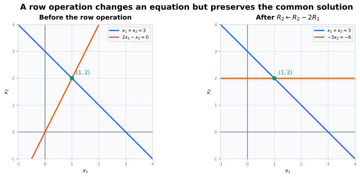
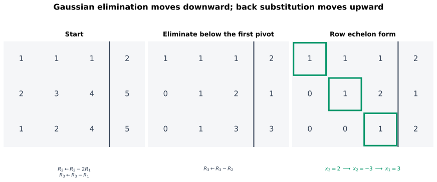
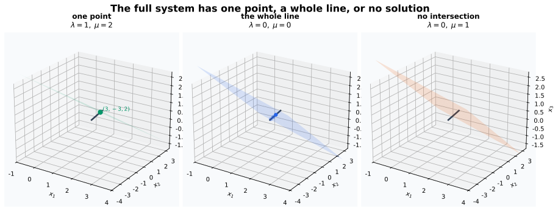
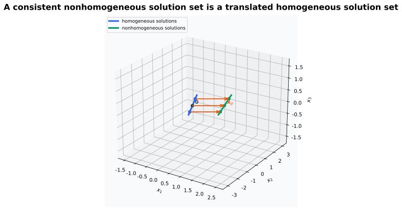

# 从上一页出发：把矩阵乘法反过来

上一页已经能够沿正向计算

$$
\mathbf{b}
=
\mathbf{A}\mathbf{x}.
$$

这一页把问题反过来：给定

$$
\mathbf{A}\in\mathbb{R}^{m\times n},
\qquad
\mathbf{b}\in\mathbb{R}^{m},
$$

怎样找出所有满足

$$
\mathbf{A}\mathbf{x}=\mathbf{b}
$$

的 $\mathbf{x}\in\mathbb{R}^{n}$？

这里还不能直接写

$$
\mathbf{x}=\mathbf{A}^{-1}\mathbf{b},
$$

因为：

- $\mathbf{A}$ 可能不是方阵；
- 即使 $\mathbf{A}$ 是方阵，也还不知道它是否可逆；
- 方程组可能没有解；
- 方程组也可能有不止一个解。

Gaussian 消元不预设矩阵可逆，而是通过不会改变解集的方程变形，把系统化到可以直接读出答案的形式。

# 本页要回答的问题

给定 $\mathbf{A}\mathbf{x}=\mathbf{b}$，核心问题是：**怎样不断简化方程，同时既不漏掉解，也不制造新解，直到全部解可以直接读出来？**

这条问题会依次逼出本页的概念：

$$
\text{先明确“全部解”是什么}
\longrightarrow
\text{定义同解变形}
\longrightarrow
\text{寻找可撤销的行操作}
\longrightarrow
\text{规定消元终点}
\longrightarrow
\text{从主元和自由变量读出三种情形}
\longrightarrow
\text{分离一个特解与齐次方向}.
$$

后面的定义不是待背诵的清单：解集用来说明什么必须保持不变，初等行变换提供合法的化简动作，阶梯形描述算法何时结束，齐次方程则解释无穷多个解为何沿固定方向延伸。

# 一般线性方程组

含 $n$ 个未知量 $x_1,\ldots,x_n$ 的一个实线性方程写为

$$
a_1x_1+\cdots+a_nx_n=b,
$$

其中

$$
a_1,\ldots,a_n,b\in\mathbb{R}.
$$

未知量只以一次幂出现，并且未知量之间没有乘积、除法、指数或其他非线性函数。例如

$$
2x_1-3x_2+x_3=5
$$

是线性方程，而

$$
x_1x_2=1,
\qquad
x_1^2+x_2=0,
\qquad
\sin x_1+x_2=0
$$

都不是线性方程。

由 $m$ 个方程组成、含 $n$ 个未知量的实线性方程组一般写为

$$
\begin{cases}
a_{11}x_1+\cdots+a_{1n}x_n=b_1,\\
a_{21}x_1+\cdots+a_{2n}x_n=b_2,\\
\qquad\vdots\\
a_{m1}x_1+\cdots+a_{mn}x_n=b_m.
\end{cases}
$$ {#eq-general-linear-system}

这里：

- $a_{ij}$ 是第 $i$ 个方程中 $x_j$ 的系数；
- $b_i$ 是第 $i$ 个方程的右端常数；
- 行索引 $i\in\{1,\ldots,m\}$ 枚举方程；
- 列索引 $j\in\{1,\ldots,n\}$ 枚举未知量。

## 解与解集

一个向量

$$
\mathbf{x}
=
\begin{bmatrix}
x_1\\
\vdots\\
x_n
\end{bmatrix}
\in\mathbb{R}^{n}
$$

称为方程组的一个**解**，如果把它的分量代入后，所有 $m$ 个方程都同时成立。

设系数矩阵与右端向量为

$$
\mathbf{A}
=
\begin{bmatrix}
a_{11}&\cdots&a_{1n}\\
\vdots&\ddots&\vdots\\
a_{m1}&\cdots&a_{mn}
\end{bmatrix}
\in\mathbb{R}^{m\times n},
\qquad
\mathbf{b}
=
\begin{bmatrix}
b_1\\
\vdots\\
b_m
\end{bmatrix}
\in\mathbb{R}^{m}.
$$

那么 @eq-general-linear-system 可以压缩为

$$
\mathbf{A}\mathbf{x}=\mathbf{b}.
$$ {#eq-linear-system-matrix-form}

解集定义为

$$
\mathcal{S}(\mathbf{A},\mathbf{b})
\coloneqq
\left\{
\mathbf{x}\in\mathbb{R}^{n}
\mathrel{\big|}
\mathbf{A}\mathbf{x}=\mathbf{b}
\right\}.
$$ {#eq-linear-system-solution-set}

方程组至少有一个解时称为**相容**或**有解**；没有任何解时称为**不相容**或**无解**。

## 增广矩阵

把右端向量附在系数矩阵右侧，得到增广矩阵

$$
[\mathbf{A}\mid\mathbf{b}]
=
\left[
\begin{array}{ccc|c}
a_{11}&\cdots&a_{1n}&b_1\\
\vdots&\ddots&\vdots&\vdots\\
a_{m1}&\cdots&a_{mn}&b_m
\end{array}
\right]
\in\mathbb{R}^{m\times(n+1)}.
$$ {#eq-augmented-matrix}

竖线只用于区分“左边是未知量系数，右边是常数项”，不是一种新的矩阵运算。增广列也不是第 $n+1$ 个未知量。

@fig-system-matrix-correspondence 取后文参数例的 $\lambda=1,\mu=2$ 分支，因此图中的 $\mathbf{x}=[3,-3,2]^{\mathsf T}$ 确实满足 $\mathbf{A}\mathbf{x}=\mathbf{b}$。

![同一个线性方程组可以写成逐行方程、矩阵方程 $\mathbf{A}\mathbf{x}=\mathbf{b}$ 或增广矩阵 $[\mathbf{A}\mid\mathbf{b}]$；三种记录包含相同信息。](../../images/linear-algebra/system-matrix-correspondence.svg){#fig-system-matrix-correspondence fig-alt="左侧是三个三元一次方程，中间是系数矩阵 A 乘实际解向量 x 等于右端向量 b，右侧是把 b 作为紫色增广列附到 A 后面的增广矩阵。" width="100%"}

# 几何上：解是约束的公共部分

当一个线性方程中至少有一个未知量系数非零时，它在 $\mathbb{R}^{2}$ 中表示一条直线，在 $\mathbb{R}^{3}$ 中表示一个平面，在 $\mathbb{R}^{n}$ 中表示一个高维线性约束面。若所有未知量系数都为零，则还要单独判断右端项：$0=0$ 的解是整个 $\mathbb{R}^{n}$，而 $0=b$、$b\neq0$ 的解集为空。

一个方程组要求所有方程同时成立，所以解集是这些约束集合的公共部分：

- 两条平面直线交于一点：唯一解；
- 两条不同平行直线没有交点：无解；
- 两个方程实际描述同一条直线：无穷多解。

高维中仍然使用同一逻辑，只是公共部分可能是点、直线、平面或更高维对象，也可能为空集。后面会用“子空间”“平移”和“维数”给这些现象正式命名；当前先从消元中观察它们。

低维图形能显示交点、重合与平行，却不能成为任意维度、任意规模系统的求解方法。要逐步化简约束，需要允许方程本身发生变化，同时确保它们的公共解完全不变。因此下一步不是立即规定操作，而是先明确什么叫“变了方程，却没有变答案”。

# 为了化简约束，先明确什么叫“同解”

两个线性方程组称为**等价**或**同解**，如果它们的解集完全相同。

若两个系统分别记为

$$
\mathbf{A}\mathbf{x}=\mathbf{b},
\qquad
\widetilde{\mathbf{A}}\mathbf{x}=\widetilde{\mathbf{b}},
$$

那么等价的意思是

$$
\mathcal{S}(\mathbf{A},\mathbf{b})
=
\mathcal{S}(\widetilde{\mathbf{A}},\widetilde{\mathbf{b}}).
$$

消元的目标不是让每一条原方程保持不动，而是把整个系统替换成更容易求解、但解集相同的新系统。

# 哪些变形既能化简，又能撤销

仅仅要求新方程由旧方程组合出来还不够：不可撤销的操作可能丢掉原约束。这里需要的是既能制造零、又能完整撤销的最基本操作。对方程组或增广矩阵的行，恰好使用以下三类初等行变换。

## 交换两行

$$
R_i\leftrightarrow R_j.
$$

这只改变方程排列顺序。

## 一行乘非零标量

$$
R_i\leftarrow cR_i,
\qquad
c\in\mathbb{R}\setminus\{0\}.
$$

必须要求 $c\neq0$。乘以零会丢失整条约束，无法恢复。

## 一行加上另一行的倍数

$$
R_i\leftarrow R_i+cR_j,
\qquad
i\neq j,
\quad
c\in\mathbb{R}.
$$

这会用两条方程的线性组合替换第 $i$ 条方程。

::: {.callout-important title="初等行变换保持解集"}
对一个线性方程组实施任意一次初等行变换，所得方程组与原方程组等价。
:::

## 为什么解集不变

- **交换行**可以再交换一次恢复；
- **非零倍乘**可以再乘 $1/c$ 恢复；
- **行倍加** $R_i\leftarrow R_i+cR_j$ 可以用 $R_i\leftarrow R_i-cR_j$ 恢复。

从正向看，若原方程全部成立，它们的线性组合也成立，所以原系统的每个解都是变换后系统的解。从反向看，每种操作都可以撤销，所以变换后系统的每个解也满足原系统。两个解集因此相同。$\square$

{#fig-row-operation-same-solution fig-alt="左图中直线 x1 加 x2 等于 3 与直线 2x1 减 x2 等于 0 交于点一二；右图把第二条方程替换成负 3x2 等于负 6 后，新的水平直线仍与第一条直线交于同一点。" width="100%"}

图中保持的是**两条方程的公共解**。被替换的第二条直线本身已经改变，因此“行变换不改变解”不能误读成“每条方程的几何对象都不变”。

::: {.callout-warning title="不要把行变换与列变换混在一起"}
行变换重新组合方程，保持关于同一组未知量 $x_1,\ldots,x_n$ 的解集。列变换会重新组合未知量坐标，一般会改变原变量的含义；若不同时记录变量替换，就不能把列变换当作普通消元步骤。
:::

到这里，行变换仍像一套作用在方程上的外部操作。为了把它接回上一页的矩阵乘法，并统一表示多步操作怎样复合、怎样撤销，还需要追问：**一次行变换本身能否由一个矩阵表示？**

# 初等矩阵：把行变换写成左乘

对 $m$ 阶单位矩阵 $\mathbf{I}_m$ 做一次初等行变换，得到的矩阵称为**初等矩阵**，记为 $\mathbf{E}$。

若把同一行变换作用于增广矩阵，则可以写成

$$
\mathbf{E}
[\mathbf{A}\mid\mathbf{b}]
=
[\mathbf{E}\mathbf{A}\mid\mathbf{E}\mathbf{b}].
$$ {#eq-elementary-left-multiplication}

例如三行系统中的

$$
R_2\leftarrow R_2-2R_1
$$

对应

$$
\mathbf{E}
=
\begin{bmatrix}
1&0&0\\
-2&1&0\\
0&0&1
\end{bmatrix}.
$$

左乘 $\mathbf{E}$ 时，第一、第三行保持不变，第二行正好变成原第二行减两倍原第一行。这是上一页矩阵乘法行视角的具体应用。

每种初等行变换都可撤销，因此对应的初等矩阵也有一个表示撤销操作的矩阵。本页不展开一般逆矩阵理论，只记录：合法初等行变换不会丢失信息。

若连续做多次行变换，就相当于连续左乘多个初等矩阵：

$$
\mathbf{E}_r\cdots\mathbf{E}_2\mathbf{E}_1
[\mathbf{A}\mid\mathbf{b}].
$$

矩阵乘法的顺序再次反映操作顺序：最右侧的 $\mathbf{E}_1$ 最先作用。

# 一个贯穿本页的参数方程组

考虑

$$
\begin{cases}
x_1+x_2+x_3=2,\\
2x_1+3x_2+4x_3=5,\\
x_1+2x_2+(3+\lambda)x_3=3+\mu,
\end{cases}
$$ {#eq-parameter-linear-system}

其中 $\lambda,\mu\in\mathbb{R}$。增广矩阵为

$$
\left[
\begin{array}{ccc|c}
1&1&1&2\\
2&3&4&5\\
1&2&3+\lambda&3+\mu
\end{array}
\right].
$$

先做

$$
R_2\leftarrow R_2-2R_1,
\qquad
R_3\leftarrow R_3-R_1,
$$

得到

$$
\left[
\begin{array}{ccc|c}
1&1&1&2\\
0&1&2&1\\
0&1&2+\lambda&1+\mu
\end{array}
\right].
$$

再做

$$
R_3\leftarrow R_3-R_2,
$$

得到

$$
\left[
\begin{array}{ccc|c}
1&1&1&2\\
0&1&2&1\\
0&0&\lambda&\mu
\end{array}
\right].
$$ {#eq-parameter-echelon-form}

最后一行压缩了整个分类问题：

$$
\lambda x_3=\mu.
$$

::: {.callout-warning title="不要在分类前除以参数"}
只有确认 $\lambda\neq0$ 后，才能除以 $\lambda$。若提前写 $x_3=\mu/\lambda$，就会非法丢掉 $\lambda=0$ 时的无穷多解与无解情形。
:::

在这个例子里，消元把全部判断压缩到最后一行。但对更大的系统，不能每次都凭外观说“已经消得差不多了”。需要一种统一语言，说明消元何时到达可读的终点、哪些位置真正约束变量、哪些变量仍可自由选择。

# 怎样描述消元的终点：阶梯形与主元

## 行阶梯形

一个矩阵称为**行阶梯形**（row echelon form，REF），如果满足：

1. 所有零行位于非零行下方；
2. 每个非零行的第一个非零元素，称为该行的**主元**；
3. 越往下，主元位置严格向右移动；
4. 每个主元下方的元素都为零。

主元所在的位置称为主元位置。对增广矩阵，需要区分：

- 系数部分中的主元列；
- 最右侧的增广列。

主元所在的未知量列对应**主元变量**；系数部分中没有主元的未知量列对应**自由变量**。

## 简化行阶梯形

行阶梯形进一步满足以下条件时，称为**简化行阶梯形**（reduced row echelon form，RREF）：

1. 每个主元都等于 $1$；
2. 每个主元是其所在列唯一的非零元素。

Gaussian 消元通常先得到 REF，再通过回代求解；Gauss–Jordan 消元则继续消去主元上方元素，直到得到 RREF。同一个矩阵可以经不同路线得到不同 REF；RREF 则是唯一的。RREF 唯一性的证明不影响当前求解流程，这里先记录结论，等后面整理行等价与子空间结构时再补证明。

::: {.callout-warning title="增广列中的主元不是主元变量"}
若出现

$$
\left[
\begin{array}{ccc|c}
0&\cdots&0&c
\end{array}
\right],
\qquad
c\neq0,
$$

它表示方程 $0=c$，也就是矛盾。增广列不对应未知量，不能把它当成新的主元变量。
:::

# Gaussian 消元算法

对一个有限增广矩阵，可以按以下步骤得到行阶梯形：

1. 从当前最左侧可能含非零元素的系数列开始；
2. 若当前行及下方在该列全部为零，跳到下一列；
3. 否则交换行，把一个非零元素放到当前主元位置；
4. 用主元行的倍数消去主元下方元素；
5. 向右、向下处理剩余子矩阵；
6. 得到 REF 后，从最后一个主元方程开始回代。

@fig-gaussian-elimination-steps 同样采用参数例的 $\lambda=1,\mu=2$ 分支。

{#fig-gaussian-elimination-steps fig-alt="三个增广矩阵依次展示初始矩阵、消去第一列下方元素后的矩阵和带三个绿色主元的阶梯形矩阵，底部标出行操作与从 x3 到 x1 的回代顺序。" width="100%"}

## 为什么算法一定会停

若当前待处理子矩阵全为零，已经完成。否则选择其中最左侧含非零元素的列，把一个非零元素换到当前首行，并消去它下方元素。这样固定了一个主元行，下一轮只处理更小的右下子矩阵。

每一轮都会把主元搜索位置至少向右或向下推进，而矩阵只有有限行和有限列，所以过程经过有限步后必定终止。$\square$

这说明每个有限矩阵都能通过初等行变换化为某个行阶梯形。不同合法消元路线的中间矩阵可能不同，但它们都与原系统同解。

# 解的三种情形与消元判别准则

::: {.callout-important title="消元判别准则（操作性）"}
一个实线性方程组化为行阶梯形后：

1. 出现矛盾行 $[0\ \cdots\ 0\mid c]$、$c\neq0$：无解；
2. 没有矛盾行，并且每个未知量列都有主元：唯一解；
3. 没有矛盾行，但至少有一个自由变量：无穷多解。
:::

## 为什么只有这三种情形

若存在矛盾行，它表示 $0=c$，任何未知量取值都不可能满足，因此无解。

若没有矛盾行，可以先给自由变量任意实数值，再从最下面的主元行开始回代。每个主元非零，所以对应主元变量会被已经确定的自由变量和后续主元变量唯一决定。

- 没有自由变量时，没有任意参数可选，因此只有一个解；
- 至少有一个自由变量时，它可以在 $\mathbb{R}$ 中任意取值，不同参数值产生不同解，因此有无穷多解。

“有自由变量就有无穷多解”这里使用了标量属于无限集合 $\mathbb{R}$。若以后改在有限域上讨论，只能直接推出“有多个解”，不能沿用“无穷多”。

这已经是完整的**消元判别准则**：把增广矩阵化为阶梯形，就能根据矛盾行与主元位置判断解的情况。但它仍是算法形式的判别。后面定义行列式、子式和秩后，可以把它压缩成更结构化的判别准则，并证明两种说法等价。

# 参数例子的三个分支

回到 @eq-parameter-echelon-form。

## 情形一：$\lambda\neq0$，唯一解

第三行给出

$$
x_3
=
\frac{\mu}{\lambda}.
$$

向上回代：

$$
x_2
=
1-\frac{2\mu}{\lambda},
\qquad
x_1
=
1+\frac{\mu}{\lambda}.
$$

所以唯一解是

$$
\mathbf{x}
=
\begin{bmatrix}
1+\mu/\lambda\\
1-2\mu/\lambda\\
\mu/\lambda
\end{bmatrix}.
$$

取

$$
\lambda=1,
\qquad
\mu=2,
$$

得到

$$
\mathbf{x}
=
\begin{bmatrix}
3\\-3\\2
\end{bmatrix}.
$$

## 情形二：$\lambda=0$、$\mu=0$，无穷多解

最后一行变成 $0=0$，没有提供新约束。令自由变量

$$
x_3=\tau,
\qquad
\tau\in\mathbb{R},
$$

则

$$
x_2=1-2\tau,
\qquad
x_1=1+\tau.
$$

全部解写成参数形式：

$$
\mathbf{x}
=
\begin{bmatrix}
1\\1\\0
\end{bmatrix}
+
\tau
\begin{bmatrix}
1\\-2\\1
\end{bmatrix},
\qquad
\tau\in\mathbb{R}.
$$ {#eq-parameter-infinite-solutions}

这里 $x_1,x_2$ 是主元变量，$x_3$ 是自由变量。

## 情形三：$\lambda=0$、$\mu\neq0$，无解

最后一行变成

$$
0=\mu.
$$

因为 $\mu\neq0$，这是矛盾。取 $\mu=1$ 时就是 $0=1$，因此

$$
\mathcal{S}=\varnothing.
$$

## 三种情形的统一几何解释

前两个方程的公共解是一条直线

$$
\mathbf{x}
=
\begin{bmatrix}
1\\1\\0
\end{bmatrix}
+
\tau
\begin{bmatrix}
1\\-2\\1
\end{bmatrix}.
$$

把它代入第三个方程，恰好得到

$$
\lambda\tau=\mu.
$$

因此：

- $\lambda\neq0$：直线与第三个平面交于一个点；
- $\lambda=0,\mu=0$：整条直线都位于第三个平面内；
- $\lambda=0,\mu\neq0$：直线与第三个平面平行且不相交。

{#fig-parameter-system-outcomes fig-alt="三个三维小图分别显示黑色直线与绿色平面交于点三负三二、黑色直线完全位于蓝色平面中，以及黑色直线与橙色平面平行不相交。" width="100%"}

消元已经把答案分成零个、一个或无穷多个，但“有多少个”还没有解释无穷多个解为什么沿某些固定方向延伸。在上面的直线参数式中，$[1,-2,1]^{\mathsf T}$ 决定了移动方向，而 $[1,1,0]^{\mathsf T}$ 只决定直线放在哪里。为了把**解的位置**和**解之间允许移动的方向**分开，可以先把右端归零。

# 把位置与方向分开：齐次方程组

右端向量为零的系统

$$
\mathbf{A}\mathbf{h}=\mathbf{0}
$$

称为与 $\mathbf{A}$ 相关的**齐次线性方程组**。一般的

$$
\mathbf{A}\mathbf{x}=\mathbf{b}
$$

在 $\mathbf{b}\neq\mathbf{0}$ 时称为非齐次方程组。

齐次方程组永远至少有一个解：

$$
\mathbf{h}=\mathbf{0},
$$

称为零解或平凡解。齐次方程组是否还有非零解，要看消元后是否出现自由变量。

## 齐次解对线性组合封闭

若

$$
\mathbf{A}\mathbf{h}_1=\mathbf{0},
\qquad
\mathbf{A}\mathbf{h}_2=\mathbf{0},
$$

那么对任意 $\alpha,\beta\in\mathbb{R}$：

$$
\begin{aligned}
\mathbf{A}(\alpha\mathbf{h}_1+\beta\mathbf{h}_2)
&=
\alpha\mathbf{A}\mathbf{h}_1
+
\beta\mathbf{A}\mathbf{h}_2\\
&=
\mathbf{0}.
\end{aligned}
$$

所以齐次解不只是零散答案：任意两个齐次解的线性组合仍然是齐次解。等后面正式定义向量空间与子空间时，这会成为一个核心例子。

齐次解给出了“不改变右端 $\mathbf{b}$ 的移动方向”。那么，如果 $\mathbf{x}_1$ 与 $\mathbf{x}_2$ 都满足同一个非齐次方程，它们之差会发生什么？

$$
\mathbf{A}(\mathbf{x}_1-\mathbf{x}_2)
=
\mathbf{b}-\mathbf{b}
=
\mathbf{0}.
$$

所以任意两个非齐次解之间的差都是齐次解。这个观察说明：只要先找到一个解，其余解不必重新逐个寻找。

# 找到一个解以后，其他解从哪里来

设 $\mathbf{x}_p$ 是非齐次方程组

$$
\mathbf{A}\mathbf{x}=\mathbf{b}
$$

的一个特解，即

$$
\mathbf{A}\mathbf{x}_p=\mathbf{b}.
$$

再记齐次解集合为

$$
\mathcal{S}_0
=
\left\{
\mathbf{h}\in\mathbb{R}^{n}
\mathrel{\big|}
\mathbf{A}\mathbf{h}=\mathbf{0}
\right\}.
$$

那么非齐次方程组的全部解是

$$
\mathcal{S}(\mathbf{A},\mathbf{b})
=
\left\{
\mathbf{x}_p+
\mathbf{h}
\mathrel{\big|}
\mathbf{h}\in\mathcal{S}_0
\right\}.
$$ {#eq-particular-plus-homogeneous}

## 证明

若 $\mathbf{h}\in\mathcal{S}_0$，则

$$
\begin{aligned}
\mathbf{A}(\mathbf{x}_p+\mathbf{h})
&=
\mathbf{A}\mathbf{x}_p
+
\mathbf{A}\mathbf{h}\\
&=
\mathbf{b}+\mathbf{0}\\
&=
\mathbf{b}.
\end{aligned}
$$

所以“特解加齐次解”一定是非齐次解。

反过来，若 $\mathbf{x}$ 是任意一个非齐次解，则

$$
\begin{aligned}
\mathbf{A}(\mathbf{x}-\mathbf{x}_p)
&=
\mathbf{A}\mathbf{x}
-
\mathbf{A}\mathbf{x}_p\\
&=
\mathbf{b}-\mathbf{b}\\
&=
\mathbf{0}.
\end{aligned}
$$

因此 $\mathbf{x}-\mathbf{x}_p\in\mathcal{S}_0$，也就是

$$
\mathbf{x}
=
\mathbf{x}_p+
\mathbf{h}
$$

对某个齐次解 $\mathbf{h}$ 成立。$\square$

{#fig-affine-solution-translation fig-alt="三维坐标系中有两条平行直线，蓝色齐次解线经过原点，绿色非齐次解线经过特解 xp，三支相同的橙色箭头把蓝线上的对应点平移到绿线上。" width="92%"}

这里可以直观地说“非齐次解集是齐次解集的一次平移”。等定义子空间和仿射空间后，再补上正式术语。

# NumPy 核对

## 复现手算行变换

```{python}
#| label: lst-linear-system-elimination
#| echo: true

import numpy as np

augmented = np.array(
    [
        [1.0, 1.0, 1.0, 2.0],
        [2.0, 3.0, 4.0, 5.0],
        [1.0, 2.0, 4.0, 5.0],
    ]
)

step_one = augmented.copy()
step_one[1] = step_one[1] - 2.0 * step_one[0]
step_one[2] = step_one[2] - step_one[0]

step_two = step_one.copy()
step_two[2] = step_two[2] - step_two[1]

expected_echelon = np.array(
    [
        [1.0, 1.0, 1.0, 2.0],
        [0.0, 1.0, 2.0, 1.0],
        [0.0, 0.0, 1.0, 2.0],
    ]
)

np.testing.assert_allclose(step_two, expected_echelon)
print(step_two)
```

## 唯一解与无穷多解样本

```{python}
def parameter_system(lambda_value: float, mu_value: float) -> tuple[np.ndarray, np.ndarray]:
    A = np.array(
        [
            [1.0, 1.0, 1.0],
            [2.0, 3.0, 4.0],
            [1.0, 2.0, 3.0 + lambda_value],
        ]
    )
    b = np.array([2.0, 5.0, 3.0 + mu_value])
    return A, b

A_unique, b_unique = parameter_system(1.0, 2.0)
x_unique = np.linalg.solve(A_unique, b_unique)
np.testing.assert_allclose(x_unique, [3.0, -3.0, 2.0])

A_many, b_many = parameter_system(0.0, 0.0)
particular = np.array([1.0, 1.0, 0.0])
direction = np.array([1.0, -2.0, 1.0])
for tau in (-2.0, 0.0, 1.5):
    np.testing.assert_allclose(A_many @ (particular + tau * direction), b_many)

print("唯一解：", x_unique)
print("无穷多解样本验证通过；无解分支将在下一段由分类器检查。")
```

`np.linalg.solve` 面向方阵且有唯一解的情况。它不负责返回无穷多个解，也不能把无解系统变成有解系统。

## 一个教学用的阶梯形与分类函数

```{python}
def row_echelon(augmented_matrix: np.ndarray, tolerance: float = 1e-12):
    if augmented_matrix.ndim != 2 or augmented_matrix.shape[1] < 2:
        raise ValueError("augmented_matrix 必须是至少含两列的二维数组")
    if not np.isfinite(tolerance) or tolerance <= 0:
        raise ValueError("tolerance 必须是有限正数")
    if not np.all(np.isfinite(augmented_matrix)):
        raise ValueError("augmented_matrix 必须只含有限数值")

    matrix = augmented_matrix.astype(float).copy()
    row_count, column_count = matrix.shape
    variable_count = column_count - 1
    pivot_columns: list[int] = []
    pivot_row = 0

    # 连增广列也一起处理，确保矛盾行位于零行上方，整个增广矩阵满足 REF 条件。
    for column in range(column_count):
        if pivot_row >= row_count:
            break

        candidates = np.abs(matrix[pivot_row:, column])
        selected_row = pivot_row + int(np.argmax(candidates))
        if abs(matrix[selected_row, column]) <= tolerance:
            continue

        matrix[[pivot_row, selected_row]] = matrix[[selected_row, pivot_row]]
        for row in range(pivot_row + 1, row_count):
            factor = matrix[row, column] / matrix[pivot_row, column]
            matrix[row] -= factor * matrix[pivot_row]

        matrix[np.abs(matrix) <= tolerance] = 0.0
        if column < variable_count:
            pivot_columns.append(column)
        pivot_row += 1

    return matrix, pivot_columns


def classify_echelon(echelon: np.ndarray, pivot_columns: list[int], tolerance: float = 1e-12):
    if echelon.ndim != 2 or echelon.shape[1] < 2:
        raise ValueError("echelon 必须是增广矩阵")
    if not np.isfinite(tolerance) or tolerance <= 0:
        raise ValueError("tolerance 必须是有限正数")

    variable_count = echelon.shape[1] - 1
    if pivot_columns != sorted(set(pivot_columns)):
        raise ValueError("pivot_columns 必须严格递增且不能重复")
    if any(column < 0 or column >= variable_count for column in pivot_columns):
        raise ValueError("pivot_columns 只能引用系数列")

    coefficient = echelon[:, :-1]
    rhs = echelon[:, -1]
    contradictory = np.any(
        np.all(np.abs(coefficient) <= tolerance, axis=1)
        & (np.abs(rhs) > tolerance)
    )
    if contradictory:
        return "no solution"
    if len(pivot_columns) == variable_count:
        return "unique solution"
    return "infinitely many solutions"

for lambda_value, mu_value in ((1.0, 2.0), (0.0, 0.0), (0.0, 1.0)):
    A_case, b_case = parameter_system(lambda_value, mu_value)
    echelon, pivots = row_echelon(np.column_stack((A_case, b_case)))
    print((lambda_value, mu_value), classify_echelon(echelon, pivots))

edge_case = np.array(
    [
        [0.0, 0.0, 0.0],
        [0.0, 0.0, 1.0],
    ]
)
edge_echelon, edge_pivots = row_echelon(edge_case)
np.testing.assert_allclose(edge_echelon[0], [0.0, 0.0, 1.0])
np.testing.assert_allclose(edge_echelon[1], [0.0, 0.0, 0.0])
assert classify_echelon(edge_echelon, edge_pivots) == "no solution"
```

这两个函数是为了把定义翻译成代码，不是要替代成熟数值库。它们分类的是**在同一个给定容差下解释的浮点系统**，不是精确实数定理的机器判定器；`row_echelon` 与 `classify_echelon` 必须使用同一容差。代码加入了绝对值最大的候选主元选择，但仍没有处理尺度、自适应容差、条件数和稀疏结构等实际问题。例如精确非零但小于容差的 $\lambda$ 可能被数值代码视为零，这不与“精确代数中 $\lambda\neq0$ 时唯一解”的定理矛盾。

也可以在项目根目录运行更完整的独立核对：

```bash
python code/linear_systems.py
```

# 精确代数与浮点消元

纸面推导默认实数运算精确，因此一个数要么等于零，要么不等于零。浮点计算中则需要额外谨慎：

- 很小的非零数可能来自舍入误差，也可能是真实的小主元；
- 直接用很小的主元做除法会放大误差；
- 实际 Gaussian 消元通常会选择当前列中绝对值较大的主元，例如部分选主元；
- “是否为零”需要结合容差与数据尺度判断；
- 病态系统中，输入的微小扰动可能导致解大幅变化。

参数例子已经给出一个预告。若

$$
\lambda=10^{-8},
\qquad
\mu=1,
$$

则唯一解包含

$$
x_3=10^{8},
\qquad
x_2=-199999999,
\qquad
x_1=100000001.
$$

系统仍有唯一精确解，但解对参数变化非常敏感。“代数上唯一”与“数值上稳定”不是同一件事；条件数会在后续专门整理。

::: {.callout-warning title="最小二乘不会改变原系统是否有精确解"}
`np.linalg.lstsq` 可以在无精确解时返回残差最小的近似解，但这个近似解不属于原方程组的解集。不能用最小二乘结果掩盖“原系统无解”这一代数事实。
:::

# 与机器学习问题的连接

线性方程组不是 Transformer 前向传播的主要计算形式，但它在机器学习中仍然直接出现：

- 线性回归的精确拟合或最小二乘推导；
- 为隐藏表示拟合线性 probe 或 readout；
- 约束优化中的线性等式约束；
- 局部二阶方法和隐式层中的线性求解；
- 参数估计、校准和多模态线性对齐。

这些问题经常是长方形系统：方程数与未知量数不相等。Gaussian 消元提供精确代数基线，但大规模实现通常使用针对结构和数值稳定性设计的分解或迭代算法，而不是显式手写行操作。

# 学习来源备忘

这一页的组织方式重点参考丘维声老师高等代数路线中“先从线性方程组的矩阵消元法进入，再逐步抽象解结构”的思路 [@qiuAdvancedAlgebraCourse]。截至本次整理，第三方检索结果中可以明确看到“习题 1.1：解线性方程组的矩阵消元法”和后续“齐次线性方程组的解集的结构”等条目；但当前引用仍只是转载检索入口，不是官方课程页面，也不足以支持精确页码或逐句归因。

| 可复核的路线线索 | 这页笔记中的对应内容 |
|---|---|
| 从“解线性方程组的矩阵消元法”开始 | 同解变形、增广矩阵、Gaussian 消元、REF 与回代 |
| 从具体求解归纳解的情况 | 矛盾行、主元变量、自由变量与三种解情形 |
| 后续讨论齐次解集结构 | 本页先证明线性组合封闭，以及“特解加齐次解”；正式子空间结构留到后页 |
| 本项目额外需要的工程连接 | shape、NumPy、部分选主元、容差与最小二乘边界 |

这里同时用 Strang 的行图景、列图景和方程组视角核对矩阵解释 [@strang2023linear]，并参考 Boyd 与 Vandenberghe 对应用线性方程、数值计算和最小二乘边界的组织 [@boyd2018applied]。

因此，这里是对丘维声路线的可核对学习整理，不是课程逐字转写；概念顺序还结合了前几页已经建立的矩阵乘法、shape 和 NumPy 依赖。

# 容易混淆、需要反复检查的地方

1. 解必须同时满足全部方程，不是只满足其中一条。
2. 增广列是右端项，不是新的未知量列。
3. 等价方程组要求解集完全相同。
4. 行倍乘只能乘非零标量。
5. 行变换保持整个系统的公共解，不保持每条单独方程不变。
6. 列变换会改变未知量坐标，不能与行消元混用。
7. 增广列中出现主元意味着矛盾，不对应主元变量。
8. 参数可能为零时，不能提前除以参数。
9. 没有矛盾行时，自由变量可以任意指定，主元变量再由回代确定。
10. 齐次方程组总有零解，但不一定只有零解。
11. 非齐次通解是一个特解加全部齐次解，前提是非齐次系统至少有一个特解。
12. `np.linalg.solve` 只适合方阵唯一解问题。
13. `np.linalg.lstsq` 给出的近似解不等于原无解系统突然有了解。
14. 浮点数中的“近似零”需要容差、尺度和稳定性判断。
15. 本页尚未正式定义秩、核、像、子空间和维数，不应提前用这些术语替代消元观察。

# 自检

1. 写出一般 $m$ 个方程、$n$ 个未知量的线性方程组，并说明 $a_{ij}$ 的两个下标分别表示什么。
2. 把
   $$
   \begin{cases}
   x_1-2x_2=3,\\
   4x_1+x_2=-1
   \end{cases}
   $$
   写成 $\mathbf{A}\mathbf{x}=\mathbf{b}$ 和增广矩阵。
3. 用解集相等的语言定义等价方程组。
4. 分别写出三类初等行变换，并说明为什么行倍乘要求标量非零。
5. 证明 $R_i\leftarrow R_i+cR_j$ 不改变解集。
6. 对一个三行增广矩阵，说明怎样构造交换第一、第三行的初等矩阵。
7. 判断
   $$
   \begin{bmatrix}
   1&2&0\\
   0&1&3\\
   0&0&0
   \end{bmatrix},
   \qquad
   \begin{bmatrix}
   1&0&-6\\
   0&1&3\\
   0&0&0
   \end{bmatrix}
   $$
   中哪个只是 REF，哪个同时是 RREF，并说明理由。
8. 解释 Gaussian 消元与 Gauss–Jordan 消元的区别。
9. 从 @eq-parameter-echelon-form 出发，完整推导 $\lambda\neq0$ 时的唯一解。
10. 解释为什么 $\lambda=0,\mu=0$ 时 $x_3$ 是自由变量。
11. 解释矛盾行 $[0\ 0\ 0\mid1]$ 为什么意味着无解。
12. 验证 @eq-parameter-infinite-solutions 中任意 $\tau$ 都满足原方程组。
13. 证明齐次解的任意线性组合仍是齐次解。
14. 证明 @eq-particular-plus-homogeneous 的两个包含方向。
15. 给出一个二维方程组，使它分别具有唯一解、无解和无穷多解。
16. 为什么不能用 `np.linalg.lstsq` 的输出证明原系统有精确解？
17. 当消元主元非常小时，为什么交换行可能改善数值计算？
18. 在参数例子中，$\lambda$ 很小时为什么解可能很大？

# 小结

线性方程组把多个线性约束同时施加在同一未知向量上。方程组、矩阵方程 $\mathbf{A}\mathbf{x}=\mathbf{b}$ 和增广矩阵记录相同信息；三类初等行变换通过可逆的方程重组保持解集。Gaussian 消元把系统化为行阶梯形，再由矛盾行、主元变量和自由变量判断无解、唯一解或无穷多解。齐次方程组总有零解，并且齐次解对线性组合封闭；一旦非齐次系统有一个特解，其全部解就是该特解加全部齐次解。

# 后续方向：消元为什么会逼出行列式

Gaussian 消元已经给出解的三种情形和一个可执行判别准则，但每次判定仍要实际完成消元。

前面的齐次解结构把方阵的唯一性问题换了一种说法：如果存在非零 $\mathbf{h}$ 满足 $\mathbf{A}\mathbf{h}=\mathbf{0}$，那么一旦 $\mathbf{x}$ 是 $\mathbf{A}\mathbf{x}=\mathbf{b}$ 的解，$\mathbf{x}+\mathbf{h}$ 也是同一个方程的解；唯一性立即失效。于是“是否有唯一解”可以转化为“是否存在非零齐次方向”。

但目前检查非零齐次方向，仍然只能看消元后是否出现自由变量。对一个 $n\times n$ 方阵，这又等价于每一列最终是否都有主元。消元会把矩阵变成上三角形，此时主元位于对角线上。于是自然需要一个标量，同时记录“所有主元都存在”和“没有非零齐次方向”。它应当：

- 在上三角形时等于对角元素的乘积；
- 某行乘标量时按同样倍数变化；
- 某行加另一行的倍数时保持不变；
- 交换两行时只改变符号；
- 恰好在某个主元消失时变成零。

这个标量就是行列式。但要给一般 $n$ 阶行列式写出统一公式，需要从每一行、每一列各选一个元素。所有合法选法由**排列**编码；交换顺序带来的正负号则由**逆序对、逆序数和排列的奇偶性**编码。因此下一步不是凭空插入一个公式，而是沿下面的依赖继续：

$$
\text{消元中的主元}
\longrightarrow
\text{排列、逆序对与逆序数}
\longrightarrow
\text{行列式}
\longrightarrow
\text{行列式与方阵方程组}
\longrightarrow
\text{子式与秩}
\longrightarrow
\text{一般方程组的秩判别准则}
\longrightarrow
\text{线性空间}.
$$

行列式只能直接判别方阵是否具有唯一解；当行列式为零时，它不能单独区分“无解”和“无穷多解”，长方形系统也没有同样的行列式。这会进一步引出子式和秩。等一般方程组的有解判据、自由变量数量和齐次解结构都写清楚后，再进入向量空间、基与维数会更自然。

# 参考资料

::: {#refs}
:::
