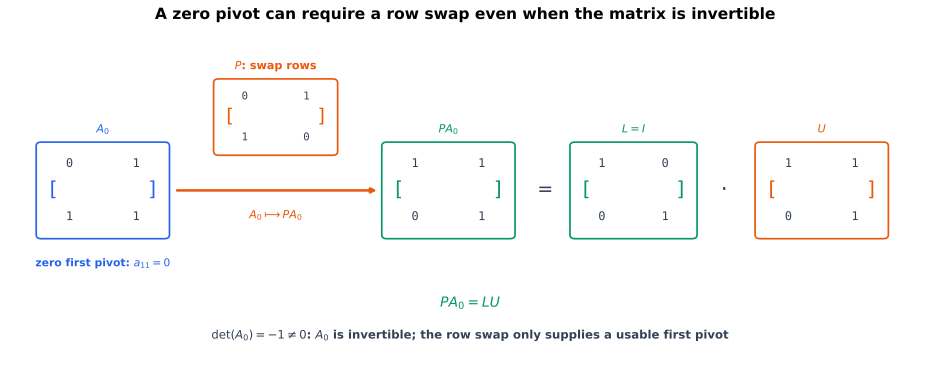

# 消元能走多远，记录又为什么成立

消元把矩阵变成上三角形，但这还留下三个需要证明的问题：逆消元的乘积为什么恰好保存原来的乘子；不交换行时，哪些矩阵能完成分解；允许换行后，奇异矩阵是否也有分解。

[LU、PLU 与三角求解](lu-plu-factorization-and-triangular-solves.qmd)用行重建解释分解的含义。逆消元乘子公式、三角因子的唯一性和一般 PLU 的块构造只需要矩阵乘法、消元与[逆矩阵](elimination-inverses-and-invertibility.qmd)。顺序主子式判据及行列式计算公式另用到[行列式的行变换规则](permutations-inversions-and-determinants.qmd)和[乘法性](determinant-multiplicativity-cofactors-and-invariants.qmd)。

## 记号与约定

所有矩阵均为实矩阵。LU 指 $\mathbf A=\mathbf L\mathbf U$，其中 $\mathbf L$ 是单位下三角矩阵，$\mathbf U$ 是上三角矩阵。允许行交换时使用 $\mathbf P\mathbf A=\mathbf L\mathbf U$。排列矩阵是重排单位矩阵各行得到的矩阵；左乘它会作同样的行排列，其逆为转置。这些约定本身不要求 $\mathbf A$ 可逆。

$\mathbf e_k$ 表示第 $k$ 个标准基列向量，$\mathbf I$ 表示相应阶数的单位矩阵。外积 $\mathbf v\mathbf e_k^{\mathsf T}$ 只有第 $k$ 列可能非零，该列就是 $\mathbf v$。

# 从初等消元矩阵得到 LU {#sec-lu-elimination-proof}

先用一个不换行的三阶例子核对次序：

$$
\mathbf A=\begin{bmatrix}2&1&1\\4&-6&0\\-2&7&2\end{bmatrix},
\qquad
\mathbf U=\begin{bmatrix}2&1&1\\0&-8&-2\\0&0&1\end{bmatrix}.
$$

第一列消元使用乘子 $2,-1$，第二列使用乘子 $-1$。目标是证明重建矩阵为

$$
\mathbf L=\begin{bmatrix}1&0&0\\2&1&0\\-1&-1&1\end{bmatrix}.
$$

## 按相反的作用顺序撤销消元

每次把主元下方元素消成零，都可以写成一个初等矩阵左乘。以下写出三次消元对应的矩阵。

对上面的三阶例子，第一步

$$
R_2\leftarrow R_2-2R_1
$$

对应

$$
\mathbf E_{21}
=
\begin{bmatrix}
1&0&0\\
-2&1&0\\
0&0&1
\end{bmatrix}.
$$

第二步

$$
R_3\leftarrow R_3-(-1)R_1
$$

对应

$$
\mathbf E_{31}
=
\begin{bmatrix}
1&0&0\\
0&1&0\\
1&0&1
\end{bmatrix}.
$$

第三步

$$
R_3\leftarrow R_3-(-1)R_2
$$

对应

$$
\mathbf E_{32}
=
\begin{bmatrix}
1&0&0\\
0&1&0\\
0&1&1
\end{bmatrix}.
$$

按照实际作用顺序，

$$
\mathbf E_{32}\mathbf E_{31}\mathbf E_{21}\mathbf A
=\mathbf U.
$$ {#eq-elimination-matrices-to-u}

每个消元矩阵都可逆。撤销

$$
R_i\leftarrow R_i-m_{ik}R_k
$$

只需执行

$$
R_i\leftarrow R_i+m_{ik}R_k.
$$

因此

$$
\mathbf E_{ik}^{-1}
$$

与 $\mathbf E_{ik}$ 只有对应位置的符号相反。

在 @eq-elimination-matrices-to-u 两侧从左依次乘逆矩阵：

$$
\begin{aligned}
\mathbf A
&=
\mathbf E_{21}^{-1}
\mathbf E_{31}^{-1}
\mathbf E_{32}^{-1}
\mathbf U.
\end{aligned}
$$

定义

$$
\mathbf L
\coloneqq
\mathbf E_{21}^{-1}
\mathbf E_{31}^{-1}
\mathbf E_{32}^{-1},
$$

就得到

$$
\mathbf A=\mathbf L\mathbf U.
$$

在本例中，

$$
\mathbf E_{21}^{-1}
=
\begin{bmatrix}
1&0&0\\
2&1&0\\
0&0&1
\end{bmatrix},
$$

$$
\mathbf E_{31}^{-1}
=
\begin{bmatrix}
1&0&0\\
0&1&0\\
-1&0&1
\end{bmatrix},
$$

以及

$$
\mathbf E_{32}^{-1}
=
\begin{bmatrix}
1&0&0\\
0&1&0\\
0&-1&1
\end{bmatrix}.
$$

相乘得到本节开头列出的 $\mathbf L$，从而核对了 $\mathbf A=\mathbf L\mathbf U$。

## 为什么 $\mathbf L$ 一定是单位下三角矩阵

每个逆消元矩阵都是单位下三角矩阵：

- 主对角线全为 $1$；
- 主对角线上方全为 $0$；
- 只有主对角线下方某个位置可能多出一个乘子。

两个单位下三角矩阵的乘积仍是单位下三角矩阵。设 $\mathbf L_1,\mathbf L_2$ 都是单位下三角矩阵。

当 $i<j$ 时，

$$
(\mathbf L_1\mathbf L_2)_{ij}
=
\sum_{k=1}^{n}(L_1)_{ik}(L_2)_{kj}.
$$

若某项可能非零，第一因子要求 $k\le i$，第二因子要求 $j\le k$，合起来得到

$$
j\le k\le i,
$$

这与 $i<j$ 矛盾，所以主对角线上方仍全为零。

当 $i=j$ 时，只有 $k=i$ 的项可能非零，因此

$$
(\mathbf L_1\mathbf L_2)_{ii}
=(L_1)_{ii}(L_2)_{ii}=1.
$$

所以单位下三角矩阵对乘法封闭。由此，所有逆消元矩阵的乘积 $\mathbf L$ 仍是单位下三角矩阵。

## 为什么 $\mathbf L$ 中保存的正是消元乘子 {#sec-lu-multiplier-proof}

先假设无换行消元的前 $n-1$ 个主元都非零。标准 Gaussian 消元按列从左到右推进。记 $a_{ij}^{(k)}$ 为第 $k$ 步开始时工作矩阵第 $(i,j)$ 个元素。在第 $k$ 列，使用乘子

$$
m_{ik}
=
\frac{a_{ik}^{(k)}}{a_{kk}^{(k)}},
\qquad i>k,
$$ {#eq-elimination-multiplier}

并做

$$
R_i\leftarrow R_i-m_{ik}R_k.
$$

把第 $k$ 列下方的全部乘子收集成向量

$$
\mathbf m^{(k)}
=
\begin{bmatrix}
0&\cdots&0&m_{k+1,k}&\cdots&m_{n,k}
\end{bmatrix}^{\mathsf T}.
$$

它的前 $k$ 个分量为零。整列消元可以写成

$$
\mathbf E_k
=
\mathbf I-
\mathbf m^{(k)}\mathbf e_k^{\mathsf T}.
$$

因为

$$
\mathbf e_k^{\mathsf T}\mathbf m^{(k)}=0,
$$

直接相乘可得

$$
\mathbf E_k^{-1}
=
\mathbf I+
\mathbf m^{(k)}\mathbf e_k^{\mathsf T}.
$$

所有列依次消元后，

$$
\mathbf U
=
\mathbf E_{n-1}\cdots\mathbf E_2\mathbf E_1\mathbf A,
$$

所以

$$
\mathbf L
=
\mathbf E_1^{-1}\mathbf E_2^{-1}\cdots\mathbf E_{n-1}^{-1}.
$$

还需检查这些逆矩阵相乘时不会产生额外交叉项。若 $p<q$，则 $\mathbf m^{(q)}$ 的前 $q$ 个分量为零，特别有

$$
\mathbf e_p^{\mathsf T}\mathbf m^{(q)}=0.
$$

因此

$$
\left(
\mathbf m^{(p)}\mathbf e_p^{\mathsf T}
\right)
\left(
\mathbf m^{(q)}\mathbf e_q^{\mathsf T}
\right)
=
\mathbf 0.
$$

按 $1,2,\ldots,n-1$ 的顺序展开乘积，所有这样的交叉项都为零，于是

$$
\mathbf L
=
\mathbf I+
\sum_{k=1}^{n-1}
\mathbf m^{(k)}\mathbf e_k^{\mathsf T}.
$$

第 $k$ 个秩至多为一的外积项只把 $\mathbf m^{(k)}$ 放入 $\mathbf L$ 的第 $k$ 列，所以

$$
\boxed{
L_{ik}=m_{ik},
\qquad i>k
}.
$$

因此实现 LU 时不必显式形成所有初等矩阵：可以在工作数组的上三角部分保存 $\mathbf U$，在严格下三角部分原地保存 $\mathbf L$ 的乘子，并把 $\mathbf L$ 的主对角线理解为隐含的 $1$。

::: {.callout-warning title="消元矩阵与 L 中的符号相反"}
执行消元的初等矩阵在 $(i,k)$ 位置放的是 $-m_{ik}$，因为它实施

$$
R_i\leftarrow R_i-m_{ik}R_k.
$$

而 $\mathbf L$ 来自这些消元矩阵的逆，所以 $L_{ik}=m_{ik}$。漏掉这次取逆，会把 $\mathbf L$ 的符号全部写反。
:::

# 无换行 LU 什么时候存在且唯一 {#sec-lu-existence-proof}

前面的乘子公式以消元能够继续为前提。要判断这一前提，必须检查逐步出现的主元，而不是只检查整个矩阵的行列式。顺序主子式把这些逐步条件写成了原矩阵本身的性质。

对方阵 $\mathbf A\in\mathbb R^{n\times n}$，记左上角 $k\times k$ 方块为

$$
\mathbf A_{1:k,1:k}.
$$

它称为第 $k$ 阶**顺序主子矩阵**；其行列式称为第 $k$ 阶顺序主子式。

## 存在唯一性定理

::: {.callout-important title="无换行 LU 的判据"}
设 $\mathbf A\in\mathbb R^{n\times n}$ 非奇异。则以下条件等价：

1. $\mathbf A$ 存在分解
   $$
   \mathbf A=\mathbf L\mathbf U,
   $$
   其中 $\mathbf L$ 是单位下三角矩阵，$\mathbf U$ 是上三角矩阵；
2. 前 $n-1$ 个顺序主子式都非零：
   $$
   \det(\mathbf A_{1:k,1:k})\neq0,
   \qquad
   k=1,\ldots,n-1.
   $$

第 $n$ 阶顺序主子式就是 $\det(\mathbf A)$，已由非奇异假设保证非零。满足这些条件时，分解唯一。
:::

## 从 LU 推出顺序主子式非零

设

$$
\mathbf A=\mathbf L\mathbf U.
$$

由于 $\mathbf L$ 下三角、$\mathbf U$ 上三角，矩阵乘积左上角的 $k\times k$ 方块只由两者各自左上角方块相乘得到：

$$
\mathbf A_{1:k,1:k}
=
\mathbf L_{1:k,1:k}
\mathbf U_{1:k,1:k}.
$$

因此

$$
\det(\mathbf A_{1:k,1:k})
=
\det(\mathbf L_{1:k,1:k})
\det(\mathbf U_{1:k,1:k}).
$$

$\mathbf L_{1:k,1:k}$ 仍是单位下三角矩阵，所以行列式为 $1$；$\mathbf U_{1:k,1:k}$ 是上三角矩阵，所以

$$
\det(\mathbf A_{1:k,1:k})
=
\prod_{i=1}^{k}u_{ii}.
$$ {#eq-leading-minor-pivot-product}

因为 $\mathbf A$ 非奇异，$\mathbf U$ 也非奇异，所有 $u_{ii}\neq0$。所以每个顺序主子式都非零。

## 从顺序主子式非零推出 LU 存在

对矩阵阶数 $n$ 做归纳。

当 $n=1$ 时，非奇异矩阵 $[a]$ 直接写成

$$
[a]=[1][a].
$$

现在设结论对 $(n-1)\times(n-1)$ 矩阵成立，并把 $\mathbf A$ 分块为

$$
\mathbf A
=
\begin{bmatrix}
\alpha&\mathbf r^{\mathsf T}\\
\mathbf c&\mathbf B
\end{bmatrix}.
$$

第一阶顺序主子式非零，所以

$$
\alpha\neq0.
$$

定义

$$
\boldsymbol\ell
=\frac{\mathbf c}{\alpha},
\qquad
\mathbf S
=\mathbf B-
\boldsymbol\ell\mathbf r^{\mathsf T}.
$$

直接块乘法给出

$$
\mathbf A
=
\begin{bmatrix}
1&\mathbf 0^{\mathsf T}\\
\boldsymbol\ell&\mathbf I
\end{bmatrix}
\begin{bmatrix}
\alpha&\mathbf r^{\mathsf T}\\
\mathbf 0&\mathbf S
\end{bmatrix}.
$$ {#eq-lu-schur-first-step}

这里 $\mathbf S=\mathbf B-\mathbf c\mathbf r^{\mathsf T}/\alpha$ 称为关于块 $\alpha$ 的 **Schur 补**，也就是消去第一列后留下的右下子矩阵。对 $j=1,\ldots,n-1$，同样的第一列消元作用在 $\mathbf A$ 的前 $(j+1)$ 阶顺序主子矩阵上，行列式不变，因此

$$
\det(\mathbf A_{1:j+1,1:j+1})
=
\alpha
\det(\mathbf S_{1:j,1:j}).
$$ {#eq-leading-minor-schur-relation}

当 $j\le n-2$ 时，左侧由顺序主子式假设非零；当 $j=n-1$ 时，左侧是 $\det(\mathbf A)\neq0$。再结合 $\alpha\neq0$，可知 $\mathbf S$ 非奇异且它的前 $n-2$ 个顺序主子式都非零。

由归纳假设，存在单位下三角矩阵 $\mathbf L_2$ 和上三角矩阵 $\mathbf U_2$，使

$$
\mathbf S=\mathbf L_2\mathbf U_2.
$$

把它代入 @eq-lu-schur-first-step：

$$
\mathbf A
=
\underbrace{
\begin{bmatrix}
1&\mathbf 0^{\mathsf T}\\
\boldsymbol\ell&\mathbf L_2
\end{bmatrix}
}_{\mathbf L}
\underbrace{
\begin{bmatrix}
\alpha&\mathbf r^{\mathsf T}\\
\mathbf 0&\mathbf U_2
\end{bmatrix}
}_{\mathbf U}.
$$

左因子是单位下三角矩阵，右因子是上三角矩阵，所以所需 LU 存在。$\square$

LU 已经存在后，@eq-leading-minor-pivot-product 可以相邻相除，得到主元公式

$$
\boxed{
u_{kk}
=
\frac{
\det(\mathbf A_{1:k,1:k})
}{
\det(\mathbf A_{1:k-1,1:k-1})
}
},
$$ {#eq-pivot-leading-minor-ratio}

其中约定零阶行列式为 $1$。这个公式现在是存在性定理的推论，而不是证明存在性的前提。

## 为什么分解唯一 {#sec-lu-uniqueness-proof}

先补齐一个三角结构事实：可逆下三角矩阵的逆仍是下三角，单位下三角矩阵的逆仍是单位下三角。

设 $\mathbf T$ 下三角且对角元素非零。逐列解 $\mathbf T\mathbf z=\mathbf e_j$：从第一行开始，在 $i<j$ 时右端为零，归纳得到 $z_i=0$；第 $j$ 行给出 $z_j=1/t_{jj}$；之后各行仍可用非零对角元素唯一解出。把这些解作为列，得到 $\mathbf T^{-1}$，其第 $j$ 列在第 $j$ 行上方为零。若 $t_{jj}=1$，逆的对角元素也为 $1$。上三角情形从最后一行反向求解，完全类似。上三角矩阵乘积仍上三角，则可由下三角乘积结论取转置得到。

现在假设

$$
\mathbf A
=
\mathbf L_1\mathbf U_1
=
\mathbf L_2\mathbf U_2,
$$

其中 $\mathbf L_1,\mathbf L_2$ 都是单位下三角矩阵，$\mathbf U_1,\mathbf U_2$ 都是可逆上三角矩阵。

两边整理为

$$
\mathbf L_2^{-1}\mathbf L_1
=
\mathbf U_2\mathbf U_1^{-1}.
$$ {#eq-lu-uniqueness-bridge}

左侧是单位下三角矩阵，右侧是上三角矩阵。同一个矩阵同时单位下三角和上三角，只能是单位矩阵：

- 上三角要求主对角线下方为零；
- 单位下三角要求主对角线上方为零且对角线为 $1$。

因此

$$
\mathbf L_2^{-1}\mathbf L_1=\mathbf I,
\qquad
\mathbf U_2\mathbf U_1^{-1}=\mathbf I,
$$

从而

$$
\mathbf L_1=\mathbf L_2,
\qquad
\mathbf U_1=\mathbf U_2.
$$

唯一性得证。$\square$

::: {.callout-warning title="L 的对角归一化决定唯一性"}
若不要求 $\mathbf L$ 的对角线全为 $1$，则可以把任意非零对角缩放在 $\mathbf L$ 与 $\mathbf U$ 之间来回移动。例如对可逆对角矩阵 $\mathbf D$：

$$
\mathbf A
=
(\mathbf L\mathbf D)
(\mathbf D^{-1}\mathbf U).
$$

所以单位对角线不是装饰，而是消除缩放歧义的规范化条件。
:::

# 从 LU 与 PLU 读取行列式

行列式把上三角矩阵的对角元素压缩成一个乘积。已经得到分解后，可以直接从因子读取这个数。

## LU 与 PLU 的行列式计算公式

若无换行消元得到

$$
\mathbf A=\mathbf L\mathbf U,
$$

其中 $\mathbf L$ 是单位下三角矩阵、$\mathbf U$ 是上三角矩阵，则由行列式乘法性与三角矩阵的对角公式：

$$
\det(\mathbf L)=1,
\qquad
\det(\mathbf U)=\prod_{i=1}^{n}u_{ii}.
$$

因此

$$
\boxed{
\det(\mathbf A)=\prod_{i=1}^{n}u_{ii}
}
$$ {#eq-determinant-from-lu}

对于允许换行的约定

$$
\mathbf P\mathbf A=\mathbf L\mathbf U,
$$

有

$$
\det(\mathbf P)\det(\mathbf A)=\prod_{i=1}^{n}u_{ii}.
$$

排列矩阵的行交换可撤销，且每次交换改变一次符号，所以 $\det(\mathbf P)=\pm1$ 且 $\det(\mathbf P)^{-1}=\det(\mathbf P)$。于是

$$
\boxed{
\det(\mathbf A)=\det(\mathbf P)\prod_{i=1}^{n}u_{ii}
}
$$ {#eq-determinant-from-plu}

若一共交换 $s$ 次行，则 $\det(\mathbf P)=(-1)^s$。对贯穿例子，$\mathbf U$ 的对角线为 $2,-8,1$，所以 $\det(\mathbf A)=2\cdot(-8)\cdot1=-16$。

顺序主子式控制的是各步主元，而不只是最后的行列式。贯穿例子的三个顺序主子式为 $2,-16,-16$，都非零；可逆矩阵 $\begin{bmatrix}0&1\\1&1\end{bmatrix}$ 的第一阶顺序主子式却为零，因此不能无换行 LU。判据及其 Schur 补归纳证明见 @sec-lu-existence-proof。

{#fig-plu-row-swap fig-alt="左侧矩阵 A0 的左上角为零，行列式为负一；排列矩阵 P 交换两行，右侧 PA 成为上三角矩阵，L 为单位矩阵。" width="100%"}

## 行列式与主子式的 NumPy 与 SymPy 核对

```{python}
#| label: lst-lu-determinant-minor-checks
#| echo: true

import math
import numpy as np
import sympy as sp

A = sp.Matrix([[2, 1, 1], [4, -6, 0], [-2, 7, 2]])
L = sp.Matrix([[1, 0, 0], [2, 1, 0], [-1, -1, 1]])
U = sp.Matrix([[2, 1, 1], [0, -8, -2], [0, 0, 1]])
assert L * U == A
assert A.det() == math.prod(U[i, i] for i in range(3)) == -16

leading_minor_products = []
for order in range(1, 4):
    leading_minor = A[:order, :order].det()
    pivot_product = math.prod(U[i, i] for i in range(order))
    leading_minor_products.append(leading_minor)
    assert leading_minor == pivot_product
assert leading_minor_products == [2, -16, -16]
assert all(value != 0 for value in leading_minor_products)
previous_minor = sp.Integer(1)
for k, minor in enumerate(leading_minor_products):
    assert minor / previous_minor == U[k, k]
    previous_minor = minor

A_zero_pivot = sp.Matrix([[0, 1], [1, 1]])
assert A_zero_pivot.det() == -1
assert A_zero_pivot[:1, :1].det() == 0
P_swap = sp.Matrix([[0, 1], [1, 0]])
U_swap = P_swap * A_zero_pivot
assert U_swap == sp.Matrix([[1, 1], [0, 1]])
assert A_zero_pivot.det() == P_swap.det() * math.prod(U_swap[i, i] for i in range(2))

A_np = np.array(A.tolist(), dtype=float)
P_np = np.eye(3)
L_np = np.array(L.tolist(), dtype=float)
U_np = np.array(U.tolist(), dtype=float)
np.testing.assert_allclose(P_np @ A_np, L_np @ U_np)
np.testing.assert_allclose(np.linalg.det(A_np), np.prod(np.diag(U_np)))
print("det(A) =", A.det())
print("顺序主子式 =", leading_minor_products)
```

# 为什么每个方阵都能做 PLU {#sec-plu-existence-proof}

允许换行后，第一列只要有非零元素，就能选到非零主元。但要覆盖所有方阵，还必须处理第一列全为零的情形；不能把这一情形误当作整个分解不存在。

::: {.callout-important title="PLU 存在性"}
对每个方阵 $\mathbf A\in\mathbb R^{n\times n}$，都存在排列矩阵 $\mathbf P$、单位下三角矩阵 $\mathbf L$ 和上三角矩阵 $\mathbf U$，使

$$
\boxed{
\mathbf P\mathbf A=\mathbf L\mathbf U
}.
$$
:::

**证明。** 对 $n$ 归纳。$n=1$ 时，无论 $a$ 是否为零，都可取 $\mathbf P=\mathbf L=[1]$、$\mathbf U=[a]$。

设 $n>1$，先看 $\mathbf A$ 的第一列。

## 第一列全零

把矩阵写成

$$
\mathbf A
=
\begin{bmatrix}
0&\mathbf r^{\mathsf T}\\
\mathbf 0&\mathbf B
\end{bmatrix}.
$$

由归纳假设，存在

$$
\mathbf P_2\mathbf B
=
\mathbf L_2\mathbf U_2.
$$

令

$$
\mathbf P
=
\begin{bmatrix}1&\mathbf 0^{\mathsf T}\\\mathbf 0&\mathbf P_2\end{bmatrix},
\qquad
\mathbf L
=
\begin{bmatrix}1&\mathbf 0^{\mathsf T}\\\mathbf 0&\mathbf L_2\end{bmatrix},
$$

以及

$$
\mathbf U
=
\begin{bmatrix}
0&\mathbf r^{\mathsf T}\\
\mathbf 0&\mathbf U_2
\end{bmatrix}.
$$

直接块乘法得到 $\mathbf P\mathbf A=\mathbf L\mathbf U$。

## 第一列含非零元素

选择一个排列矩阵 $\mathbf P_1$，把某个非零元素换到左上角：

$$
\mathbf P_1\mathbf A
=
\begin{bmatrix}
\alpha&\mathbf r^{\mathsf T}\\
\mathbf c&\mathbf B
\end{bmatrix},
\qquad
\alpha\neq0.
$$

令

$$
\boldsymbol\ell=\frac{\mathbf c}{\alpha},
\qquad
\mathbf S=\mathbf B-
\boldsymbol\ell\mathbf r^{\mathsf T}.
$$

由归纳假设，存在

$$
\mathbf P_2\mathbf S
=
\mathbf L_2\mathbf U_2.
$$

把 $\mathbf P_2$ 扩展到整个矩阵：

$$
\widehat{\mathbf P}_2
=
\begin{bmatrix}
1&\mathbf 0^{\mathsf T}\\
\mathbf 0&\mathbf P_2
\end{bmatrix}.
$$

定义

$$
\mathbf P
=
\widehat{\mathbf P}_2\mathbf P_1,
$$

$$
\mathbf L
=
\begin{bmatrix}
1&\mathbf 0^{\mathsf T}\\
\mathbf P_2\boldsymbol\ell&\mathbf L_2
\end{bmatrix},
\qquad
\mathbf U
=
\begin{bmatrix}
\alpha&\mathbf r^{\mathsf T}\\
\mathbf 0&\mathbf U_2
\end{bmatrix}.
$$

则

$$
\begin{aligned}
\mathbf L\mathbf U
&=
\begin{bmatrix}
\alpha&\mathbf r^{\mathsf T}\\
\mathbf P_2\boldsymbol\ell\alpha&
\mathbf P_2\boldsymbol\ell\mathbf r^{\mathsf T}+
\mathbf L_2\mathbf U_2
\end{bmatrix}\\
&=
\begin{bmatrix}
\alpha&\mathbf r^{\mathsf T}\\
\mathbf P_2\mathbf c&\mathbf P_2\mathbf B
\end{bmatrix}\\
&=
\widehat{\mathbf P}_2\mathbf P_1\mathbf A\\
&=
\mathbf P\mathbf A.
\end{aligned}
$$

两个情形都成立，所以归纳完成。$\square$

这个块证明也解释了实现中的一个细节：若后续步骤交换了剩余行，先前已经存入 $\mathbf L$ 的乘子也必须按同样方式交换。公式中的 $\mathbf P_2\boldsymbol\ell$ 正是在同步重排这些旧乘子。

## 分解存在、唯一性与可解性的区别

结论不要求 $\mathbf A$ 可逆。若 $\mathbf A$ 奇异，而 $\mathbf U$ 的对角元素全非零，那么前代与回代说明 $\mathbf L,\mathbf U$ 都可逆，$\mathbf P$ 也可通过撤销换行求逆。因此 $\mathbf A=\mathbf P^{-1}\mathbf L\mathbf U$ 是可逆矩阵的乘积，也可逆，矛盾。所以 $\mathbf U$ 至少有一个零对角元素。分解仍记录消元过程，但普通唯一解回代不能除以这个零；此时须继续分析相容性与自由变量。

无换行 LU 的唯一性定理不能直接推广为“PLU 三个因子总是唯一”：不同选行策略可能给出不同的 $\mathbf P$。若固定 $\mathbf P$ 且 $\mathbf A$ 非奇异，则对 $\mathbf P\mathbf A$ 应用前面的唯一性证明，可知 $\mathbf L,\mathbf U$ 唯一。奇异情形连这一结论也未必成立，例如零矩阵可写成任意单位下三角矩阵乘零矩阵。

# 结论与自检

无换行 LU 的限制来自当前行序下的主元。对非奇异矩阵，顺序主子式非零保证 Schur 补归纳能继续；单位对角规范则消除了缩放歧义。允许换行后，即使某列剩余候选全为零，也可递归处理右下块，因此每个方阵都有 PLU。

这些证明也给出实现约束：逆消元矩阵的次序不能颠倒；后续换行必须同步重排旧乘子；分解存在不能替代唯一可解性。部分选主元的乘子界及其数值局限，见[选主元与数值边界](lu-plu-factorization-and-triangular-solves.qmd#sec-lu-numerical-boundaries)。

1. 用三阶例子的三个初等矩阵核对 @eq-elimination-matrices-to-u，再按相反的作用顺序重建原矩阵。
2. 证明单位下三角矩阵的乘积和逆仍是单位下三角矩阵。
3. 外积证明中为什么需要 $p<q$？交换逆消元因子的顺序后，交叉项还一定为零吗？
4. 用 @eq-leading-minor-schur-relation 说明归纳时如何同时保证 Schur 补非奇异及其顺序主子式非零。
5. 为什么 @eq-lu-uniqueness-bridge 两侧只能等于单位矩阵？去掉单位对角规范或非奇异假设会怎样？
6. 在 PLU 的两种归纳情形中分别核对块乘法，并解释旧乘子为什么变成 $\mathbf P_2\boldsymbol\ell$。
7. 对 $\begin{bmatrix}0&1\\0&0\end{bmatrix}$ 给出 PLU，并说明为什么存在分解却不能对任意右端进行唯一解回代。
8. 从行列式乘法性证明 @eq-determinant-from-lu，再推导 @eq-determinant-from-plu 中的换行符号。
9. 对贯穿的非奇异三阶例子计算全部顺序主子式，并判断能否无换行 LU；用 @eq-pivot-leading-minor-ratio 核对三个主元。
10. 为什么无换行 LU 判据用的是顺序主子式，而不是任意主子式？非奇异假设能否省略？

# 参考资料

Gaussian 消元、三角分解及其存在性可参见 Strang 和 Boyd 与 Vandenberghe [@strang2023linear; @boyd2018applied]；矩阵与可逆线性映射的背景可参见 Axler [@axler2015linear]。

::: {#refs}
:::
