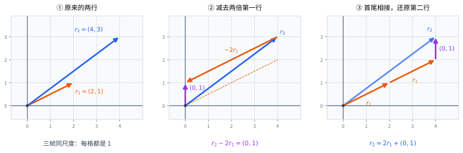
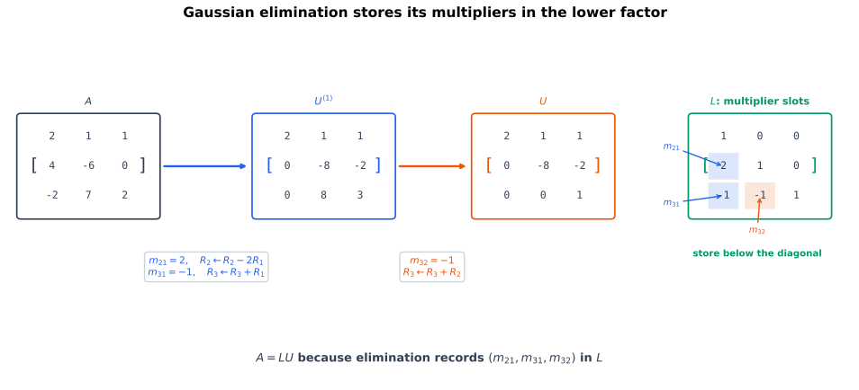
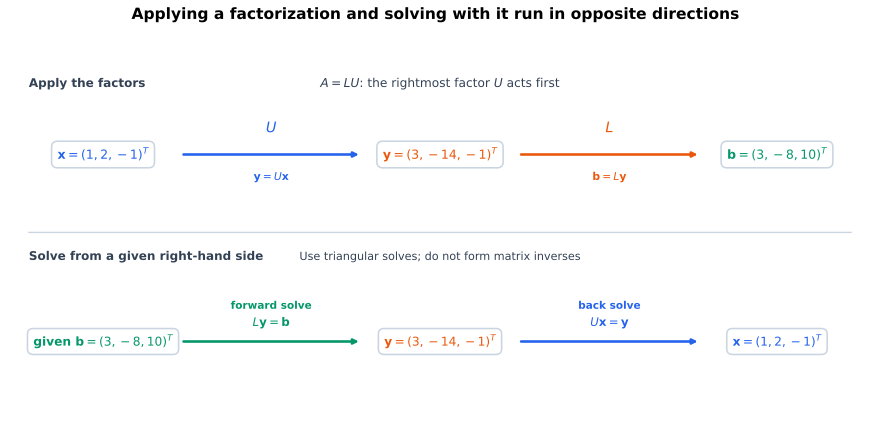
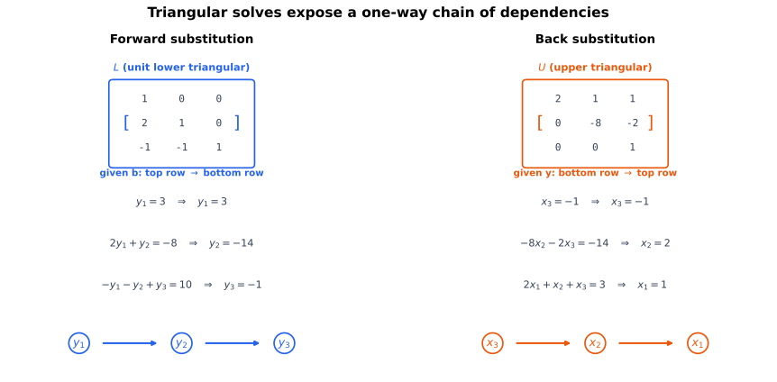
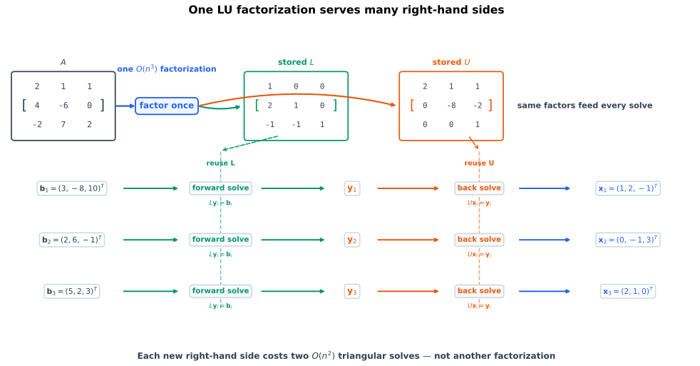
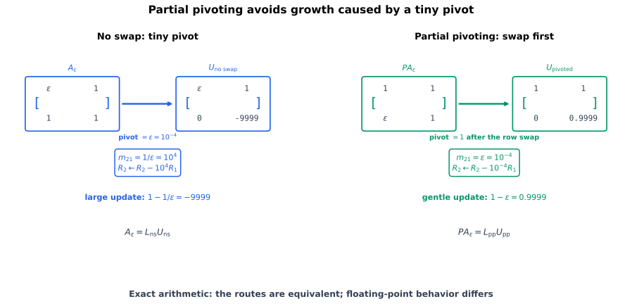

# 从两行的消元与重建看 LU

[逆矩阵](elimination-inverses-and-invertibility.qmd)把所有右端的唯一解统一写成 $\mathbf A^{-1}\mathbf b$。现在不先求出整张逆矩阵，而是保存消元时的乘子与换行，让不同右端复用同一次分解。

取一个只需消元一次的矩阵，把它的两行记作行向量：

$$
\mathbf A=\begin{bmatrix}2&1\\4&3\end{bmatrix},
\qquad \mathbf r_1=(2,1),\quad \mathbf r_2=(4,3).
$$

要把第二行的第一个数 $4$ 消成零，就从第二行减去第一行的两倍：

$$
\mathbf r_2-2\mathbf r_1=(4,3)-2(2,1)=(0,1).
$$

第一行不变。把消元后的两行记为 $\mathbf u_1=(2,1)$、$\mathbf u_2=(0,1)$，得到

$$
\mathbf U=\begin{bmatrix}2&1\\0&1\end{bmatrix}.
$$

现在反过来问：只知道这两条新行，怎样找回原来的行？把刚才减去的部分加回来：

$$
\mathbf r_1=\mathbf u_1,
\qquad
\mathbf r_2=2\mathbf u_1+\mathbf u_2.
$$

左乘矩阵的每一行，给出对右侧矩阵各行作线性组合的系数。因此重建第一行的系数是 $(1,0)$，重建第二行的系数是 $(2,1)$；将它们排成矩阵，就是

$$
\mathbf L=\begin{bmatrix}1&0\\2&1\end{bmatrix},
\qquad
\underbrace{\begin{bmatrix}2&1\\4&3\end{bmatrix}}_{\mathbf A}
=
\underbrace{\begin{bmatrix}1&0\\2&1\end{bmatrix}}_{\mathbf L}
\underbrace{\begin{bmatrix}2&1\\0&1\end{bmatrix}}_{\mathbf U}.
$$

$L_{21}=2$ 不是第二行剩下的元素，而是重建原第二行时，需要取多少倍第一条主元行。消元时减去 $2\mathbf r_1$，重建时加回 $2\mathbf u_1$，所以 $\mathbf L$ 中存的是 $2$ 而不是 $-2$。

@fig-lu-row-reconstruction 把这次减去与加回放在相同尺度的坐标图中。图中的箭头表示矩阵的行向量，不是 $\mathbf A$ 对输入列向量的作用。

{#fig-lu-row-reconstruction fig-alt="同尺度的三个分镜依次画出原始行 r1=(2,1)、r2=(4,3)，消元 r2-2r1=(0,1)，以及反向重建 r2=2r1+(0,1)。" width="100%"}

这里 $\mathbf U$ 保存消元结果，$\mathbf L$ 保存重建系数；$\mathbf A=\mathbf L\mathbf U$ 把两者合在一起。这就是 LU 分解。

# 三阶消元与重建系数

## 为什么不应为每个右端重新消元

设同一个方阵反复出现在多个方程组中：

$$
\mathbf A\mathbf x_1=\mathbf b_1,
\qquad
\mathbf A\mathbf x_2=\mathbf b_2,
\qquad
\ldots,
\qquad
\mathbf A\mathbf x_r=\mathbf b_r.
$$

如果每得到一个新右端 $\mathbf b_j$，就从头对增广矩阵

$$
[\mathbf A\mid\mathbf b_j]
$$

实施同一遍 Gaussian 消元，那么系数部分发生的工作被重复了很多次。消去第一列时使用哪个主元、减去多少倍主元行；消去第二列时又使用哪些乘子——这些都只由 $\mathbf A$ 决定，与右端无关。

因此更自然的做法是：

1. 只对 $\mathbf A$ 做一次消元；
2. 保存这次消元使用的行交换和消元乘子；
3. 每个新右端只通过已经保存的结构求解。

这不是另发明一套算法，而是把已有消元过程拆成“预处理一次、使用多次”。

## 逐列消去主元下方的元素

取贯穿后续计算的三阶矩阵

$$
\mathbf A
=
\begin{bmatrix}
2&1&1\\
4&-6&0\\
-2&7&2
\end{bmatrix}.
$$ {#eq-running-lu-matrix}

对第一列消元：

$$
m_{21}=\frac{4}{2}=2,
\qquad
m_{31}=\frac{-2}{2}=-1.
$$

实施

$$
R_2\leftarrow R_2-2R_1,
\qquad
R_3\leftarrow R_3-(-1)R_1=R_3+R_1,
$$

得到

$$
\begin{bmatrix}
2&1&1\\
0&-8&-2\\
0&8&3
\end{bmatrix}.
$$

再对第二列消元：

$$
m_{32}=\frac{8}{-8}=-1,
$$

所以

$$
R_3\leftarrow R_3-(-1)R_2=R_3+R_2.
$$

最终得到上三角矩阵

$$
\mathbf U
=
\begin{bmatrix}
2&1&1\\
0&-8&-2\\
0&0&1
\end{bmatrix}.
$$ {#eq-running-u-matrix}

## 逐行重建原矩阵

记原矩阵的三行为 $\mathbf r_1,\mathbf r_2,\mathbf r_3$，最终上三角矩阵的三行为 $\mathbf u_1,\mathbf u_2,\mathbf u_3$。消元过程给出

$$
\begin{aligned}
\mathbf u_1&=\mathbf r_1,\\
\mathbf u_2&=\mathbf r_2-2\mathbf u_1,\\
\mathbf u_3&=(\mathbf r_3+\mathbf u_1)+\mathbf u_2.
\end{aligned}
$$

最后一步加的是已经更新过的第二行 $\mathbf u_2$，不是原来的 $\mathbf r_2$。逐个把等式改写为重建形式：

$$
\begin{aligned}
\mathbf r_1&=\mathbf u_1,\\
\mathbf r_2&=2\mathbf u_1+\mathbf u_2,\\
\mathbf r_3&=-\mathbf u_1-\mathbf u_2+\mathbf u_3.
\end{aligned}
$$

三行的系数分别是 $(1,0,0)$、$(2,1,0)$、$(-1,-1,1)$。它们组成 $\mathbf L$，其中严格下三角部分恰好是三个消元乘子：

$$
m_{21}=2,
\qquad
m_{31}=-1,
\qquad
m_{32}=-1
$$

于是得到单位下三角矩阵：

$$
\mathbf L
=
\begin{bmatrix}
1&0&0\\
2&1&0\\
-1&-1&1
\end{bmatrix}.
$$ {#eq-running-l-matrix}

@fig-lu-multipliers-stored 展示了同一个信息流：矩阵上三角部分逐步变成 $\mathbf U$，被消去位置使用的乘子则落入 $\mathbf L$ 的对应位置。

{#fig-lu-multipliers-stored fig-alt="左侧矩阵 A 经过两轮消元变成右侧上三角矩阵 U；三条带颜色的乘子二、负一、负一从消元步骤落入下方单位下三角矩阵 L 的二一、三一、三二位置。" width="100%"}

直接相乘可以核对：

$$
\begin{aligned}
\mathbf L\mathbf U
&=
\begin{bmatrix}
1&0&0\\
2&1&0\\
-1&-1&1
\end{bmatrix}
\begin{bmatrix}
2&1&1\\
0&-8&-2\\
0&0&1
\end{bmatrix}\\
&=
\begin{bmatrix}
2&1&1\\
4&-6&0\\
-2&7&2
\end{bmatrix}\\
&=\mathbf A.
\end{aligned}
$$

于是这次消元留下了分解

$$
\boxed{\mathbf A=\mathbf L\mathbf U}.
$$

只要无换行逐列消元能够完成，第 $i$ 行同样满足

$$
\mathbf r_i=\sum_{k=1}^{i-1}m_{ik}\mathbf u_k+\mathbf u_i.
$$

原因是第 $k$ 步从该行减去 $m_{ik}\mathbf u_k$；主元行 $\mathbf u_k$ 一旦确定，后续步骤不再改变它。把各步减去的量加回，就恢复原行。因此重建只用当前行与更早的主元行，系数矩阵是下三角形，而当前行自己的系数为 $1$。

这一行重建等式就是 $\mathbf A=\mathbf L\mathbf U$，已经给出了任意阶的构造：按消元顺序存下 $m_{ik}$，把它们填进单位下三角矩阵。

## 用逆消元核对构造

记 $a_{ij}^{(k)}$ 为第 $k$ 步开始时的元素；当 $a_{kk}^{(k)}\neq0$ 时，令 $m_{ik}=a_{ik}^{(k)}/a_{kk}^{(k)}$。将这些乘子收集成前 $k$ 个分量为零的列向量 $\mathbf m^{(k)}$，并用 $\mathbf e_k$ 表示单位矩阵第 $k$ 列，则整列消元与撤销消元分别为

$$
\mathbf E_k=\mathbf I-\mathbf m^{(k)}\mathbf e_k^{\mathsf T},
\qquad
\mathbf E_k^{-1}=\mathbf I+\mathbf m^{(k)}\mathbf e_k^{\mathsf T}.
$$

这里只用了矩阵乘法：$\mathbf m^{(k)}\mathbf e_k^{\mathsf T}$ 只有第 $k$ 列非零，左乘时从各行减去对应倍数的第 $k$ 行；第 $k$ 行本身不变，所以加回同样的倍数就能撤销。也可由 $\mathbf e_k^{\mathsf T}\mathbf m^{(k)}=0$ 直接核对两个乘积均为单位矩阵。

因此

$$
\mathbf U=\mathbf E_{n-1}\cdots\mathbf E_1\mathbf A,
\qquad
\mathbf L=\mathbf E_1^{-1}\cdots\mathbf E_{n-1}^{-1},
\qquad
\mathbf A=\mathbf L\mathbf U.
$$

乘法次序来自逆矩阵的反序规则。前面的逐行重建已说明 $L_{ik}=m_{ik}$；按这个次序展开逆消元乘积、核对交叉项为零的详细证明，见[消元矩阵与乘子证明](lu-existence-and-pivoting-proofs.qmd#sec-lu-elimination-proof)。

## 分解的约定

::: {.callout-important title="假设与约定"}
本章主要讨论实方阵。无换行的 LU 分解约定为

$$
\mathbf A=\mathbf L\mathbf U,
$$

其中 $\mathbf L$ 是主对角线全为 $1$ 的单位下三角矩阵，$\mathbf U$ 是上三角矩阵。

需要交换行时，本章统一使用

$$
\boxed{\mathbf P\mathbf A=\mathbf L\mathbf U}.
$$

不同资料可能把排列矩阵的逆吸收到记号中，写成 $\mathbf A=\mathbf P\mathbf L\mathbf U$。公式看起来相近，含义却取决于约定；使用软件或阅读资料时必须先检查等式本身。
:::

# 用两个三角系统求解

## $A=LU$ 是怎样的变换复合

矩阵乘法表示线性映射复合。若

$$
\mathbf A=\mathbf L\mathbf U,
$$

那么对任意输入 $\mathbf x$：

$$
\mathbf A\mathbf x
=
\mathbf L(\mathbf U\mathbf x).
$$

因此从正向变换看，作用顺序是：

$$
\mathbf x
\xmapsto{\mathbf U}
\mathbf y
\xmapsto{\mathbf L}
\mathbf b.
$$

其中

$$
\mathbf y=\mathbf U\mathbf x,
\qquad
\mathbf b=\mathbf L\mathbf y.
$$

但求解问题给定的是终点 $\mathbf b$，要反向找回 $\mathbf x$。所以先撤销最后作用的 $\mathbf L$，再撤销最先作用的 $\mathbf U$：

$$
\mathbf L\mathbf y=\mathbf b,
\qquad
\mathbf U\mathbf x=\mathbf y.
$$

@fig-lu-forward-and-solve-directions 把“正向作用顺序”和“求解顺序”放在同一张图中。二者方向相反，但没有矛盾：一个是在计算输出，另一个是在反求输入。

{#fig-lu-forward-and-solve-directions fig-alt="上方箭头从 x 经 U 到中间 y，再经 L 到 b，表示 A x 等于 L U x；下方从给定 b 反向求解，先做前代解 L y 等于 b，再做回代解 U x 等于 y。" width="100%"}

::: {.callout-tip title="避免背错顺序的方法"}
不要机械记忆“先 L 后 U”或“先 U 后 L”。写出

$$
\mathbf A\mathbf x
=
\mathbf L\mathbf U\mathbf x
=
\mathbf b.
$$

正向矩阵作用从右向左；求解未知量则从等式外层向内层撤销，所以先解 $\mathbf L\mathbf y=\mathbf b$。
:::

## 三角方程为什么容易求解

一般稠密方程中，每一行可能同时含有全部未知量。三角结构则给出单向依赖：

- 下三角系统从第一行开始，逐行向下；
- 上三角系统从最后一行开始，逐行向上。

这正是前代与回代。

## 下三角系统的前代

设

$$
\mathbf L
=
\begin{bmatrix}
\ell_{11}&0&\cdots&0\\
\ell_{21}&\ell_{22}&\cdots&0\\
\vdots&\vdots&\ddots&\vdots\\
\ell_{n1}&\ell_{n2}&\cdots&\ell_{nn}
\end{bmatrix},
$$

且所有对角元素都非零。求解

$$
\mathbf L\mathbf y=\mathbf b.
$$

第 $i$ 行是

$$
\ell_{i1}y_1+
\cdots+
\ell_{i,i-1}y_{i-1}
+
\ell_{ii}y_i
=b_i.
$$

在已经知道 $y_1,\ldots,y_{i-1}$ 后，可以解出

$$
\boxed{
y_i
=
\frac{
 b_i-
 \sum_{j=1}^{i-1}\ell_{ij}y_j
}{\ell_{ii}}
}.
$$ {#eq-forward-substitution}

若 $\mathbf L$ 是 LU 中的单位下三角矩阵，则 $\ell_{ii}=1$，公式简化为

$$
y_i
=
b_i-
\sum_{j=1}^{i-1}\ell_{ij}y_j.
$$ {#eq-unit-lower-forward-substitution}

### 前代为什么正确

按 $i$ 归纳。

- 当 $i=1$ 时，第一行只有
  $$
  \ell_{11}y_1=b_1,
  $$
  因为 $\ell_{11}\neq0$，@eq-forward-substitution 唯一确定 $y_1$。
- 假设前 $i-1$ 个分量已经被唯一确定，并且前 $i-1$ 行成立。第 $i$ 行中只有 $y_i$ 尚未知，其系数 $\ell_{ii}\neq0$，所以 @eq-forward-substitution 唯一确定 $y_i$，并使第 $i$ 行成立。

有限步后，所有行都成立，得到唯一解。$\square$

对贯穿例子，取

$$
\mathbf x
=
\begin{bmatrix}1\\2\\-1\end{bmatrix}.
$$

由 @eq-running-lu-matrix，

$$
\mathbf b
=\mathbf A\mathbf x
=
\begin{bmatrix}3\\-8\\10\end{bmatrix}.
$$ {#eq-running-lu-rhs}

先解

$$
\begin{bmatrix}
1&0&0\\
2&1&0\\
-1&-1&1
\end{bmatrix}
\begin{bmatrix}y_1\\y_2\\y_3\end{bmatrix}
=
\begin{bmatrix}3\\-8\\10\end{bmatrix}.
$$

逐行得到

$$
y_1=3,
$$

$$
2y_1+y_2=-8
\quad\Longrightarrow\quad
y_2=-14,
$$

以及

$$
-y_1-y_2+y_3=10
\quad\Longrightarrow\quad
y_3=-1.
$$

因此

$$
\mathbf y
=
\begin{bmatrix}3\\-14\\-1\end{bmatrix}.
$$ {#eq-running-intermediate-y}

## 上三角系统的回代

设

$$
\mathbf U
=
\begin{bmatrix}
u_{11}&u_{12}&\cdots&u_{1n}\\
0&u_{22}&\cdots&u_{2n}\\
\vdots&\vdots&\ddots&\vdots\\
0&0&\cdots&u_{nn}
\end{bmatrix},
$$

且所有 $u_{ii}\neq0$。求解

$$
\mathbf U\mathbf x=\mathbf y.
$$

第 $i$ 行是

$$
u_{ii}x_i
+
u_{i,i+1}x_{i+1}
+
\cdots+
u_{in}x_n
=y_i.
$$

从最后一行向上，在 $x_{i+1},\ldots,x_n$ 已知时：

$$
\boxed{
x_i
=
\frac{
 y_i-
 \sum_{j=i+1}^{n}u_{ij}x_j
}{u_{ii}}
}.
$$ {#eq-back-substitution}

### 回代为什么正确

对 $i=n,n-1,\ldots,1$ 做反向归纳。

- 最后一行只有
  $$
  u_{nn}x_n=y_n,
  $$
  因为 $u_{nn}\neq0$，唯一确定 $x_n$。
- 假设 $x_{i+1},\ldots,x_n$ 已被唯一确定，并使第 $i+1$ 到第 $n$ 行成立。第 $i$ 行中只剩 $x_i$ 未知，且 $u_{ii}\neq0$，所以 @eq-back-substitution 唯一确定 $x_i$。

最终得到唯一解。$\square$

对贯穿例子，使用 @eq-running-u-matrix 与 @eq-running-intermediate-y：

$$
\begin{bmatrix}
2&1&1\\
0&-8&-2\\
0&0&1
\end{bmatrix}
\begin{bmatrix}x_1\\x_2\\x_3\end{bmatrix}
=
\begin{bmatrix}3\\-14\\-1\end{bmatrix}.
$$

从最后一行开始：

$$
x_3=-1,
$$

$$
-8x_2-2x_3=-14
\quad\Longrightarrow\quad
x_2=2,
$$

$$
2x_1+x_2+x_3=3
\quad\Longrightarrow\quad
x_1=1.
$$

恢复原解

$$
\mathbf x
=
\begin{bmatrix}1\\2\\-1\end{bmatrix}.
$$

@fig-triangular-solve-dependencies 用箭头画出两种单向依赖。前代中 $y_i$ 只依赖更早的分量；回代中 $x_i$ 只依赖更后的分量。

{#fig-triangular-solve-dependencies fig-alt="左侧下三角矩阵按行高亮，从 y1 到 y2 再到 y3 向下产生依赖；右侧上三角矩阵从 x3 到 x2 再到 x1 向上传播，箭头分别标明前代和回代的方向。" width="100%"}

## 三角求解需要多少计算

这里只计主要的标量乘法和加减法数量，不追求机器指令级精确常数。

前代第 $i$ 行需要处理前面的 $i-1$ 个分量，总工作量与

$$
\sum_{i=1}^{n}(i-1)
=
\frac{n(n-1)}{2}
$$

同阶。

回代同理，总工作量也是 $n^2$ 量级。因此对一个右端，前代加回代的主要算术量是

$$
O(n^2).
$$

相比之下，对稠密 $n\times n$ 矩阵完成 LU 分解要更新逐渐缩小的右下子矩阵，主要工作量是

$$
O(n^3),
$$

更精确的首项约为

$$
\frac{2}{3}n^3.
$$

大写 $O$ 只描述规模增长速度，不表示具体实现速度完全由这个首项决定。内存布局、缓存、并行、稀疏性和硬件都会影响实际耗时。

## 一次分解怎样复用多个右端

把多个右端并为列：

$$
\mathbf B
=
\begin{bmatrix}
\vert&&\vert\\
\mathbf b_1&\cdots&\mathbf b_r\\
\vert&&\vert
\end{bmatrix}
\in\mathbb R^{n\times r},
$$

并把所有解也并为列：

$$
\mathbf X
=
\begin{bmatrix}
\vert&&\vert\\
\mathbf x_1&\cdots&\mathbf x_r\\
\vert&&\vert
\end{bmatrix}.
$$

方程组统一写成

$$
\mathbf A\mathbf X=\mathbf B.
$$

若已经计算

$$
\mathbf A=\mathbf L\mathbf U,
$$

则只需依次求解

$$
\mathbf L\mathbf Y=\mathbf B,
$$

和

$$
\mathbf U\mathbf X=\mathbf Y.
$$

每一列都是独立的三角求解，但可以在矩阵层面批量组织。一次昂贵分解服务所有右端。

@fig-lu-reuse-multiple-rhs 中，左侧只有一个 $\mathbf L,\mathbf U$，右侧却连接多个 $\mathbf b_j$。这正是数值库通常把“分解”和“求解”设计为两个阶段的原因。

{#fig-lu-reuse-multiple-rhs fig-alt="左侧系数矩阵 A 只分解一次为 L 和 U；右侧三个不同右端 b1、b2、b3 共享同一前代和回代管线，分别输出 x1、x2、x3。" width="100%"}

若只有一个右端，一次分解加求解仍是 $O(n^3)$。若右端很多，分解的成本只支付一次，之后每个新右端主要增加 $O(n^2)$ 工作。

::: {.callout-warning title="复用分解要求系数矩阵不变"}
只有右端改变而 $\mathbf A$ 保持不变时，才能直接复用同一个 LU/PLU。若 $\mathbf A$ 的元素发生变化，原分解一般不再精确成立；除非另有专门的更新算法，否则必须重新分解。
:::


# 行交换与 PLU 分解

## 可逆为什么还不保证能无换行 LU

考虑

$$
\mathbf A_0
=
\begin{bmatrix}
0&1\\
1&1
\end{bmatrix}.
$$ {#eq-zero-leading-pivot-example}

若直接从左上角开始消元，第一个候选主元是 $0$，无法计算

$$
m_{21}=\frac{1}{0}.
$$

交换两行后立刻得到上三角矩阵：

$$
\begin{bmatrix}
1&1\\
0&1
\end{bmatrix}.
$$

换行后的阶梯形有两个非零主元，因此由[消元的可逆性判据](elimination-inverses-and-invertibility.qmd)可知原矩阵可逆。这已经表明：

> “矩阵可逆”与“当前行顺序下可以无换行完成 LU”不是同一件事。

还可以直接证明 $\mathbf A_0$ 不存在单位下三角—上三角分解。假设

$$
\mathbf A_0
=
\begin{bmatrix}
1&0\\
\ell&1
\end{bmatrix}
\begin{bmatrix}
u_{11}&u_{12}\\
0&u_{22}
\end{bmatrix}.
$$

相乘得到左上角

$$
u_{11}=0.
$$

而左下角必须满足

$$
\ell u_{11}=1.
$$

代入 $u_{11}=0$ 得到 $0=1$，矛盾。因此这种 LU 分解不存在。

## 检查的是当前主元

只要前 $n-1$ 步的当前主元非零，就能按乘子公式完成无换行 LU；最后一个对角元素可以为零，因为最后一行下方已没有元素需要消去。若每个对角元素都非零，才可以继续对任意右端作唯一解回代。

当前主元为零时，若该列下方也全为零，可以跳过这列的消去；若下方有非零元素，就需要交换行。存在分解和无需换行完成通常的非零主元算法，不能在奇异情形下混为一谈。

## 排列矩阵与换行

对单位矩阵重新排列各行，得到的矩阵称为**排列矩阵**。例如交换二阶矩阵的两行对应

$$
\mathbf P
=
\begin{bmatrix}
0&1\\
1&0
\end{bmatrix}.
$$

左乘 $\mathbf P$ 会交换任意两行矩阵的第一、第二行：

$$
\mathbf P
\begin{bmatrix}
\text{row}_1\\
\text{row}_2
\end{bmatrix}
=
\begin{bmatrix}
\text{row}_2\\
\text{row}_1
\end{bmatrix}.
$$

排列矩阵的每一行、每一列恰好有一个 $1$，其余元素为 $0$。行交换可以撤销，所以 $\mathbf P$ 可逆，而且

$$
\mathbf P^{-1}=\mathbf P^{\mathsf T}.
$$ {#eq-permutation-inverse-transpose}

从元素乘法也可核对 @eq-permutation-inverse-transpose：$\mathbf P\mathbf P^{\mathsf T}$ 的 $(i,j)$ 元素是两行对应元素乘积之和；同一行只有一个 $1$，不同的两行中 $1$ 的位置不同，所以结果为 $\mathbf I$。这不需要引入内积。

对 @eq-zero-leading-pivot-example，

$$
\mathbf P\mathbf A_0
=
\begin{bmatrix}
0&1\\
1&0
\end{bmatrix}
\begin{bmatrix}
0&1\\
1&1
\end{bmatrix}
=
\begin{bmatrix}
1&1\\
0&1
\end{bmatrix}.
$$

此时可取

$$
\mathbf L=\mathbf I_2,
\qquad
\mathbf U=
\begin{bmatrix}1&1\\0&1\end{bmatrix},
$$

于是

$$
\boxed{
\mathbf P\mathbf A_0=\mathbf L\mathbf U
}.
$$


## 为什么每个方阵都能做 PLU

::: {.callout-important title="PLU 存在性"}
对每个方阵 $\mathbf A\in\mathbb R^{n\times n}$，都存在排列矩阵 $\mathbf P$、单位下三角矩阵 $\mathbf L$ 和上三角矩阵 $\mathbf U$，使

$$
\boxed{
\mathbf P\mathbf A=\mathbf L\mathbf U
}.
$$ {#eq-plu-factorization}
:::

当前列还有非零候选时，把它换到主元位置再消元；当前列剩余部分全为零时，不作除法，直接处理右下块。这两种情形都能继续构造分解，完整的块归纳证明见[一般 PLU 存在性](lu-existence-and-pivoting-proofs.qmd#sec-plu-existence-proof)。

后续换行时，已经存入 $\mathbf L$ 的旧乘子也必须跟着对应的行移动。它们记录的是那一行的消元历史，不能只交换工作矩阵而把历史留在原位置。

结论不要求 $\mathbf A$ 可逆。若 $\mathbf A$ 奇异，则 $\mathbf U$ 至少有一个对角元素为零：否则 $\mathbf L$ 与 $\mathbf U$ 都能通过前代与回代逐列求逆，排列矩阵 $\mathbf P$ 也能通过撤销换行求逆，于是 $\mathbf A=\mathbf P^{-1}\mathbf L\mathbf U$ 也可逆，矛盾。分解仍然记录消元过程，但普通的唯一解回代会在零主元处停止；此时必须回到相容性与自由变量的分析。

## PLU 下怎样求解

由

$$
\mathbf A\mathbf x=\mathbf b,
$$

左乘 $\mathbf P$：

$$
\mathbf P\mathbf A\mathbf x
=
\mathbf P\mathbf b.
$$

使用 @eq-plu-factorization：

$$
\mathbf L\mathbf U\mathbf x
=
\mathbf P\mathbf b.
$$

所以求解顺序是

$$
\boxed{
\mathbf L\mathbf y=\mathbf P\mathbf b,
\qquad
\mathbf U\mathbf x=\mathbf y
}.
$$ {#eq-plu-solve}

右端必须应用同样的行排列。只排列系数矩阵而忘记排列 $\mathbf b$，相当于交换方程左边却不交换右边，会改变方程组。


# 选主元与数值边界 {#sec-lu-numerical-boundaries}

## 部分选主元怎样选择行

在精确代数中，只要主元非零就可以继续消元。但浮点计算还要考虑主元大小。

第 $k$ 步开始时，在当前第 $k$ 列的候选中选择绝对值最大者：

$$
p
\in
\operatorname*{arg\,max}_{i=k,\ldots,n}
\left|a_{ik}^{(k)}\right|.
$$ {#eq-partial-pivot-choice}

若 $p\neq k$，交换第 $p$ 行与第 $k$ 行。然后使用新的主元

$$
a_{kk}^{(k)}
$$

消去下方元素。这称为**部分选主元**：只在当前列的候选行中选择，不搜索整个剩余子矩阵。

### 为什么乘子绝对值不超过 $1$

选主元后，对任意 $i>k$，

$$
\left|a_{ik}^{(k)}\right|
\le
\left|a_{kk}^{(k)}\right|.
$$

只要主元非零，消元乘子为

$$
\ell_{ik}
=
\frac{a_{ik}^{(k)}}{a_{kk}^{(k)}}.
$$

因此

$$
\boxed{
|\ell_{ik}|\le1
}.
$$ {#eq-partial-pivot-multiplier-bound}

这个界避免了因为选到同列中很小的主元而立即产生巨大乘子。

::: {.callout-warning title="乘子有界不等于误差都有界"}
更新 $a_{ij}^{(k+1)}=a_{ij}^{(k)}-\ell_{ik}a_{kj}^{(k)}$ 仍可能在 $\mathbf U$ 中产生很大的中间元素。$|\ell_{ik}|\le1$ 不是对所有矩阵都稳定的证明；精确非零主元也不等于浮点计算中的可靠主元。
:::

## 微小主元与舍入

考虑

$$
\mathbf A_{\varepsilon}=\begin{bmatrix}\varepsilon&1\\1&1\end{bmatrix},
\qquad 0<\varepsilon\ll1.
$$ {#eq-small-pivot-matrix}

不换行时乘子为 $1/\varepsilon$，第二行变成 $[0,1-1/\varepsilon]$，容易产生大数相减；交换两行后乘子变为 $\varepsilon$。

{#fig-small-pivot-vs-partial-pivot fig-alt="左侧使用微小主元 epsilon，乘子一除以 epsilon 很大；右侧交换两行后使用主元一，乘子变为 epsilon。" width="100%"}

取 $\varepsilon=10^{-4}$、$\mathbf b=[1,2]^{\mathsf T}$，精确解是 $x_1=1/(1-10^{-4})$、$x_2=2-x_1$。每步只保留三位有效数字时，不换行路线把第二行系数与右端都舍入为 $-10^4$，回代得到 $x_2=1$、$x_1=(1-1)/10^{-4}=0$；换行后得到 $[1,1]^{\mathsf T}$，更接近精确解。两条路线在精确算术中等价，差异来自舍入。

## 小残差不等于小解误差

候选解 $\widehat{\mathbf x}$ 的**残差**是代回原方程后的差：

$$
\mathbf r\coloneqq\mathbf b-\mathbf A\widehat{\mathbf x}.
$$ {#eq-residual-definition}

若 $\mathbf A\mathbf x=\mathbf b$，则

$$
\mathbf r=\mathbf A\mathbf x-\mathbf A\widehat{\mathbf x}
=-\mathbf A(\widehat{\mathbf x}-\mathbf x).
$$ {#eq-residual-error-relation}

例如取 $\mathbf H_\varepsilon=\begin{bmatrix}1&1\\1&1+\varepsilon\end{bmatrix}$、真实解 $\mathbf x=[1,1]^{\mathsf T}$、右端 $\mathbf b=[2,2+\varepsilon]^{\mathsf T}$ 和候选解 $\widehat{\mathbf x}=[2,0]^{\mathsf T}$。解误差固定为 $[1,-1]^{\mathsf T}$，残差却是 $[0,\varepsilon]^{\mathsf T}$，可以任意小。

因此，可逆性说明精确唯一可解，部分选主元控制乘子，而小残差只说明近似满足原方程；三者都不能单独保证与单位和尺度无关的解误差上界。

# 用 NumPy 与 SymPy 核对

```{python}
#| label: lst-lu-plu-triangular-solves
#| echo: true

import numpy as np
import sympy as sp

# 贯穿例子的精确 LU。
A = sp.Matrix([[2, 1, 1], [4, -6, 0], [-2, 7, 2]])
L = sp.Matrix([[1, 0, 0], [2, 1, 0], [-1, -1, 1]])
U = sp.Matrix([[2, 1, 1], [0, -8, -2], [0, 0, 1]])
assert L * U == A

x_exact = sp.Matrix([1, 2, -1])
b = A * x_exact
assert b == sp.Matrix([3, -8, 10])
y = L.lower_triangular_solve(b)
assert y == sp.Matrix([3, -14, -1])
assert U.upper_triangular_solve(y) == x_exact


def forward_substitution(lower: np.ndarray, rhs: np.ndarray, *, unit_diagonal: bool = False):
    """Solve lower @ solution = rhs for one or several right-hand sides."""
    lower = np.asarray(lower, dtype=float)
    rhs = np.asarray(rhs, dtype=float)
    vector_rhs = rhs.ndim == 1
    rhs_matrix = rhs[:, None] if vector_rhs else rhs
    row_count = lower.shape[0]
    if lower.shape != (row_count, row_count) or rhs_matrix.shape[0] != row_count:
        raise ValueError("lower 与 rhs 的形状不相容")

    solution = np.zeros_like(rhs_matrix)
    for i in range(row_count):
        diagonal = 1.0 if unit_diagonal else lower[i, i]
        if diagonal == 0.0:
            raise np.linalg.LinAlgError("下三角矩阵出现零对角元素")
        known_part = lower[i, :i] @ solution[:i]
        solution[i] = (rhs_matrix[i] - known_part) / diagonal
    return solution[:, 0] if vector_rhs else solution


def back_substitution(upper: np.ndarray, rhs: np.ndarray):
    """Solve upper @ solution = rhs for one or several right-hand sides."""
    upper = np.asarray(upper, dtype=float)
    rhs = np.asarray(rhs, dtype=float)
    vector_rhs = rhs.ndim == 1
    rhs_matrix = rhs[:, None] if vector_rhs else rhs
    row_count = upper.shape[0]
    if upper.shape != (row_count, row_count) or rhs_matrix.shape[0] != row_count:
        raise ValueError("upper 与 rhs 的形状不相容")

    solution = np.zeros_like(rhs_matrix)
    for i in range(row_count - 1, -1, -1):
        if upper[i, i] == 0.0:
            raise np.linalg.LinAlgError("上三角矩阵出现零对角元素")
        known_part = upper[i, i + 1 :] @ solution[i + 1 :]
        solution[i] = (rhs_matrix[i] - known_part) / upper[i, i]
    return solution[:, 0] if vector_rhs else solution


def plu_partial_pivot(matrix: np.ndarray, tolerance: float = 1e-12):
    """Teaching implementation of P @ A = L @ U with partial pivoting."""
    U = np.asarray(matrix, dtype=float).copy()
    if U.ndim != 2 or U.shape[0] != U.shape[1]:
        raise ValueError("matrix 必须是方阵")
    if tolerance <= 0 or not np.isfinite(tolerance):
        raise ValueError("tolerance 必须是有限正数")

    size = U.shape[0]
    P = np.eye(size)
    L = np.eye(size)
    for k in range(size - 1):
        pivot_row = k + int(np.argmax(np.abs(U[k:, k])))
        if abs(U[pivot_row, k]) <= tolerance:
            if np.all(U[k:, k] == 0.0):
                continue
            raise np.linalg.LinAlgError("当前列只有容差以下的非零候选；不能返回精确 PLU")
        if pivot_row != k:
            U[[k, pivot_row]] = U[[pivot_row, k]]
            P[[k, pivot_row]] = P[[pivot_row, k]]
            L[[k, pivot_row], :k] = L[[pivot_row, k], :k]
        for i in range(k + 1, size):
            L[i, k] = U[i, k] / U[k, k]
            U[i, k:] -= L[i, k] * U[k, k:]
            U[i, k] = 0.0
    return P, L, U


# 用三角求解核对，不显式形成逆矩阵。
L_np = np.array(L.tolist(), dtype=float)
U_np = np.array(U.tolist(), dtype=float)
b_np = np.array(b, dtype=float).reshape(-1)
y_np = forward_substitution(L_np, b_np, unit_diagonal=True)
x_np = back_substitution(U_np, y_np)
np.testing.assert_allclose(y_np, [3.0, -14.0, -1.0])
np.testing.assert_allclose(x_np, [1.0, 2.0, -1.0])

# 一次 PLU 分解复用多个右端。
A_np = np.array(A.tolist(), dtype=float)
P_np, L_pivoted, U_pivoted = plu_partial_pivot(A_np)
np.testing.assert_allclose(P_np @ A_np, L_pivoted @ U_pivoted)
assert np.all(np.abs(L_pivoted[np.tril_indices(3, -1)]) <= 1.0)

# 覆盖 k > 0 时换行：已存入 L 的旧乘子列也必须同步交换。
late_swap = np.array(
    [
        [4.0, 2.0, 1.0, 0.0],
        [2.0, 1.0, 5.0, 1.0],
        [1.0, 3.0, 1.0, 2.0],
        [3.0, 2.0, 0.0, 1.0],
    ]
)
P_late, L_late, U_late = plu_partial_pivot(late_swap)
np.testing.assert_allclose(P_late @ late_swap, L_late @ U_late, atol=1e-12)
np.testing.assert_allclose(P_late[0], [1.0, 0.0, 0.0, 0.0])
assert not np.allclose(P_late, np.eye(4))  # 第一步不换行，后续步骤发生换行。

# 近零但非零的候选不能被静默当成精确零列。
try:
    plu_partial_pivot(1e-13 * np.array([[1.0, 0.0], [2.0, 1.0]]))
except np.linalg.LinAlgError:
    pass
else:
    raise AssertionError("容差以下的非零主元应触发明确错误")

X_expected = np.array([[1.0, 0.0, 2.0], [2.0, 1.0, -1.0], [-1.0, 3.0, 1.0]])
B_np = A_np @ X_expected
Y_computed = forward_substitution(L_pivoted, P_np @ B_np, unit_diagonal=True)
X_computed = back_substitution(U_pivoted, Y_computed)
np.testing.assert_allclose(X_computed, X_expected)

# 可逆但无当前行序下的单位下三角 LU。
A_zero_pivot = sp.Matrix([[0, 1], [1, 1]])

P_zero_pivot = sp.Matrix([[0, 1], [1, 0]])
assert P_zero_pivot * A_zero_pivot == sp.Matrix([[1, 1], [0, 1]])
assert A_zero_pivot.rref() == (sp.eye(2), (0, 1))

# 奇异矩阵仍有 PLU，但唯一解回代不能除以零。
for singular in (np.zeros((2, 2)), np.array([[0.0, 1.0], [0.0, 0.0]]),
                 np.array([[1.0, 2.0], [2.0, 4.0]])):
    P_singular, L_singular, U_singular = plu_partial_pivot(singular)
    np.testing.assert_allclose(P_singular @ singular, L_singular @ U_singular)
    assert np.any(np.diag(U_singular) == 0.0)
    try:
        back_substitution(U_singular, np.zeros(2))
    except np.linalg.LinAlgError:
        pass
    else:
        raise AssertionError("零对角元素应阻止唯一解回代")

# 部分选主元的小主元例子。
epsilon = 1e-4
A_small = np.array([[epsilon, 1.0], [1.0, 1.0]])
b_small = np.array([1.0, 2.0])
x_small = np.linalg.solve(A_small, b_small)
np.testing.assert_allclose(x_small, [1.0 / (1.0 - epsilon), 1.0 - epsilon / (1.0 - epsilon)])
assert abs(1.0 / epsilon) == 10000.0
assert abs(epsilon) <= 1.0

# 小残差不保证小解误差。
epsilon_residual = 1e-8
H = np.array([[1.0, 1.0], [1.0, 1.0 + epsilon_residual]])
x_true = np.array([1.0, 1.0])
x_hat = np.array([2.0, 0.0])
b_h = H @ x_true
residual = b_h - H @ x_hat
error = x_hat - x_true
np.testing.assert_allclose(error, [1.0, -1.0])
np.testing.assert_allclose(residual, [0.0, epsilon_residual])

print("L =")
sp.pprint(L)
print("U =")
sp.pprint(U)
print("single RHS solution =", x_np)
print("multiple RHS solutions =\n", X_computed)
print("small-pivot exact solution =", x_small)
print("residual =", residual, "; error =", error)
```

上面的三个函数逐行翻译了定义，便于核对 $\mathbf P\mathbf A=\mathbf L\mathbf U$、前代、回代和多个右端复用。它们不是高性能实现，也只用一个绝对容差解释浮点零。

成熟数值库常把 $\mathbf L$ 的严格下三角乘子和 $\mathbf U$ 存在同一个数组中，另行编码主元交换；返回对象未必直接等于数学记号中的三张矩阵。使用任何库时都必须先检查它采用 $\mathbf P\mathbf A=\mathbf L\mathbf U$ 还是其他等价约定。

对单次普通求解，直接调用

```python
np.linalg.solve(A_np, b_np)
```

通常比用户自己显式形成

```python
np.linalg.inv(A_np) @ b_np
```

更合适。前者把问题交给线性求解例程，后者先计算整张逆矩阵，做了不需要的工作并增加舍入机会。

::: {.callout-warning title="不要把教学代码等同于库实现"}
本章公式适合解释 LU/PLU 的数学结构。成熟数值库还需要处理：

- 连续存储和批量矩阵运算；
- 主元索引的编码；
- 极端尺度、非有限输入和奇异检测；
- 块算法、缓存和并行；
- 稀疏矩阵的填充与排序。

这些工程细节不改变 $\mathbf P\mathbf A=\mathbf L\mathbf U$，却决定大型问题能否高效可靠地运行。
:::

# 与模型计算的连接

## 固定线性系统的重复求解

训练和推断中的某些子问题会反复求解同一个系数矩阵、不同右端，例如：

- 约束优化中固定线性约束对应的多个右端；
- 隐式层或固定点方法中重复出现的线性化系统；
- 局部二阶近似中同一矩阵对多个向量的求解；
- 多个输出或批量任务共享同一系数结构。

若矩阵规模允许直接分解，一次 PLU 加多次三角求解可以避免重复消元。

但神经网络中的一般权重乘法

$$
\mathbf y=\mathbf W\mathbf x
$$

不是线性方程求解。前向传播已知输入并计算输出，不需要把每个线性层都做 LU。只有问题确实要求反求未知量，而且系数矩阵是适合直接求解的方阵时，PLU 才直接对应这里的算法。

## 自动微分中的线性求解边界

若某个计算图包含

$$
\mathbf x(\theta)
=\mathbf A(\theta)^{-1}\mathbf b(\theta),
$$

实现时通常仍写成“求解线性系统”，而不是显式形成逆矩阵。求导规则可以利用原系统和转置系统的求解结构。

这并不表示 LU 对所有自动微分场景都是最佳选择：矩阵可能稀疏、对称、长方形或过大，适合的算法取决于结构。LU/PLU 提供的是一般稠密方阵的基线。

## 混合精度与残差检查

低精度计算可以更快，但小主元和大范围中间数会使舍入更明显。实际流程可能在较低精度中分解和求解，再在较高精度中计算残差

$$
\mathbf r=\mathbf b-\mathbf A\widehat{\mathbf x}.
$$

残差能够发现候选解没有很好满足原方程，却不能单独保证解误差小。进一步利用残差修正解，需要对问题敏感性和误差传播作更完整分析。

# 容易混淆、需要反复检查的地方

1. **$\mathbf A=\mathbf L\mathbf U$ 的正向作用顺序是先 $\mathbf U$、后 $\mathbf L$。**
2. **求解顺序却是先解 $\mathbf L\mathbf y=\mathbf b$，再解 $\mathbf U\mathbf x=\mathbf y$。** 这是从外层向内层撤销复合。
3. **消元矩阵中是 $-m_{ik}$，$\mathbf L$ 中是 $m_{ik}$。** $\mathbf L$ 来自逆消元矩阵。
4. **前代和回代都要求所除的对角元素非零。** LU 中的 $\mathbf L$ 对角线固定为 $1$；唯一解回代要求 $u_{ii}\neq0$。
5. **矩阵可逆不保证当前行序下能无换行 LU。** 零的前导主元可能迫使交换行。
6. **检查的是每一步更新后的主元，不只是原矩阵对角线。**
7. **LU 唯一性依赖 $\mathbf L$ 的单位对角规范。**
8. **本章采用 $\mathbf P\mathbf A=\mathbf L\mathbf U$。** 其他资料可能使用不同排列记号。
9. **求解 PLU 时必须同时排列右端：$\mathbf P\mathbf b$。**
10. **奇异矩阵也可以有 PLU。** 分解存在不表示唯一解存在。
11. **部分选主元只在当前列中选择。** 它不是搜索整个剩余矩阵。
12. **$|\ell_{ik}|\le1$ 不保证所有中间元素都不增长。**
13. **精确非零主元与浮点可靠主元不是同一判断。** 数值实现还要考虑尺度和舍入。
14. **小残差不自动推出小解误差。** 两者通过矩阵 $\mathbf A$ 联系。
15. **一次分解只能直接复用于同一个系数矩阵。**
16. **解方程不应先显式计算逆矩阵。** 分解和三角求解直接处理所需右端。

# 自检

1. 对 @eq-running-lu-matrix 手算三次消元，重新得到三个乘子、$\mathbf L$ 与 $\mathbf U$。
2. 用两行的例子解释为什么 $L_{21}=2$ 而不是 $-2$，再用三阶例子的行重建式逐行核对 $\mathbf A=\mathbf L\mathbf U$。
3. 证明两个单位下三角矩阵的乘积仍是单位下三角矩阵。
4. 用 @eq-forward-substitution 解一个一般 $3\times3$ 下三角系统，并逐行代回核对。
5. 用 @eq-back-substitution 解一个一般 $3\times3$ 上三角系统，并逐行代回核对。
6. 解释为什么 $\mathbf A=\mathbf L\mathbf U$ 时正向先作用 $\mathbf U$，求解却先处理 $\mathbf L$。
7. 对三个右端组成的矩阵 $\mathbf B$，说明怎样用两次三角矩阵方程得到全部解 $\mathbf X$。
8. 证明 @eq-zero-leading-pivot-example 中的矩阵可逆，但不存在单位下三角—上三角 LU。
9. 阅读[LU 唯一性证明](lu-existence-and-pivoting-proofs.qmd#sec-lu-uniqueness-proof)，解释为什么单位对角规范不可省略。
10. 构造交换第一、第三行的 $3\times3$ 排列矩阵，并核对 $\mathbf P^{-1}=\mathbf P^{\mathsf T}$。
11. 从 $\mathbf P\mathbf A=\mathbf L\mathbf U$ 推导正确的求解顺序。
12. 证明部分选主元产生的非零消元乘子满足 @eq-partial-pivot-multiplier-bound。
13. 解释为什么 $|\ell_{ik}|\le1$ 仍不能证明 $\mathbf U$ 中所有元素都不增长。
14. 复现 $\varepsilon=10^{-4}$ 的三位有效数字例子，分别比较换行和不换行结果。
15. 在残差例子中直接核对 @eq-residual-error-relation。
16. 给出一个奇异矩阵的 PLU，并指出 $\mathbf U$ 中哪个零主元阻止唯一解回代。
17. 解释为什么显式计算 $\mathbf A^{-1}\mathbf b$ 通常不如直接求解 $\mathbf A\mathbf x=\mathbf b$。
18. 解释为什么只比较残差各分量，仍不足以给出与单位和尺度无关的相对解误差结论。

# 小结

Gaussian 消元不只是把矩阵临时化为阶梯形。若没有行交换，消元乘子组成单位下三角矩阵 $\mathbf L$，消元终点组成上三角矩阵 $\mathbf U$：

$$
\mathbf A=\mathbf L\mathbf U.
$$

正向变换满足

$$
\mathbf A\mathbf x
=\mathbf L(\mathbf U\mathbf x),
$$

而求解通过两个三角系统完成：

$$
\mathbf L\mathbf y=\mathbf b,
\qquad
\mathbf U\mathbf x=\mathbf y.
$$

前代和回代各需要 $O(n^2)$ 工作；稠密 LU 分解需要 $O(n^3)$ 工作，因此固定 $\mathbf A$ 时，一次分解可以高效服务多个右端。

可逆矩阵不一定能在当前行顺序下无换行 LU；奇异矩阵也可能有 LU。允许行交换后，每个方阵的消元都能记录为

$$
\mathbf P\mathbf A=\mathbf L\mathbf U.
$$

部分选主元选择当前列绝对值最大的候选，使消元乘子满足

$$
|\ell_{ik}|\le1,
$$

避免由当前列中的微小主元立即产生巨大乘子。但代数可逆、乘子有界、小残差和解误差小仍是不同的判断。

# 主元不足时，怎样描述全部输入与输出

当矩阵不是方阵，或消元后出现自由变量时，一张逆矩阵不再能描述全部解。可以先收集所有满足 $\mathbf A\mathbf h=\mathbf0$ 的齐次方向，再问右端 $\mathbf b$ 是否能由 $\mathbf A$ 的列线性组合得到；一旦有特解，全部解就是特解加全部齐次方向。

这些集合都与线性组合密切相关。[向量空间、子空间、基与维数](vector-spaces-bases-and-dimension.qmd)进一步解释它们的共同结构，以及怎样用尽可能少的向量描述它们。

# 参考资料

Gaussian 消元、LU/PLU、三角求解与部分选主元可参见 Strang 和 Boyd 与 Vandenberghe [@strang2023linear; @boyd2018applied]；有限维线性映射与矩阵分解的代数背景可参见 Axler [@axler2015linear]。

::: {#refs}
:::
