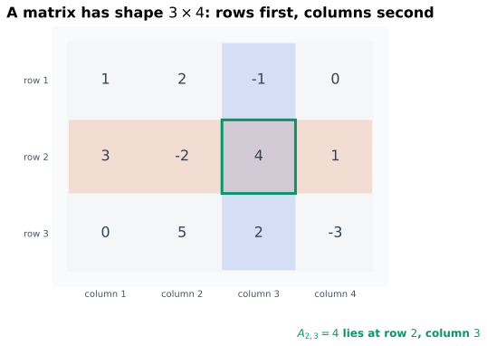
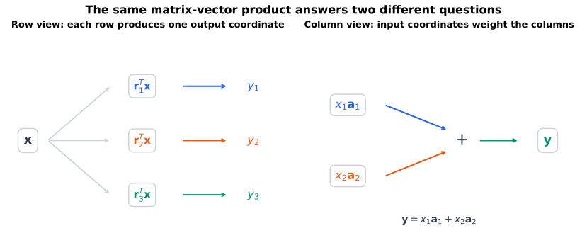
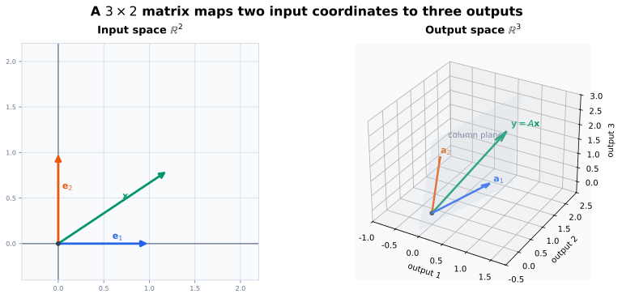
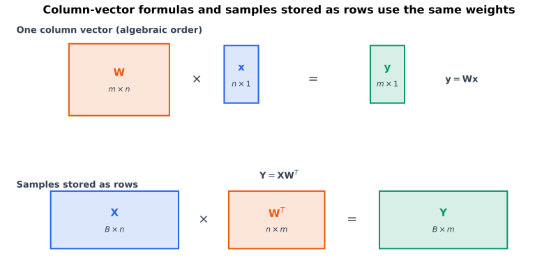

# 从上一页出发：怎样统一记录许多线性组合

上一页已经知道，给定向量

$$
\mathbf{a}_1,\ldots,\mathbf{a}_n\in\mathbb{R}^{m}
$$

和系数

$$
x_1,\ldots,x_n\in\mathbb{R},
$$

可以构造线性组合

$$
x_1\mathbf{a}_1+\cdots+x_n\mathbf{a}_n.
$$

但如果每次都把所有向量和分量完整写开，表达会迅速变长。更自然的做法是把这些向量按列排在一起：

$$
\mathbf{A}
=
\begin{bmatrix}
\vert & & \vert\\
\mathbf{a}_1 & \cdots & \mathbf{a}_n\\
\vert & & \vert
\end{bmatrix},
\qquad
\mathbf{x}
=
\begin{bmatrix}
x_1\\
\vdots\\
x_n
\end{bmatrix}.
$$

于是整个线性组合可以压缩为

$$
\mathbf{A}\mathbf{x}
=
x_1\mathbf{a}_1+\cdots+x_n\mathbf{a}_n.
$$

从列视角看，矩阵统一记录了参与组合的向量；从行视角看，它又把 $m$ 条产生输出分量的标量线性组合打包在一起。

这一步把上一页的“向量与线性组合”连接到本页的“矩阵与线性映射”。本页不把矩阵只当成数字表，而会同时追踪三层含义：

1. **分量层**：第 $i$ 行、第 $j$ 列放了什么数；
2. **计算层**：每个输出分量如何由输入分量得到；
3. **映射层**：这张数字表描述了怎样的线性函数。

# 本页要回答的问题

读完并动手验算后，我希望能回答：

1. 怎样读取矩阵的形状、行、列与元素；
2. 为什么 $m\times n$ 矩阵接受 $n$ 维输入并产生 $m$ 维输出；
3. 怎样从“逐行内积”和“列的线性组合”两种视角理解 $\mathbf{A}\mathbf{x}$；
4. 为什么 $T_{\mathbf{A}}(\mathbf{x})=\mathbf{A}\mathbf{x}$ 一定是线性映射；
5. 为什么每个 $T:\mathbb{R}^{n}\to\mathbb{R}^{m}$ 都有唯一的标准矩阵；
6. 矩阵的列为什么正好是标准坐标向量的像；
7. 怎样区分线性映射、仿射映射和一般非线性函数；
8. 数学中的列向量公式怎样对应 NumPy 和深度学习框架中的批量行布局。

# 矩阵：按行和列排列的标量

设 $m,n\in\mathbb{N}_{>0}$。一个 $m$ 行 $n$ 列的实矩阵写为

$$
\mathbf{A}
=
\begin{bmatrix}
A_{11} & A_{12} & \cdots & A_{1n}\\
A_{21} & A_{22} & \cdots & A_{2n}\\
\vdots & \vdots & \ddots & \vdots\\
A_{m1} & A_{m2} & \cdots & A_{mn}
\end{bmatrix}
\in\mathbb{R}^{m\times n}.
$$ {#eq-matrix-definition}

这里：

- $m$ 是行数；
- $n$ 是列数；
- $A_{ij}\in\mathbb{R}$ 是第 $i$ 行、第 $j$ 列的元素；
- $i\in\{1,\ldots,m\}$；
- $j\in\{1,\ldots,n\}$；
- 形状总是按“行数在前，列数在后”读取。

例如

$$
\mathbf{A}
=
\begin{bmatrix}
1 & 2\\
-1 & 3\\
4 & 0
\end{bmatrix}
\in\mathbb{R}^{3\times2}
$$ {#eq-running-matrix}

有 $3$ 行、$2$ 列，并且

$$
A_{11}=1,
\qquad
A_{22}=3,
\qquad
A_{31}=4.
$$

为了同时展示不在前两列中的元素，@fig-matrix-anatomy 另取一个 $3\times4$ 矩阵作为行列定位示意，不沿用上面的 $3\times2$ 运行例子。

{#fig-matrix-anatomy fig-alt="一个三行四列的矩阵，第二行被橙色标出，第三列被蓝色标出，它们交点处的元素 A 下标 2,3 被绿色边框标出。" width="88%"}

::: {.callout-warning title="下标顺序不是坐标轴顺序的猜谜"}
$A_{ij}$ 的第一个下标始终是行号，第二个下标始终是列号。在矩阵表示线性映射时，可以进一步理解为：$i$ 枚举输出分量，$j$ 枚举输入分量。
:::

## 行视角与列视角

矩阵既可以按行拆开，也可以按列拆开。记第 $i$ 行为

$$
\mathbf{r}_i^{\mathsf T}
=
\begin{bmatrix}
A_{i1} & \cdots & A_{in}
\end{bmatrix}
\in\mathbb{R}^{1\times n},
$$

第 $j$ 列为

$$
\mathbf{a}_j
=
\begin{bmatrix}
A_{1j}\\
\vdots\\
A_{mj}
\end{bmatrix}
\in\mathbb{R}^{m}.
$$

于是同一个矩阵可以写成

$$
\mathbf{A}
=
\begin{bmatrix}
\mathbf{r}_1^{\mathsf T}\\
\vdots\\
\mathbf{r}_m^{\mathsf T}
\end{bmatrix}
=
\begin{bmatrix}
\vert & & \vert\\
\mathbf{a}_1 & \cdots & \mathbf{a}_n\\
\vert & & \vert
\end{bmatrix}.
$$ {#eq-row-column-decomposition}

对 @eq-running-matrix，行向量是

$$
\mathbf{r}_1^{\mathsf T}=\begin{bmatrix}1&2\end{bmatrix},
\quad
\mathbf{r}_2^{\mathsf T}=\begin{bmatrix}-1&3\end{bmatrix},
\quad
\mathbf{r}_3^{\mathsf T}=\begin{bmatrix}4&0\end{bmatrix},
$$

列向量是

$$
\mathbf{a}_1=
\begin{bmatrix}1\\-1\\4\end{bmatrix},
\qquad
\mathbf{a}_2=
\begin{bmatrix}2\\3\\0\end{bmatrix}.
$$

行和列不是两种不同的矩阵，而是读取同一矩阵的两种组织方式。后面会看到：行负责产生输出分量，列负责描述输入方向被送到哪里。

# 矩阵相等、零矩阵与单位矩阵

两个矩阵相等，当且仅当它们形状相同，且所有对应元素相等：

$$
\mathbf{A}=\mathbf{B}
\quad\Longleftrightarrow\quad
A_{ij}=B_{ij}
\quad
\text{对所有 }i,j.
$$

形状为 $m\times n$ 的零矩阵记作

$$
\mathbf{0}_{m\times n},
$$

它的每个元素都是 $0$。不引起歧义时可简写为 $\mathbf{0}$，但必须由上下文判断它是标量、向量还是哪种形状的矩阵。

$n$ 阶单位矩阵定义为

$$
\mathbf{I}_n
=
\begin{bmatrix}
1 & 0 & \cdots & 0\\
0 & 1 & \cdots & 0\\
\vdots & \vdots & \ddots & \vdots\\
0 & 0 & \cdots & 1
\end{bmatrix}
\in\mathbb{R}^{n\times n}.
$$ {#eq-identity-matrix}

它的第 $j$ 列正是标准坐标向量 $\mathbf{e}_j$。矩阵—向量乘法将在下一节正式定义；按照该定义可以直接验证

$$
\mathbf{I}_n\mathbf{x}=\mathbf{x}
$$

对任意 $\mathbf{x}\in\mathbb{R}^{n}$ 成立。单位矩阵表示“不改变输入”的恒等映射。

::: {.callout-note title="方阵只是矩阵的一类"}
当 $m=n$ 时，$\mathbf{A}\in\mathbb{R}^{n\times n}$ 称为方阵。但线性层常常改变特征维数，因此机器学习里大量矩阵是长方形的。不要把“矩阵”默认理解为“方阵”。
:::

# 矩阵乘向量

设

$$
\mathbf{A}\in\mathbb{R}^{m\times n},
\qquad
\mathbf{x}\in\mathbb{R}^{n}.
$$

矩阵—向量乘积定义为向量

$$
\mathbf{y}
=
\mathbf{A}\mathbf{x}
\in\mathbb{R}^{m},
$$

其中第 $i$ 个输出分量是

$$
y_i
\coloneqq
\sum_{j=1}^{n}A_{ij}x_j,
\qquad
i\in\{1,\ldots,m\}.
$$ {#eq-matrix-vector-component}

形状检查为

$$
\underbrace{\mathbf{A}}_{m\times n}
\underbrace{\mathbf{x}}_{n\times1}
=
\underbrace{\mathbf{y}}_{m\times1}.
$$ {#eq-matrix-vector-shape}

内部维数 $n$ 必须匹配；外部维数 $m$ 留在结果中。这不是单纯的记忆规则：$n$ 个输入坐标为 $m$ 个输出坐标分别提供加权信息。

## 一个完整例子

继续使用 @eq-running-matrix，并取

$$
\mathbf{x}
=
\begin{bmatrix}
2\\
-1
\end{bmatrix}
\in\mathbb{R}^{2}.
$$

那么

$$
\begin{aligned}
\mathbf{A}\mathbf{x}
&=
\begin{bmatrix}
1 & 2\\
-1 & 3\\
4 & 0
\end{bmatrix}
\begin{bmatrix}
2\\
-1
\end{bmatrix}\\
&=
\begin{bmatrix}
1\cdot2+2\cdot(-1)\\
(-1)\cdot2+3\cdot(-1)\\
4\cdot2+0\cdot(-1)
\end{bmatrix}\\
&=
\begin{bmatrix}
0\\
-5\\
8
\end{bmatrix}.
\end{aligned}
$$ {#eq-running-matrix-vector}

输入有 $2$ 个分量，输出有 $3$ 个分量，恰好对应 $3\times2$ 矩阵的列数与行数。

## 行视角：每一行读取一个输出分量

由 @eq-matrix-vector-component，

$$
y_i
=
\mathbf{r}_i^{\mathsf T}\mathbf{x}.
$$

因此

$$
\mathbf{A}\mathbf{x}
=
\begin{bmatrix}
\mathbf{r}_1^{\mathsf T}\mathbf{x}\\
\vdots\\
\mathbf{r}_m^{\mathsf T}\mathbf{x}
\end{bmatrix}.
$$ {#eq-matrix-vector-row-view}

每一行都是一个线性“读出规则”：它接收整个输入向量，输出一个标量。对运行例子：

$$
\mathbf{r}_1^{\mathsf T}\mathbf{x}=0,
\qquad
\mathbf{r}_2^{\mathsf T}\mathbf{x}=-5,
\qquad
\mathbf{r}_3^{\mathsf T}\mathbf{x}=8.
$$

以后讨论分类器的 logit、线性 probe 或 reward readout 时，这个视角尤其重要：矩阵的每一行可以看成从隐藏向量中读取一个标量的线性泛函。

## 列视角：输入坐标为各列加权

由线性组合的定义，

$$
\mathbf{A}\mathbf{x}
=
\sum_{j=1}^{n}x_j\mathbf{a}_j.
$$ {#eq-matrix-vector-column-view}

对运行例子：

$$
\mathbf{A}\mathbf{x}
=
2\mathbf{a}_1-\mathbf{a}_2
=
2\begin{bmatrix}1\\-1\\4\end{bmatrix}
-
\begin{bmatrix}2\\3\\0\end{bmatrix}
=
\begin{bmatrix}0\\-5\\8\end{bmatrix}.
$$

因此所有可能输出都由矩阵的列做线性组合得到。列能生成哪些方向，将在后面的张成、列空间与秩中成为核心问题。

{#fig-row-column-views fig-alt="左侧显示输入向量分别送入三行并产生三个输出分量，右侧显示输入的两个坐标分别乘矩阵的两列后相加得到输出向量。" width="100%"}

::: {.callout-tip title="两种视角要能来回切换"}
- 想知道某个 $y_i$ 怎样计算：看第 $i$ 行；
- 想知道输出能落在哪些方向：看所有列；
- 想写循环或检查索引：用分量公式；
- 想理解几何变换：追踪基向量对应的列。
:::

# 从矩阵到线性映射

导论已经在二维例子中预览过“矩阵就是空间变换”的图景；这里转入一般维数，给出正式定义和证明。

给定矩阵 $\mathbf{A}\in\mathbb{R}^{m\times n}$，定义函数

$$
T_{\mathbf{A}}:\mathbb{R}^{n}\to\mathbb{R}^{m},
\qquad
T_{\mathbf{A}}(\mathbf{x})
\coloneqq
\mathbf{A}\mathbf{x}.
$$ {#eq-matrix-induced-map}

注意定义域维数来自矩阵列数 $n$，陪域维数来自矩阵行数 $m$。

## 为什么它一定线性

要证明 $T_{\mathbf{A}}$ 线性，需要验证：对任意 $\mathbf{x},\mathbf{z}\in\mathbb{R}^{n}$ 和 $\alpha,\beta\in\mathbb{R}$，

$$
T_{\mathbf{A}}(\alpha\mathbf{x}+\beta\mathbf{z})
=
\alpha T_{\mathbf{A}}(\mathbf{x})
+
\beta T_{\mathbf{A}}(\mathbf{z}).
$$

检查第 $i$ 个分量：

$$
\begin{aligned}
\bigl[T_{\mathbf{A}}(\alpha\mathbf{x}+\beta\mathbf{z})\bigr]_i
&=
\sum_{j=1}^{n}A_{ij}(\alpha x_j+\beta z_j)\\
&=
\alpha\sum_{j=1}^{n}A_{ij}x_j
+
\beta\sum_{j=1}^{n}A_{ij}z_j\\
&=
\bigl[\alpha T_{\mathbf{A}}(\mathbf{x})
+
\beta T_{\mathbf{A}}(\mathbf{z})\bigr]_i.
\end{aligned}
$$

所有分量都相等，所以两个向量相等。$\square$

这个证明揭示了根本原因：矩阵—向量乘法只使用了实数乘法、加法和有限求和，而这些运算与线性组合相容。

## 长方形矩阵也描述空间之间的映射

对 @eq-running-matrix，

$$
T_{\mathbf{A}}:\mathbb{R}^{2}\to\mathbb{R}^{3}.
$$

它不是把一个平面“变形成另一个平面”，而是把两个输入坐标映成三个输出坐标。二维几何动画常聚焦 $\mathbb{R}^{2}\to\mathbb{R}^{2}$，但线性映射不要求定义域和陪域维数相等。

@fig-rectangular-linear-map 另取一组更便于观察的数值，并用浅灰平面标出两列能够张成的输出区域；它展示的是同一类 $\mathbb{R}^{2}\to\mathbb{R}^{3}$ 映射，不是 @eq-running-matrix-vector 的数值复现。

{#fig-rectangular-linear-map fig-alt="左侧二维坐标系显示标准坐标向量和输入 x，右侧三维坐标系显示矩阵两列 a1、a2、它们张成的平面以及输出 Ax。" width="100%"}

图中最重要的不是把高维情况都画出来，而是看见一个可推广的事实：输入空间有几个基方向，矩阵就有几列；输出向量有几个分量，每一列就有几个分量。这里所有输出都落在两列张成的平面内，后续会把它称为矩阵的列空间。

# 从线性映射到矩阵

上面说明每个矩阵都产生一个线性映射。反方向是否成立？

::: {.callout-important title="标准矩阵表示定理"}
对每个线性映射

$$
T:\mathbb{R}^{n}\to\mathbb{R}^{m},
$$

都存在唯一矩阵 $\mathbf{A}\in\mathbb{R}^{m\times n}$，使得

$$
T(\mathbf{x})=\mathbf{A}\mathbf{x}
$$

对所有 $\mathbf{x}\in\mathbb{R}^{n}$ 成立。
:::

## 存在性：把基向量的像放成列

令 $\mathbf{e}_1,\ldots,\mathbf{e}_n$ 是 $\mathbb{R}^{n}$ 的标准坐标向量，定义

$$
\mathbf{A}
\coloneqq
\begin{bmatrix}
\vert & & \vert\\
T(\mathbf{e}_1) & \cdots & T(\mathbf{e}_n)\\
\vert & & \vert
\end{bmatrix}.
$$ {#eq-standard-matrix-columns}

任意 $\mathbf{x}\in\mathbb{R}^{n}$ 都可写为

$$
\mathbf{x}
=
\sum_{j=1}^{n}x_j\mathbf{e}_j.
$$

利用 $T$ 的线性性：

$$
\begin{aligned}
T(\mathbf{x})
&=
T\!\left(\sum_{j=1}^{n}x_j\mathbf{e}_j\right)\\
&=
\sum_{j=1}^{n}x_jT(\mathbf{e}_j)\\
&=
\mathbf{A}\mathbf{x}.
\end{aligned}
$$

因此所需矩阵存在，而且第 $j$ 列就是 $T(\mathbf{e}_j)$。

## 唯一性：标准基的像已经决定全部列

假设另一个矩阵 $\mathbf{B}\in\mathbb{R}^{m\times n}$ 也满足

$$
T(\mathbf{x})=\mathbf{B}\mathbf{x}
$$

对所有 $\mathbf{x}$ 成立。特别地，对每个标准坐标向量 $\mathbf{e}_j$：

$$
\mathbf{A}\mathbf{e}_j
=
T(\mathbf{e}_j)
=
\mathbf{B}\mathbf{e}_j.
$$

而 $\mathbf{A}\mathbf{e}_j$ 与 $\mathbf{B}\mathbf{e}_j$ 分别是 $\mathbf{A}$ 和 $\mathbf{B}$ 的第 $j$ 列，所以两矩阵每一列都相同，从而

$$
\mathbf{A}=\mathbf{B}.
$$

唯一性得证。$\square$

::: {.callout-warning title="唯一矩阵依赖已经选定的基"}
这里说的“唯一”是相对于定义域和陪域的标准基而言。同一个抽象线性映射在不同基下通常由不同矩阵表示。等笔记推进到基变换时，我会再把这件事写成精确公式。
:::

# 两个具体线性映射

## 从三维读取两个坐标

定义

$$
P:\mathbb{R}^{3}\to\mathbb{R}^{2},
\qquad
P\!\left(
\begin{bmatrix}
x_1\\x_2\\x_3
\end{bmatrix}
\right)
=
\begin{bmatrix}
x_1\\x_3
\end{bmatrix}.
$$

它的标准矩阵是

$$
\mathbf{P}
=
\begin{bmatrix}
1&0&0\\
0&0&1
\end{bmatrix}.
$$

可以逐列理解：

$$
P(\mathbf{e}_1)=
\begin{bmatrix}1\\0\end{bmatrix},
\quad
P(\mathbf{e}_2)=
\begin{bmatrix}0\\0\end{bmatrix},
\quad
P(\mathbf{e}_3)=
\begin{bmatrix}0\\1\end{bmatrix}.
$$

第二个输入方向被完全忽略，对应矩阵第二列是零向量。

## 平面旋转

逆时针旋转角度 $\theta$ 的线性映射有矩阵

$$
\mathbf{R}_{\theta}
=
\begin{bmatrix}
\cos\theta & -\sin\theta\\
\sin\theta & \cos\theta
\end{bmatrix}.
$$

它的两列分别是旋转后的 $\mathbf{e}_1$ 与 $\mathbf{e}_2$：

$$
\mathbf{R}_{\theta}\mathbf{e}_1
=
\begin{bmatrix}
\cos\theta\\
\sin\theta
\end{bmatrix},
\qquad
\mathbf{R}_{\theta}\mathbf{e}_2
=
\begin{bmatrix}
-\sin\theta\\
\cos\theta
\end{bmatrix}.
$$

这再次说明：不必逐点记录整个空间如何旋转，只要记录一组基向量的去向。

# 转置：交换行与列

对 $\mathbf{A}\in\mathbb{R}^{m\times n}$，转置矩阵 $\mathbf{A}^{\mathsf T}\in\mathbb{R}^{n\times m}$ 定义为

$$
(\mathbf{A}^{\mathsf T})_{ij}
\coloneqq
A_{ji}.
$$ {#eq-transpose-definition}

也就是说，$\mathbf{A}$ 的第 $i$ 行变成 $\mathbf{A}^{\mathsf T}$ 的第 $i$ 列。对运行例子：

$$
\mathbf{A}^{\mathsf T}
=
\begin{bmatrix}
1&-1&4\\
2&3&0
\end{bmatrix}
\in\mathbb{R}^{2\times3}.
$$

转置满足

$$
(\mathbf{A}^{\mathsf T})^{\mathsf T}=\mathbf{A}.
$$

目前先把转置理解为行列角色的交换。下一页讨论矩阵—矩阵乘法时，会证明复合乘积的转置会反转顺序。

# 线性映射、仿射映射与非线性函数

## 仿射映射

神经网络中的线性层通常计算

$$
F(\mathbf{x})
=
\mathbf{W}\mathbf{x}+\mathbf{b},
$$

其中

$$
\mathbf{W}\in\mathbb{R}^{m\times n},
\qquad
\mathbf{b}\in\mathbb{R}^{m}.
$$

当 $\mathbf{b}\neq\mathbf{0}$ 时，

$$
F(\mathbf{0})=\mathbf{b}\neq\mathbf{0},
$$

所以 $F$ 不是线性映射，而是仿射映射。$\mathbf{W}$ 描述线性部分，$\mathbf{b}$ 描述整体平移。

不过两个输入之差仍满足

$$
F(\mathbf{x})-F(\mathbf{z})
=
\mathbf{W}(\mathbf{x}-\mathbf{z}),
$$

因为偏置会相消。若两个差向量互为标量倍数，它们经过 $\mathbf{W}$ 后仍互为同一标量倍数；但某个方向也可能满足 $\mathbf{W}\mathbf{d}=\mathbf{0}$，从而被压缩成一个点。因此一般仿射映射只在非退化方向上保持平行性，而且不一定固定原点；可逆仿射变换才不会发生这种方向坍缩。

## 一般非线性函数

函数

$$
G(\mathbf{x})
=
\begin{bmatrix}
x_1^2\\
\vdots\\
x_n^2
\end{bmatrix}
$$

通常不是线性的。例如取任意非零标准坐标向量 $\mathbf{x}=\mathbf{e}_i$，则 $G(2\mathbf{x})=4G(\mathbf{x})$，并不等于 $2G(\mathbf{x})$。

逐分量 ReLU

$$
\operatorname{ReLU}(\mathbf{x})_i
=
\max\{0,x_i\}
$$

也不是线性映射。虽然对 $\alpha\ge0$ 有

$$
\operatorname{ReLU}(\alpha\mathbf{x})
=
\alpha\operatorname{ReLU}(\mathbf{x}),
$$

但它一般不保持加法。因此只验证缩放关系的一部分还不够，必须检查完整定义。

# NumPy 验证：从列向量公式到批量行布局

NumPy 使用 `@` 表示矩阵乘法。对一维数组 `x.shape == (n,)`，它不会显式保存“列向量”轴，但 `A @ x` 仍按照矩阵—向量乘法解释。

```{python}
#| label: lst-matrix-linear-map
#| echo: true

import numpy as np

A = np.array(
    [
        [1.0, 2.0],
        [-1.0, 3.0],
        [4.0, 0.0],
    ]
)
x = np.array([2.0, -1.0])

y = A @ x

print("A.shape =", A.shape)
print("x.shape =", x.shape)
print("y.shape =", y.shape)
print("A @ x =", y)

assert A.shape == (3, 2)
assert x.shape == (2,)
assert y.shape == (3,)
np.testing.assert_allclose(y, [0.0, -5.0, 8.0])
```

## 在代码中核对行视角与列视角

```{python}
row_view = np.array([row @ x for row in A])
column_view = x[0] * A[:, 0] + x[1] * A[:, 1]

np.testing.assert_allclose(row_view, y)
np.testing.assert_allclose(column_view, y)

print("逐行读出：", row_view)
print("列的线性组合：", column_view)
```

`A[i, :]` 读取第 `i` 行，`A[:, j]` 读取第 `j` 列。注意 Python 索引从 $0$ 开始，因此数学中的第 $i$ 行对应代码中的 `A[i - 1, :]`。

## 数值检查线性性

```{python}
z = np.array([-1.0, 3.0])
alpha = 1.5
beta = -0.25

left = A @ (alpha * x + beta * z)
right = alpha * (A @ x) + beta * (A @ z)

np.testing.assert_allclose(left, right)
print("线性性数值检查通过：", left)
```

浮点数计算中通常使用容差比较，而不是对复杂计算链直接使用逐位相等。这里的 `assert_allclose` 检查数值误差是否落在合理容差内。

## 批量数据为什么出现在左侧

数学中单个样本默认是列向量：

$$
\mathbf{y}
=
\mathbf{W}\mathbf{x},
\qquad
\mathbf{W}\in\mathbb{R}^{m\times n}.
$$

代码常把 $B$ 个样本按行堆叠：

$$
\mathbf{X}
=
\begin{bmatrix}
(\mathbf{x}^{(1)})^{\mathsf T}\\
\vdots\\
(\mathbf{x}^{(B)})^{\mathsf T}
\end{bmatrix}
\in\mathbb{R}^{B\times n}.
$$

于是批量输出写成

$$
\mathbf{Y}
=
\mathbf{X}\mathbf{W}^{\mathsf T}
\in\mathbb{R}^{B\times m}.
$$ {#eq-batch-linear-map}

第 $b$ 行满足

$$
\mathbf{Y}_{b,:}
=
(\mathbf{W}\mathbf{x}^{(b)})^{\mathsf T},
$$

所以它与单样本列向量公式完全一致，只是存储布局改变了。

{#fig-batch-layout fig-alt="上方显示 m 乘 n 权重矩阵乘 n 乘 1 列向量得到 m 乘 1 输出；下方显示 B 乘 n 批量矩阵乘转置后的 n 乘 m 权重得到 B 乘 m 输出。" width="100%"}

```{python}
X = np.array(
    [
        [2.0, -1.0],
        [0.0, 1.0],
        [-2.0, 0.5],
    ]
)
Y = X @ A.T

expected = np.stack([A @ sample for sample in X])
np.testing.assert_allclose(Y, expected)

print("X.shape =", X.shape)
print("A.T.shape =", A.T.shape)
print("Y.shape =", Y.shape)
```

若加入偏置 $\mathbf{b}\in\mathbb{R}^{m}$，NumPy 会把它广播到每一行：

```{python}
b = np.array([0.5, -1.0, 2.0])
Y_affine = X @ A.T + b

np.testing.assert_allclose(Y_affine[0], A @ X[0] + b)
print("仿射批量输出第一行：", Y_affine[0])
```

::: {.callout-warning title="`*` 通常不是矩阵乘法"}
在 NumPy 中，`A * B` 表示逐元素乘法，`A @ B` 才表示线性代数中的矩阵乘法。两个操作即使碰巧都能运行，含义也完全不同。
:::

也可以在项目根目录独立运行：

```bash
python code/matrix_linear_maps.py
```

# 与 Transformer 线性投影的连接

设一个 token 的隐藏状态为

$$
\mathbf{h}_t
\in
\mathbb{R}^{d_{\mathrm{model}}}.
$$

单个 attention head 的 query 投影可以写成

$$
\mathbf{q}_t
=
\mathbf{W}_{Q}\mathbf{h}_t,
$$

其中

$$
\mathbf{W}_{Q}
\in
\mathbb{R}^{d_k\times d_{\mathrm{model}}},
\qquad
\mathbf{q}_t
\in
\mathbb{R}^{d_k}.
$$

从行视角看，$\mathbf{W}_{Q}$ 的每一行从隐藏状态中读取一个 query 分量；从列视角看，隐藏状态的每个输入坐标为输出空间中的一列加权。

如果序列中 $T$ 个 token 的隐藏状态按行堆成

$$
\mathbf{H}
\in
\mathbb{R}^{T\times d_{\mathrm{model}}},
$$

那么批量投影为

$$
\mathbf{Q}
=
\mathbf{H}\mathbf{W}_{Q}^{\mathsf T}
\in
\mathbb{R}^{T\times d_k}.
$$

key 与 value 投影完全类似。不同模型是否在这些投影中使用偏置属于架构选择；类名或变量名不能代替对实际公式的检查。

::: {.callout-note title="线性投影本身不会产生 attention 权重"}
$\mathbf{W}_{Q}$、$\mathbf{W}_{K}$ 和 $\mathbf{W}_{V}$ 只把隐藏向量映到新的坐标空间。query 与 key 的比较、缩放、mask 和 softmax 是后续操作，不能全部归入一个线性映射。
:::

# 学习来源备忘

为了以后能追溯这页笔记是怎样整理出来的，我把当前实际用到的参考路径记在这里：

- 我用丘维声老师课程所代表的国内高等代数路线和 Axler 的线性映射视角，核对“标准基的像怎样唯一决定矩阵”的构造与证明 [@qiuAdvancedAlgebraCourse; @axler2015linear]。目前找到的 B 站页面只是多个第三方转载的检索入口，不当作北京大学官方发布页或稳定课程版本；
- 我用 Strang 的列组合视角，反复检查行、列、线性组合和方程组之间的关系 [@strang2023linear]；
- Boyd 与 Vandenberghe 主要帮助我连接应用、数值计算和后面的最小二乘 [@boyd2018applied]。这里的 shape 检查、NumPy 批量布局和 Transformer 对接，是我为了打通数学记号与代码而做的整理；
- 低维图形借鉴 3Blue1Brown 的几何直觉，但我仍要求自己把图里的直觉还原成一般维数下的定义或证明 [@sanderson2016essence]。

这些资料是核对思路和补足视角的入口，不是要拼成一套完整教材。记录机器学习连接时，我还需要继续区分数学定理、代码布局和具体模型设计。

# 我需要反复检查的地方

1. $m\times n$ 矩阵有 $m$ 行、$n$ 列，不要反过来读。
2. $A_{ij}$ 的第一个下标是行，第二个下标是列。
3. $\mathbf{A}\mathbf{x}$ 的输入维数由列数决定，输出维数由行数决定。
4. 行视角与列视角给出同一个结果，不是两种不同的乘法。
5. 长方形矩阵同样表示线性映射，只是定义域和陪域维数不同。
6. 矩阵的第 $j$ 列是标准坐标向量 $\mathbf{e}_j$ 的像，不是第 $j$ 行。
7. $\mathbf{W}\mathbf{x}+\mathbf{b}$ 在 $\mathbf{b}\neq\mathbf{0}$ 时是仿射映射，不是严格的线性映射。
8. NumPy 的一维数组不显式区分行列，必须结合运算和 shape 理解。
9. NumPy 中 `*` 是逐元素乘法，`@` 才是矩阵乘法。
10. 形状相容只能说明运算可以执行，不能保证 token 轴、特征轴等语义正确。

# 自检

1. 写出一个 $2\times3$ 矩阵的一般形式，并说明 $A_{23}$ 在什么位置。
2. 对 $\mathbf{A}\in\mathbb{R}^{4\times7}$、$\mathbf{x}\in\mathbb{R}^{7}$，说明 $\mathbf{A}\mathbf{x}$ 的类型和形状。
3. 计算
   $$
   \begin{bmatrix}
   2&-1\\
   0&3\\
   1&4
   \end{bmatrix}
   \begin{bmatrix}
   2\\-1
   \end{bmatrix}.
   $$
4. 把上一题分别写成三个行向量与输入的内积，以及两列向量的线性组合。
5. 证明零矩阵诱导的映射 $T(\mathbf{x})=\mathbf{0}$ 是线性映射。
6. 若 $T:\mathbb{R}^{2}\to\mathbb{R}^{3}$ 满足
   $$
   T(\mathbf{e}_1)=\begin{bmatrix}1\\0\\2\end{bmatrix},
   \qquad
   T(\mathbf{e}_2)=\begin{bmatrix}-1\\3\\1\end{bmatrix},
   $$
   写出 $T$ 的标准矩阵并计算 $T([2,-1]^{\mathsf T})$。
7. 解释为什么只知道线性映射在标准基上的像，就足以知道它在任意输入上的像。
8. 给出一个 $F:\mathbb{R}^{2}\to\mathbb{R}^{2}$ 的仿射但非线性例子，并用 $F(\mathbf{0})$ 说明原因。
9. 设 $\mathbf{X}\in\mathbb{R}^{32\times768}$，$\mathbf{W}\in\mathbb{R}^{128\times768}$。批量公式应写成什么，输出形状是什么？
10. 解释 `A[:, j]` 与 `A[i, :]` 分别对应数学中的什么对象。
11. 构造一个函数，它满足 $F(\alpha\mathbf{x})=\alpha F(\mathbf{x})$ 对所有 $\alpha\ge0$ 成立，但不是线性映射。
12. 若一个矩阵的某一列是零向量，这对相应标准基方向的像意味着什么？

# 通往下一页：连续做两次线性变换

本页解决了一个矩阵怎样作用于一个向量。现在设

$$
S:\mathbb{R}^{n}\to\mathbb{R}^{p},
\qquad
T:\mathbb{R}^{p}\to\mathbb{R}^{m}
$$

都是线性映射，标准矩阵分别为

$$
\mathbf{B}\in\mathbb{R}^{p\times n},
\qquad
\mathbf{A}\in\mathbb{R}^{m\times p}.
$$

连续应用两个映射得到

$$
\mathbf{x}
\longrightarrow
\mathbf{B}\mathbf{x}
\longrightarrow
\mathbf{A}(\mathbf{B}\mathbf{x}).
$$

这个复合仍然是线性映射，因此应该也能由一个矩阵表示。下一个问题自然出现：

> 怎样定义矩阵—矩阵乘法，才能让一个矩阵精确表示两个线性映射的复合？

下一页将从这个问题出发定义 $\mathbf{A}\mathbf{B}$，解释为什么乘法顺序不能随意交换，并把分量求和、行列配对、列组合和函数复合统一起来。

# 小结

矩阵 $\mathbf{A}\in\mathbb{R}^{m\times n}$ 同时是一张有 $m$ 行 $n$ 列的数字表、一组 $m$ 维列向量、一组线性读出行，以及线性映射 $T_{\mathbf{A}}:\mathbb{R}^{n}\to\mathbb{R}^{m}$ 的坐标表示。矩阵—向量乘法既可逐行计算输出分量，也可理解为对矩阵列做线性组合。每个 $\mathbb{R}^{n}\to\mathbb{R}^{m}$ 的线性映射都由标准基的像唯一决定，因此有唯一的标准矩阵。代码把样本按行批量存储时，$\mathbf{W}\mathbf{x}$ 相应写成 $\mathbf{X}\mathbf{W}^{\mathsf T}$；布局改变了，线性映射本身没有改变。

# 参考资料

::: {#refs}
:::
