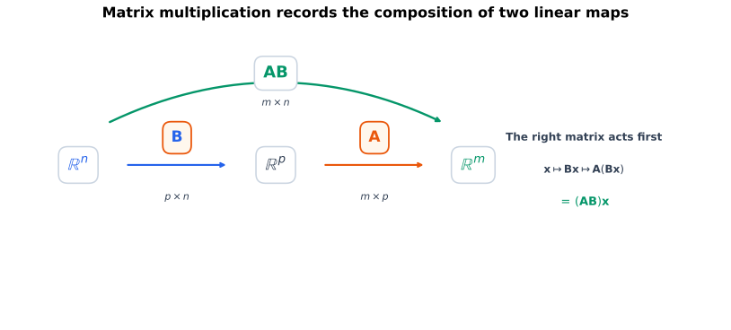
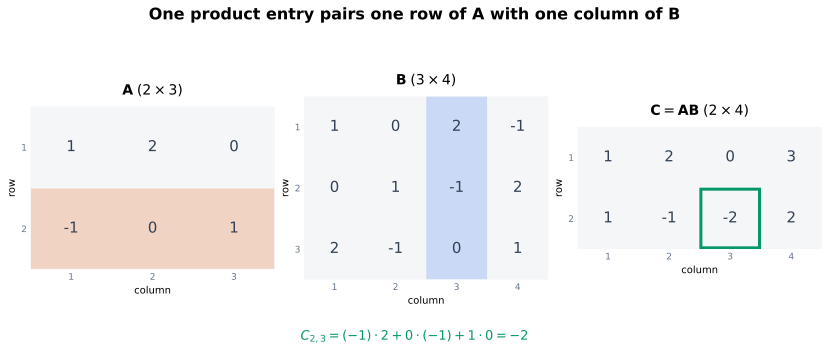
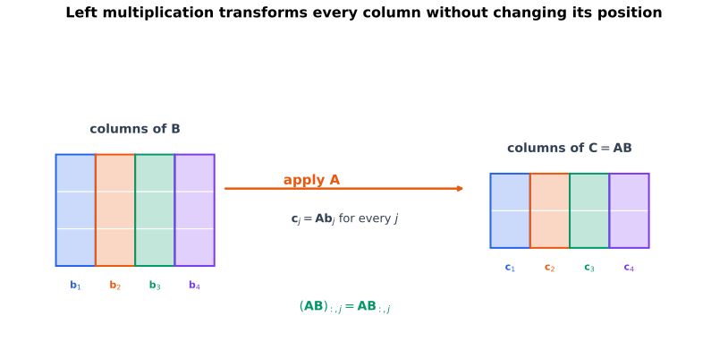
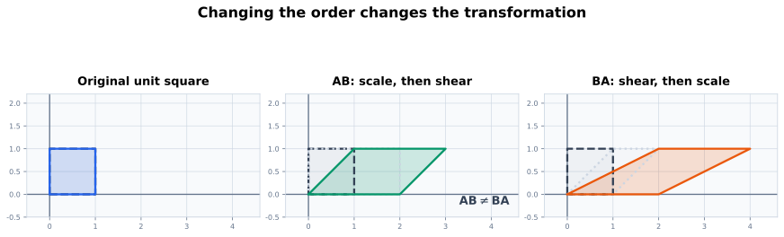

# 从上一页出发：哪个矩阵表示连续两次变换

上一页已经知道，每个线性映射

$$
S:\mathbb{R}^{n}\to\mathbb{R}^{p},
\qquad
T:\mathbb{R}^{p}\to\mathbb{R}^{m}
$$

在标准基下分别由矩阵

$$
\mathbf{B}\in\mathbb{R}^{p\times n},
\qquad
\mathbf{A}\in\mathbb{R}^{m\times p}
$$

唯一表示。对输入 $\mathbf{x}\in\mathbb{R}^{n}$，先应用 $S$，再应用 $T$：

$$
\mathbf{x}
\longrightarrow
\mathbf{B}\mathbf{x}
\longrightarrow
\mathbf{A}(\mathbf{B}\mathbf{x}).
$$

中间结果 $\mathbf{B}\mathbf{x}$ 属于 $\mathbb{R}^{p}$，恰好是 $\mathbf{A}$ 可以接收的输入。既然复合映射

$$
T\circ S:\mathbb{R}^{n}\to\mathbb{R}^{m}
$$

仍然是线性映射，它也应该有一个唯一的标准矩阵。本页要找的正是这个矩阵。

# 本页要回答的问题

读完并动手验算后，我希望能回答：

1. 为什么线性映射复合会自然产生矩阵乘法；
2. 怎样判断 $\mathbf{A}\mathbf{B}$ 是否有定义，以及结果的形状；
3. 为什么 $(\mathbf{A}\mathbf{B})_{ij}$ 是 $\mathbf{A}$ 第 $i$ 行与 $\mathbf{B}$ 第 $j$ 列的内积；
4. 怎样从行列配对、列与标准基、行组合和函数复合四个角度理解同一个乘积；
5. 为什么右边的矩阵先作用，以及为什么矩阵乘法一般不能交换顺序；
6. 为什么矩阵乘法满足结合律；
7. 为什么乘积转置会反转顺序；
8. 两个仿射层连续作用时，权重和偏置怎样合并；
9. 数学中的列向量复合怎样对应 NumPy 的批量行布局；
10. 矩阵乘法怎样把这页笔记带到线性方程组与消元。

# 先确认：线性映射的复合仍然线性

取任意

$$
\mathbf{x},\mathbf{z}\in\mathbb{R}^{n},
\qquad
\alpha,\beta\in\mathbb{R}.
$$

因为 $S$ 与 $T$ 都线性：

$$
\begin{aligned}
(T\circ S)(\alpha\mathbf{x}+\beta\mathbf{z})
&=
T\!\left(S(\alpha\mathbf{x}+\beta\mathbf{z})\right)\\
&=
T\!\left(\alpha S(\mathbf{x})+\beta S(\mathbf{z})\right)\\
&=
\alpha T(S(\mathbf{x}))
+
\beta T(S(\mathbf{z}))\\
&=
\alpha(T\circ S)(\mathbf{x})
+
\beta(T\circ S)(\mathbf{z}).
\end{aligned}
$$

所以 $T\circ S$ 线性。由上一页的标准矩阵表示结论，它必定有唯一矩阵

$$
\mathbf{C}\in\mathbb{R}^{m\times n}.
$$

矩阵乘法的定义并不是随意规定一套数字运算；它要让 $\mathbf{C}$ 精确表示这个复合映射。

# 矩阵乘法的定义与形状

设

$$
\mathbf{A}\in\mathbb{R}^{m\times p},
\qquad
\mathbf{B}\in\mathbb{R}^{p\times n}.
$$

矩阵乘积

$$
\mathbf{C}
=
\mathbf{A}\mathbf{B}
\in
\mathbb{R}^{m\times n}
$$

按元素定义为

$$
C_{ij}
\coloneqq
\sum_{k=1}^{p}A_{ik}B_{kj},
\qquad
i\in\{1,\ldots,m\},
\quad
j\in\{1,\ldots,n\}.
$$ {#eq-matrix-product-definition}

形状检查为

$$
\underbrace{\mathbf{A}}_{m\times p}
\underbrace{\mathbf{B}}_{p\times n}
=
\underbrace{\mathbf{A}\mathbf{B}}_{m\times n}.
$$ {#eq-matrix-product-shape}

我需要记住的不是“消掉中间两个字母”，而是：

- $p$ 是中间空间的维数；
- $\mathbf{B}$ 把 $n$ 维输入送到 $p$ 维中间表示；
- $\mathbf{A}$ 再把 $p$ 维中间表示送到 $m$ 维输出；
- 结果矩阵因此接受 $n$ 维输入并产生 $m$ 维输出。

{#fig-composition-spaces fig-alt="三个空间 R 的 n 次方、R 的 p 次方和 R 的 m 次方依次连接，B 和 A 分别标在两段箭头上，另有一条标记 AB 的弧线直接连接起点与终点。" width="100%"}

::: {.callout-warning title="形状相容仍然只是必要条件"}
即使两个轴的数值长度碰巧相等，也必须确认它们表达的是同一个中间对象。例如一个轴表示 token 位置、另一个轴表示特征坐标时，不能因为二者都等于 $512$ 就直接相乘。
:::

# 为什么这个定义确实表示复合

对任意 $\mathbf{x}\in\mathbb{R}^{n}$，检查第 $i$ 个分量：

$$
\begin{aligned}
\bigl[(\mathbf{A}\mathbf{B})\mathbf{x}\bigr]_i
&=
\sum_{j=1}^{n}
(\mathbf{A}\mathbf{B})_{ij}x_j\\
&=
\sum_{j=1}^{n}
\left(
\sum_{k=1}^{p}A_{ik}B_{kj}
\right)x_j\\
&=
\sum_{k=1}^{p}A_{ik}
\left(
\sum_{j=1}^{n}B_{kj}x_j
\right)\\
&=
\bigl[\mathbf{A}(\mathbf{B}\mathbf{x})\bigr]_i.
\end{aligned}
$$

这里交换有限求和顺序不会改变结果。因此所有分量都相等：

$$
(\mathbf{A}\mathbf{B})\mathbf{x}
=
\mathbf{A}(\mathbf{B}\mathbf{x}).
$$ {#eq-product-represents-composition}

换成映射记号：

$$
T_{\mathbf{A}}\circ T_{\mathbf{B}}
=
T_{\mathbf{A}\mathbf{B}}.
$$

这条等式解释了乘法顺序：$\mathbf{A}\mathbf{B}\mathbf{x}$ 中离 $\mathbf{x}$ 最近的 $\mathbf{B}$ 先作用，然后才是 $\mathbf{A}$。它与函数复合 $T\circ S$ 的读取顺序一致：先 $S$，后 $T$。

# 一个贯穿本页的长方形例子

取

$$
\mathbf{A}
=
\begin{bmatrix}
1&2&0\\
-1&0&1
\end{bmatrix}
\in\mathbb{R}^{2\times3},
$$

以及

$$
\mathbf{B}
=
\begin{bmatrix}
1&0&2&-1\\
0&1&-1&2\\
2&-1&0&1
\end{bmatrix}
\in\mathbb{R}^{3\times4}.
$$

内部维数都是 $3$，所以

$$
\mathbf{C}
=
\mathbf{A}\mathbf{B}
\in\mathbb{R}^{2\times4}.
$$

逐项计算得到

$$
\begin{aligned}
\mathbf{C}
&=
\begin{bmatrix}
1&2&0\\
-1&0&1
\end{bmatrix}
\begin{bmatrix}
1&0&2&-1\\
0&1&-1&2\\
2&-1&0&1
\end{bmatrix}\\
&=
\begin{bmatrix}
1&2&0&3\\
1&-1&-2&2
\end{bmatrix}.
\end{aligned}
$$ {#eq-running-matrix-product}

为了核对复合，再取

$$
\mathbf{x}
=
\begin{bmatrix}
1\\2\\-1\\1
\end{bmatrix}
\in\mathbb{R}^{4}.
$$

先做两段变换：

$$
\mathbf{B}\mathbf{x}
=
\begin{bmatrix}
-2\\5\\1
\end{bmatrix},
\qquad
\mathbf{A}(\mathbf{B}\mathbf{x})
=
\begin{bmatrix}
8\\3
\end{bmatrix}.
$$

使用合并矩阵也得到

$$
(\mathbf{A}\mathbf{B})\mathbf{x}
=
\mathbf{C}\mathbf{x}
=
\begin{bmatrix}
8\\3
\end{bmatrix}.
$$

# 同一个乘积的四种视角

## 视角一：结果元素来自一行与一列的配对

记 $\mathbf{A}$ 第 $i$ 行为 $\mathbf{r}_i^{\mathsf T}\in\mathbb{R}^{1\times p}$，$\mathbf{B}$ 第 $j$ 列为 $\mathbf{b}_j\in\mathbb{R}^{p}$。那么

$$
(\mathbf{A}\mathbf{B})_{ij}
=
\mathbf{r}_i^{\mathsf T}\mathbf{b}_j.
$$ {#eq-product-row-column}

也就是说，要得到结果第 $i$ 行、第 $j$ 列的元素，就取左矩阵第 $i$ 行与右矩阵第 $j$ 列做内积。

在运行例子中：

$$
C_{23}
=
\begin{bmatrix}-1&0&1\end{bmatrix}
\begin{bmatrix}2\\-1\\0\end{bmatrix}
=(-1)\cdot2+0\cdot(-1)+1\cdot0
=-2.
$$

{#fig-matrix-product-entry fig-alt="三个并排矩阵中，A 的第二行被橙色标出，B 的第三列被蓝色标出，乘积 C 的第二行第三列元素负二被绿色边框标出。" width="100%"}

“行乘列”是有效的计算规则，但它只解释一个元素。为了理解整个乘积，还需要下面几个视角。

## 视角二：左乘矩阵逐列变换右矩阵

把 $\mathbf{B}$ 与 $\mathbf{C}=\mathbf{A}\mathbf{B}$ 分别写成列：

$$
\mathbf{B}
=
\begin{bmatrix}
\vert&&\vert\\
\mathbf{b}_1&\cdots&\mathbf{b}_n\\
\vert&&\vert
\end{bmatrix},
\qquad
\mathbf{C}
=
\begin{bmatrix}
\vert&&\vert\\
\mathbf{c}_1&\cdots&\mathbf{c}_n\\
\vert&&\vert
\end{bmatrix}.
$$

那么

$$
\mathbf{A}\mathbf{B}
=
\begin{bmatrix}
\vert&&\vert\\
\mathbf{A}\mathbf{b}_1&\cdots&\mathbf{A}\mathbf{b}_n\\
\vert&&\vert
\end{bmatrix}.
$$

因此第 $j$ 列满足

$$
(\mathbf{A}\mathbf{B})_{:,j}
=
\mathbf{A}\mathbf{B}_{:,j}.
$$ {#eq-product-column-view}

对运行例子的第三列：

$$
\mathbf{B}_{:,3}
=
\begin{bmatrix}
2\\-1\\0
\end{bmatrix},
\qquad
\mathbf{A}\mathbf{B}_{:,3}
=
\begin{bmatrix}
0\\-2
\end{bmatrix}
=
\mathbf{C}_{:,3}.
$$

{#fig-product-columns fig-alt="左侧是由四个彩色列组成的三行矩阵 B，经过标记为应用 A 的箭头后，右侧得到保持四列颜色与次序的两行矩阵 C。" width="100%"}

这个视角与标准基直接相连，因为

$$
\mathbf{B}\mathbf{e}_j
=
\mathbf{B}_{:,j}.
$$

所以

$$
\mathbf{e}_j
\longrightarrow
\mathbf{B}\mathbf{e}_j
\longrightarrow
\mathbf{A}\mathbf{B}\mathbf{e}_j
=
(\mathbf{A}\mathbf{B})_{:,j}.
$$

乘积第 $j$ 列就是第 $j$ 个标准基方向经过两段映射后的最终位置。

## 视角三：结果的行是右矩阵各行的线性组合

取 $\mathbf{A}$ 第 $i$ 行，可以得到

$$
(\mathbf{A}\mathbf{B})_{i,:}
=
\sum_{k=1}^{p}A_{ik}\mathbf{B}_{k,:}.
$$ {#eq-product-row-view}

因此左矩阵第 $i$ 行的元素，是组合右矩阵各行的系数。运行例子中：

$$
\begin{aligned}
\mathbf{C}_{1,:}
&=
\mathbf{B}_{1,:}+2\mathbf{B}_{2,:}\\
&=
\begin{bmatrix}1&2&0&3\end{bmatrix},\\[4pt]
\mathbf{C}_{2,:}
&=
-\mathbf{B}_{1,:}+\mathbf{B}_{3,:}\\
&=
\begin{bmatrix}1&-1&-2&2\end{bmatrix}.
\end{aligned}
$$

这个视角会直接进入消元：左乘某个矩阵，就是按该矩阵各行给出的系数重新组合原方程的行。

## 视角四：乘积是复合映射的标准矩阵

最整体的理解仍然是

$$
\mathbf{A}\mathbf{B}
\quad\longleftrightarrow\quad
T_{\mathbf{A}}\circ T_{\mathbf{B}}.
$$

分量公式负责计算，行列视角负责解释局部结构，标准基视角说明各列从哪里来，复合视角则说明为什么乘法必须保持这个顺序。

::: {.callout-tip title="我会怎样选择视角"}
- 检查一个元素：看左边一行与右边一列；
- 检查结果各列：对右矩阵每一列应用左矩阵；
- 检查结果各行：用左矩阵一行组合右矩阵各行；
- 检查乘法顺序：把矩阵还原成函数复合；
- 检查 shape：追踪定义域、中间空间和陪域。
:::

# 顺序不能交换

## 有时反向乘法根本没有定义

运行例子中

$$
\mathbf{A}\in\mathbb{R}^{2\times3},
\qquad
\mathbf{B}\in\mathbb{R}^{3\times4}.
$$

$\mathbf{A}\mathbf{B}$ 有定义，因为内部维数都是 $3$。但 $\mathbf{B}\mathbf{A}$ 要求 $4=2$，所以根本没有定义。

## 即使都能相乘，结果通常也不同

取剪切矩阵和非均匀缩放矩阵

$$
\mathbf{A}
=
\begin{bmatrix}
1&1\\
0&1
\end{bmatrix},
\qquad
\mathbf{B}
=
\begin{bmatrix}
2&0\\
0&1
\end{bmatrix}.
$$

则

$$
\mathbf{A}\mathbf{B}
=
\begin{bmatrix}
2&1\\
0&1
\end{bmatrix},
\qquad
\mathbf{B}\mathbf{A}
=
\begin{bmatrix}
2&2\\
0&1
\end{bmatrix}.
$$

所以

$$
\mathbf{A}\mathbf{B}\neq\mathbf{B}\mathbf{A}.
$$

{#fig-matrix-noncommutativity fig-alt="左图是单位正方形，中图先缩放再剪切得到绿色平行四边形，右图先剪切再缩放得到更宽的橙色平行四边形，两者不同。" width="100%"}

乘法不交换不是纯符号现象，而是“改变操作顺序通常会改变结果”的代数记录。

# 括号可以移动：结合律

矩阵乘法一般不能交换顺序，但在形状相容时满足结合律。设

$$
\mathbf{D}\in\mathbb{R}^{n\times q},
\qquad
\mathbf{B}\in\mathbb{R}^{p\times n},
\qquad
\mathbf{A}\in\mathbb{R}^{m\times p}.
$$

那么

$$
(\mathbf{A}\mathbf{B})\mathbf{D}
=
\mathbf{A}(\mathbf{B}\mathbf{D}).
$$ {#eq-matrix-associativity}

一种适合当前笔记的证明，是把两边重新解释为映射。对任意 $\mathbf{x}\in\mathbb{R}^{q}$：

$$
\begin{aligned}
\bigl((\mathbf{A}\mathbf{B})\mathbf{D}\bigr)\mathbf{x}
&=
(\mathbf{A}\mathbf{B})(\mathbf{D}\mathbf{x})\\
&=
\mathbf{A}\bigl(\mathbf{B}(\mathbf{D}\mathbf{x})\bigr)\\
&=
\mathbf{A}\bigl((\mathbf{B}\mathbf{D})\mathbf{x}\bigr)\\
&=
\bigl(\mathbf{A}(\mathbf{B}\mathbf{D})\bigr)\mathbf{x}.
\end{aligned}
$$

两边对所有输入作用相同，因此它们表示同一个线性映射；相对于标准基的矩阵表示唯一，所以两个矩阵相等。$\square$

结合律只允许移动括号，不允许改变顺序：

$$
(\mathbf{A}\mathbf{B})\mathbf{D}
=
\mathbf{A}(\mathbf{B}\mathbf{D})
$$

不能推出

$$
\mathbf{A}\mathbf{B}\mathbf{D}
=
\mathbf{B}\mathbf{A}\mathbf{D}.
$$

# 单位矩阵与分配律

对 $\mathbf{A}\in\mathbb{R}^{m\times n}$：

$$
\mathbf{I}_m\mathbf{A}
=
\mathbf{A}
=
\mathbf{A}\mathbf{I}_n.
$$ {#eq-matrix-identity}

左右单位矩阵阶数不同，但都表示在对应空间中“不做改变”。

若

$$
\mathbf{B},\mathbf{D}\in\mathbb{R}^{p\times n},
\qquad
\mathbf{A},\mathbf{E}\in\mathbb{R}^{m\times p},
$$

则矩阵乘法满足分配律：

$$
\mathbf{A}(\mathbf{B}+\mathbf{D})
=
\mathbf{A}\mathbf{B}
+
\mathbf{A}\mathbf{D},
$$

以及

$$
(\mathbf{A}+\mathbf{E})\mathbf{B}
=
\mathbf{A}\mathbf{B}
+
\mathbf{E}\mathbf{B}.
$$

这些性质都可以逐分量验证，也可以理解为线性映射对输入加法以及映射加法的相容性。

# 乘积转置为什么反转顺序

上一页留下了转置与乘积的关系。对

$$
\mathbf{A}\in\mathbb{R}^{m\times p},
\qquad
\mathbf{B}\in\mathbb{R}^{p\times n},
$$

有

$$
(\mathbf{A}\mathbf{B})^{\mathsf T}
=
\mathbf{B}^{\mathsf T}\mathbf{A}^{\mathsf T}.
$$ {#eq-product-transpose}

对

$$
i\in\{1,\ldots,n\},
\qquad
j\in\{1,\ldots,m\},
$$

检查第 $i$ 行、第 $j$ 列元素：

$$
\begin{aligned}
\bigl[(\mathbf{A}\mathbf{B})^{\mathsf T}\bigr]_{ij}
&=
(\mathbf{A}\mathbf{B})_{ji}\\
&=
\sum_{k=1}^{p}A_{jk}B_{ki}\\
&=
\sum_{k=1}^{p}
(\mathbf{B}^{\mathsf T})_{ik}
(\mathbf{A}^{\mathsf T})_{kj}\\
&=
\bigl[\mathbf{B}^{\mathsf T}\mathbf{A}^{\mathsf T}\bigr]_{ij}.
\end{aligned}
$$

所以两边元素全部相等。$\square$

形状也必须相容：

$$
\underbrace{\mathbf{B}^{\mathsf T}}_{n\times p}
\underbrace{\mathbf{A}^{\mathsf T}}_{p\times m}
\in
\mathbb{R}^{n\times m},
$$

恰好与 $(\mathbf{A}\mathbf{B})^{\mathsf T}$ 的形状一致。

为什么顺序要反转？逐分量证明已经给出了直接答案。进一步说，在标准 Euclidean 内积下，转置把一个映射改写成与内积配对相容的反向类型：若 $\mathbf{A}:\mathbb{R}^{p}\to\mathbb{R}^{m}$，则 $\mathbf{A}^{\mathsf T}:\mathbb{R}^{m}\to\mathbb{R}^{p}$。复合中的配对顺序因此反转。这里的“反向类型”不等于撤销原映射；转置一般不是逆矩阵，等笔记整理到内积与伴随映射时再把这件事形式化。

# 两个仿射映射怎样合并

设第一步是

$$
S(\mathbf{x})
=
\mathbf{B}\mathbf{x}+\mathbf{c},
\qquad
\mathbf{c}\in\mathbb{R}^{p},
$$

第二步是

$$
T(\mathbf{y})
=
\mathbf{A}\mathbf{y}+\mathbf{b},
\qquad
\mathbf{b}\in\mathbb{R}^{m}.
$$

复合为

$$
\begin{aligned}
(T\circ S)(\mathbf{x})
&=
\mathbf{A}(\mathbf{B}\mathbf{x}+\mathbf{c})+\mathbf{b}\\
&=
\mathbf{A}\mathbf{B}\mathbf{x}
+
\mathbf{A}\mathbf{c}
+
\mathbf{b}\\
&=
(\mathbf{A}\mathbf{B})\mathbf{x}
+
(\mathbf{A}\mathbf{c}+\mathbf{b}).
\end{aligned}
$$ {#eq-affine-composition}

所以：

- 合并后的权重是 $\mathbf{A}\mathbf{B}$；
- 合并后的偏置是 $\mathbf{A}\mathbf{c}+\mathbf{b}$；
- 第一层偏置 $\mathbf{c}$ 先经过第二层线性部分 $\mathbf{A}$，不能直接写成 $\mathbf{c}+\mathbf{b}$；
- 两个仿射映射的复合仍是仿射映射；
- 当总偏置 $\mathbf{A}\mathbf{c}+\mathbf{b}=\mathbf{0}$ 时，复合结果可以严格线性，即使两个原偏置不分别为零。

这也解释了一个神经网络事实：若多个仿射层之间没有激活函数或其他非线性操作，它们可以合并成一个仿射层。

# NumPy 验证

## 计算乘积与复合

```{python}
#| label: lst-matrix-product
#| echo: true

import numpy as np

A = np.array(
    [
        [1.0, 2.0, 0.0],
        [-1.0, 0.0, 1.0],
    ]
)
B = np.array(
    [
        [1.0, 0.0, 2.0, -1.0],
        [0.0, 1.0, -1.0, 2.0],
        [2.0, -1.0, 0.0, 1.0],
    ]
)
x = np.array([1.0, 2.0, -1.0, 1.0])

C = A @ B
intermediate = B @ x
composed = A @ intermediate
combined = C @ x

print("A.shape =", A.shape)
print("B.shape =", B.shape)
print("C.shape =", C.shape)
print("B @ x =", intermediate)
print("A @ (B @ x) =", composed)

assert A.shape == (2, 3)
assert B.shape == (3, 4)
assert C.shape == (2, 4)
np.testing.assert_allclose(
    C,
    [
        [1.0, 2.0, 0.0, 3.0],
        [1.0, -1.0, -2.0, 2.0],
    ],
)
np.testing.assert_allclose(intermediate, [-2.0, 5.0, 1.0])
np.testing.assert_allclose(composed, [8.0, 3.0])
np.testing.assert_allclose(combined, composed)
```

## 用循环核对分量定义

```{python}
C_by_entries = np.zeros((A.shape[0], B.shape[1]))

for i in range(A.shape[0]):
    for j in range(B.shape[1]):
        for k in range(A.shape[1]):
            C_by_entries[i, j] += A[i, k] * B[k, j]

np.testing.assert_allclose(C_by_entries, C)
print("逐分量循环与 A @ B 一致。")
```

这里 `i` 枚举结果行，`j` 枚举结果列，`k` 枚举中间维数。它与

$$
C_{ij}
=
\sum_{k=1}^{p}A_{ik}B_{kj}
$$

完全对应，只是 Python 索引从 $0$ 开始。

## 批量行布局

本页已经用 $\mathbf{B}$ 表示矩阵，因此把批量样本数记为 $N$。设

$$
\mathbf{X}
\in
\mathbb{R}^{N\times n}
$$

按行存放样本。两段线性映射写成

$$
\mathbf{X}
\mathbf{B}^{\mathsf T}
\mathbf{A}^{\mathsf T}.
$$

利用乘积转置反序：

$$
\mathbf{B}^{\mathsf T}\mathbf{A}^{\mathsf T}
=
(\mathbf{A}\mathbf{B})^{\mathsf T},
$$

所以

$$
\mathbf{X}\mathbf{B}^{\mathsf T}\mathbf{A}^{\mathsf T}
=
\mathbf{X}(\mathbf{A}\mathbf{B})^{\mathsf T}.
$$ {#eq-batch-composition}

```{python}
X = np.stack([x, -x, 0.5 * x])

batch_two_steps = (X @ B.T) @ A.T
batch_one_step = X @ C.T

assert X.shape == (3, 4)
assert batch_two_steps.shape == (3, 2)
np.testing.assert_allclose(batch_two_steps, batch_one_step)

print("批量两段计算与合并矩阵计算一致。")
```

::: {.callout-warning title="一维数组的 `.T` 不会变成列向量"}
对 `x.shape == (n,)`，NumPy 中 `x.T.shape` 仍然是 `(n,)`。若确实需要二维列布局，应使用 `x[:, None]` 或 `x.reshape(n, 1)`。矩阵 `A.T` 才会交换两个显式轴。
:::

## 仿射复合

```{python}
c = np.array([0.5, -1.0, 2.0])
b = np.array([1.0, -0.5])

sequential_affine = (X @ B.T + c) @ A.T + b
combined_weight = A @ B
combined_bias = A @ c + b
combined_affine = X @ combined_weight.T + combined_bias

np.testing.assert_allclose(sequential_affine, combined_affine)
print("仿射层合并检查通过。")
```

也可以在项目根目录独立运行：

```bash
python code/matrix_multiplication.py
```

# 与神经网络和 Transformer 的连接

## 连续线性层为什么会坍缩成一层

若没有偏置和非线性操作：

$$
\mathbf{h}
\longmapsto
\mathbf{W}_1\mathbf{h}
\longmapsto
\mathbf{W}_2\mathbf{W}_1\mathbf{h},
$$

那么两层等价于一层权重 $\mathbf{W}_2\mathbf{W}_1$。加入偏置后仍可合并为一个仿射层，公式就是 @eq-affine-composition。

在这种纯串联的仿射层场景中，中间的非线性通常会阻止合并。例如 MLP：

$$
\mathbf{h}_{\mathrm{out}}
=
\mathbf{W}_2
\sigma(\mathbf{W}_1\mathbf{h}+\mathbf{b}_1)
+
\mathbf{b}_2.
$$

因为一般不能把非线性函数 $\sigma$ 移到矩阵乘法外，所以不能把它简化为单个仿射映射。

## Q、K、V 投影通常是并行分支，不是连续复合

Transformer 中

$$
\mathbf{q}_t=\mathbf{W}_Q\mathbf{h}_t,
\qquad
\mathbf{k}_t=\mathbf{W}_K\mathbf{h}_t,
\qquad
\mathbf{v}_t=\mathbf{W}_V\mathbf{h}_t
$$

都直接作用于同一个隐藏状态。它们是三条并行分支，因此不能因为都叫“投影”就写成

$$
\mathbf{W}_Q\mathbf{W}_K\mathbf{W}_V\mathbf{h}_t.
$$

只有一个输出真正作为下一个映射的输入时，才形成矩阵乘积所描述的复合链。

工程实现仍可以把三组权重沿输出维拼接：

$$
\begin{bmatrix}
\mathbf{q}_t\\
\mathbf{k}_t\\
\mathbf{v}_t
\end{bmatrix}
=
\begin{bmatrix}
\mathbf{W}_Q\\
\mathbf{W}_K\\
\mathbf{W}_V
\end{bmatrix}
\mathbf{h}_t,
$$

一次矩阵乘法后再切分结果。这是在合并并行计算，不是把 $\mathbf{W}_Q$、$\mathbf{W}_K$、$\mathbf{W}_V$ 做矩阵乘积。

## 代码布局仍要追踪转置顺序

单个列向量的两段复合是

$$
\mathbf{A}\mathbf{B}\mathbf{x}.
$$

按行存储的一批样本则是

$$
\mathbf{X}\mathbf{B}^{\mathsf T}\mathbf{A}^{\mathsf T}.
$$

两者顺序看起来相反，是因为每个样本从列布局变成了行布局，同时使用了

$$
(\mathbf{A}\mathbf{B})^{\mathsf T}
=
\mathbf{B}^{\mathsf T}\mathbf{A}^{\mathsf T}.
$$

# 精确代数、浮点数与计算顺序

在精确代数中，结合律保证

$$
(\mathbf{A}\mathbf{B})\mathbf{x}
=
\mathbf{A}(\mathbf{B}\mathbf{x}).
$$

但这不表示两种执行方式在计算机上完全相同。

第一，浮点运算会受到舍入影响，不同括号可能改变求和顺序。在尺度合理、数值条件较好的常见计算中，差异通常较小；但严重消去、溢出、下溢或病态问题可能放大误差，不能保证只影响最后几位。通常应使用与问题尺度相符的容差比较，而不是要求复杂计算链逐位完全相等。

第二，计算成本可能相差很大。对单个向量 $\mathbf{x}$：

- 先算 $\mathbf{B}\mathbf{x}$，再算 $\mathbf{A}(\mathbf{B}\mathbf{x})$，大约需要与 $pn+mp$ 成比例的标量乘加；
- 先显式形成 $\mathbf{A}\mathbf{B}$，再乘 $\mathbf{x}$，完整成本大约与 $mpn+mn$ 成比例，其中 $mpn$ 来自形成乘积，$mn$ 来自再乘向量。

因此代数上可以移动括号，不代表实现中应随意选择括号。具体选择还取决于批量大小、矩阵是否重复使用、硬件和数值库。

# 学习来源备忘

这一页我主要用以下资料交叉核对：

- Strang 的列视角帮助我把乘积理解为“左矩阵作用于右矩阵的每一列”，而不只记行乘列 [@strang2023linear]；
- Axler 的线性映射视角帮助我从复合和标准基的像理解乘法与结合律 [@axler2015linear]；
- 丘维声老师课程所代表的国内高等代数路线帮助我核对乘法性质、证明顺序以及与后续线性方程组的衔接；现有链接仍只是第三方课程录像检索入口 [@qiuAdvancedAlgebraCourse]；
- Boyd 与 Vandenberghe 的应用路线提醒我把代数等式与 shape、批量计算和实际计算成本分开记录 [@boyd2018applied]。

这些参考资料用于检查我的推导和补足视角，不要求这份笔记复现它们的章节结构。

# 我需要反复检查的地方

1. $\mathbf{A}\mathbf{B}$ 的行数来自左矩阵，列数来自右矩阵。
2. 求和指标枚举中间维数：$C_{ij}=\sum_{k=1}^{p}A_{ik}B_{kj}$。
3. 结果元素配对的是左矩阵的一行和右矩阵的一列。
4. $\mathbf{A}\mathbf{B}\mathbf{x}$ 表示先 $\mathbf{B}$、后 $\mathbf{A}$。
5. 结合律允许移动括号，但不允许交换矩阵顺序。
6. $\mathbf{A}\mathbf{B}$ 有定义时，$\mathbf{B}\mathbf{A}$ 可能没有定义。
7. 正确的转置公式是 $(\mathbf{A}\mathbf{B})^{\mathsf T}=\mathbf{B}^{\mathsf T}\mathbf{A}^{\mathsf T}$。
8. 两个仿射层的总偏置是 $\mathbf{A}\mathbf{c}+\mathbf{b}$，不是 $\mathbf{c}+\mathbf{b}$。
9. NumPy 的 `A * B` 是逐元素乘法，`A @ B` 才是矩阵乘法。
10. shape 相容不代表轴语义正确。
11. Q、K、V 通常是并行投影，不能把它们误写成连续矩阵乘积。
12. 精确代数中的结合律不保证不同浮点执行顺序逐位相等或计算成本相同。

# 自检

1. 若 $\mathbf{A}\in\mathbb{R}^{5\times3}$、$\mathbf{B}\in\mathbb{R}^{3\times7}$，说明 $\mathbf{A}\mathbf{B}$ 的形状；$\mathbf{B}\mathbf{A}$ 是否有定义？
2. 对
   $$
   \mathbf{A}=\begin{bmatrix}1&2\\0&-1\end{bmatrix},
   \qquad
   \mathbf{B}=\begin{bmatrix}3&0\\1&4\end{bmatrix},
   $$
   分别计算 $\mathbf{A}\mathbf{B}$ 与 $\mathbf{B}\mathbf{A}$。
3. 用行列配对计算 @eq-running-matrix-product 中的 $C_{14}$。
4. 用列视角计算 @eq-running-matrix-product 的第二列。
5. 用行组合视角重新计算 @eq-running-matrix-product 的第二行。
6. 说明为什么 $(\mathbf{A}\mathbf{B})\mathbf{e}_j$ 是乘积的第 $j$ 列。
7. 用映射复合解释为什么矩阵乘法满足结合律，却一般不满足交换律。
8. 对相容形状的矩阵逐分量证明 $\mathbf{A}(\mathbf{B}+\mathbf{D})=\mathbf{A}\mathbf{B}+\mathbf{A}\mathbf{D}$。
9. 检查 $(\mathbf{A}\mathbf{B})^{\mathsf T}$ 与 $\mathbf{B}^{\mathsf T}\mathbf{A}^{\mathsf T}$ 的形状为什么一致。
10. 若第一层是 $\mathbf{B}\mathbf{x}+\mathbf{c}$，第二层是 $\mathbf{A}\mathbf{y}+\mathbf{b}$，写出合并后的权重和偏置。
11. 解释为什么两个连续 `Linear` 层之间没有非线性时可以合并，而中间加入 ReLU 后通常不能。
12. 设 $\mathbf{X}\in\mathbb{R}^{N\times n}$ 按行存储样本，写出先应用 $\mathbf{B}\in\mathbb{R}^{p\times n}$、再应用 $\mathbf{A}\in\mathbb{R}^{m\times p}$ 的批量公式。
13. 给出一个例子，说明两个 shape 相容的轴在语义上仍可能不应该相乘。
14. 对单个向量，比较先计算 $\mathbf{A}\mathbf{B}$ 与先计算 $\mathbf{B}\mathbf{x}$ 的大致运算量。

# 后续方向：从计算输出到反求输入

到这里，我已经能沿正向计算

$$
\mathbf{y}
=
\mathbf{M}\mathbf{x}.
$$

下一步要把问题反过来：给定 $\mathbf{M}$ 和 $\mathbf{y}$，怎样找到满足

$$
\mathbf{M}\mathbf{x}
=
\mathbf{y}
$$

的 $\mathbf{x}$？解是否存在？若存在，是否唯一？

矩阵乘法已经给出一个关键线索。若左乘某个矩阵 $\mathbf{E}$：

$$
\mathbf{E}(\mathbf{M}\mathbf{x})
=
\mathbf{E}\mathbf{y},
$$

利用结合律可写成

$$
(\mathbf{E}\mathbf{M})\mathbf{x}
=
\mathbf{E}\mathbf{y}.
$$

从行视角看，$\mathbf{E}\mathbf{M}$ 是在重新组合 $\mathbf{M}$ 的行，也就是重新组合方程。后续整理线性方程组与增广矩阵时，我会研究怎样选择不会改变解集的行变换，并逐步得到 Gaussian 消元。

# 小结

矩阵乘法把线性映射的复合记录成一个新矩阵。对 $\mathbf{A}\in\mathbb{R}^{m\times p}$ 和 $\mathbf{B}\in\mathbb{R}^{p\times n}$，乘积属于 $\mathbb{R}^{m\times n}$，元素由左矩阵的一行与右矩阵的一列配对得到。按列看，左乘 $\mathbf{A}$ 会对 $\mathbf{B}$ 每一列应用同一个映射；按行看，$\mathbf{A}$ 的每一行给出重新组合 $\mathbf{B}$ 各行的系数。矩阵乘法不交换但满足结合律，乘积转置会反转顺序，连续仿射层的权重与偏置也可由同一套规则合并。代码中的批量行布局通过转置反序与列向量公式保持一致。

# 参考资料

::: {#refs}
:::
