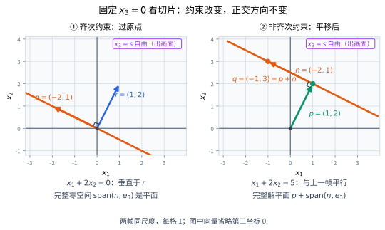
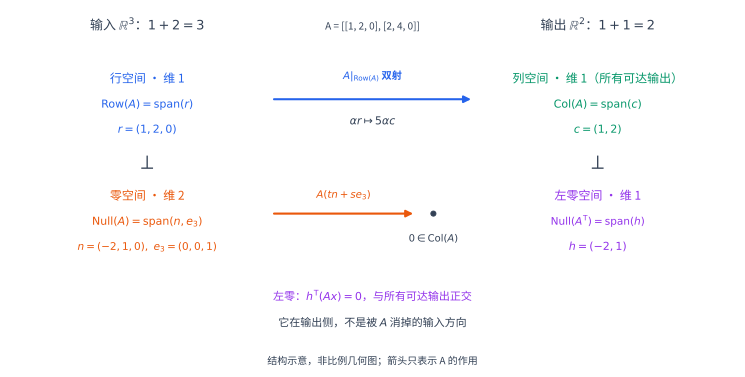
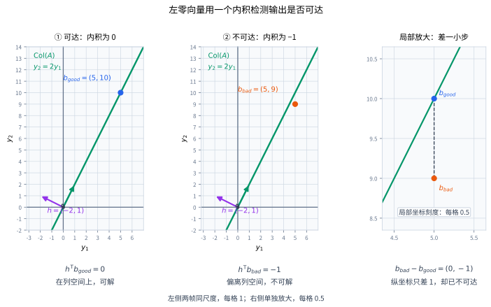
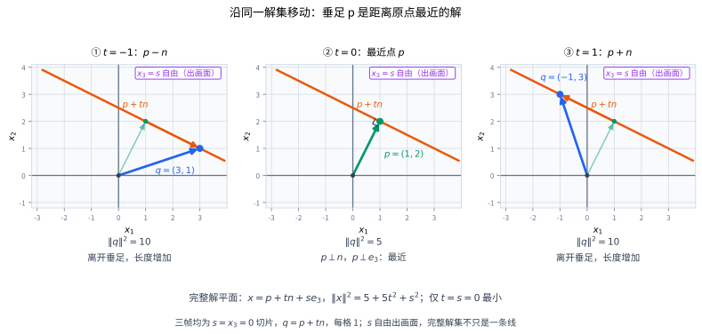

# 方程看不见哪些移动

考虑线性映射

$$
\mathbf A=\begin{bmatrix}1&2&0\\2&4&0\end{bmatrix},
\qquad
\mathbf A\mathbf x
=(x_1+2x_2)\begin{bmatrix}1\\2\end{bmatrix}.
$$ {#eq-four-spaces-running-matrix}

输入有三个坐标，但输出只读取一个数 $x_1+2x_2$。如果沿着

$$
\mathbf n=\begin{bmatrix}-2\\1\\0\end{bmatrix}
$$

移动，第一坐标减少 $2$，第二坐标增加 $1$，两种改变恰好抵消；如果沿 $\mathbf e_3=(0,0,1)^{\mathsf T}$ 移动，输出根本没有读取第三坐标。因此

$$
\mathbf A(\mathbf x+t\mathbf n+s\mathbf e_3)=\mathbf A\mathbf x
\qquad(t,s\in\mathbb R).
$$

输出完全看不见这两个方向的变化。它们张成零空间：

$$
\mathcal N(\mathbf A)
=\{\mathbf x:x_1+2x_2=0\}
=\operatorname{span}(\mathbf n,\mathbf e_3).
$$

这不仅是“两个自由变量”的代数描述。令

$$
\mathbf r=\begin{bmatrix}1\\2\\0\end{bmatrix},
$$

则 $x_1+2x_2=\langle\mathbf r,\mathbf x\rangle$。根据[内积与直线投影](inner-products-angles-and-line-projections.qmd)，这个数读取了输入沿 $\mathbf r$ 方向的有符号分量，再乘以 $\|\mathbf r\|=\sqrt5$。所有与 $\mathbf r$ 垂直的方向都被消掉。

{#fig-orthogonal-complement-constraints fig-alt="在 x3=0 的切片里，r=(1,2) 与 x1+2x2=0 的直线垂直；第二帧是 x1+2x2=5 的平行线，包含 p=(1,2) 和 p+(-2,1)=(-1,3)。完整约束集合还沿 x3 方向延伸。" width="100%"}

图中只画 $x_3=0$ 的切片。**整个零空间是三维输入空间中的一个平面，不是图里的那条线。** $\mathbf r$ 是这个平面的法向量：它与平面中的每个方向都正交。

# 与一个子空间的所有方向正交

## 正交补的定义

设 $V$ 是有限维实内积空间，$U\subseteq V$ 是子空间。定义

$$
\boxed{
U^\perp=\{\mathbf v\in V:
\langle\mathbf v,\mathbf u\rangle=0
\text{ 对所有 }\mathbf u\in U\}.
}
$$ {#eq-orthogonal-complement}

这叫作 $U$ 在 $V$ 中的**正交补**。符号取决于环境空间和内积：同一条直线在平面中的正交补是一条直线，在三维空间中的正交补却是一个平面。

对开头的例子，在标准内积下，

$$
\operatorname{span}(\mathbf r)^\perp=\mathcal N(\mathbf A).
$$

正交补不是“所有不属于 $U$ 的向量”。例如，平面中水平轴的正交补是竖直轴，斜向箭头既不属于水平轴，也未必属于它的正交补。

## 只检查一组基就够了

若 $U=\operatorname{span}(\mathbf u_1,\ldots,\mathbf u_k)$，则

$$
\mathbf v\in U^\perp
\quad\Longleftrightarrow\quad
\langle\mathbf v,\mathbf u_i\rangle=0
\quad(i=1,\ldots,k).
$$

向右的方向来自定义。反过来，任意 $\mathbf u\in U$ 都可写成 $\sum_i a_i\mathbf u_i$，故

$$
\langle\mathbf v,\mathbf u\rangle
=\sum_i a_i\langle\mathbf v,\mathbf u_i\rangle=0.
$$

因此“对无限多个向量都成立”的条件，可以用有限个生成方向来检查；这些方向甚至不必线性无关。

## 为什么它仍是子空间

若 $\mathbf v,\mathbf w\in U^\perp$，对任意 $a,b\in\mathbb R$ 及 $\mathbf u\in U$，

$$
\langle a\mathbf v+b\mathbf w,\mathbf u\rangle
=a\langle\mathbf v,\mathbf u\rangle+b\langle\mathbf w,\mathbf u\rangle=0.
$$

所以 $U^\perp$ 对线性组合封闭，且包含零向量，因而是子空间。

若 $\mathbf z\in U\cap U^\perp$，它属于 $U$，又与 $U$ 中每个向量正交，特别有

$$
\langle\mathbf z,\mathbf z\rangle=0.
$$

正定性给出 $\mathbf z=0$，于是

$$
\boxed{U\cap U^\perp=\{0\}.}
$$ {#eq-orthogonal-intersection}

这已经保证：若某向量能写成 $\mathbf u+\mathbf w$，其中 $\mathbf u\in U$、$\mathbf w\in U^\perp$，分解就只能有一种。但**是否每个向量都能这样写**，还没有证明。

# 垂直方向的维数为什么正好补齐

设 $\dim V=n$、$\dim U=k$。如果 $k=0$，则 $U=\{0\}$，每个向量都与零向量正交，所以 $U^\perp=V$，结论直接成立。以下设 $k>0$。

取 $U$ 的一组基 $\mathbf u_1,\ldots,\mathbf u_k$，把 $k$ 个内积组织成一个线性映射：

$$
\Phi:V\to\mathbb R^k,
\qquad
\Phi(\mathbf v)=
\begin{bmatrix}
\langle\mathbf v,\mathbf u_1\rangle\\
\vdots\\
\langle\mathbf v,\mathbf u_k\rangle
\end{bmatrix}.
$$

它记录一个向量与这些基方向的配对。刚才的生成组判据说明

$$
\ker\Phi=U^\perp.
$$

剩下的问题是：这 $k$ 个约束是否独立？不能仅凭它们有 $k$ 个就断言秩为 $k$。

## Gram 矩阵保证这些约束独立

令

$$
\mathbf G=(\langle\mathbf u_j,\mathbf u_i\rangle)_{i,j=1}^k.
$$

它的第 $j$ 列正是 $\Phi(\mathbf u_j)$。证明 $\mathbf G$ 可逆即可证明 $\Phi$ 满射。

若 $\mathbf G\mathbf a=0$，令 $\mathbf u=\sum_j a_j\mathbf u_j$。矩阵等式逐项表示

$$
\langle\mathbf u,\mathbf u_i\rangle=0\qquad(i=1,\ldots,k).
$$

于是

$$
\langle\mathbf u,\mathbf u\rangle
=\sum_i a_i\langle\mathbf u,\mathbf u_i\rangle=0.
$$

正定性给出 $\mathbf u=0$；基的线性无关性再给出 $\mathbf a=0$。因此 $\mathbf G$ 的核只有零向量，作为 $k\times k$ 方阵它可逆，其列张成 $\mathbb R^k$。这些列又属于 $\Phi$ 的像，所以 $\operatorname{rank}\Phi=k$。

由已经证明的秩—零度定理，

$$
\boxed{\dim U^\perp=n-k=\dim V-\dim U.}
$$ {#eq-orthogonal-complement-dimension}

这没有预先使用正交基或正交化算法。正定性保证约束独立，秩—零度把约束数转成剩余维数。

## 从维数得到唯一正交分解

因为 $U\cap U^\perp=\{0\}$，子空间和的维数公式给出

$$
\dim(U+U^\perp)=k+(n-k)-0=n.
$$

$U+U^\perp$ 是 $V$ 的同维子空间，故等于 $V$。因此

$$
\boxed{V=U\oplus U^\perp.}
$$ {#eq-orthogonal-direct-sum}

也就是说，每个 $\mathbf v\in V$ 都可以且只能写成

$$
\mathbf v=\mathbf p+\mathbf e,
\qquad \mathbf p\in U,\quad \mathbf e\in U^\perp.
$$

若还有 $\mathbf v=\mathbf p'+\mathbf e'$，则 $\mathbf p-\mathbf p'=\mathbf e'-\mathbf e$ 同时属于两个子空间，只能为零，这也直接验证了唯一性。

特殊情形同样包含在内：$\{0\}^\perp=V$，$V^\perp=\{0\}$。这些维数与分解结论在这里都以**有限维、正定的实内积**为前提。

## 取两次正交补会回到原子空间

由对称性，$U$ 中每个向量都与 $U^\perp$ 正交，所以

$$
U\subseteq(U^\perp)^\perp.
$$

而

$$
\dim(U^\perp)^\perp=n-(n-k)=k=\dim U.
$$

包含关系加上维数相等，得到

$$
\boxed{(U^\perp)^\perp=U.}
$$ {#eq-double-orthogonal-complement}

还可以检查方向数的关系：若 $U\subseteq W$，与 $W$ 的所有方向正交当然也与 $U$ 正交，因此 $W^\perp\subseteq U^\perp$。原子空间越大，允许的垂直方向越少。

# 正交分解为什么给出最近点

令 $\mathbf v=\mathbf p+\mathbf e$ 是刚才的唯一分解。任取 $\mathbf w\in U$，有

$$
\mathbf v-\mathbf w=(\mathbf p-\mathbf w)+\mathbf e.
$$

第一项在 $U$，第二项在 $U^\perp$，因此两项正交。勾股关系给出

$$
\boxed{
\|\mathbf v-\mathbf w\|^2
=\|\mathbf p-\mathbf w\|^2+\|\mathbf e\|^2
\ge\|\mathbf e\|^2.
}
$$ {#eq-subspace-nearest-point}

等号当且仅当 $\mathbf w=\mathbf p$。所以 $\mathbf p$ 是子空间中离 $\mathbf v$ 最近的唯一向量，称为正交投影 $\operatorname{proj}_U(\mathbf v)$。

这是直线投影的同一个论证：先证明正交分解存在，再用勾股证明最近点，不能倒过来把未经证明的最近点当作分解存在的理由。

普通补空间也给出唯一分解，但剩余部分未必垂直，因此不能照搬这个平方和等式。直和是代数性质，最近点是指定内积之后的几何性质。

# 一个矩阵，两边各有一对正交空间

现在回到 $\mathbf A\in\mathbb R^{m\times n}$，并在输入和输出上使用**标准 Euclidean 内积**。四个基本子空间分别是

| 环境 | 子空间 | 定义 |
|---|---|---|
| 输入 $\mathbb R^n$ | 行空间 $\mathcal R(\mathbf A)$ | 各行转成列向量后的张成空间 |
| 输入 $\mathbb R^n$ | 零空间 $\mathcal N(\mathbf A)$ | 被 $\mathbf A$ 映到零的输入 |
| 输出 $\mathbb R^m$ | 列空间 $\mathcal C(\mathbf A)$ | 所有可达到的输出 |
| 输出 $\mathbb R^m$ | 左零空间 $\mathcal N(\mathbf A^{\mathsf T})$ | 被 $\mathbf A^{\mathsf T}$ 映到零的输出空间向量 |

即使 $m=n$，两边的角色仍不同；当 $m\neq n$ 时，连环境维数都不同。不能把它们当成同一个空间里的四个区域。

{#fig-four-subspaces-input-output fig-alt="本例输入 R3 分成一维行空间与二维零空间，输出 R2 分成一维列空间与一维左零空间。A 在行空间和列空间之间给出双射，将零空间送到零；左零空间与全部可达输出正交。这是结构示意而非等比例几何图。" width="100%"}

## 零空间与行空间正交补

记矩阵第 $i$ 行为 $\mathbf r_i^{\mathsf T}$。则

$$
\begin{aligned}
\mathbf x\in\mathcal N(\mathbf A)
&\Longleftrightarrow \mathbf A\mathbf x=0\\
&\Longleftrightarrow \langle\mathbf r_i,\mathbf x\rangle=0
\quad\text{对所有 }i\\
&\Longleftrightarrow \mathbf x\perp\operatorname{span}(\mathbf r_1,\ldots,\mathbf r_m).
\end{aligned}
$$

最后一步用到了“只检查生成组就够了”。这是一串双向等价，因而已经证明

$$
\boxed{\mathcal N(\mathbf A)=\mathcal R(\mathbf A)^\perp.}
$$ {#eq-null-row-orthogonality}

再取两次正交补的结论给出

$$
\boxed{\mathcal R(\mathbf A)=\mathcal N(\mathbf A)^\perp.}
$$ {#eq-row-null-orthogonality}

若秩为 $r$，这与已有维数结论完全吻合：行空间维数为 $r$，零空间维数为 $n-r$。维数不是额外的画图猜测，而是核对两种描述的一致性。

## 左零空间与列空间正交补

将上述结论应用于 $\mathbf A^{\mathsf T}$，注意转置的行空间是原矩阵的列空间，得到

$$
\boxed{
\mathcal N(\mathbf A^{\mathsf T})=\mathcal C(\mathbf A)^\perp,
\qquad
\mathcal C(\mathbf A)=\mathcal N(\mathbf A^{\mathsf T})^\perp.
}
$$ {#eq-left-null-column-orthogonality}

也可以直接看到这个关系。对 $\mathbf x\in\mathbb R^n$、$\mathbf y\in\mathbb R^m$，

$$
\langle\mathbf A\mathbf x,\mathbf y\rangle
=(\mathbf A\mathbf x)^{\mathsf T}\mathbf y
=\mathbf x^{\mathsf T}\mathbf A^{\mathsf T}\mathbf y
=\langle\mathbf x,\mathbf A^{\mathsf T}\mathbf y\rangle.
$$ {#eq-transpose-inner-pairing}

若 $\mathbf A^{\mathsf T}\mathbf y=0$，它与每个可达输出 $\mathbf A\mathbf x$ 都正交；反过来，若右边对所有 $\mathbf x$ 都为零，取 $\mathbf x=\mathbf A^{\mathsf T}\mathbf y$，正定性就迫使 $\mathbf A^{\mathsf T}\mathbf y=0$。

**标准内积的假设不可省略。** 在一般加权内积或任意斜基坐标中，普通转置未必满足同一个配对公式；坐标中的内积必须按其实际度量计算。

# 左零空间如何发现无解的右端

方程 $\mathbf A\mathbf x=\mathbf b$ 有解，当且仅当 $\mathbf b\in\mathcal C(\mathbf A)$。因此

$$
\boxed{
\mathbf A\mathbf x=\mathbf b\text{ 有解}
\quad\Longleftrightarrow\quad
\mathbf y^{\mathsf T}\mathbf b=0
\text{ 对所有 }\mathbf y\in\mathcal N(\mathbf A^{\mathsf T}).
}
$$ {#eq-consistency-left-null}

必要性可以不借助维数直接核对：若 $\mathbf b=\mathbf A\mathbf x$ 且 $\mathbf y^{\mathsf T}\mathbf A=0$，则 $\mathbf y^{\mathsf T}\mathbf b=0$。充分性用到了已证明的 $\mathcal C(\mathbf A)=\mathcal N(\mathbf A^{\mathsf T})^\perp$。

只要找到一个左零向量满足 $\mathbf y^{\mathsf T}\mathbf b\neq0$，就得到无解的证据。相反，与某一个左零向量内积为零未必足够；必须检查整个左零空间的一组基。

## 右端分量的相容性条件

对 @eq-four-spaces-running-matrix，

$$
\mathcal C(\mathbf A)=\operatorname{span}\left\{\begin{bmatrix}1\\2\end{bmatrix}\right\},
\qquad
\mathcal N(\mathbf A^{\mathsf T})
=\operatorname{span}\left\{\begin{bmatrix}-2\\1\end{bmatrix}\right\}.
$$

右端 $\mathbf b=(b_1,b_2)^{\mathsf T}$ 可达的条件就是

$$
-2b_1+b_2=0.
$$

这是消元中“第二个方程减去第一个方程的两倍”产生的相容性条件。左零向量把同一次线性组合记录成向量 $(-2,1)^{\mathsf T}$。

{#fig-left-null-inconsistency fig-alt="列空间是 y2=2y1 的直线。b_good=(5,10) 与左零向量 (-2,1) 内积为零，b_bad=(5,9) 的内积为负一。两帧同尺度，局部细节帮助区分两个右端。" width="100%"}

具体地，

$$
(-2,1)\begin{bmatrix}5\\10\end{bmatrix}=0,
\qquad
(-2,1)\begin{bmatrix}5\\9\end{bmatrix}=-1.
$$

前一个右端有解，后一个无解。输出越接近列空间不代表它已经属于列空间；这里说的是精确相容性，不是带浮点容差的近似判断。

# 矩阵真正传递的是行空间部分

由正交直和，任意输入唯一分解为

$$
\mathbf x=\mathbf x_R+\mathbf x_N,
\qquad
\mathbf x_R\in\mathcal R(\mathbf A),
\quad \mathbf x_N\in\mathcal N(\mathbf A).
$$

于是

$$
\mathbf A\mathbf x=\mathbf A\mathbf x_R.
$$

零空间部分被丢掉，输出只由行空间部分决定。而限制映射

$$
\mathbf A|_{\mathcal R(\mathbf A)}:
\mathcal R(\mathbf A)\to\mathcal C(\mathbf A)
$$

是线性同构，两个方向都可以直接证明：

- **单射：**若 $\mathbf A\mathbf x_R=0$，则 $\mathbf x_R$ 同时属于行空间和零空间；这两个空间正交且交集为零，所以 $\mathbf x_R=0$。
- **满射：**任取 $\mathbf b\in\mathcal C(\mathbf A)$，存在某个 $\mathbf x$ 使 $\mathbf A\mathbf x=\mathbf b$。分解这个 $\mathbf x$ 后，$\mathbf A\mathbf x_R=\mathbf b$，所以每个列空间向量都来自行空间。

这不表示长度和夹角被保留，只表示一一对应。对贯穿例子，令 $\mathbf c=(1,2)^{\mathsf T}$，有

$$
\mathbf A(\alpha\mathbf r)=5\alpha\mathbf c.
$$

输入长度是 $|\alpha|\sqrt5$，输出长度是 $5|\alpha|\sqrt5$，在这一方向上长度被放大了五倍。

若秩为 $r$，四个空间的维数是

| 环境 | 一对正交空间 | 维数 |
|---|---|---|
| 输入 $\mathbb R^n$ | $\mathcal R(\mathbf A)$、$\mathcal N(\mathbf A)$ | $r$、$n-r$ |
| 输出 $\mathbb R^m$ | $\mathcal C(\mathbf A)$、$\mathcal N(\mathbf A^{\mathsf T})$ | $r$、$m-r$ |

左零空间不是“被 $\mathbf A$ 消掉的输入”。它生活在输出侧，被 $\mathbf A^{\mathsf T}$ 消掉，与所有可能输出正交；其中的非零向量不可能同时属于列空间。

# 所有解里，哪一个最短

设 $\mathbf A\mathbf x=\mathbf b$ 相容，取任意特解 $\mathbf x_0$。若 $\mathbf x$ 也是解，则

$$
\mathbf A(\mathbf x-\mathbf x_0)=0.
$$

反过来，对任意 $\mathbf z\in\mathcal N(\mathbf A)$，$\mathbf A(\mathbf x_0+\mathbf z)=\mathbf b$。因此

$$
\boxed{\{\mathbf x:\mathbf A\mathbf x=\mathbf b\}
=\mathbf x_0+\mathcal N(\mathbf A).}
$$ {#eq-affine-solution-nullspace}

分解特解 $\mathbf x_0=\mathbf p+\mathbf z_0$，其中 $\mathbf p$ 在行空间，$\mathbf z_0$ 在零空间。由于 $\mathbf A\mathbf p=\mathbf b$，$\mathbf p$ 也是特解。行空间到列空间的单射性保证，它是唯一位于行空间中的特解。

任意解可写成 $\mathbf x=\mathbf p+\mathbf z$，且两部分正交，所以

$$
\boxed{\|\mathbf x\|^2=\|\mathbf p\|^2+\|\mathbf z\|^2
\ge\|\mathbf p\|^2.}
$$ {#eq-minimum-norm-consistent-solution}

等号仅在 $\mathbf z=0$ 时成立。因此 $\mathbf p$ 是唯一的最小 Euclidean 范数解。这是对**已经相容的方程组，在全部精确解中选最短者**，不是对无解方程组最小化残差，两种问题不能混淆。

## 用同一个例子看完整解平面

对 $\mathbf b=(5,10)^{\mathsf T}$，行空间中的特解是 $\mathbf p=(1,2,0)^{\mathsf T}$。完整解集为

$$
\mathbf x(t,s)=\mathbf p+t\mathbf n+s\mathbf e_3
=\begin{bmatrix}1-2t\\2+t\\s\end{bmatrix},
\qquad t,s\in\mathbb R.
$$

$\mathbf p,\mathbf n,\mathbf e_3$ 两两正交，故

$$
\|\mathbf x(t,s)\|^2=5+5t^2+s^2.
$$

{#fig-orthogonal-affine-solutions fig-alt="同尺度分镜取 t=-1、0、1，解分别为 (3,1,0)、(1,2,0)、(-1,3,0)，长度平方分别为十、五、十。完整解还有 x3=s 的自由方向，长度平方再增加 s平方。" width="100%"}

图中 $s=0$ 的直线只是解平面的切片；完整解集沿 $\mathbf e_3$ 延伸。只有 $t=s=0$ 才取最小长度，加入任何非零零空间成分都会使解变长。

# 精确计算核对四个空间

下面使用 SymPy 核对结构，不使用数值秩阈值判断精确零空间。库返回的基不必和手选基逐项相同，因此先核对它们确实属于相应空间，再比较维数。

```{python}
#| label: lst-orthogonal-complements-four-spaces
#| echo: true

import sympy as sp

A = sp.Matrix([[1, 2, 0], [2, 4, 0]])
r = sp.Matrix([1, 2, 0])
n = sp.Matrix([-2, 1, 0])
e3 = sp.Matrix([0, 0, 1])
c = sp.Matrix([1, 2])
h = sp.Matrix([-2, 1])

row_basis = A.rowspace()
null_basis = A.nullspace()
column_basis = A.columnspace()
left_null_basis = A.T.nullspace()
assert [len(row_basis), len(null_basis), len(column_basis), len(left_null_basis)] == [1, 2, 1, 1]
assert A.rank() == 1
assert A * n == sp.zeros(2, 1)
assert A * e3 == sp.zeros(2, 1)
assert A.T * h == sp.zeros(3, 1)
assert A * r == 5 * c
for row in row_basis:
    for z in null_basis:
        assert (row * z)[0] == 0
for col in column_basis:
    for y in left_null_basis:
        assert (y.T * col)[0] == 0

b_good, b_bad = sp.Matrix([5, 10]), sp.Matrix([5, 9])
assert (h.T * b_good)[0] == 0
assert (h.T * b_bad)[0] == -1
assert A.row_join(b_good).rank() == A.rank()
assert A.row_join(b_bad).rank() > A.rank()

t, s = sp.symbols("t s", real=True)
p = r
x = p + t * n + s * e3
assert A * x == b_good
assert sp.expand((x.T * x)[0]) == 5 + 5 * t**2 + s**2

# 核对不是正交基时的 Gram 矩阵论证。
B = sp.Matrix.hstack(r, r + e3)
G = B.T * B
assert G == sp.Matrix([[5, 5], [5, 6]])
assert G.rref()[0] == sp.eye(2)
assert len(B.T.nullspace()) == 3 - B.rank()

# 零矩阵、满列秩、满行秩：四个空间仍按各自环境维数配对。
for M in (sp.zeros(2, 3), sp.eye(3)[:, :2], sp.eye(3)[:2, :], A):
    m, ncols = M.shape
    rank = M.rank()
    assert len(M.nullspace()) == ncols - rank
    assert len(M.T.nullspace()) == m - rank
    for row in M.rowspace():
        for z in M.nullspace():
            assert (row * z)[0] == 0
    for col in M.columnspace():
        for y in M.T.nullspace():
            assert (y.T * col)[0] == 0

print("行空间基：", row_basis)
print("零空间基：", null_basis)
print("列空间基：", column_basis)
print("左零空间基：", left_null_basis)
print("全部解：", x.T)
print("长度平方：", sp.expand((x.T * x)[0]))
```

SymPy 的 `rowspace()` 返回行向量，其他三种基在这里均用列向量记录；内积核对的乘法形状因此不同。对浮点矩阵，判断一个方向是否“近似被消掉”还依赖尺度与容差，不能把精确核的定义直接替换为 `== 0`。

# 自检与关键答案

1. 为什么只需与子空间的一组生成向量取内积，而不用检查其中的每个向量？
2. 对 $U=\operatorname{span}((1,2,0)^{\mathsf T})$，分别说明它在三维空间中的正交补，以及在 $x_3=0$ 平面内的正交补。
3. 正交补维数证明中，基的线性无关性和内积的正定性分别用在哪里？
4. 证明 $U\subseteq W$ 推出 $W^\perp\subseteq U^\perp$。当 $U=W$ 时如何核对？
5. 在贯穿例子里，把右端改成 $(5\alpha,10\alpha)^{\mathsf T}$，写出最短特解和全部解。
6. 为什么 $\mathbf A$ 在行空间与列空间之间是一一对应，却未必保持长度？
7. 满列秩的 $m\times n$ 矩阵，其零空间和左零空间维数各是多少？满行秩时又是多少？
8. 如果改用别的正定内积，精确方程的解集会改变吗？最短解可能改变吗？

::: {.callout-note title="核对结果"}
第 2 题：三维正交补为 $\operatorname{span}((-2,1,0)^{\mathsf T},\mathbf e_3)$；限制在 $x_3=0$ 平面内则只有 $\operatorname{span}((-2,1,0)^{\mathsf T})$。第 5 题：最短解为 $\alpha\mathbf r$，全部解为 $\alpha\mathbf r+t\mathbf n+s\mathbf e_3$。第 7 题：满列秩时维数为 $0,m-n$；满行秩时为 $n-m,0$。第 8 题：方程不变，解集不变，但长度度量和相应的最短解可能改变。
:::

# 从子空间的存在转向分量的计算

正交补把维数、方程与几何合在一起：输入中的行空间与零空间互为正交补，输出中的列空间与左零空间互为正交补。一个矩阵消掉零空间成分，把行空间一一送到列空间，而左零空间给出可达输出必须满足的约束。

当右端不属于列空间时，精确方程无解，但列空间中仍有唯一最近点。怎样让残差的平方和最小，并求出产生最近输出的参数？[最小二乘、投影与正规方程](least-squares-projections-and-normal-equations.qmd)将这个几何条件转成可求解的矩阵方程。

# 参考资料

正交补、四个基本子空间与线性方程组的关系可参见 Strang、Boyd 与 Vandenberghe 及 Axler [@strang2023linear; @boyd2018applied; @axler2015linear]。

::: {#refs}
:::
