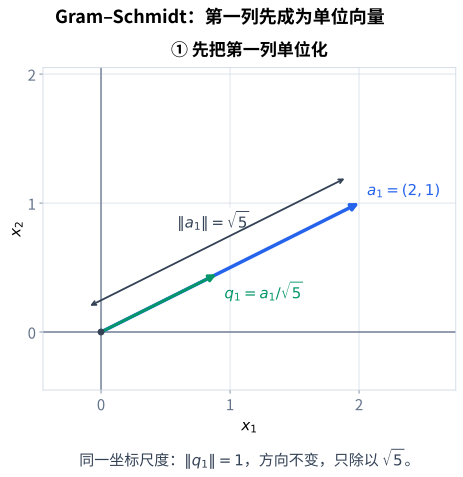
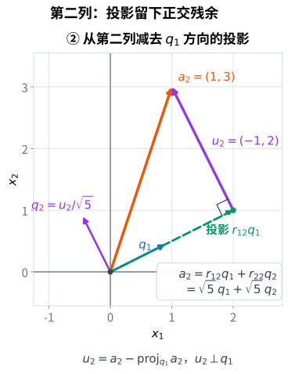
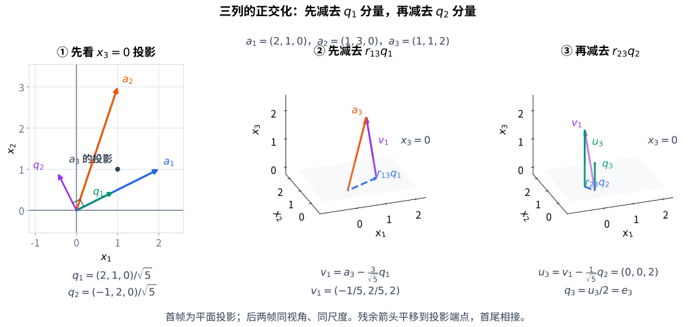
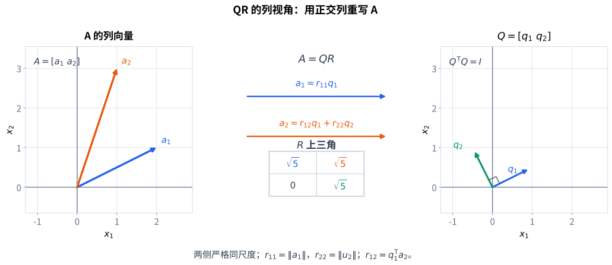
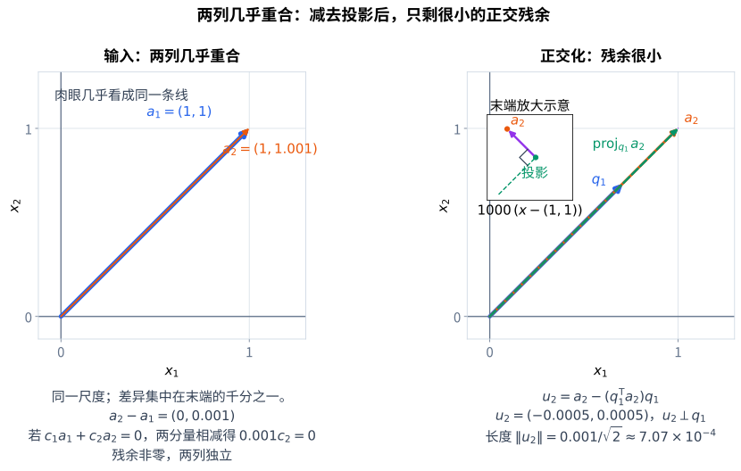

# 已知方向不正交，怎样重新量长度

最小二乘把目标拆成可达输出与正交残差。满列秩时，正规方程给出 $A^{\mathsf T}A\widehat x=A^{\mathsf T}\mathbf b$；若能将列空间改用正交单位方向记录，就可以直接读取分量。面对一组具体列向量，问题变成：

> 怎样只用投影和减法，逐步造出一组彼此正交、同时仍然张成原来空间的方向？

取

$$
\mathbf a_1=\begin{bmatrix}2\\1\end{bmatrix}.
$$

它的长度是 $\sqrt5$。把它除以长度，得到单位方向

$$
\mathbf q_1=\frac{\mathbf a_1}{\|\mathbf a_1\|}
=\frac1{\sqrt5}\begin{bmatrix}2\\1\end{bmatrix},
\qquad \|\mathbf q_1\|=1.
$$

{#fig-orthogonalize-first fig-alt="同一坐标尺度中，蓝色向量 a1=(2,1) 与绿色单位向量 q1 同方向，长度分别为根号五和一。" width="82%"}

归一化没有改变一维子空间：$\operatorname{span}(\mathbf a_1)=\operatorname{span}(\mathbf q_1)$。它只是把以后测量投影的尺子固定为单位长度。

# 第二个正交方向

取

$$
\mathbf a_2=\begin{bmatrix}1\\3\end{bmatrix}.
$$

它既有沿 $\mathbf q_1$ 的部分，也有垂直于 $\mathbf q_1$ 的部分。先算沿已知方向的投影：

$$
\mathbf p_2
=\langle\mathbf q_1,\mathbf a_2\rangle\mathbf q_1.
$$

定义剩余部分

$$
\mathbf u_2=\mathbf a_2-\mathbf p_2.
$$

由上一章的投影公式，

$$
\langle\mathbf q_1,\mathbf u_2\rangle
=\langle\mathbf q_1,\mathbf a_2\rangle
-\langle\mathbf q_1,\mathbf a_2\rangle\langle\mathbf q_1,\mathbf q_1\rangle=0.
$$

所以 $\mathbf u_2$ 与 $\mathbf q_1$ 正交。只要 $\mathbf u_2\neq0$，再归一化：

$$
\mathbf q_2=\frac{\mathbf u_2}{\|\mathbf u_2\|}.
$$

本例中

$$
\langle\mathbf q_1,\mathbf a_2\rangle
=\frac{5}{\sqrt5}=\sqrt5,
$$

$$
\mathbf p_2=\begin{bmatrix}2\\1\end{bmatrix},
\qquad
\mathbf u_2=\begin{bmatrix}-1\\2\end{bmatrix},
\qquad
\|\mathbf u_2\|=\sqrt5,
$$

因此

$$
\mathbf q_2=\frac1{\sqrt5}\begin{bmatrix}-1\\2\end{bmatrix}.
$$

{#fig-gram-schmidt-second fig-alt="橙色 a2=(1,3) 被分成绿色投影 p2=(2,1) 和紫色残余 u2=(-1,2)，残余与 q1 垂直；归一化残余得到 q2。" width="100%"}

于是同一个向量有两种等价记录：

$$
\boxed{
\mathbf a_2=r_{12}\mathbf q_1+r_{22}\mathbf q_2,
\qquad
r_{12}=\langle\mathbf q_1,\mathbf a_2\rangle,
\quad
r_{22}=\|\mathbf u_2\|.
}
$$ {#eq-two-vector-orthogonal-coordinates}

这里 $r_{12}=\sqrt5$、$r_{22}=\sqrt5$。系数不是普通坐标基中随便读出的数字，而是对正交归一方向取内积得到的分量。

## 为什么顺序很重要

Gram–Schmidt 的第二步不是把 $\mathbf a_2$ 直接除以长度。若那样做，得到的方向仍然与 $\mathbf q_1$ 不正交。必须先减去已经保留的方向：

$$
\text{原向量}
\;-
\text{它在旧方向上的投影}
\;=
\text{新方向的残余}.
$$

正交性来自投影公式，归一化只负责让长度变成 $1$。

# 正交基为什么容易读取坐标

一个子空间的基若两两正交，称为**正交基**；若每个基向量还都长为 $1$，称为**正交归一基**。非零且两两正交的向量一定线性无关：对 $\sum_i c_i\mathbf u_i=0$ 与 $\mathbf u_j$ 取内积，得到 $c_j\|\mathbf u_j\|^2=0$，故每个 $c_j=0$。

若 $\mathbf v=\sum_i c_i\mathbf q_i$，且 $\mathbf q_i$ 正交归一，则

$$
\langle\mathbf q_j,\mathbf v\rangle
=\sum_i c_i\langle\mathbf q_j,\mathbf q_i\rangle=c_j.
$$

其他方向不会混入第 $j$ 个读数。因此

$$
\mathbf v=\sum_i\langle\mathbf q_i,\mathbf v\rangle\mathbf q_i,
\qquad
\|\mathbf v\|^2=\sum_i\langle\mathbf q_i,\mathbf v\rangle^2.
$$ {#eq-orthonormal-coordinates-norm}

第二式由平方展开且所有交叉项为零得到。它要求 $\mathbf v$ 属于这组向量张成的空间；若有空间外的正交残余，还要加上残余的平方长度。只有正交而未归一时，坐标应为 $c_j=\langle\mathbf u_j,\mathbf v\rangle/\|\mathbf u_j\|^2$。

# 一般的 Gram–Schmidt 过程

以下矩阵使用标准实内积，输入为 $\mathbb R^m$ 中线性无关的 $\mathbf a_1,\ldots,\mathbf a_k$，其中 $1\le k\le m$。递归构造 $\mathbf q_1,\ldots,\mathbf q_k$：

$$
\mathbf u_1=\mathbf a_1,
\qquad
\mathbf q_1=\frac{\mathbf u_1}{\|\mathbf u_1\|},
$$

对于 $j=2,\ldots,k$，先从 $\mathbf a_j$ 中减去它在已有正交方向上的全部投影：

$$
\boxed{
\mathbf u_j
=\mathbf a_j-
\sum_{i=1}^{j-1}
\langle\mathbf q_i,\mathbf a_j\rangle\mathbf q_i,
\qquad
\mathbf q_j=\frac{\mathbf u_j}{\|\mathbf u_j\|}.
}
$$ {#eq-gram-schmidt}

将“已有方向正交归一”和“前缀张成空间相等”一起作为归纳假设。第一步因 $\mathbf a_1\neq0$ 而成立。假设前 $j-1$ 步成立，则线性无关性保证第 $j$ 步的 $\mathbf u_j\neq0$：若残余为零，就说明

$$
\mathbf a_j=\sum_{i=1}^{j-1}
\langle\mathbf q_i,\mathbf a_j\rangle\mathbf q_i,
$$

由前缀张成空间相等，它落在 $\operatorname{span}(\mathbf a_1,\ldots,\mathbf a_{j-1})$ 中，与输入向量组线性无关矛盾。因而归一化的分母确实非零。

## 证明每一步保持正交

对任意 $\ell<j$，由定义：

$$
\begin{aligned}
\langle\mathbf q_\ell,\mathbf u_j\rangle
&=\langle\mathbf q_\ell,\mathbf a_j\rangle
-\sum_{i=1}^{j-1}
\langle\mathbf q_i,\mathbf a_j\rangle
\langle\mathbf q_\ell,\mathbf q_i\rangle\\
&=\langle\mathbf q_\ell,\mathbf a_j\rangle
-\langle\mathbf q_\ell,\mathbf a_j\rangle\\
&=0.
\end{aligned}
$$

第二行使用了归纳得到的正交归一关系

$$
\langle\mathbf q_\ell,\mathbf q_i\rangle
=\begin{cases}1,&i=\ell,\\0,&i\neq\ell.\end{cases}
$$

因此 $\mathbf u_j$ 与所有先前的 $\mathbf q_i$ 正交，归一化不改变正交性，并且 $\|\mathbf q_j\|=1$。归纳得到

$$
\boxed{
\langle\mathbf q_i,\mathbf q_j\rangle=\delta_{ij},
\qquad
Q^{\mathsf T}Q=I_k.
}
$$ {#eq-orthonormal-columns}

其中 $\delta_{ij}$ 在 $i=j$ 时为 $1$，否则为 $0$，$Q=[\mathbf q_1\ \cdots\ \mathbf q_k]\in\mathbb R^{m\times k}$。

还需闭合关于张成空间的归纳。由构造式，$\mathbf q_j$ 是 $\mathbf a_j$ 与旧 $\mathbf q_i$ 的线性组合，故属于前 $j$ 个输入的张成空间。反过来，将构造式移项，得到 $\mathbf a_j=\sum_{i<j}\langle\mathbf q_i,\mathbf a_j\rangle\mathbf q_i+\|\mathbf u_j\|\mathbf q_j$，所以每个输入也在对应的正交方向张成空间里。两个包含方向合起来，得到

$$
\operatorname{span}(\mathbf a_1,\ldots,\mathbf a_j)
=\operatorname{span}(\mathbf q_1,\ldots,\mathbf q_j).
$$ {#eq-gram-span-preservation}

正交化改变了坐标方向，却没有改变每一步已经生成的子空间。这也证明任意有限维实内积空间都有正交归一基：取一组基，按相同内积运算执行这个过程即可。这里的归纳只使用了实内积的性质；矩阵等式 $Q^{\mathsf T}Q=I_k$ 则专用于标准坐标内积。

若输入中有相关向量，可在精确残余为零时跳过该列，只保留非零新方向，最终得到原张成空间的一组正交归一基。不过此时接受的方向数小于输入列数，不能照搬满列秩 QR 的尺寸与正对角线结论。

# 三向量正交化

在三维中取

$$
\mathbf a_1=\begin{bmatrix}2\\1\\0\end{bmatrix},
\qquad
\mathbf a_2=\begin{bmatrix}1\\3\\0\end{bmatrix},
\qquad
\mathbf a_3=\begin{bmatrix}1\\1\\2\end{bmatrix}.
$$

第三个向量不能只减去 $\mathbf q_1$ 的投影；还要减去它在 $\mathbf q_2$ 方向的投影。每一次都只减去一个已经建立好的正交方向：

$$
\mathbf u_3
=\mathbf a_3
-\langle\mathbf q_1,\mathbf a_3\rangle\mathbf q_1
-\langle\mathbf q_2,\mathbf a_3\rangle\mathbf q_2.
$$

具体算出

$$
r_{13}=\frac3{\sqrt5},\qquad r_{23}=\frac1{\sqrt5},
\qquad
\mathbf v_1=\mathbf a_3-r_{13}\mathbf q_1
=\begin{bmatrix}-1/5\\2/5\\2\end{bmatrix},
$$

$$
\mathbf u_3=\mathbf v_1-r_{23}\mathbf q_2
=\begin{bmatrix}0\\0\\2\end{bmatrix},
\qquad \mathbf q_3=\begin{bmatrix}0\\0\\1\end{bmatrix}.
$$

因为 $\mathbf q_2\perp\mathbf q_1$，有 $\langle\mathbf q_2,\mathbf v_1\rangle=\langle\mathbf q_2,\mathbf a_3\rangle$。所以在精确运算中，先减去第一投影，再读取第二分量，与一次计算两个原向量分量等价。

{#fig-gram-schmidt-three fig-alt="第一帧是 x3=0 的二维投影，不是完整三维向量。后两帧同视角同尺度，从 a3 减去 r13 q1 得到 v1=(-1/5,2/5,2)，再减去 r23 q2 得到 u3=(0,0,2)，归一化为 q3=e3。" width="100%"}

如果第三个残余为零，说明三个输入向量实际只张成一个平面；这不是算法失败，而是它准确发现了线性相关。

# 从 Gram–Schmidt 读出 QR

把输入向量按列排成矩阵

$$
A=\begin{bmatrix}\mathbf a_1&\cdots&\mathbf a_k\end{bmatrix},
\qquad
Q=\begin{bmatrix}\mathbf q_1&\cdots&\mathbf q_k\end{bmatrix}.
$$

定义上三角系数

$$
R_{ij}=\begin{cases}
\langle\mathbf q_i,\mathbf a_j\rangle,&i\le j,\\
0,&i>j.
\end{cases}
$$

为什么 $i>j$ 的位置为零？因为 $\mathbf a_j$ 已经属于前 $j$ 个 $\mathbf q_i$ 张成的空间，所以它与更晚出现的正交方向 $\mathbf q_i$ 正交。

由逐步分解

$$
\mathbf a_j
=\sum_{i=1}^{j}R_{ij}\mathbf q_i
$$

可把所有列同时写成

$$
\boxed{A=QR.}
$$ {#eq-qr-factorization}

{#fig-qr-factorization-columns fig-alt="左侧显示 A 的两列 a1、a2，右侧显示 Q 的两列 q1、q2 和上三角 R；a1=r11 q1，a2=r12 q1 加 r22 q2。两侧保持相同坐标尺度。" width="100%"}

对满列秩的 $A\in\mathbb R^{m\times k}$，$Q\in\mathbb R^{m\times k}$ 的列正交归一，$R\in\mathbb R^{k\times k}$ 是上三角且对角元素为正，因为

$$
R_{jj}=\langle\mathbf q_j,\mathbf a_j\rangle
=\langle\mathbf q_j,\mathbf u_j\rangle
=\|\mathbf u_j\|>0.
$$

这给出**薄 QR（reduced QR）分解**。二维例子的矩阵可以完整写成

$$
\begin{bmatrix}2&1\\1&3\end{bmatrix}
=\underbrace{\frac1{\sqrt5}\begin{bmatrix}2&-1\\1&2\end{bmatrix}}_Q
\underbrace{\begin{bmatrix}\sqrt5&\sqrt5\\0&\sqrt5\end{bmatrix}}_R.
$$

第三列的例子对应

$$
Q_3=\begin{bmatrix}2/\sqrt5&-1/\sqrt5&0\\1/\sqrt5&2/\sqrt5&0\\0&0&1\end{bmatrix},
\qquad
R_3=\begin{bmatrix}\sqrt5&\sqrt5&3/\sqrt5\\0&\sqrt5&1/\sqrt5\\0&0&2\end{bmatrix}.
$$

若 $A$ 是 $m\times m$ 可逆方阵，$Q$ 是正交矩阵。其列线性无关，方阵因此可逆，$Q^{\mathsf T}Q=I$ 给出 $Q^{\mathsf T}=Q^{-1}$，从而满足

$$
Q^{\mathsf T}Q=QQ^{\mathsf T}=I_m,
$$

而 $R$ 是对角线为正的上三角矩阵。对一般长方形 $Q$，则只有 $Q^{\mathsf T}Q=I_k$；$Q$ 把坐标 $\mathbf c\in\mathbb R^k$ 等距送入列空间，因为 $\|Q\mathbf c\|^2=\mathbf c^{\mathsf T}Q^{\mathsf T}Q\mathbf c=\|\mathbf c\|^2$。它不是整个 $\mathbb R^m$ 上的可逆变换。

当 $m>k$ 时，也可以给 $\mathcal C(Q)^\perp$ 选正交归一基，拼成方阵 $\widehat Q=[Q\ Q_\perp]\in\mathbb R^{m\times m}$，并令 $\widehat R=\begin{bmatrix}R\\0\end{bmatrix}\in\mathbb R^{m\times k}$，得到完整 QR：$A=\widehat Q\widehat R$。新增的基可以不同，完整 $\widehat Q$ 因而不由 $A$ 唯一决定。$m=k$ 时没有新增列，完整分解就是原来的方阵分解。

## QR 的唯一性规范

对固定列顺序、满列秩的 $A\in\mathbb R^{m\times k}$，若要求薄分解中的 $Q$ 有 $k$ 个正交归一列、$R$ 上三角且 $R_{jj}>0$，则分解唯一。Gram–Schmidt 已经给出一种构造；证明唯一性可从第一列开始：

$$
\mathbf a_1=r_{11}\mathbf q_1,
\qquad r_{11}>0.
$$

所以 $r_{11}=\|\mathbf a_1\|$、$\mathbf q_1=\mathbf a_1/r_{11}$ 唯一。假设前 $j-1$ 个方向已经唯一。将第 $j$ 列等式与各个 $\mathbf q_i$ 取内积，强制得到 $R_{ij}=\langle\mathbf q_i,\mathbf a_j\rangle$（$i<j$）；因而

$$
\mathbf u_j=\mathbf a_j-
\sum_{i=1}^{j-1}R_{ij}\mathbf q_i
$$

由与先前列正交的条件唯一确定；正对角线规范再唯一确定

$$
R_{jj}=\|\mathbf u_j\|,
\qquad \mathbf q_j=\mathbf u_j/R_{jj}.
$$

归纳完成唯一性。若允许 $R_{jj}$ 任意非零，$\mathbf q_j$ 可以与 $R$ 的第 $j$ 行同时变号，乘积 $QR$ 不变，因此必须加符号规范。正交化的列顺序若改变，一般也会得到不同的正交方向。

# 线性无关性与近相关性

Gram–Schmidt 的精确证明要求输入列线性无关；数值计算中还要关心一个不同的问题：残余虽然不为零，但可能非常小。

取

$$
\mathbf a_1=\begin{bmatrix}1\\1\end{bmatrix},
\qquad
\mathbf a_2=\begin{bmatrix}1\\1.001\end{bmatrix}.
$$

若 $c_1\mathbf a_1+c_2\mathbf a_2=0$，将第二坐标方程减去第一坐标方程，得到 $0.001c_2=0$，进而 $c_1=c_2=0$。因此两列线性无关，但第二个方向几乎落在第一条直线上。正交化后，第二个残余只有约 $7.07\times10^{-4}$。

{#fig-orthogonal-nearly-dependent fig-alt="左图两个输入向量几乎重合，右图显示从第二向量减去第一方向投影后得到很短的正交残余；残余虽小但非零，两列仍线性无关。" width="86%"}

其精确残余为 $\mathbf u_2=(-0.0005,0.0005)^{\mathsf T}$，长度为 $0.001/\sqrt2$。这是两个量级约为 $1$ 的向量相减得到的小量，归一化还要除以这个小长度。因此中间计算的舍入可能显著影响所得方向；精确证明中的零内积不保证浮点结果也严格为零。

这里给出的公式称为 classical Gram–Schmidt：各系数从原列 $\mathbf a_j$ 读取。若每减去一个投影就从当前残余重新读取下一系数，称为 modified Gram–Schmidt。二者在精确运算下相同，在浮点数下可以不同；改写计算顺序也不意味着近相关性消失。

# 投影矩阵与正交投影的代数形式

若 $Q\in\mathbb R^{m\times k}$ 列正交归一，则列空间上的正交投影为

$$
\boxed{P=QQ^{\mathsf T}.}
$$ {#eq-orthogonal-projector-qr}

对任意 $\mathbf v$，$Q^{\mathsf T}\mathbf v$ 收集它与各个正交单位方向的分量，再由 $Q$ 把这些分量合成为列空间中的向量。验证：

$$
P^2=QQ^{\mathsf T}QQ^{\mathsf T}=Q(Q^{\mathsf T}Q)Q^{\mathsf T}=P,
$$

$$
P^{\mathsf T}=P,
$$

且 $P\mathbf v\in\mathcal C(Q)$。残余满足

$$
Q^{\mathsf T}(\mathbf v-P\mathbf v)
=Q^{\mathsf T}\mathbf v-Q^{\mathsf T}QQ^{\mathsf T}\mathbf v=0,
$$

所以与 $\mathcal C(Q)$ 正交。这正是上一章的正交分解。

如果基列不正交归一，不能把投影直接写成 $QQ^{\mathsf T}$；那时各方向的投影会互相混合，需要先处理 Gram 矩阵。正交归一化的价值正在这里：每个分量可以独立读取。

## 投影与基的选择无关

$P$ 的像恰好是 $\mathcal C(Q)$：输出总在列空间中，而 $P(Q\mathbf c)=Q\mathbf c$，所以列空间内每个向量都被固定。其核是 $\mathcal C(Q)^\perp$：$Q^{\mathsf T}\mathbf v=0$ 显然推出 $P\mathbf v=0$；反过来 $P\mathbf v=0$ 左乘 $Q^{\mathsf T}$ 也得到 $Q^{\mathsf T}\mathbf v=0$。

若换成同一子空间的另一组正交归一基，所得投影仍相同，因为子空间的正交分解唯一。这一点与 QR 的列顺序可能改变并不矛盾：基向量可以变，投影所指向的子空间没变。

例如把二维 $Q$ 的两列添上零的第三坐标，得到 $Q_{\mathrm{thin}}\in\mathbb R^{3\times2}$，则

$$
Q_{\mathrm{thin}}^{\mathsf T}Q_{\mathrm{thin}}=I_2,
\qquad Q_{\mathrm{thin}}Q_{\mathrm{thin}}^{\mathsf T}
=\begin{bmatrix}1&0&0\\0&1&0\\0&0&0\end{bmatrix}\neq I_3.
$$

它将 $(1,3,4)^{\mathsf T}$ 投到 $(1,3,0)^{\mathsf T}$，丢掉的是垂直于列空间的第三坐标。

# 相容方程如何变成三角求解

若满列秩矩阵 $A=QR$ 且 $\mathbf b\in\mathcal C(A)$，则

$$
A\mathbf x=\mathbf b
\quad\Longleftrightarrow\quad
R\mathbf x=Q^{\mathsf T}\mathbf b.
$$

向右的推导是左乘 $Q^{\mathsf T}$；反过来左乘 $Q$，利用 $QQ^{\mathsf T}\mathbf b=\mathbf b$。由于 $R$ 的对角线非零，可用已经建立的回代求得唯一解，不必形成逆矩阵。

若 $\mathbf b\notin\mathcal C(A)$，同一个三角系统仍能求解，但此时 $A\mathbf x=QQ^{\mathsf T}\mathbf b$，不是 $\mathbf b$。它匹配的是右端的投影，由[最小二乘的正交残差判据](least-squares-projections-and-normal-equations.qmd)可知，这正是唯一最小二乘解。于是无需形成 $A^{\mathsf T}A$，只需计算 $Q^{\mathsf T}\mathbf b$ 并回代求解。“精确求解原方程”与“匹配可达的最近输出”仍须区分。

# NumPy 与 SymPy 核对

```{python}
#| label: lst-gram-schmidt-qr
#| echo: true

import numpy as np
import sympy as sp


def gram_schmidt(A, rtol=1e-12):
    if np.iscomplexobj(A):
        raise ValueError("本实现只处理实矩阵")
    A = np.asarray(A, dtype=float)
    if A.ndim != 2 or not np.isfinite(A).all():
        raise ValueError("A 必须是元素有限的二维实数组")
    m, k = A.shape
    if not 1 <= k <= m:
        raise ValueError("需要 1 <= 列数 <= 行数")
    if not np.isfinite(rtol) or rtol < 0:
        raise ValueError("rtol 必须是有限非负数")
    column_norms = np.linalg.norm(A, axis=0)
    if not np.isfinite(column_norms).all():
        raise ValueError("列长度溢出，请先调整输入尺度")
    Q = np.zeros((m, k))
    R = np.zeros((k, k))
    for j in range(k):
        u = A[:, j].copy()
        for i in range(j):
            R[i, j] = Q[:, i] @ A[:, j]
            u -= R[i, j] * Q[:, i]
        R[j, j] = np.linalg.norm(u)
        if not np.isfinite(R[j, j]) or R[j, j] <= rtol * column_norms[j]:
            raise np.linalg.LinAlgError("残余为零、过小或非有限；不能可靠地建立新方向")
        Q[:, j] = u / R[j, j]
    return Q, R

A_np = np.array([[2.0, 1.0], [1.0, 3.0]])
Q_np, R_np = gram_schmidt(A_np)
np.testing.assert_allclose(Q_np.T @ Q_np, np.eye(2), atol=1e-12)
np.testing.assert_allclose(Q_np @ R_np, A_np, atol=1e-12)
assert np.allclose(R_np[np.tril_indices(2, -1)], 0.0)
assert np.all(np.diag(R_np) > 0)

P_np = Q_np @ Q_np.T
np.testing.assert_allclose(P_np @ P_np, P_np, atol=1e-12)
np.testing.assert_allclose(P_np.T, P_np, atol=1e-12)

near = np.array([[1.0, 1.0], [1.0, 1.001]])
Q_near, R_near = gram_schmidt(near)
np.testing.assert_allclose(Q_near.T @ Q_near, np.eye(2), atol=1e-12)
np.testing.assert_allclose(Q_near @ R_near, near, atol=1e-12)
np.testing.assert_allclose(R_near[1, 1], 0.001 / np.sqrt(2.0), atol=1e-12)

A_exact = sp.Matrix([[2, 1], [1, 3]])
Q_exact = sp.Matrix([[2, -1], [1, 2]]) / sp.sqrt(5)
R_exact = sp.Matrix([[sp.sqrt(5), sp.sqrt(5)], [0, sp.sqrt(5)]])
assert Q_exact.T * Q_exact == sp.eye(2)
assert Q_exact * R_exact == A_exact

# 长方形 Q 的 QQ.T 是投影，不是整个环境空间上的恒等矩阵。
A_thin = np.vstack((A_np, np.zeros((1, 2))))
Q_thin, R_thin = gram_schmidt(A_thin)
P_thin = Q_thin @ Q_thin.T
np.testing.assert_allclose(Q_thin.T @ Q_thin, np.eye(2), atol=1e-12)
np.testing.assert_allclose(Q_thin @ R_thin, A_thin, atol=1e-12)
np.testing.assert_allclose(P_thin, np.diag([1.0, 1.0, 0.0]), atol=1e-12)
v = np.array([1.0, 3.0, 4.0])
np.testing.assert_allclose(P_thin @ v, [1.0, 3.0, 0.0], atol=1e-12)
np.testing.assert_allclose(Q_thin.T @ (v - P_thin @ v), 0.0, atol=1e-12)

A_three = np.array([[2.0, 1.0, 1.0], [1.0, 3.0, 1.0], [0.0, 0.0, 2.0]])
Q_three, R_three = gram_schmidt(A_three)
np.testing.assert_allclose(Q_three.T @ Q_three, np.eye(3), atol=1e-12)
np.testing.assert_allclose(Q_three @ R_three, A_three, atol=1e-12)
np.testing.assert_allclose(R_three[:, 2], [3 / np.sqrt(5), 1 / np.sqrt(5), 2])

for scale in (1e-8, 1e8):
    Q_scaled, R_scaled = gram_schmidt(scale * A_np)
    np.testing.assert_allclose(Q_scaled, Q_np, atol=1e-12)
    np.testing.assert_allclose(R_scaled / scale, R_np, atol=1e-12)

for invalid in (np.zeros((2, 1)), np.array([[1.0, 2.0], [1.0, 2.0]])):
    try:
        gram_schmidt(invalid)
    except np.linalg.LinAlgError:
        pass
    else:
        raise AssertionError("零列或相关列应被拒绝")
for invalid in (np.ones((2, 3)), np.array([[np.nan]]), np.array([[1j]])):
    try:
        gram_schmidt(invalid)
    except ValueError:
        pass
    else:
        raise AssertionError("非法输入应被拒绝")
print("Q =\n", Q_np)
print("R =\n", R_np)
print("projector idempotence error =", np.linalg.norm(P_np @ P_np - P_np))
print("near-dependent second diagonal =", R_near[1, 1])
```

这段代码把 classical Gram–Schmidt 的定义翻译成逐列操作。拒绝条件比较残余长度与原列长度的比例，避免固定绝对阈值随单位变化，但它仍然只是用于阻止不可靠归一化的保护条件，不是精确秩判据，也不是误差保证。极端尺度可能造成平方下溢或溢出；通过阈值的矩阵也可能出现正交性损失。

实际计算可使用 `np.linalg.qr(A, mode="reduced")` 等成熟实现。库返回的 $R$ 对角线不保证全为正：比较两个分解时应核对重建、正交性与列空间，不能仅逐项要求 $Q$ 相同。如需正对角线，可以将每个 $Q$ 列与对应 $R$ 行同时乘以该对角元素的符号。

# 常见混淆

1. 正交化不是简单把每根输入向量分别归一化；必须先减去已有方向上的全部投影。
2. $\mathbf u_j$ 是未归一化的正交残余，$\mathbf q_j$ 才是单位方向。
3. $Q^{\mathsf T}Q=I$ 表示列正交归一；若 $Q$ 是长方矩阵，不能自动写 $QQ^{\mathsf T}=I$。
4. $R$ 上三角来自“第 $j$ 根输入只需要前 $j$ 个正交方向”，不是矩阵乘法顺序口诀。
5. $A=QR$ 中 $Q$ 的列张成 $A$ 的列空间；$Q$ 的列数和 $R$ 的尺寸必须与满列秩假设匹配。
6. 精确线性无关不等于数值上容易区分；近相关向量会产生很小的正交残余。
7. $QQ^{\mathsf T}$ 是正交投影矩阵的公式，前提是 $Q^{\mathsf T}Q=I$。
8. QR 分解本身不是最小二乘问题；最小二乘还要说明目标和残差条件。

# 自检

1. 手算本章的 $\mathbf a_1,\mathbf a_2$，求出 $\mathbf q_1,\mathbf q_2$、$R$ 与 $QR$。
2. 证明 Gram–Schmidt 每一步的残余与全部旧 $\mathbf q_i$ 正交。
3. 如果输入向量组线性相关，算法在哪一步发现零残余？
4. 解释为什么 $R_{ij}=0$ 对 $i>j$，而不是对 $i<j$。
5. 证明 $P=QQ^{\mathsf T}$ 对称且幂等，并说明它的像和核分别是什么。
6. 若把某个 $\mathbf q_j$ 与 $R$ 的第 $j$ 行同时变号，为什么仍得到同一个 $A$？正对角线规范怎样消除这个自由度？
7. 对一个 $3\times2$ 的满列秩矩阵，写出 $Q$、$R$ 与 $Q^{\mathsf T}Q$ 的形状。
8. 为什么近相关输入会让某个 $R_{jj}$ 很小？这与精确秩和数值秩有什么区别？

# 小结

Gram–Schmidt 把一组线性无关向量逐步变成正交归一向量：每一步从新向量中减去它在旧方向上的投影，再把剩余部分归一化。它保持每一步的张成空间，因此没有改变原问题的有效方向。

把输入列组成 $A$，正交归一列组成 $Q$，投影系数组成上三角矩阵 $R$，就得到

$$
A=QR,
\qquad Q^{\mathsf T}Q=I.
$$

正交列让分量可以由内积独立读取，$QQ^{\mathsf T}$ 则是列空间上的正交投影。近相关输入提醒我们：精确代数中的非零残余，在浮点计算中可能非常脆弱；几何结构与数值稳定性必须分开讨论。

当右端不在列空间中，QR 将最小二乘化为 $R\widehat x=Q^{\mathsf T}\mathbf b$：投影确定最近输出，回代确定产生它的系数。这把此前的几何最优性结论变成了可执行的计算。

# 参考资料

正交化、QR 分解与投影可参见 Strang、Boyd 与 Vandenberghe 及 Axler [@strang2023linear; @boyd2018applied; @axler2015linear]。

::: {#refs}
:::
