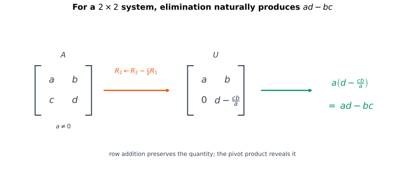
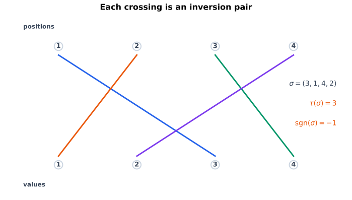
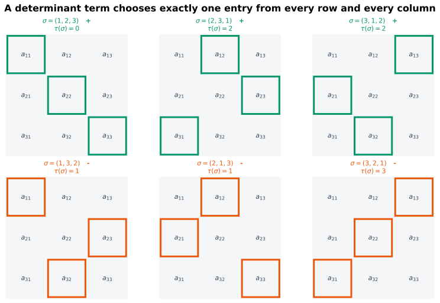
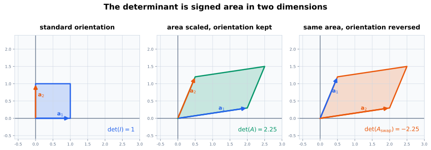

# 从消元出发：能不能用一个数追踪所有主元

上一页用 Gaussian 消元判断

$$
\mathbf{A}\mathbf{x}=\mathbf{b}
$$

是无解、唯一解还是无穷多解。对一个 $n\times n$ 方阵，唯一解要求消元后每个未知量列都有主元。

如果把 $\mathbf{A}$ 化为上三角矩阵

$$
\mathbf{U}
=
\begin{bmatrix}
u_{11}&u_{12}&\cdots&u_{1n}\\
0&u_{22}&\cdots&u_{2n}\\
\vdots&\vdots&\ddots&\vdots\\
0&0&\cdots&u_{nn}
\end{bmatrix},
$$

那么所有对角主元都非零时才可能逐步回代得到唯一解。于是自然需要一个标量，它在三角形情形下等于

$$
u_{11}u_{22}\cdots u_{nn},
$$

同时还能追踪消元过程中的换行、倍乘与行倍加。这个标量就是行列式。

但一般矩阵还不是三角形。怎样在不先做消元的情况下写出统一公式？为什么公式中会出现排列、逆序数和正负号？本页从二阶情形一步步推到一般定义。

# 本页要回答的问题

这一页不是为了先背排列、逆序数和行列式三个知识点。核心问题是：**能不能把方阵消元中“所有主元是否都存在”压缩成一个标量，同时让这个标量随行操作按可预测的方式变化？**

二阶消元先给出候选量 $ad-bc$。把它推广到 $n$ 阶时，行线性要求每行取一个元素，交换变号又淘汰重复列，于是合法项只能由排列编码；排列只说明取哪些元素，却没有说明正负号，因此还需要逆序数记录交换奇偶性。由此得到的 Leibniz 公式必须再通过三项核对：

$$
\text{是否正确追踪行变换}
\longrightarrow
\text{是否能在三角矩阵上直接读值}
\longrightarrow
\text{是否真的刻画了空间被压扁}.
$$

只有这三步闭合后，行列式才不是凭空给出的公式，而是能够重新回答方程组唯一性问题的工具。

# 二阶消元怎样产生 $ad-bc$

考虑二元方程组的系数矩阵

$$
\mathbf{A}
=
\begin{bmatrix}
a&b\\
c&d
\end{bmatrix}.
$$

先假设 $a\neq0$。用第一行消去第二行第一列：

$$
R_2
\leftarrow
R_2-\frac{c}{a}R_1.
$$

系数矩阵变成

$$
\begin{bmatrix}
a&b\\
0&d-\dfrac{cb}{a}
\end{bmatrix}.
$$

两个主元分别是

$$
a,
\qquad
d-\frac{cb}{a}.
$$

主元乘积为

$$
a\left(d-\frac{cb}{a}\right)
=ad-bc.
$$ {#eq-two-by-two-determinant-from-elimination}

因此在 $a\neq0$ 的分支中，第二个主元非零当且仅当

$$
ad-bc\neq0.
$$

{#fig-two-by-two-determinant fig-alt="一个二阶符号矩阵通过第二行减 c 除以 a 倍第一行变成上三角矩阵，右侧把两个主元相乘并化简为 ad 减 bc。" width="100%"}

若 $a=0$ 但 $c\neq0$，可以先交换两行再消元；若 $a=c=0$，第一列根本没有主元。交换行会改变后面这个标量的符号，而“某行加另一行的倍数”不会改变它。这正好预告了行列式的变换规则。

对二阶矩阵，定义

$$
\det(\mathbf{A})
=
\det\!\begin{bmatrix}
a&b\\
c&d
\end{bmatrix}
\coloneqq
ad-bc.
$$

接下来的任务是解释：一般 $n$ 阶公式为什么是二阶公式的自然推广。

# 为什么消元会引出排列

设

$$
\mathbf{A}=(a_{ij})\in\mathbb{R}^{n\times n}.
$$

先不急着写公式，把想找的标量暂时记作 $D(\mathbf{A})$。为了让它能追踪消元，至少希望它满足三条要求：

1. 对每一行分别线性，这样才能追踪行倍乘和行倍加；
2. 交换两行时变号，因此两行相同时必为零；
3. $D(\mathbf{I}_n)=1$，固定整体尺度。

这三条要求会主动把“排列”推出来。把第 $i$ 行按标准行向量展开：

$$
\mathbf{r}_i
=
a_{i1}\mathbf{e}_1^{\mathsf T}
+\cdots+
a_{in}\mathbf{e}_n^{\mathsf T}.
$$

若 $D$ 对每一行分别线性，那么完全展开后会先出现

$$
D(\mathbf{A})
=
\sum_{j_1=1}^{n}\cdots\sum_{j_n=1}^{n}
a_{1,j_1}\cdots a_{n,j_n}
D\!\left(
\mathbf{e}_{j_1}^{\mathsf T},\ldots,
\mathbf{e}_{j_n}^{\mathsf T}
\right).
$$

这里每个乘积都从每一行取了一个元素。但如果某两个下标相同，例如 $j_p=j_q$，那么 $D$ 的第 $p$、$q$ 个行参数相同；交换这两行既不改变对象又应使它变号，所以这一项的系数只能是零。

因此可能留下来的项必须满足

$$
j_1,j_2,\ldots,j_n
$$

两两不同。它们一共取了 $n$ 个来自 $\{1,\ldots,n\}$ 的值，所以恰好是 $1,2,\ldots,n$ 的一种重新排列。换句话说，**行线性先要求每行取一个，交换变号再迫使每列也恰好取一个**。

## $n$ 元排列

集合

$$
\{1,2,\ldots,n\}
$$

到自身的一个双射

$$
\sigma:
\{1,\ldots,n\}
\to
\{1,\ldots,n\}
$$

称为一个 $n$ 元排列。

通常把它记为

$$
\sigma
=
(\sigma(1),\sigma(2),\ldots,\sigma(n)).
$$

所有 $n$ 元排列组成集合

$$
S_n,
$$

它包含

$$
n!
$$

个元素。

例如

$$
S_3
=
\{
(1,2,3),
(1,3,2),
(2,1,3),
(2,3,1),
(3,1,2),
(3,2,1)
\}.
$$

排列 $\sigma$ 表示：第 $i$ 行选择第 $\sigma(i)$ 列。因此对应乘积是

$$
\prod_{i=1}^{n}a_{i,\sigma(i)}.
$$

# 为什么还需要逆序对与逆序数

排列已经编码了“选哪些元素”，但只枚举排列还不够。二阶公式是

$$
a_{11}a_{22}-a_{12}a_{21},
$$

两个排列项的符号不同。符号必须反映列顺序相对于自然顺序发生了多少次“颠倒”。

## 逆序对

给定排列

$$
\sigma=(\sigma(1),\ldots,\sigma(n)),
$$

若

$$
i<j
\qquad\text{但}\qquad
\sigma(i)>\sigma(j),
$$

则位置对 $(i,j)$ 称为 $\sigma$ 的一个**逆序对**。

## 逆序数

排列 $\sigma$ 的逆序对总数称为**逆序数**，记作

$$
\tau(\sigma).
$$

若 $\tau(\sigma)$ 为偶数，称 $\sigma$ 为偶排列；若为奇数，称 $\sigma$ 为奇排列。

定义排列的符号为

$$
\operatorname{sgn}(\sigma)
\coloneqq
(-1)^{\tau(\sigma)}.
$$ {#eq-permutation-sign}

因此偶排列符号为 $+1$，奇排列符号为 $-1$。

## 一个例子

取

$$
\sigma=(3,1,4,2).
$$

逆序对是

$$
(1,2),
\qquad
(1,4),
\qquad
(3,4),
$$

因为

$$
3>1,
\qquad
3>2,
\qquad
4>2.
$$

所以

$$
\tau(\sigma)=3,
\qquad
\operatorname{sgn}(\sigma)=-1.
$$

{#fig-inversion-crossings fig-alt="上方位置一到四连接到下方取值三一四二，四条彩色线发生三次交叉，右侧标出逆序数三和符号负一。" width="88%"}

## 为什么相邻交换会改变奇偶性

若交换排列中相邻的两个元素，它们之间的顺序恰好反转一次；对任何其他元素，这两个元素与它形成的逆序总数不变。因此逆序数恰好增加或减少 $1$，奇偶性随之改变：

$$
\operatorname{sgn}(\text{交换后的排列})
=
-\operatorname{sgn}(\text{原排列}).
$$

若交换两个不相邻的位置，可以把它分解成奇数次相邻交换，所以一般的两位置交换也会改变排列奇偶性。这个事实正好对应行列式的核心要求：交换矩阵两行，行列式应变号。

## 逆序数怎样给出每一项的系数

回到上一节暂记的 $D$。排列 $\sigma$ 对应的系数是

$$
D\!\left(
\mathbf{e}_{\sigma(1)}^{\mathsf T},\ldots,
\mathbf{e}_{\sigma(n)}^{\mathsf T}
\right).
$$

用相邻交换把 $\sigma$ 排回 $(1,2,\ldots,n)$ 时，每消去一个逆序就交换一次，一共需要 $\tau(\sigma)$ 次。每次交换都使 $D$ 变号，而最后得到 $D(\mathbf{I}_n)=1$，所以原来的系数只能是

$$
(-1)^{\tau(\sigma)}
=
\operatorname{sgn}(\sigma).
$$

至此，“从每行、每列各取一个元素”由排列编码，“这一项取正还是取负”由逆序数编码。一般公式已经被前面的要求确定下来。

# 一般 $n$ 阶行列式

对

$$
\mathbf{A}=(a_{ij})\in\mathbb{R}^{n\times n},
$$

定义

$$
\det(\mathbf{A})
\coloneqq
\sum_{\sigma\in S_n}
\operatorname{sgn}(\sigma)
\prod_{i=1}^{n}a_{i,\sigma(i)}.
$$ {#eq-leibniz-determinant}

这称为行列式的 Leibniz 公式。前面是从消元需要的性质反推公式；从现在起，把这个公式作为定义，再由它核对那些性质确实成立。

每个排列项：

1. 从每一行取一个元素；
2. 从每一列取一个元素；
3. 把选出的 $n$ 个元素相乘；
4. 根据排列逆序数的奇偶性添加正号或负号；
5. 最后对全部 $n!$ 项求和。

{#fig-permutation-selections fig-alt="六个三阶矩阵小图分别高亮一种每行每列各选一个元素的排列，前三个偶排列用绿色正号，后三个奇排列用橙色负号。" width="100%"}

# 二阶与三阶公式

## 二阶

$S_2$ 只有

$$
(1,2),
\qquad
(2,1).
$$

它们的逆序数分别是 $0$ 与 $1$，所以

$$
\begin{aligned}
\det(\mathbf{A})
&=
a_{11}a_{22}
-
a_{12}a_{21}.
\end{aligned}
$$

这正是消元得到的 $ad-bc$。

## 三阶

对

$$
\mathbf{A}
=
\begin{bmatrix}
a_{11}&a_{12}&a_{13}\\
a_{21}&a_{22}&a_{23}\\
a_{31}&a_{32}&a_{33}
\end{bmatrix},
$$

Leibniz 公式给出

$$
\begin{aligned}
\det(\mathbf{A})
={}&
a_{11}a_{22}a_{33}
+a_{12}a_{23}a_{31}
+a_{13}a_{21}a_{32}\\
&-
a_{11}a_{23}a_{32}
-a_{12}a_{21}a_{33}
-a_{13}a_{22}a_{31}.
\end{aligned}
$$ {#eq-three-by-three-determinant}

Sarrus 法则可以帮助记忆三阶公式，但它只适用于 $3\times3$，不是一般定义。一般理论仍以排列或等价的递归展开为基础。

# 定义怎样兑现消元需要的规则

行列式的公式看起来复杂，但它被设计成与消元完全相容。

## 对某一行保持线性

每个排列项从第 $i$ 行恰好取一个元素。因此固定其他行时，行列式关于第 $i$ 行是线性的：

$$
\det(\ldots,\alpha\mathbf{r}_i+\beta\mathbf{s}_i,\ldots)
=
\alpha\det(\ldots,\mathbf{r}_i,\ldots)
+
\beta\det(\ldots,\mathbf{s}_i,\ldots).
$$

## 一行乘标量

由行线性立刻得到

$$
R_i\leftarrow cR_i
\quad\Longrightarrow\quad
\det\leftarrow c\det.
$$ {#eq-determinant-row-scaling}

## 交换两行

交换两行会把每个排列项对应的排列复合一次交换，从而改变奇偶性。因此

$$
R_i\leftrightarrow R_j
\quad\Longrightarrow\quad
\det\leftarrow-\det.
$$ {#eq-determinant-row-swap}

这就是逆序数在行列式中的实际作用：它确保交换两行时全部项同时变号。

## 两行相同则行列式为零

若两行相同，交换它们后矩阵没有变化，但行列式应变成相反数。因此

$$
\det(\mathbf{A})
=-\det(\mathbf{A}),
$$

从而

$$
\det(\mathbf{A})=0.
$$

两行成比例时，也可利用行线性推出行列式为零。

## 一行加另一行的倍数

设 $i\neq j$，把第 $i$ 行替换为

$$
\mathbf{r}_i+c\mathbf{r}_j.
$$

由行线性：

$$
\det(\ldots,\mathbf{r}_i+c\mathbf{r}_j,\ldots)
=
\det(\mathbf{A})
+c\det(\ldots,\mathbf{r}_j,\ldots).
$$

第二个行列式有两行相同，因此等于零。于是

$$
R_i\leftarrow R_i+cR_j
\quad\Longrightarrow\quad
\det\text{ 不变}.
$$ {#eq-determinant-row-addition}

这正是 Gaussian 消元最常使用的操作。

这些规则已经说明每一步消元怎样改变行列式，却还没有完成计算：仍需要知道消元最终停在哪类矩阵，以及那类矩阵的行列式能否直接读出。由于方阵消元的自然终点是三角矩阵，下一步只需确定三角矩阵的行列式。

# 在消元终点直接读值：三角矩阵

设 $\mathbf{U}$ 是上三角矩阵。若一个排列对每个 $i$ 都满足 $\sigma(i)\geq i$，那么

$$
\sum_{i=1}^{n}\sigma(i)
\geq
\sum_{i=1}^{n}i.
$$

但排列只是把 $1,\ldots,n$ 重新排序，两边总和本来相等，所以每个不等式都只能取等号，即 $\sigma(i)=i$。因此任何非恒等排列都存在某个 $i$ 使 $\sigma(i)<i$，对应的 $u_{i,\sigma(i)}$ 位于主对角线下方并等于零。Leibniz 展开中只有恒等排列

$$
\sigma=(1,2,\ldots,n)
$$

对应的项可能非零。

所以

$$
\det(\mathbf{U})
=
u_{11}u_{22}\cdots u_{nn}.
$$ {#eq-triangular-determinant}

下三角矩阵同理。

这使行列式重新连接到消元：把方阵消成三角形后，只需记录换行次数与行缩放，再乘对角元素即可得到原行列式。

例如若只使用

- 行倍加：行列式不变；
- 交换行：每次乘 $-1$；

把 $\mathbf{A}$ 化为上三角矩阵 $\mathbf{U}$，并一共交换 $s$ 次行，则

$$
\det(\mathbf{A})
=
(-1)^s
\prod_{i=1}^{n}u_{ii}.
$$

若消元过程中还把行乘了标量，就必须把相应倍数也记录并还原。

到目前为止，前面的推导一直从“行”研究行列式，因为问题来自消元。但线性变换的几何图景使用矩阵的列：列向量是标准基向量的像，也是平行多面体的边。要把刚证明的行规则带到列向量几何，先要确认转置不会改变行列式。

# 从消元的行视角转到几何的列视角

Leibniz 公式对行与列是对称的。排列 $\sigma$ 与逆排列 $\sigma^{-1}$ 具有相同奇偶性，因此

$$
\det(\mathbf{A}^{\mathsf T})
=
\det(\mathbf{A}).
$$ {#eq-determinant-transpose}

所以所有行变换规则都有对应的列版本：

- 交换两列，行列式变号；
- 一列乘 $c$，行列式乘 $c$；
- 一列加另一列的倍数，行列式不变。

这不意味着在线性方程组求解中可以随意做列变换。行列式性质讨论的是标量如何变化；方程组中列变换仍会改变未知量坐标，必须另行记录变量替换。

有了列版本，行列式就不再只是消元过程中的代数记账量。现在可以追问：它对矩阵列向量张成的图形究竟测量了什么？

# 几何直觉：有向面积与有向体积

二维矩阵

$$
\mathbf{A}
=
\begin{bmatrix}
\vert&\vert\\
\mathbf{a}_1&\mathbf{a}_2\\
\vert&\vert
\end{bmatrix}
$$

把单位正方形的两条边映到列向量 $\mathbf{a}_1,\mathbf{a}_2$。它们张成平行四边形，其普通面积是

$$
|\det(\mathbf{A})|.
$$

行列式的绝对值给出面积缩放，符号则记录方向：

- $\det(\mathbf{A})>0$：方向保持；
- $\det(\mathbf{A})<0$：方向反转；
- $\det(\mathbf{A})=0$：平行四边形压扁，面积变为零。

{#fig-determinant-orientation fig-alt="左图是单位正方形行列式一，中图是面积二点二五且方向保持的绿色平行四边形，右图交换两列后是相同面积但行列式负二点二五的橙色平行四边形。" width="100%"}

在三维乃至 $n$ 维中，$|\det(\mathbf{A})|$ 给出普通体积的缩放倍数，而 $\det(\mathbf{A})$ 本身是有向体积缩放因子。这个几何解释有助于理解行交换变号和行列式为零，但正式结论仍由代数定义与性质支撑。

这里也出现了下一页真正要证明的联系：若 $\det(\mathbf{A})=0$，某个方向被线性变换压扁，这是否恰好意味着存在非零向量 $\mathbf{h}$ 使

$$
\mathbf{A}\mathbf{h}=\mathbf{0}?
$$

如果是，那么 $\mathbf{x}$ 与 $\mathbf{x}+\mathbf{h}$ 会得到同一个右端 $\mathbf{b}$，方程组不可能保持唯一解。几何图只给出直觉；下一步需要把“体积压扁—非零齐次方向—解不唯一”证明成严格的等价关系。

# 用 NumPy 核对排列定义

## 计算逆序对

```{python}
#| label: lst-determinant-permutations
#| echo: true

from itertools import permutations
from math import factorial

import numpy as np


def inversion_pairs(permutation: tuple[int, ...]) -> list[tuple[int, int]]:
    pairs: list[tuple[int, int]] = []
    for i in range(len(permutation)):
        for j in range(i + 1, len(permutation)):
            if permutation[i] > permutation[j]:
                pairs.append((i, j))
    return pairs


def permutation_sign(permutation: tuple[int, ...]) -> int:
    return -1 if len(inversion_pairs(permutation)) % 2 else 1

sigma = (3, 1, 4, 2)
pairs = inversion_pairs(sigma)

print("逆序位置对：", pairs)
print("逆序数：", len(pairs))
print("排列符号：", permutation_sign(sigma))

assert len(pairs) == 3
assert permutation_sign(sigma) == -1
```

代码索引从 $0$ 开始，因此输出位置对会写成 `(0, 1)` 等；它们分别对应数学中的 $(1,2)$ 等位置。

## 直接实现 Leibniz 公式

```{python}
def determinant_leibniz(matrix: np.ndarray) -> float:
    if matrix.ndim != 2 or matrix.shape[0] != matrix.shape[1]:
        raise ValueError("matrix 必须是方阵")

    order = matrix.shape[0]
    total = 0.0
    for zero_based_permutation in permutations(range(order)):
        one_based_permutation = tuple(index + 1 for index in zero_based_permutation)
        term = float(permutation_sign(one_based_permutation))
        for row, column in enumerate(zero_based_permutation):
            term *= matrix[row, column]
        total += term
    return total

A2 = np.array([[2.0, 1.0], [4.0, 3.0]])
A3 = np.array(
    [
        [1.0, 2.0, 0.0],
        [-1.0, 1.0, 3.0],
        [2.0, 0.0, 1.0],
    ]
)

np.testing.assert_allclose(determinant_leibniz(A2), 2.0)
np.testing.assert_allclose(determinant_leibniz(A3), 15.0)
np.testing.assert_allclose(determinant_leibniz(A3), np.linalg.det(A3))

print("二阶行列式：", determinant_leibniz(A2))
print("三阶行列式：", determinant_leibniz(A3))
```

## 核对行变换性质

```{python}
row_swapped = A3[[1, 0, 2]]
row_added = A3.copy()
row_added[1] = row_added[1] + 5.0 * row_added[0]
row_scaled = A3.copy()
row_scaled[2] = -2.0 * row_scaled[2]

base_det = determinant_leibniz(A3)
np.testing.assert_allclose(determinant_leibniz(row_swapped), -base_det)
np.testing.assert_allclose(determinant_leibniz(row_added), base_det)
np.testing.assert_allclose(determinant_leibniz(row_scaled), -2.0 * base_det)

triangular = np.array(
    [
        [2.0, 1.0, -1.0],
        [0.0, 3.0, 4.0],
        [0.0, 0.0, -5.0],
    ]
)
np.testing.assert_allclose(
    determinant_leibniz(triangular),
    np.prod(np.diag(triangular)),
)
```

也可以在项目根目录运行：

```bash
python code/determinant_basics.py
```

# 为什么不用 Leibniz 公式计算大矩阵

$n$ 阶行列式的 Leibniz 公式包含

$$
n!
$$

项。随着 $n$ 增大，排列数量增长极快：

$$
5!=120,
\qquad
10!=3628800,
\qquad
20!\approx2.43\times10^{18}.
$$

直接枚举排列适合定义、证明与小矩阵核对，不适合实际大矩阵计算。

利用 Gaussian 消元把矩阵化为三角形，大约需要与 $n^3$ 成比例的标量运算，远小于 $n!$。实际数值库通常通过 LU 一类分解计算行列式，并额外处理选主元、缩放、溢出和下溢。

`np.linalg.det` 返回浮点近似值。对于大矩阵或行列式绝对值极大、极小时，常使用 `np.linalg.slogdet` 返回符号与绝对值对数，避免直接数值溢出或下溢。

# 学习来源备忘

这一页采用传统高等代数中“排列与逆序数先于行列式一般定义”的路线，并把它接回上一页的矩阵消元问题。丘维声相关课程与教材检索线索用于核对“逆序数—排列奇偶性—行列式展开—初等变换性质”的依赖方向；当前引用仍是第三方检索入口，不作逐句归因 [@qiuAdvancedAlgebraCourse]。

Strang 的列图景帮助理解行列式作为有向面积、体积和线性变换的缩放因子 [@strang2023linear]。本页额外加入的 NumPy 枚举与复杂度比较，是为了把定义、手算和实际算法边界放在同一页核对。

# 容易混淆、需要反复检查的地方

1. 逆序对比较的是位置 $i<j$ 与取值 $\sigma(i)>\sigma(j)$。
2. 逆序数是逆序对的数量，不是逆序元素的数量。
3. 排列符号只取 $+1$ 或 $-1$。
4. 行列式只对方阵定义。
5. Leibniz 每一项必须从每行、每列各取一个元素。
6. 每个排列项的符号由逆序数奇偶性决定。
7. 交换两行，行列式变号；不是保持不变。
8. 一行乘 $c$，行列式乘 $c$。
9. 一行加另一行的倍数，行列式不变。
10. 两行相同或成比例时，行列式为零。
11. 三角矩阵的行列式是对角元素之积。
12. $|\det(\mathbf{A})|$ 是面积或体积缩放；符号还记录方向。
13. Sarrus 法则只适用于三阶矩阵。
14. Leibniz 公式适合定义，不适合大矩阵数值计算。
15. 行列式为零只能说明方阵发生退化；它还没有区分对应非齐次系统是无解还是无穷多解。

# 留给自己的验算

1. 列出 $S_3$ 的全部排列并计算各自逆序数。
2. 找出排列 $(4,1,3,2)$ 的全部逆序对、逆序数与符号。
3. 证明交换排列中两个相邻元素会改变排列奇偶性。
4. 对一个 $3\times3$ 矩阵，解释为什么“每行取一个元素”还不足以定义行列式，必须同时要求每列取一个。
5. 从 Leibniz 公式推导二阶行列式 $ad-bc$。
6. 写出三阶行列式的六项展开，并标记每项对应的排列。
7. 用行线性证明一行乘 $c$ 时行列式乘 $c$。
8. 证明两行相同时行列式为零。
9. 证明一行加另一行的倍数时行列式不变。
10. 解释为什么上三角矩阵的非恒等排列项都含有一个主对角线下方的零元素。
11. 用消元计算
   $$
   \det\begin{bmatrix}
   1&2&3\\
   2&5&8\\
   1&0&1
   \end{bmatrix}.
   $$
12. 若交换矩阵两列，为什么平行多面体普通体积不变，但行列式变号？
13. 构造一个行列式为零的二阶矩阵，并解释它怎样把单位正方形压成线段。
14. 比较直接枚举排列与消元计算行列式的增长速度。
15. 为什么 `np.linalg.det(A) == 0` 不是可靠的浮点退化判定？

# 小结

二阶消元自然产生 $ad-bc$，一般化这个量需要从每行、每列各选一个元素。所有合法选择由排列编码；排列中的逆序对数量决定奇偶性，从而给每个乘积项分配正负号。Leibniz 公式由此定义一般行列式，并自然推出行线性、换行变号、行倍加不变和三角矩阵对角乘积等性质。行列式的绝对值表示面积或体积缩放，符号记录方向；实际计算则通过消元而不是枚举 $n!$ 个排列。

# 下一页要接着追问什么

下一步要把行列式重新接回

$$
\mathbf{A}\mathbf{x}=\mathbf{b}.
$$

消元已经暗示：

- $\det(\mathbf{A})\neq0$ 应当等价于每列都有主元；
- 这又应当等价于齐次方程只有零解；
- 对每个 $\mathbf{b}$，非齐次系统都应有唯一解；
- 此时应该能够定义逆矩阵，并用 Cramer 法则写出解。

但当

$$
\det(\mathbf{A})=0
$$

时，行列式本身不能区分无解与无穷多解；长方形矩阵也没有同样的行列式。下一页会先证明行列式与方阵唯一解、逆矩阵和 Cramer 法则的关系，再由子式引出秩，最终得到一般线性方程组的完整判别准则。

# 参考资料

::: {#refs}
:::
