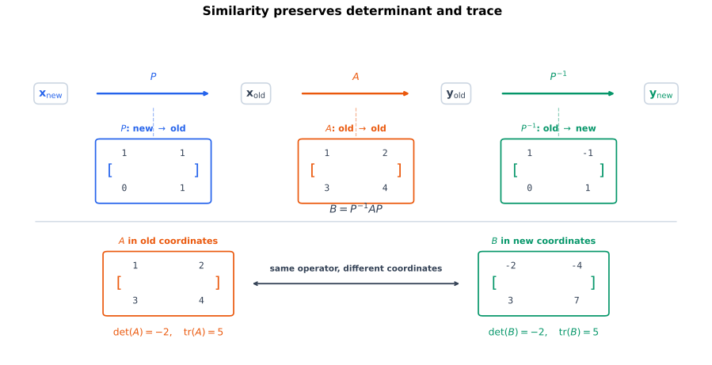

# 相似变换保持哪些标量

[坐标矩阵、换基与相似](coordinate-matrices-change-of-basis-and-similarity.qmd)说明，同一个线性算子在两组基下的矩阵满足

$$
\mathbf B=\mathbf P^{-1}\mathbf A\mathbf P,
$$

其中 $\mathbf P$ 可逆。矩阵的元素会改变，但同一个算子并没有改变：哪些由矩阵算出的标量仍然相同？[行列式的乘法性、余子式与迹](determinant-multiplicativity-cofactors-and-invariants.qmd)中的乘法性 @eq-determinant-multiplicativity、逆矩阵公式 @eq-determinant-of-inverse 和迹的循环性质 @eq-trace-cyclic-two-factors 给出两个直接的不变量。

## 相似矩阵的行列式

若

$$
\mathbf B
=
\mathbf P^{-1}\mathbf A\mathbf P,
$$

其中 $\mathbf P$ 可逆，则

$$
\begin{aligned}
\det(\mathbf B)
&=
\det(\mathbf P^{-1})
\det(\mathbf A)
\det(\mathbf P)\\
&=
\frac{1}{\det(\mathbf P)}
\det(\mathbf A)
\det(\mathbf P)\\
&=
\det(\mathbf A).
\end{aligned}
$$ {#eq-determinant-similarity-invariant}

所以行列式不依赖同一算子所使用的坐标基。


## 相似矩阵的迹

若

$$
\mathbf B
=
\mathbf P^{-1}\mathbf A\mathbf P,
$$

则利用循环性质：

$$
\begin{aligned}
\operatorname{tr}(\mathbf B)
&=
\operatorname{tr}(\mathbf P^{-1}\mathbf A\mathbf P)\\
&=
\operatorname{tr}(\mathbf P\mathbf P^{-1}\mathbf A)\\
&=
\operatorname{tr}(\mathbf A).
\end{aligned}
$$ {#eq-trace-similarity-invariant}

@fig-similarity-det-trace-invariants 使用具体矩阵

$$
\mathbf A=
\begin{bmatrix}1&2\\3&4\end{bmatrix},
\qquad
\mathbf P=
\begin{bmatrix}1&1\\0&1\end{bmatrix}
$$

与

$$
\mathbf B
=
\mathbf P^{-1}\mathbf A\mathbf P
=
\begin{bmatrix}-2&-4\\3&7\end{bmatrix}.
$$

两张数组外观不同，但都满足

$$
\det=-2,
\qquad
\operatorname{tr}=5.
$$

{#fig-similarity-det-trace-invariants fig-alt="上方坐标流从新坐标经过 P 到旧输入坐标，再经过 A 到旧输出坐标，最后经过 P 逆回到新输出坐标，合并为 B 等于 P 逆 A P；下方 A 和 B 两张矩阵卡片都标出 det 等于负二、trace 等于五。" width="100%"}


# 行列式与迹成为线性算子的量

设 $V$ 是 $n$ 维实向量空间，$T:V\to V$ 是线性算子。选择任意有序基 $\mathcal B$，可以计算矩阵

$$
[T]_{\mathcal B}.
$$

定义

$$
\det(T)
\coloneqq
\det([T]_{\mathcal B}),
$$ {#eq-operator-determinant-definition}

以及

$$
\operatorname{tr}(T)
\coloneqq
\operatorname{tr}([T]_{\mathcal B}).
$$ {#eq-operator-trace-definition}

必须证明这两个定义不依赖所选基。若改用另一组基 $\mathcal C$，[坐标矩阵、换基与相似](coordinate-matrices-change-of-basis-and-similarity.qmd)中的相似公式给出

$$
[T]_{\mathcal C}
=
\mathbf P^{-1}[T]_{\mathcal B}\mathbf P.
$$

由 @eq-determinant-similarity-invariant 与 @eq-trace-similarity-invariant，

$$
\det([T]_{\mathcal C})
=
\det([T]_{\mathcal B}),
$$

且

$$
\operatorname{tr}([T]_{\mathcal C})
=
\operatorname{tr}([T]_{\mathcal B}).
$$

所以 $\det(T)$ 与 $\operatorname{tr}(T)$ 是算子本身的标量，不是某张坐标矩阵偶然呈现的数字。

::: {.callout-warning title="一般线性映射不能这样定义迹"}
若 $T:V\to W$ 且 $V,W$ 是不同空间，定义域基与陪域基可以独立改变，表示矩阵经历一般的两侧变换，而不一定是相似变换。矩阵还可能不是方阵。因此本节的算子行列式和算子迹只对 $T:V\to V$ 定义。
:::


# 相同行列式与迹为什么仍不能判定相似

相似矩阵必有相同的行列式和迹，但反方向不成立。考虑

$$
\mathbf Z
=
\begin{bmatrix}0&0\\0&0\end{bmatrix},
\qquad
\mathbf N
=
\begin{bmatrix}0&1\\0&0\end{bmatrix}.
$$

两者都有

$$
\det(\mathbf Z)=\det(\mathbf N)=0,
$$

以及

$$
\operatorname{tr}(\mathbf Z)
=
\operatorname{tr}(\mathbf N)
=0.
$$

但

$$
\operatorname{rank}(\mathbf Z)=0,
\qquad
\operatorname{rank}(\mathbf N)=1.
$$

秩在相似变换下不变：右乘可逆矩阵只改变列的生成方式，不改变列空间；左乘可逆矩阵将列空间一一映到另一个等维子空间。因此 $\mathbf Z$ 与 $\mathbf N$ 不可能相似。

这说明行列式和迹是快速而重要的必要检查，却不是矩阵相似类的完整标签。

# 用 SymPy 核对相似不变量

```{python}
#| label: lst-similarity-determinant-trace
#| echo: true

import sympy as sp

# 相似变换保持行列式与迹。
P = sp.Matrix([[1, 1], [0, 1]])
S = sp.Matrix([[1, 2], [3, 4]])
S_new = P.inv() * S * P
assert S_new == sp.Matrix([[-2, -4], [3, 7]])
assert S_new.det() == S.det() == -2
assert sp.trace(S_new) == sp.trace(S) == 5

# 相同 det 与 trace 不足以推出相似：秩仍可能不同。
Z = sp.zeros(2)
N = sp.Matrix([[0, 1], [0, 0]])
assert Z.det() == N.det() == 0
assert sp.trace(Z) == sp.trace(N) == 0
assert Z.rank() == 0 and N.rank() == 1

print("similar matrix =")
sp.pprint(S_new)
```

# 隐藏表示换基下的方形算子

若隐藏空间中的方形线性算子在换基后变为

$$
\mathbf A'
=
\mathbf P^{-1}\mathbf A\mathbf P,
$$

那么

$$
\det(\mathbf A')=\det(\mathbf A),
\qquad
\operatorname{tr}(\mathbf A')=\operatorname{tr}(\mathbf A).
$$

这两个数确实不依赖隐藏坐标的选择。但模型中的一般权重常是长方形矩阵，前后空间也可能不同；此时没有方阵行列式和迹，不能为了套用不变量而忽略 shape。

相同的行列式与迹也不证明两个训练后表示具有相同语义。它们只提供精确的线性代数约束，语义与因果作用仍需额外实验。

# 容易混淆、需要反复检查的地方

1. **相似变换要求同一个空间的同步换基。** 一般 $V\to W$ 映射的矩阵经历两侧独立变换，不能直接使用相似不变量。
2. **行列式和迹是相似的必要不变量，不是完整分类。** 相同的两个标量不推出两个矩阵相似。
3. **这里的算子行列式和算子迹针对 $T:V\to V$ 定义。** 对一般 $V\to W$ 映射，不能把某张矩阵的行列式或迹直接当作与两端基选择无关的量。

# 自检

1. 证明 $\det(\mathbf P^{-1}\mathbf A\mathbf P)=\det(\mathbf A)$ 与 $\operatorname{tr}(\mathbf P^{-1}\mathbf A\mathbf P)=\operatorname{tr}(\mathbf A)$，并标出每一步使用的定理。
2. 找出两张行列式与迹都相同但秩不同的 $3\times3$ 矩阵，说明它们不相似。
3. 从同步换基公式证明 @eq-operator-determinant-definition 与 @eq-operator-trace-definition 不依赖所选基。
4. 对 $T:V\to W$，解释为什么两端独立换基不能直接使用相似不变性，即使 $\dim V=\dim W$。

# 小结

行列式和迹都在相似变换下保持不变，因此可以定义有限维线性算子本身的

$$
\det(T),
\qquad
\operatorname{tr}(T).
$$

它们是重要的坐标不变量，却不是相似类的完整描述；行列式和迹相同的矩阵，仍可能由秩的差异判定为不相似。

# 参考资料

相似变换与算子不变量可参见 Strang 与 Axler [@strang2023linear; @axler2015linear]。

::: {#refs}
:::
