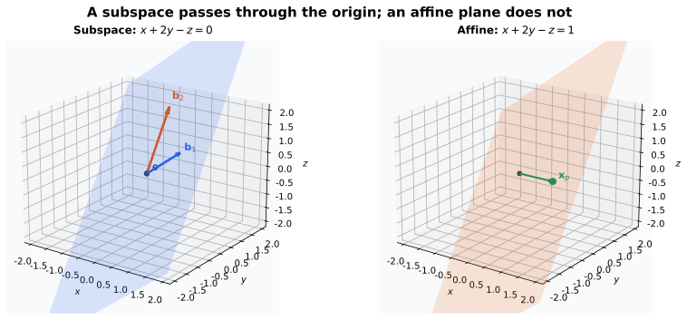
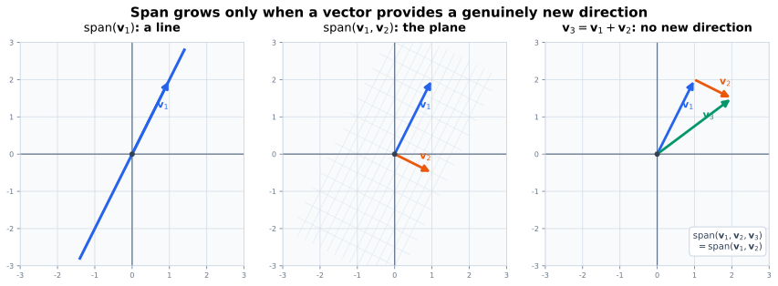
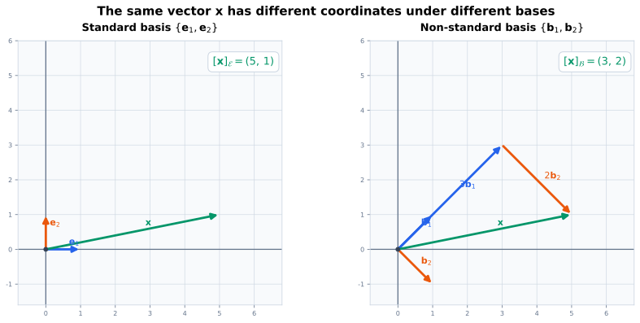
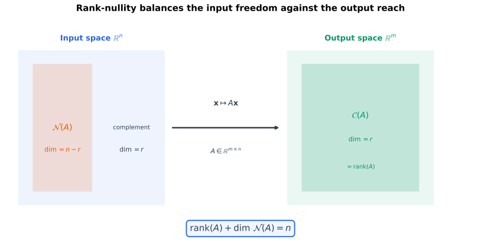
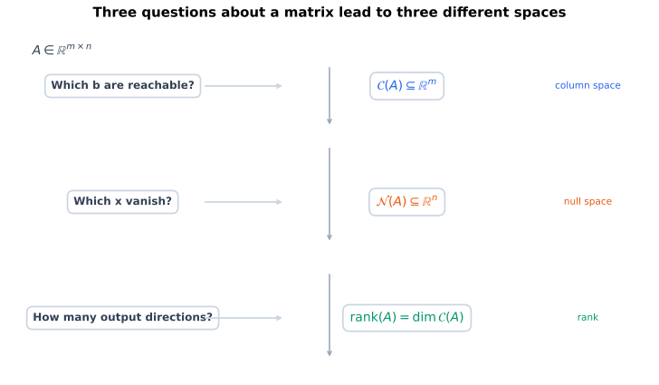

# 从上一页留下的问题出发

上一页考察了线性方程组在相容条件下的**自由变量数**

$$
n-\operatorname{rank}(\mathbf{A}),
$$

其中 $n$ 是未知量个数。这个计数为每个齐次自由方向赋了一个数字，但尚未说明：自由变量实际在什么对象中变化？为什么它们能产生一整个解集？为什么矩阵列的张成能覆盖所有可达到的右端？

答案是把坐标向量看成更一般结构的一个实例。矩阵列的张成（列空间）、齐次方程的解、次数不超过 $d$ 的多项式，乃至定义在同一集合上的函数，都可以组成向量空间。之后，消元中见过的主元、自由变量和秩会分别进入抽象框架：原矩阵的主元列可构成列空间的一组基；自由变量参数化零空间；秩等于列空间的维数。

# 本页要回答的问题

读完并动手核对后，我希望能回答：

1. 向量空间除了“元素看起来像列向量”以外，究竟需要什么结构；
2. 怎样判断一个集合是否是子空间，以及仿射集合为什么通常不是子空间；
3. 什么是线性组合与张成，为什么张成集是包含给定向量的最小子空间；
4. 线性相关表示什么，怎样从一个非平凡齐次关系找到冗余向量；
5. 基为什么同时要求“张成”与“无冗余”，以及坐标为什么唯一；
6. 维数在数什么，为什么它与“数组有几条轴”不是同一概念；
7. 为什么 $\operatorname{rank}(\mathbf{A})$ 是列空间的维数，而
   $n-\operatorname{rank}(\mathbf{A})$ 是零空间的维数；
8. 怎样区分齐次解空间与非齐次方程的仿射解集。

::: {.callout-important title="本页的边界"}
本页只在实数域 $\mathbb{R}$ 上讨论有限维向量空间，并把重点放在与矩阵、方程组和机器学习表示直接相连的概念。作为对照会提及一两个无限维示例，但不展开其分析细节。一般域、商空间、对偶空间和线性算子的谱理论会在后续专题中展开。
:::

# 坐标向量只是最先遇到的向量

此前的向量主要属于 $\mathbb{R}^n$，例如

$$
\mathbf{x}
=
\begin{bmatrix}
2\\-1\\3
\end{bmatrix}.
$$

它有加法和实数倍：

$$
\begin{bmatrix}2\\-1\\3\end{bmatrix}
+
\begin{bmatrix}1\\4\\0\end{bmatrix}
=
\begin{bmatrix}3\\3\\3\end{bmatrix},
\qquad
-2
\begin{bmatrix}2\\-1\\3\end{bmatrix}
=
\begin{bmatrix}-4\\2\\-6\end{bmatrix}.
$$

真正重要的不是它被排成一列，而是这些运算满足一组稳定规则。只要另一个对象集合也能做同类运算并满足相同规则，它也可以作为向量空间。

例如次数不超过 $2$ 的实系数多项式

$$
p(t)=a_0+a_1t+a_2t^2
$$

可以逐项相加和做实数倍，因此也像向量一样运算。它与坐标向量

$$
\begin{bmatrix}a_0\\a_1\\a_2\end{bmatrix}
$$

之间可以建立对应，但多项式本身不是一个三行一列的数组。

# 向量空间：允许做线性组合的世界

设 $V$ 是一个集合，元素记为 $\mathbf{u},\mathbf{v},\mathbf{w}$；设标量属于 $\mathbb{R}$。若 $V$ 配备：

- 向量加法 $+:V\times V\to V$；
- 标量乘法 $\mathbb{R}\times V\to V$；

并满足下表规则，则称 $V$ 为一个（实）**向量空间**。

| 规则 | 对任意适当的向量和标量 |
|---|---|
| 加法封闭 | $\mathbf{u}+\mathbf{v}\in V$ |
| 加法交换、结合 | $\mathbf{u}+\mathbf{v}=\mathbf{v}+\mathbf{u}$，$(\mathbf{u}+\mathbf{v})+\mathbf{w}=\mathbf{u}+(\mathbf{v}+\mathbf{w})$ |
| 零向量 | 存在 $\mathbf{0}\in V$，使 $\mathbf{u}+\mathbf{0}=\mathbf{u}$ |
| 加法逆元 | 每个 $\mathbf{u}\in V$ 有 $-\mathbf{u}\in V$，使 $\mathbf{u}+(-\mathbf{u})=\mathbf{0}$ |
| 标量分配 | $a(\mathbf{u}+\mathbf{v})=a\mathbf{u}+a\mathbf{v}$，$(a+b)\mathbf{u}=a\mathbf{u}+b\mathbf{u}$ |
| 标量结合与单位元 | $a(b\mathbf{u})=(ab)\mathbf{u}$，$1\mathbf{u}=\mathbf{u}$ |

这些公理不是为了增加记忆量。它们保证任意有限线性组合

$$
a_1\mathbf{v}_1+\cdots+a_k\mathbf{v}_k
$$

都有明确含义，并且仍留在同一空间中。

## 常见例子

### 坐标空间与零空间

$\mathbb{R}^n$ 是向量空间，零向量是所有分量为零的列向量。

对一个矩阵 $\mathbf{A}\in\mathbb{R}^{m\times n}$，齐次方程的解集

$$
\mathcal{N}(\mathbf{A})
\coloneqq
\left\{
\mathbf{x}\in\mathbb{R}^n:
\mathbf{A}\mathbf{x}=\mathbf{0}
\right\}
$$ {#eq-null-space-definition}

也会是向量空间。事实上，若 $\mathbf{x},\mathbf{y}\in\mathcal{N}(\mathbf{A})$，则

$$
\mathbf{A}(a\mathbf{x}+b\mathbf{y})
=a\mathbf{A}\mathbf{x}+b\mathbf{A}\mathbf{y}
=\mathbf{0}.
$$

因此线性组合仍是齐次解。这正是上一页中“自由变量产生一整族解”的结构原因。

### 矩阵、多项式与函数

下面的集合都以逐项加法和实数倍为运算，因此都是向量空间：

$$
\mathbb{R}^{m\times n},
\qquad
\mathbb{P}_d
\coloneqq
\left\{
\sum_{j=0}^{d}a_jt^j:a_j\in\mathbb{R}
\right\},
\qquad
\mathcal{F}(S,\mathbb{R})
\coloneqq
\{f:S\to\mathbb{R}\}.
$$

例如函数空间中的零向量是零函数 $f(s)=0$；它不是数字 $0$，但在函数加法下扮演同一角色。

## 两个容易误判的集合

非负正交锥

$$
\mathbb{R}_{\geq 0}^2
=
\left\{
\begin{bmatrix}x_1\\x_2\end{bmatrix}:x_1,x_2\geq0
\right\}
$$

对加法和正数倍封闭，但不对负数倍封闭。例如 $(1,0)^{\mathsf T}$ 在集合中，$-(1,0)^{\mathsf T}$ 不在，所以它不是实向量空间。

另一个例子是平面中的单位圆

$$
\left\{
\mathbf{x}\in\mathbb{R}^2:\lVert\mathbf{x}\rVert_2=1
\right\}.
$$

它甚至不含零向量，也不对加法封闭，因此不是子空间或向量空间。长度固定的集合与“可任意线性组合”是相冲突的约束。

# 子空间：在大空间中仍可线性组合的部分

设 $W\subseteq V$。若 $W$ 自身沿用 $V$ 的加法和标量乘法后仍是向量空间，则称 $W$ 是 $V$ 的**子空间**。

直接逐条检查全部向量空间公理很繁琐。对非空集合，以下更紧凑的判据等价：

$$
\mathbf{u},\mathbf{v}\in W,
\quad a,b\in\mathbb{R}
\quad\Longrightarrow\quad
 a\mathbf{u}+b\mathbf{v}\in W.
$$ {#eq-subspace-test}

这称为**线性组合封闭性**。令 $a=b=0$ 可得到 $\mathbf{0}\in W$；令 $a=b=1$ 得到加法封闭；令 $a=-1,b=0$ 得到加法逆元。

## 过原点的平面为什么是子空间

考虑

$$
W
=
\left\{
\begin{bmatrix}x\\y\\z\end{bmatrix}\in\mathbb{R}^3:
 x+2y-z=0
\right\}.
$$

零向量满足约束，所以集合非空。若 $\mathbf{u},\mathbf{v}\in W$，分别有

$$
u_1+2u_2-u_3=0,
\qquad
v_1+2v_2-v_3=0.
$$

于是对任意 $a,b$，

$$
(au_1+bv_1)+2(au_2+bv_2)-(au_3+bv_3)=0.
$$

因此 $a\mathbf{u}+b\mathbf{v}\in W$，它是 $\mathbb{R}^3$ 的子空间。几何上，这是一个经过原点的平面。

{#fig-subspace-vs-affine fig-alt="左图是经过原点的蓝色平面，标出两个在平面内的基向量 b1 和 b2；右图是平移后的橙色仿射平面，绿色箭头从原点指向特解 xp。" width="100%"}

更一般地，任何齐次线性方程组的解集都是子空间；@eq-null-space-definition 正是这个事实的矩阵写法。

## 仿射平面为什么不是子空间

把右端改成非零数：

$$
H
=
\left\{
\begin{bmatrix}x\\y\\z\end{bmatrix}\in\mathbb{R}^3:
 x+2y-z=1
\right\}.
$$

零向量不满足约束，因此 $H$ 不是子空间。它仍然是一个平面，但它被平移离开了原点，称为**仿射平面**。

这与方程组的解集完全对应。若 $\mathbf{x}_p$ 是

$$
\mathbf{A}\mathbf{x}=\mathbf{b}
$$

的一个特解，那么全体解是

$$
\mathbf{x}_p+\mathcal{N}(\mathbf{A})
=
\left\{
\mathbf{x}_p+\mathbf{h}:
\mathbf{h}\in\mathcal{N}(\mathbf{A})
\right\}.
$$ {#eq-affine-solution-set}

当 $\mathbf{b}=\mathbf{0}$ 时可以取 $\mathbf{x}_p=\mathbf{0}$，解集才退化为真正的子空间。

# 线性组合、张成与列空间

给定向量

$$
\mathbf{v}_1,\ldots,\mathbf{v}_k\in V,
$$

任取系数 $a_1,\ldots,a_k\in\mathbb{R}$，表达式

$$
a_1\mathbf{v}_1+\cdots+a_k\mathbf{v}_k
$$

称为这些向量的**线性组合**。

所有线性组合组成的集合称为它们的**张成**，记为

$$
\operatorname{span}(\mathbf{v}_1,\ldots,\mathbf{v}_k)
\coloneqq
\left\{
\sum_{j=1}^{k}a_j\mathbf{v}_j:a_j\in\mathbb{R}
\right\}.
$$ {#eq-span-definition}

它总是一个子空间：零系数给出零向量，而两个线性组合的线性组合仍可把系数重新合并为原向量的一次线性组合。

更重要的是，张成空间是**包含这些向量的最小子空间**。它包含每个 $\mathbf{v}_j$，因为可以令第 $j$ 个系数为 $1$、其他系数为 $0$；而任何包含全部 $\mathbf{v}_j$ 的子空间都必须对它们的线性组合封闭，因而必然包含整个张成集。

## 从一条直线到整个空间

在 $\mathbb{R}^2$ 中：

$$
\operatorname{span}
\left(
\begin{bmatrix}1\\2\end{bmatrix}
\right)
=
\left\{
\begin{bmatrix}a\\2a\end{bmatrix}:a\in\mathbb{R}
\right\}
$$

是一条过原点的直线。

在已有 $\begin{bmatrix}1\\2\end{bmatrix}$ 的基础上补入一个不共线向量（例如 $\begin{bmatrix}1\\0\end{bmatrix}$ 或 $\begin{bmatrix}0\\1\end{bmatrix}$），就能张成整个 $\mathbb{R}^2$。下面取标准基为参考，说明继续加入向量不会扩大张成空间。假设前两个向量是

$$
\begin{bmatrix}1\\0\end{bmatrix},
\qquad
\begin{bmatrix}0\\1\end{bmatrix},
$$

则第三个向量

$$
\begin{bmatrix}1\\1\end{bmatrix}
=
\begin{bmatrix}1\\0\end{bmatrix}
+
\begin{bmatrix}0\\1\end{bmatrix}
$$

不会扩大张成空间；它已经在前两个向量张成的空间里。

{#fig-span-and-dependence fig-alt="三幅子图依次展示单个向量张成一条直线、两个独立向量张成整个平面、第三个冗余向量不扩大张成空间。" width="100%"}

## 矩阵的列空间

设

$$
\mathbf{A}
=
\begin{bmatrix}
\vert&&\vert\\
\mathbf{a}_1&\cdots&\mathbf{a}_n\\
\vert&&\vert
\end{bmatrix}
\in\mathbb{R}^{m\times n}.
$$

它的**列空间**定义为

$$
\mathcal{C}(\mathbf{A})
\coloneqq
\operatorname{span}(\mathbf{a}_1,\ldots,\mathbf{a}_n)
\subseteq\mathbb{R}^m.
$$ {#eq-column-space-definition}

矩阵乘法的列视角给出

$$
\mathbf{A}\mathbf{x}
=x_1\mathbf{a}_1+\cdots+x_n\mathbf{a}_n.
$$

所以

$$
\mathcal{C}(\mathbf{A})
=
\left\{
\mathbf{A}\mathbf{x}:\mathbf{x}\in\mathbb{R}^n
\right\}.
$$ {#eq-column-space-range}

这句话把三个旧观点合并起来：列空间是矩阵列的张成、线性映射的像，也是方程 $\mathbf{A}\mathbf{x}=\mathbf{b}$ 所有**可能相容的右端**的集合。

# 线性相关：哪些向量提供了重复方向

向量组 $\mathbf{v}_1,\ldots,\mathbf{v}_k$ 称为**线性相关**，若存在不全为零的系数 $c_1,\ldots,c_k$ 使

$$
c_1\mathbf{v}_1+\cdots+c_k\mathbf{v}_k=\mathbf{0}.
$$ {#eq-linear-dependence}

“不全为零”不可省略，因为全零系数永远给出零向量，不能说明任何结构。若只有

$$
c_1=\cdots=c_k=0
$$

这一种关系，则向量组称为**线性无关**。

## 相关意味着至少一个向量可由其余向量生成

若 @eq-linear-dependence 中 $c_j\neq0$，移项并除以 $c_j$ 得到

$$
\mathbf{v}_j
=-\sum_{i\neq j}\frac{c_i}{c_j}\mathbf{v}_i.
$$ {#eq-dependent-vector-is-redundant}

所以线性相关不是抽象的“有关系”，而是说至少有一个向量没有提供新方向。

例如

$$
\mathbf{v}_1=
\begin{bmatrix}1\\0\\1\end{bmatrix},
\qquad
\mathbf{v}_2=
\begin{bmatrix}0\\1\\1\end{bmatrix},
\qquad
\mathbf{v}_3=
\begin{bmatrix}1\\1\\2\end{bmatrix}
$$

满足

$$
\mathbf{v}_1+\mathbf{v}_2-\mathbf{v}_3=\mathbf{0},
$$

因此 $\mathbf{v}_3=\mathbf{v}_1+\mathbf{v}_2$。删去 $\mathbf{v}_3$ 后，张成空间不会改变。

## 三个快速判断

1. 含有零向量的向量组一定线性相关：给零向量的系数取 $1$ 即可；
2. 出现重复向量的向量组一定线性相关：两份相同向量的系数取 $1,-1$；
3. 在 $n$ 维空间中，超过 $n$ 个向量一定线性相关。

第三条依赖“维数”的正式理论，暂时可先把它视作直觉：有限维空间能容纳的独立方向数有限。

## 齐次方程是列相关性的同一件事

将 $\mathbf{A}$ 的列组成矩阵，则

$$
\mathbf{A}\mathbf{x}=\mathbf{0}
$$

恰好展开为

$$
x_1\mathbf{a}_1+\cdots+x_n\mathbf{a}_n=\mathbf{0}.
$$

因此：

$$
\text{$\mathbf{A}$ 的列线性无关}
\quad\Longleftrightarrow\quad
\mathbf{A}\mathbf{x}=\mathbf{0}\text{ 只有零解}.
$$ {#eq-column-independence-nullspace}

上一页中“自由变量导致非零齐次解”的结论，现在可以读成：自由变量意味着矩阵列之间存在冗余关系。

# 基：既完整又没有冗余的坐标系统

若向量组 $\mathbf{b}_1,\ldots,\mathbf{b}_r\in V$ 同时满足：

1. $\operatorname{span}(\mathbf{b}_1,\ldots,\mathbf{b}_r)=V$；
2. $\mathbf{b}_1,\ldots,\mathbf{b}_r$ 线性无关；

则称它是 $V$ 的一组**基**，记作

$$
\mathcal{B}=(\mathbf{b}_1,\ldots,\mathbf{b}_r).
$$

“张成”保证空间中每个向量都能表示；“无关”保证表示没有重复方案。

## 基坐标为什么唯一

设 $\mathcal{B}$ 是一组基，并且同一向量 $\mathbf{x}$ 有两种表示：

$$
\mathbf{x}
=\sum_{j=1}^{r}a_j\mathbf{b}_j
=\sum_{j=1}^{r}d_j\mathbf{b}_j.
$$

相减得

$$
\sum_{j=1}^{r}(a_j-d_j)\mathbf{b}_j=\mathbf{0}.
$$

基向量无关，所以每个 $a_j-d_j=0$，即 $a_j=d_j$。因此坐标唯一。

这也解释了为什么“基”不是任意一组能张成空间的向量：如果含有冗余列，同一向量会有多组系数，坐标就不再是可靠记录。

## 标准基与非标准基

$\mathbb{R}^n$ 的标准基是

$$
\mathbf{e}_1=
\begin{bmatrix}1\\0\\\vdots\\0\end{bmatrix},
\quad\ldots,\quad
\mathbf{e}_n=
\begin{bmatrix}0\\\vdots\\0\\1\end{bmatrix}.
$$

在标准基下，

$$
\mathbf{x}=x_1\mathbf{e}_1+\cdots+x_n\mathbf{e}_n
$$

的系数恰好是我们平时写出的分量。

但基不是唯一的。令

$$
\mathbf{b}_1=
\begin{bmatrix}1\\1\end{bmatrix},
\qquad
\mathbf{b}_2=
\begin{bmatrix}1\\-1\end{bmatrix}.
$$

它们不共线，因此构成 $\mathbb{R}^2$ 的另一组基。向量

$$
\mathbf{x}=
\begin{bmatrix}5\\1\end{bmatrix}
$$

在这组基下满足

$$
\mathbf{x}
=3\mathbf{b}_1+2\mathbf{b}_2.
$$

系数列

$$
[\mathbf{x}]_{\mathcal{B}}
=
\begin{bmatrix}3\\2\end{bmatrix}
$$

称为 $\mathbf{x}$ 相对于基 $\mathcal{B}$ 的坐标。它不是向量 $\mathbf{x}$ 在标准基下的坐标；两者记录的是同一个抽象对象在不同坐标系统中的分量。

{#fig-basis-coordinates fig-alt="左图在标准基下显示 e1、e2 和向量 x，坐标为 5,1；右图在非标准基下显示 b1、b2，用首尾相接的 3 倍 b1 和 2 倍 b2 组成 x，坐标为 3,2。" width="100%"}

将基向量并为列：

$$
\mathbf{B}
=
\begin{bmatrix}
\vert&\vert\\
\mathbf{b}_1&\mathbf{b}_2\\
\vert&\vert
\end{bmatrix}
=
\begin{bmatrix}
1&1\\
1&-1
\end{bmatrix},
$$

则坐标转换就是

$$
\mathbf{x}=\mathbf{B}[\mathbf{x}]_{\mathcal{B}}.
$$ {#eq-basis-coordinate-map}

当 $\mathbf{B}$ 是方阵基矩阵时，

$$
[\mathbf{x}]_{\mathcal{B}}=\mathbf{B}^{-1}\mathbf{x}.
$$

这使之前的逆矩阵有了一个几何解释：它能够在两个坐标描述之间往返。

# 维数：独立方向的数量

有限维向量空间的任意两组基含有相同数量的向量。这个不变数量称为空间的**维数**，记为

$$
\dim(V).
$$

这个定理并不显然：同一平面可以选无限多组不同的基，但每一组都恰有两个向量。由此得到：

$$
\dim(\mathbb{R}^n)=n,
\qquad
\dim(\mathbb{R}^{m\times n})=mn,
\qquad
\dim(\mathbb{P}_d)=d+1.
$$

例如 $\mathbb{P}_2$ 的一组基是 $(1,t,t^2)$，所以其维数是 $3$。维数在这里数的是独立系数的数量，不是变量 $t$ 的数量。

$\{\mathbf{0}\}$ 也有一组基：空向量组。它的维数规定为 $0$；这里不把它称为"零空间"以避免与 $\mathcal{N}(\mathbf{A})$ 混淆。

## 子空间不能比母空间拥有更多独立方向

若 $W\subseteq V$ 且 $V$ 有限维，则

$$
\dim(W)\leq\dim(V).
$$

并且只要 $\dim(W)=\dim(V)$，就必有 $W=V$。因此在 $\mathbb{R}^3$ 中，一个二维子空间只能是过原点的平面，不可能已经包含全部三维空间。

# 秩与零空间维数：消元结论的空间版本

设

$$
\mathbf{A}\in\mathbb{R}^{m\times n}.
$$

矩阵的秩可以定义为列空间的维数：

$$
\operatorname{rank}(\mathbf{A})
\coloneqq
\dim(\mathcal{C}(\mathbf{A})).
$$ {#eq-rank-column-space}

这与上一页以“最大非零子式阶数”给出的定义相等，也等于行阶梯形中的主元个数。做行化简时，主元列标出哪些列提供了新方向；**原矩阵中**对应的主元列构成列空间的一组基。不能把化简后矩阵的列直接当作原列空间的基，因为行变换会改变列向量所在的具体空间位置。

## 秩—零度定理

零空间

$$
\mathcal{N}(\mathbf{A})
\subseteq\mathbb{R}^n
$$

的维数称为 $\mathbf{A}$ 的**零度**（nullity）。秩—零度定理说：

$$
\operatorname{rank}(\mathbf{A})
+
\dim(\mathcal{N}(\mathbf{A}))
=n.
$$ {#eq-rank-nullity}

右侧是输入空间 $\mathbb{R}^n$ 的维数，也就是矩阵的列数。它正是此前的计数公式

$$
\text{自由变量数}=n-\operatorname{rank}(\mathbf{A})
$$

的空间化表述：每个自由变量对应零空间基中的一个独立方向。

考虑

$$
\mathbf{A}
=
\begin{bmatrix}
1&0&1\\
0&1&1\\
1&1&2
\end{bmatrix}.
$$

第三列等于前两列之和，所以秩至多为 $2$；前两列线性无关，例如它们前两个分量组成的 $2\times 2$ 子式行列式为 $1$，所以秩至少为 $2$。因此

$$
\operatorname{rank}(\mathbf{A})=2.
$$

解齐次方程可得

$$
\mathcal{N}(\mathbf{A})
=
\operatorname{span}
\left(
\begin{bmatrix}-1\\-1\\1\end{bmatrix}
\right).
$$

零空间维数为 $1$，正好满足 $2+1=3$。这个零空间基向量也编码列关系：

$$
-\mathbf{a}_1-\mathbf{a}_2+\mathbf{a}_3=\mathbf{0}.
$$

{#fig-rank-nullity-spaces fig-alt="左侧输入空间 Rn 由橙色零空间 N(A) 与选定的补空间 U 直和组成，维数分别为 n-r 和 r；中间箭头表示 A 的映射；右侧绿色列空间 C(A) 的维数为 r；底部给出秩—零度公式。" width="92%"}

::: {.callout-tip title="三个空间问题，三个不同答案"}
对 $\mathbf{A}\in\mathbb{R}^{m\times n}$：

- “哪些右端 $\mathbf{b}$ 可解？”问的是列空间 $\mathcal{C}(\mathbf{A})\subseteq\mathbb{R}^m$；
- “哪些输入被映到零？”问的是零空间 $\mathcal{N}(\mathbf{A})\subseteq\mathbb{R}^n$；
- “输出有多少个独立方向？”问的是秩 $\dim(\mathcal{C}(\mathbf{A}))$。

输入空间与输出空间通常不同，不能因为都写成向量就混用它们的维数。
:::

{#fig-four-spaces-summary fig-alt="三行依次列出问题、对应空间和名称：哪些右端可达对应列空间、哪些输入消失对应零空间、多少输出方向对应秩。" width="88%"}

# 对机器学习表示的直接含义

线性代数提供精确语言，但需要区分数学结论与对真实模型的推断。

## 无偏置线性映射的输出子空间

先只讨论无偏置的纯线性映射

$$
\mathbf{y}=\mathbf{W}\mathbf{x},
\qquad
\mathbf{W}\in\mathbb{R}^{d_{\mathrm{out}}\times d_{\mathrm{in}}}.
$$

当 $\mathbf{x}$ 遍历整个输入空间时，全部可能输出恰好组成列空间：

$$
\{\mathbf{W}\mathbf{x}:\mathbf{x}\in\mathbb{R}^{d_{\mathrm{in}}}\}
=
\mathcal{C}(\mathbf{W}).
$$

因此这个输出子空间的维数恰好是

$$
\dim\mathcal{C}(\mathbf{W})
=
\operatorname{rank}(\mathbf{W})
\leq
\min(d_{\mathrm{out}},d_{\mathrm{in}}).
$$

若只观察一个受限数据集，样本输出的张成维数还可能更小。若 $\operatorname{rank}(\mathbf{W})<d_{\mathrm{out}}$，全部输出会被限制在 $\mathbb{R}^{d_{\mathrm{out}}}$ 的一个真子空间中；当秩远小于矩阵两边的维数时，低秩分解可以减少精确表示 $\mathbf{W}$ 所需的参数。

对于带偏置层 $\mathbf{y}=\mathbf{W}\mathbf{x}+\mathbf{b}$，全部可能输出恰好组成仿射子空间 $\mathbf{b}+\mathcal{C}(\mathbf{W})$，其仿射维数仍为 $\operatorname{rank}(\mathbf{W})$。若微调只学习低秩权重更新 $\Delta\mathbf{W}=\mathbf{B}\mathbf{A}$，低维限制作用于输出增量 $\Delta\mathbf{y}=\Delta\mathbf{W}\mathbf{x}$；这并不意味着完整权重 $\mathbf{W}+\Delta\mathbf{W}$ 的输出也位于同一个低维子空间。

但“中心化后的激活在少数主方向上解释了大部分方差”不自动等于“中心化后的激活严格位于低维线性子空间”；等价地，原激活也未必严格位于相应的低维仿射子空间。前者是近似且依赖样本、中心化方式和阈值的统计陈述，后者是精确的代数陈述。诊断表示时应说明激活矩阵怎样构造、是否经过中心化或归一化，并报告奇异值谱、解释方差或近似误差阈值、数据分布与任务，而不是只报告一个“有效维数”。

## 隐藏状态集合与它的张成

给定一批隐藏状态

$$
\mathbf{h}_1,\ldots,\mathbf{h}_N\in\mathbb{R}^d,
$$

可以研究

$$
\operatorname{span}(\mathbf{h}_1,\ldots,\mathbf{h}_N).
$$

它至多有 $\min(N,d)$ 个维度，且会随数据集选择改变。这个未中心化的张成空间记录样本位置向量相对于原点覆盖的线性方向，并不直接给出语义类别、因果机制或整个模型所有可能状态的结构。

若关心样本之间的变化方向，应先令

$$
\bar{\mathbf{h}}
=
\frac{1}{N}\sum_{i=1}^{N}\mathbf{h}_i,
$$

再研究中心化张成

$$
\operatorname{span}
(\mathbf{h}_1-\bar{\mathbf{h}},\ldots,\mathbf{h}_N-\bar{\mathbf{h}}).
$$

因为这些中心化向量之和为零，它的维数至多为 $\min(N-1,d)$，并对应这批点的仿射变化方向。未中心化张成与中心化张成回答的是不同问题。

# 用 NumPy 核对秩、坐标与零空间关系

```{python}
#| label: lst-spaces-bases-and-rank
#| echo: true

import numpy as np

# 第三列是前两列之和，因此列空间只需要前两列。
A = np.array(
    [
        [1.0, 0.0, 1.0],
        [0.0, 1.0, 1.0],
        [1.0, 1.0, 2.0],
    ]
)
null_vector = np.array([-1.0, -1.0, 1.0])

rank = np.linalg.matrix_rank(A)
np.testing.assert_allclose(A @ null_vector, np.zeros(3))
assert rank == 2
assert A.shape[1] - rank == 1

# B 的列是一组非标准基；解 B @ coordinate = x 得到该基下坐标。
B = np.array([[1.0, 1.0], [1.0, -1.0]])
x = np.array([5.0, 1.0])
coordinate = np.linalg.solve(B, x)

np.testing.assert_allclose(coordinate, [3.0, 2.0])
np.testing.assert_allclose(B @ coordinate, x)

print("rank(A) =", rank)
print("一个零空间基向量：", null_vector)
print("x 在非标准基下的坐标：", coordinate)
```

`np.linalg.matrix_rank` 根据浮点奇异值和阈值估计数值秩；在接近相关的真实数据上，改变阈值可能改变结果。本例的非零奇异值为 $3$ 和 $1$，与零之间有明显间隔，因此默认阈值会稳定给出秩 $2$；整数元素本身并不能普遍排除数值秩歧义。

# 本页小结与后续方向

本页把此前分散出现的概念接成了同一条结构链：

$$
\begin{aligned}
\text{向量空间}
&\longrightarrow \text{子空间与线性组合}\\
&\longrightarrow \text{张成与线性相关}\\
&\longrightarrow \text{基与唯一坐标}\\
&\longrightarrow \text{维数、秩与零空间}.
\end{aligned}
$$

对矩阵 $\mathbf{A}$：列空间说明能到达哪些输出，零空间说明哪些输入方向会消失，秩—零度定理则精确平衡二者的自由度。

前文已在 $\mathbb{R}^n$ 中初步定义标准内积与 Euclidean 范数；后续还可以在一般内积空间中系统研究正交、投影与子空间中的最佳近似，并连接到最小二乘 [@strang2023linear; @axler2015linear; @boyd2018applied]。标准 Transformer 则用缩放内积构造注意力得分 [@vaswani2017attention]。

# 参考资料

::: {#refs}
:::
