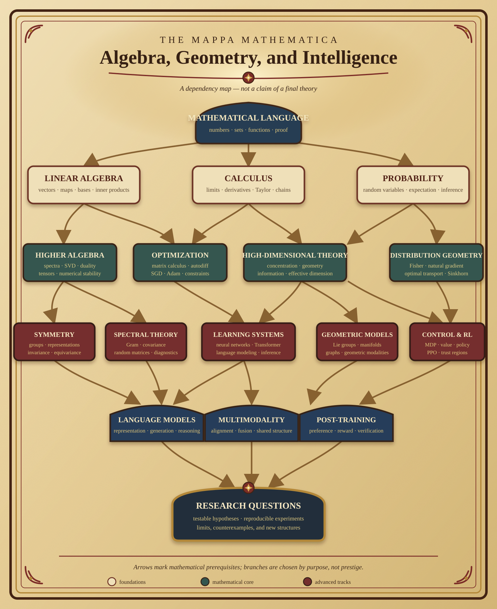

# 代数、几何与智能 {.unnumbered}

这份笔记从最少前置知识出发，选择性地学习与现代学习系统有关的代数、几何、微积分、概率和优化。目标不是用数学术语包装模型，而是准确回答：对象是什么、运算为何成立、结论依赖哪些假设，以及如何用计算验证。

{fig-alt="从数学语言开始，经线性代数、微积分、概率、高等代数、高维理论和几何路线，通向学习系统与研究问题的依赖图" width="100%"}

## 三种关系

这份笔记明确区分数学与模型之间的三种关系：

- **直接关系**：概念直接出现在公式、实现或训练目标中；
- **分析关系**：概念用于解释或诊断模型，但结论依赖额外假设；
- **研究关系**：概念能够形成可检验的架构假设，尚不是普遍规律。

详细内容分支与边界见[内容地图](roadmap.qmd)。

## 如何学习

每个主题尽量经过五个层次：

1. **对象**：讨论的数学对象属于什么集合；
2. **符号**：字母、上下标和运算符分别表示什么；
3. **推导**：结论如何从定义和已知条件逐步得到；
4. **形状**：矩阵与张量运算在维度上是否合法；
5. **验证**：用小规模数字和代码核对结论。

::: {.callout-important title="笔记规则"}
任何符号都不应凭空出现。符号首次出现时，应声明它的类型、范围、形状和上下文含义。
:::

## 当前可读内容

1. [符号规范](notation.qmd)；
2. [数学语言导论](chapters/00-foundations/index.qmd)；
3. [数、集合与区间](chapters/00-foundations/numbers-and-sets.qmd)；
4. [函数与映射](chapters/00-foundations/functions.qmd)；
5. [命题、量词与证明](chapters/00-foundations/logic-and-proofs.qmd)；
6. [极限、导数与积分的定义](chapters/00-foundations/calculus-definitions.qmd)；
7. [概率模型、随机变量与统计样本](chapters/00-foundations/probability-statistics-definitions.qmd)；
8. [线性代数导论](chapters/01-linear-algebra/index.qmd)；
9. [标量与向量](chapters/01-linear-algebra/scalars-and-vectors.qmd)。

后续内容按知识依赖逐章加入。路线图中的高级主题是明确的内容规划，不代表章节已经完成。
